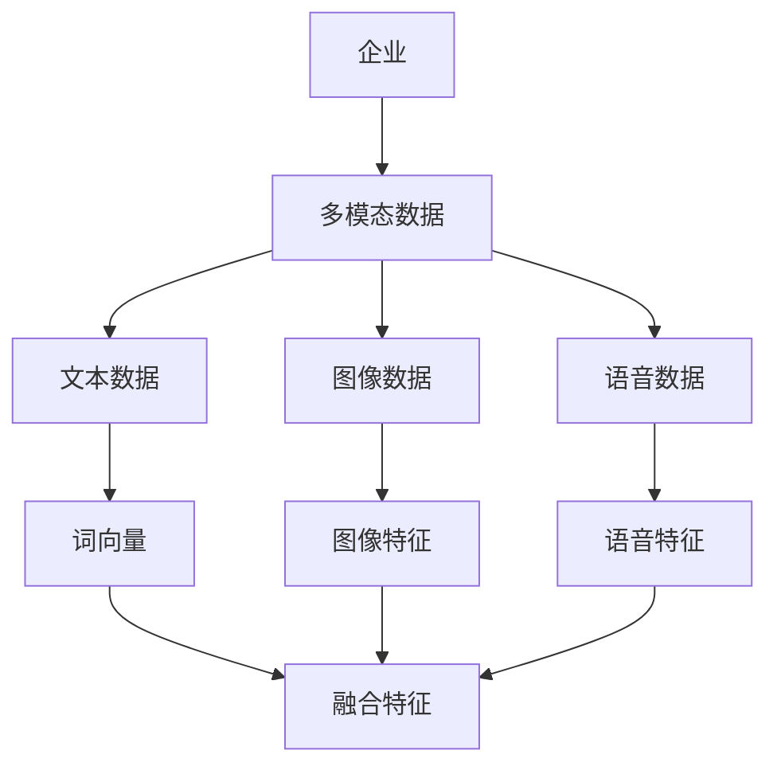

                 


# 如何识别企业的深度学习多模态融合优势

## 关键词：深度学习，多模态融合，企业优势，数据融合，AI技术

## 摘要

随着人工智能技术的飞速发展，深度学习技术在企业中的应用日益广泛。然而，单一模态的数据分析已经难以满足企业复杂场景的需求。多模态融合技术通过整合文本、图像、语音等多种数据形式，为企业提供了更全面的分析能力。本文将从背景介绍、核心概念、算法原理、系统架构设计、项目实战、最佳实践等多个方面，详细探讨如何识别和利用企业的深度学习多模态融合优势。

---

## 第一部分：背景介绍

### 第1章：深度学习多模态融合的背景与概念

#### 1.1 问题背景

- **1.1.1 企业数据的多模态化趋势**  
  当前，企业数据呈现多样化特征，包括文本、图像、语音、视频等多种形式。单一模态的分析方法难以充分挖掘数据价值。

- **1.1.2 传统单模态分析的局限性**  
  单一模态分析在处理复杂场景时存在局限，例如文本分析无法结合图像信息进行语境理解。

- **1.1.3 多模态融合的现实需求**  
  企业希望利用多模态数据提升决策能力，例如在客服系统中结合文本和语音情绪分析，提供更智能的服务。

#### 1.2 问题描述

- **1.2.1 多模态数据的定义与分类**  
  多模态数据指的是多种类型的数据，包括文本、图像、语音、视频等。根据数据类型可分为结构化数据和非结构化数据。

- **1.2.2 深度学习在多模态融合中的作用**  
  深度学习技术能够通过神经网络模型实现多模态数据的高效融合，例如使用多模态Transformer模型进行跨模态信息处理。

- **1.2.3 企业应用场景中的多模态融合问题**  
  企业需要解决如何高效整合多模态数据，提取有价值的信息，并将其应用于实际业务场景。

#### 1.3 问题解决

- **1.3.1 多模态融合的核心目标**  
  实现多模态数据的协同分析，提升模型的表达能力和准确性。

- **1.3.2 深度学习技术的优势**  
  深度学习能够自动提取多模态数据的特征，并通过神经网络实现模态间的关联分析。

- **1.3.3 企业级应用中的解决方案**  
  通过构建多模态深度学习模型，企业可以实现跨模态的数据融合，提升业务决策的精准度。

#### 1.4 边界与外延

- **1.4.1 多模态融合的边界条件**  
  多模态融合需要在特定场景下进行，例如在医疗领域，图像和文本数据的融合需要遵循医疗行业的规范。

- **1.4.2 相关概念的区分**  
  - 多模态学习与单模态学习的区别在于数据类型的多样性。
  - 跨模态检索与多模态分类的区别在于任务目标的不同。

- **1.4.3 与其他技术的对比**  
  多模态融合与传统的数据融合方法相比，具有更强的自动化和深度学习特性。

#### 1.5 概念结构与核心要素

- **1.5.1 多模态融合的系统架构**  
  从数据采集、特征提取、模态对齐到最终的融合推理，构建完整的多模态分析流程。

- **1.5.2 核心要素的组成与关系**  
  - 数据源：文本、图像、语音等多模态数据。
  - 特征提取：通过深度学习模型提取各模态的特征表示。
  - 模态对齐：通过注意力机制实现不同模态之间的对齐。
  - 融合推理：通过联合学习实现多模态数据的协同分析。

- **1.5.3 案例分析：企业中的多模态融合应用场景**  
  例如，在电商领域，可以通过多模态融合技术实现商品推荐，结合商品描述文本和商品图片特征，提升推荐的精准度。

---

## 第二部分：核心概念与联系

### 第2章：多模态融合的核心概念与原理

#### 2.1 核心概念原理

- **2.1.1 多模态数据的表示方法**  
  - 各模态数据的表示方式：文本可以使用词向量，图像可以使用卷积神经网络提取特征。
  - 多模态数据的融合方式：通过神经网络将各模态的特征向量进行融合，例如使用加法、拼接或注意力机制。

- **2.1.2 深度学习中的模态对齐机制**  
  - 模态对齐的目标：实现不同模态之间的语义对齐，例如将文本和图像的特征对齐到相同的语义空间。
  - 实现方法：通过对比学习、注意力机制等方法实现模态对齐。

- **2.1.3 跨模态注意力机制的原理**  
  - 注意力机制：在多模态融合中，注意力机制可以用于捕捉不同模态之间的关联性。
  - 跨模态注意力：通过跨模态的注意力权重，实现模态间的相互增强。

#### 2.2 核心概念属性对比表格

| 概念       | 特性1：模态独立性 | 特性2：融合方式 | 特性3：应用场景 |
|------------|------------------|----------------|----------------|
| 单模态分析 | 高               | 串行           | 简单任务         |
| 多模态融合 | 低               | 并行/联合       | 复杂任务         |

#### 2.3 ER实体关系图架构



---

## 第三部分：算法原理

### 第3章：多模态融合的算法原理与实现

#### 3.1 多模态融合的算法原理

- **3.1.1 多模态融合的数学模型**  
  - 多模态融合的目标是通过神经网络模型，将不同模态的特征表示进行融合，最终得到一个统一的特征向量。
  - 模型结构：多模态Transformer模型，结合自注意力机制和前馈网络。

- **3.1.2 多模态融合的公式推导**  
  - 特征提取：$x_i = f_i(x_{i-1})$，其中$f_i$是第$i$个模态的特征提取函数。
  - 模态对齐：$z_i = \text{Attention}(x_i, x_j)$，其中$x_i$和$x_j$是不同模态的特征表示。
  - 融合推理：$y = g(z_1, z_2, ..., z_n)$，其中$g$是融合函数。

- **3.1.3 算法流程图**  
  ```mermaid
  graph TD
      A[输入多模态数据] --> B[特征提取]
      B --> C[模态对齐]
      C --> D[融合推理]
      D --> E[输出结果]
  ```

#### 3.2 多模态融合的实现代码

- **3.2.1 环境安装**  
  ```bash
  pip install numpy tensorflow keras
  ```

- **3.2.2 核心代码实现**

```python
import numpy as np
from tensorflow import keras
from tensorflow.keras import layers

# 定义多模态融合模型
def multi_modal_fusion_model():
    # 文本模态
    text_input = layers.Input(shape=(None, 100,), dtype='int32')
    text_embeddings = layers.Embedding(1000, 64)(text_input)
    text_output = layers.GlobalAveragePooling1D()(text_embeddings)

    # 图像模态
    image_input = layers.Input(shape=(64, 64, 3))
    image_output = layers.GlobalAveragePooling2D()(image_input)

    # 融合模态
    merged = layers.concatenate([text_output, image_output])
    dense = layers.Dense(64, activation='relu')(merged)
    output = layers.Dense(1, activation='sigmoid')(dense)

    model = keras.Model(inputs=[text_input, image_input], outputs=output)
    return model

# 模型训练
model = multi_modal_fusion_model()
model.compile(optimizer='adam', loss='binary_crossentropy', metrics=['accuracy'])
model.fit([text_data, image_data], labels, epochs=10, batch_size=32)
```

---

## 第四部分：系统架构设计

### 第4章：多模态融合系统的架构与实现

#### 4.1 项目介绍

- **4.1.1 项目背景**  
  本项目旨在构建一个企业级的多模态融合系统，实现对文本、图像等多模态数据的协同分析。

- **4.1.2 项目目标**  
  - 实现多模态数据的高效采集与存储。
- **4.1.3 项目范围**  
  适用于企业内部的多模态数据分析场景，例如客服中心、电商平台等。

#### 4.2 系统功能设计

- **4.2.1 领域模型设计**  
  ```mermaid
  classDiagram
      class 数据采集模块 {
          输入文本数据
          输入图像数据
      }
      class 特征提取模块 {
          文本特征提取
          图像特征提取
      }
      class 融合推理模块 {
          模态对齐
          融合推理
      }
      数据采集模块 --> 特征提取模块
      特征提取模块 --> 融合推理模块
  ```

- **4.2.2 系统架构设计**  
  ```mermaid
  graph TD
      A[用户输入] --> B[数据采集模块]
      B --> C[特征提取模块]
      C --> D[融合推理模块]
      D --> E[输出结果]
  ```

- **4.2.3 系统接口设计**  
  - 输入接口：接收多模态数据，例如文本和图像。
  - 输出接口：返回融合后的结果，例如分类标签或回归值。

- **4.2.4 系统交互流程**  
  ```mermaid
  sequenceDiagram
      participant 用户
      participant 数据采集模块
      participant 融合推理模块
      用户 -> 数据采集模块: 提交多模态数据
      数据采集模块 -> 融合推理模块: 传输特征数据
      融合推理模块 -> 用户: 返回融合结果
  ```

---

## 第五部分：项目实战

### 第5章：多模态融合项目的实战与分析

#### 5.1 项目实战

- **5.1.1 环境安装**  
  ```bash
  pip install numpy pandas scikit-learn tensorflow
  ```

- **5.1.2 系统核心实现源代码**

```python
import numpy as np
import tensorflow as tf
from tensorflow.keras import layers

# 定义多模态融合模型
def multi_modal_model():
    # 文本模态
    text_input = layers.Input(shape=(None, 100,), dtype='int32')
    text_embeddings = layers.Embedding(1000, 64)(text_input)
    text_output = layers.GlobalAveragePooling1D()(text_embeddings)

    # 图像模态
    image_input = layers.Input(shape=(64, 64, 3))
    image_output = layers.GlobalAveragePooling2D()(image_input)

    # 融合模态
    merged = layers.concatenate([text_output, image_output])
    dense = layers.Dense(64, activation='relu')(merged)
    output = layers.Dense(1, activation='sigmoid')(dense)

    model = tf.keras.Model(inputs=[text_input, image_input], outputs=output)
    return model

# 训练模型
model = multi_modal_model()
model.compile(optimizer='adam', loss='binary_crossentropy', metrics=['accuracy'])

# 生成数据
text_data = np.random.randint(1000, size=(100, 100))
image_data = np.random.randn(100, 64, 64, 3)
labels = np.random.randint(2, size=100)

# 开始训练
model.fit([text_data, image_data], labels, epochs=10, batch_size=32)
```

---

## 第六部分：最佳实践

### 第6章：多模态融合的最佳实践与总结

#### 6.1 最佳实践

- **6.1.1 数据预处理**  
  对于多模态数据，需要进行归一化、特征提取等预处理步骤。

- **6.1.2 模型调优**  
  使用交叉验证、超参数调优等方法提升模型性能。

- **6.1.3 系统优化**  
  优化系统的计算效率和资源利用率，例如使用分布式计算。

#### 6.2 小结

多模态融合技术通过整合多种数据形式，为企业提供了更强大的数据分析能力。本文从背景介绍、核心概念、算法原理、系统架构设计、项目实战等多个方面，详细探讨了如何识别和利用企业的深度学习多模态融合优势。

---

## 作者：AI天才研究院/AI Genius Institute & 禅与计算机程序设计艺术 /Zen And The Art of Computer Programming

