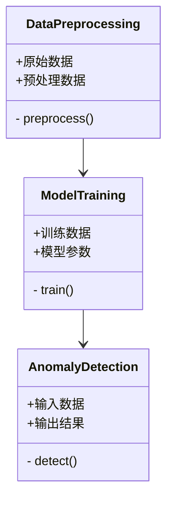

                 


# 如何识别企业的深度学习异常检测优势

> **关键词**：深度学习，异常检测，企业应用，算法原理，系统架构

> **摘要**：本文详细探讨了如何在企业环境中识别和利用深度学习技术进行异常检测的优势。通过分析深度学习的基本原理、常见模型及其在异常检测中的应用，结合实际案例和系统架构设计，为读者提供从理论到实践的全面指南。

---

## 第1章：背景介绍

### 1.1 异常检测的基本概念与核心概念

#### 1.1.1 异常检测的定义
异常检测（Outlier Detection）是指识别数据中与预期模式或行为显著不同的数据点。这些异常点可能表示潜在的问题、机会或异常事件。

#### 1.1.2 异常检测的核心概念
- **异常点**：偏离主要数据分布的点。
- **正常数据**：符合预期模式的数据。
- **检测方法**：基于统计、机器学习或深度学习的方法。

#### 1.1.3 异常检测在企业中的重要性
在企业中，异常检测用于安全监控、欺诈 detection、设备故障预测等领域，帮助企业在早期发现问题，减少损失。

### 1.2 企业中的异常检测场景

#### 1.2.1 企业安全中的异常检测
通过分析网络流量，识别潜在的安全攻击。

#### 1.2.2 金融领域的异常检测
检测欺诈交易，保护客户资产。

#### 1.2.3 工业制造中的异常检测
通过传感器数据预测设备故障，减少停机时间。

### 1.3 深度学习在异常检测中的优势

#### 1.3.1 深度学习的基本概念
深度学习是一种机器学习技术，通过多层神经网络学习数据的特征。

#### 1.3.2 深度学习在异常检测中的独特优势
- **非线性特征提取**：深度学习能够捕捉复杂的数据模式。
- **自动特征工程**：无需手动提取特征，自动学习数据表示。

#### 1.3.3 传统方法与深度学习的对比
| 方法       | 优点                           | 缺点                           |
|------------|--------------------------------|---------------------------------|
| 统计方法   | 简单，易于解释                  | 依赖于数据分布假设             |
| 传统机器学习| 可处理复杂特征                 | 需要手动特征工程               |
| 深度学习   | 自动学习复杂特征，性能优越     | 需要大量数据，计算资源消耗大   |

---

## 第2章：深度学习的核心原理

### 2.1 深度学习的基本原理

#### 2.1.1 神经网络的结构
- **输入层**：接收输入数据。
- **隐藏层**：提取数据特征。
- **输出层**：生成预测结果。

#### 2.1.2 深度学习的训练过程
- **正向传播**：输入数据通过网络计算输出。
- **反向传播**：计算误差并更新权重。

### 2.2 异常检测的核心原理

#### 2.2.1 异常检测的分类
- **单样本异常检测**：检测单个异常点。
- **多样本异常检测**：检测数据集中所有异常点。

#### 2.2.2 异常检测的算法选择
- **基于距离的方法**：如k-近邻。
- **基于密度的方法**：如DBSCAN。
- **基于统计的方法**：如Z-score。

### 2.3 深度学习与异常检测的结合

#### 2.3.1 深度学习在异常检测中的应用
- **时间序列分析**：使用RNN检测时间序列中的异常。
- **图像识别**：使用CNN检测图像中的异常。

#### 2.3.2 深度学习模型的优缺点
| 模型         | 优点                           | 缺点                           |
|--------------|--------------------------------|---------------------------------|
| RNN          | 适合时间序列数据               | 训练时间长，收敛困难             |
| CNN          | 适合图像数据                   | 不适合处理非结构化数据           |
| Autoencoder | 适合无监督异常检测             | 需要大量正常数据进行训练         |

---

## 第3章：深度学习异常检测算法

### 3.1 常见的深度学习模型

#### 3.1.1 RNN模型
- **原理**：循环神经网络，适合处理序列数据。
- **公式**：$$y_{t} = f(W_{yy}y_{t-1} + W_{xy}x_{t})$$

#### 3.1.2 CNN模型
- **原理**：卷积神经网络，适合处理图像数据。
- **公式**：$$a = W * x + b$$

#### 3.1.3 Autoencoder模型
- **原理**：自编码器，通过重构输入数据学习特征。
- **公式**：$$\hat{x} = f(f(x))$$

### 3.2 深度学习异常检测的算法流程

#### 3.2.1 异常检测的流程
1. 数据预处理：标准化、归一化。
2. 模型训练：使用正常数据训练模型。
3. 异常检测：将新数据输入模型，判断是否异常。

#### 3.2.2 深度学习模型的优缺点
| 模型         | 优点                           | 缺点                           |
|--------------|--------------------------------|---------------------------------|
| RNN          | 适合时间序列数据               | 训练时间长，收敛困难             |
| CNN          | 适合图像数据                   | 不适合处理非结构化数据           |
| Autoencoder | 适合无监督异常检测             | 需要大量正常数据进行训练         |

---

## 第4章：系统分析与架构设计

### 4.1 问题场景介绍

#### 4.1.1 项目背景
假设我们正在开发一个工业制造中的设备故障预测系统。

### 4.2 系统功能设计

#### 4.2.1 领域模型类图


### 4.3 系统架构设计

#### 4.3.1 系统架构图
```mermaid
rectangle Database {
    数据库
}
rectangle PreprocessingService {
    数据预处理服务
}
rectangle TrainingService {
    训练服务
}
rectangle DetectionService {
    异常检测服务
}
Database --> PreprocessingService
PreprocessingService --> TrainingService
TrainingService --> DetectionService
```

### 4.4 系统接口设计

#### 4.4.1 接口设计
- **输入接口**：接收原始数据。
- **输出接口**：返回异常检测结果。

### 4.5 系统交互设计

#### 4.5.1 序列图
```mermaid
sequenceDiagram
    participant 用户
    participant 数据预处理服务
    participant 训练服务
    participant 检测服务
    用户 -> 数据预处理服务：上传数据
    数据预处理服务 -> 训练服务：训练模型
    训练服务 -> 检测服务：部署模型
    用户 -> 检测服务：查询结果
    检测服务 -> 用户：返回结果
```

---

## 第5章：项目实战

### 5.1 环境安装

#### 5.1.1 安装Python和深度学习框架
```bash
pip install numpy
pip install tensorflow
pip install keras
```

### 5.2 系统核心实现

#### 5.2.1 异常检测模型实现
```python
import numpy as np
from tensorflow.keras.models import Model
from tensorflow.keras.layers import Dense, Input

def build_autoencoder(input_dim):
    input_layer = Input(shape=(input_dim,))
    encoded = Dense(64, activation='relu')(input_layer)
    decoded = Dense(input_dim, activation='sigmoid')(encoded)
    model = Model(inputs=input_layer, outputs=decoded)
    model.compile(optimizer='adam', loss='binary_crossentropy')
    return model
```

#### 5.2.2 训练模型
```python
model = build_autoencoder(100)
model.fit(X_train, X_train, epochs=100, batch_size=32)
```

#### 5.2.3 检测异常
```python
threshold = 0.1
reconstructed = model.predict(X_test)
anomalies = np.where(np.mean(np.abs(X_test - reconstructed), axis=1) > threshold)[0]
```

### 5.3 案例分析

#### 5.3.1 工业制造案例
- **输入数据**：传感器数据。
- **模型训练**：使用正常数据训练模型。
- **异常检测**：检测设备故障。

### 5.4 项目小结
通过实际案例，展示了深度学习在异常检测中的应用，以及如何从数据预处理到模型部署实现整个流程。

---

## 第6章：总结与最佳实践

### 6.1 总结

#### 6.1.1 深度学习的优势
- 自动特征提取。
- 处理复杂数据。

#### 6.1.2 未来方向
- 更高效的算法。
- 多模态数据融合。

### 6.2 最佳实践

#### 6.2.1 数据预处理
- 标准化和归一化。

#### 6.2.2 模型选择
- 根据数据类型选择模型。

#### 6.2.3 调参与优化
- 使用交叉验证优化模型。

### 6.3 注意事项

#### 6.3.1 数据质量问题
- 数据清洗，避免噪声干扰。

#### 6.3.2 计算资源
- 需要大量计算资源训练模型。

### 6.4 拓展阅读
- 《Deep Learning》- Ian Goodfellow
- 《Anomaly Detection: A Survey》- S.役田

---

**作者：AI天才研究院 & 禅与计算机程序设计艺术**

---

通过本文的详细讲解，读者可以系统地理解深度学习在异常检测中的应用，从理论到实践，掌握如何识别企业的深度学习异常检测优势。

