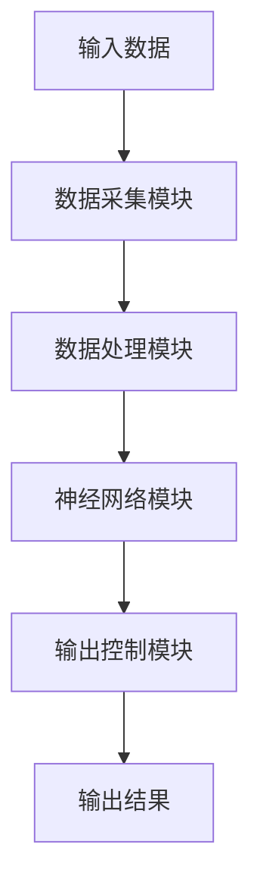

                 


# 如何识别企业的神经形态计算优势

## 关键词：神经形态计算、企业优势、算法原理、系统架构、项目实战

## 摘要：神经形态计算是一种模拟人脑结构和功能的新型计算模式，能够在实时数据处理和模式识别方面展现出传统计算无法比拟的优势。本文将从神经形态计算的核心概念、算法原理、系统架构设计、项目实战等多个方面，详细阐述如何识别和应用神经形态计算的优势，帮助企业更好地应对复杂问题。

---

# 第一部分：神经形态计算的背景与核心概念

## 第1章：神经形态计算的定义与特点

### 1.1 神经形态计算的定义

神经形态计算（Neuromorphic Computing）是一种模拟生物神经系统结构和功能的计算模式。它借鉴了人脑的信息处理方式，通过模拟神经元和突触的特性，实现对信息的高效处理和学习。

#### 1.1.1 神经形态计算的起源与发展

神经形态计算的概念最早可以追溯到20世纪80年代，美国科学家卡弗·米德（Carver Mead）提出了将生物神经系统与电子电路相结合的思想。近年来，随着人工智能和神经网络技术的发展，神经形态计算逐渐成为研究的热点。

#### 1.1.2 神经形态计算的核心特征

- **事件驱动**：神经形态计算基于事件驱动的处理方式，能够实时响应输入数据的变化。
- **能量高效**：通过模拟生物神经系统的特性，神经形态计算能够在低功耗下完成复杂的计算任务。
- **并行处理**：神经形态计算能够同时处理大量信息，具备强大的并行计算能力。

#### 1.1.3 神经形态计算与传统计算的对比

| 特性                | 神经形态计算                | 传统计算                |
|---------------------|---------------------------|------------------------|
| 处理方式            | 事件驱动，实时响应        | 批处理，周期性响应      |
| 能耗                | 低功耗                    | 较高                   |
| 并行能力            | 强大                     | 较弱                   |
| 应用场景            | 实时数据处理、模式识别    | 批处理、数值计算        |

### 1.2 神经形态计算的优势

神经形态计算在多个方面展现出显著优势，特别是在实时数据处理和模式识别方面。

#### 1.2.1 高能效比

神经形态计算通过模拟生物神经系统的低功耗特性，能够在完成相同任务的情况下，显著降低能耗。

#### 1.2.2 实时数据处理能力

神经形态计算能够实时响应输入数据的变化，适用于需要快速决策的应用场景，如自动驾驶和实时监控。

#### 1.2.3 强大的模式识别能力

通过模拟生物神经网络的特性，神经形态计算在模式识别方面表现出色，能够处理复杂的非结构化数据，如图像和语音。

## 第2章：神经形态计算的核心概念与联系

### 2.1 神经形态计算的核心原理

神经形态计算的核心原理是通过模拟生物神经元和突触的特性，构建人工神经网络，实现信息的高效处理和学习。

#### 2.1.1 生物神经元模型

生物神经元通过接收多个突触的输入，产生动作电位（脉冲），并将信号传递给下游神经元。在神经形态计算中，通常使用积分和发放（Izhikevich模型）或泄漏积分和发放（LIF模型）等模型来模拟神经元的行为。

#### 2.1.2 神经网络结构

神经形态计算的网络结构通常包括输入层、隐藏层和输出层。每个神经元通过突触连接，传递信号。网络的权重可以通过训练算法进行调整，以实现特定的函数映射。

#### 2.1.3 神经形态计算的数学模型

神经形态计算的数学模型主要基于微分方程，描述神经元的动态行为。例如，LIF模型的动态方程可以表示为：

$$
\begin{cases}
\frac{dv}{dt} = \frac{-v + V_{rest}}{\tau} & \text{当 } v < V_{th} \\
v = 0 & \text{当 } v \geq V_{th}
\end{cases}
$$

其中，$v$ 是膜电位，$V_{rest}$ 是静息电位，$\tau$ 是时间常数，$V_{th}$ 是阈值。

### 2.2 神经形态计算与传统计算的对比

神经形态计算和传统计算在多个方面存在显著差异，特别是在处理方式和硬件实现上。

#### 2.2.1 计算范式的对比

| 计算范式            | 神经形态计算                | 传统计算                |
|---------------------|---------------------------|------------------------|
| 数据处理方式        | 事件驱动，实时响应        | 批处理，周期性响应      |
| 并行能力            | 强大                     | 较弱                   |
| 硬件实现            | 专用电路                 | 通用处理器             |

#### 2.2.2 硬件实现方式的对比

神经形态计算通常采用专用硬件，如神经形态芯片，以实现高效的并行计算。传统计算则依赖于通用处理器和GPU。

#### 2.2.3 应用场景的对比

神经形态计算适用于需要实时响应和复杂模式识别的场景，如自动驾驶和医疗诊断。传统计算则适用于需要高性能计算和复杂数值处理的场景，如科学计算和金融建模。

## 第3章：神经形态计算的算法原理

### 3.1 脉冲神经网络（SNN）原理

脉冲神经网络（SNN）是一种基于生物神经网络的计算模型，通过脉冲的产生和传递实现信息处理。

#### 3.1.1 脉冲函数的定义

脉冲函数描述了神经元在接收到足够的输入后产生脉冲的行为。常用的脉冲函数包括阈值函数和 Spike Function。

$$
SpikeFunction(x) = 
\begin{cases}
1 & \text{如果 } x \geq V_{th} \\
0 & \text{否则}
\end{cases}
$$

#### 3.1.2 神经元之间的连接权重

神经元之间的连接权重决定了信号传递的强度和方向。通常，权重可以通过训练算法进行调整，以实现特定的函数映射。

#### 3.1.3 脉冲传播机制

脉冲通过突触传递的方式进行传播。当神经元产生脉冲时，会将信号传递给下游神经元，触发其膜电位的变化。

### 3.2 神经形态计算的数学模型

神经形态计算的数学模型主要基于微分方程，描述神经元的动态行为。例如，LIF模型的动态方程可以表示为：

$$
\begin{cases}
\frac{dv}{dt} = \frac{-v + V_{rest}}{\tau} & \text{当 } v < V_{th} \\
v = 0 & \text{当 } v \geq V_{th}
\end{cases}
$$

其中，$v$ 是膜电位，$V_{rest}$ 是静息电位，$\tau$ 是时间常数，$V_{th}$ 是阈值。

### 3.3 神经形态计算的算法实现

#### 3.3.1 脉冲神经网络的训练流程

脉冲神经网络的训练流程通常包括以下几个步骤：

1. 初始化网络参数，包括神经元的膜电位、突触权重等。
2. 前向传播：将输入信号传递给神经元，产生脉冲。
3. 计算损失函数，通常使用交叉熵损失。
4. 反向传播：通过链式法则计算梯度，并更新网络参数。
5. 重复训练过程，直到收敛。

#### 3.3.2 神经形态计算的优化算法

为了提高训练效率，可以采用多种优化算法，如Adam优化器。

#### 3.3.3 算法实现的代码示例

以下是一个简单的脉冲神经网络实现示例：

```python
import numpy as np

def spike_function(v, V_th):
    return 1 if v >= V_th else 0

def forward_propagation(inputs, weights, V_th):
    v = np.zeros_like(inputs)
    for i in range(len(inputs)):
        v[i] = weights * inputs[i]
        v[i] = spike_function(v[i], V_th)
    return v

def backward_propagation(inputs, outputs, weights, learning_rate):
    delta = (outputs - inputs) * learning_rate
    updated_weights = weights + delta
    return updated_weights

# 示例
inputs = np.array([0.5, 1.0, 1.5])
weights = np.array([1.0, 1.0, 1.0])
V_th = 1.0

outputs = forward_propagation(inputs, weights, V_th)
updated_weights = backward_propagation(inputs, outputs, weights, 0.1)

print("Updated weights:", updated_weights)
```

---

## 第4章：神经形态计算的系统架构设计

### 4.1 系统功能设计

#### 4.1.1 神经形态计算的输入输出接口

神经形态计算系统通常需要实时接收输入数据，并输出处理结果。输入接口可以是传感器或外部设备，输出接口可以是显示设备或控制装置。

#### 4.1.2 系统功能模块划分

神经形态计算系统通常包括以下几个功能模块：

- 数据采集模块：负责接收外部输入数据。
- 数据处理模块：对输入数据进行预处理和特征提取。
- 神经网络模块：实现脉冲神经网络的前向传播和反向传播。
- 输出控制模块：将处理结果输出给外部设备。

#### 4.1.3 系统功能的流程图

以下是系统功能的流程图：



### 4.2 系统架构设计

#### 4.2.1 神经形态计算的硬件架构

神经形态计算的硬件架构通常包括专用神经形态芯片和外围电路。专用芯片负责实现脉冲神经网络的计算，外围电路负责数据采集和信号处理。

#### 4.2.2 神经形态计算的软件架构

软件架构通常包括驱动层、算法层和应用层。驱动层负责控制硬件设备，算法层实现脉冲神经网络的训练和推理，应用层实现具体的应用逻辑。

#### 4.2.3 系统的分层设计

系统的分层设计通常包括数据层、算法层和应用层。数据层负责数据的存储和管理，算法层负责数据的处理和分析，应用层负责结果的展示和应用。

### 4.3 系统接口设计

#### 4.3.1 神经形态计算的输入接口

输入接口通常包括传感器接口和网络接口。传感器接口负责接收物理信号，网络接口负责接收远程数据。

#### 4.3.2 神经形态计算的输出接口

输出接口通常包括显示接口和控制接口。显示接口负责输出处理结果，控制接口负责控制外部设备。

#### 4.3.3 系统与外部设备的接口

系统与外部设备的接口通常包括传感器、执行器和通信模块。传感器负责数据采集，执行器负责输出控制，通信模块负责数据传输。

---

## 第5章：神经形态计算的项目实战

### 5.1 环境安装与配置

#### 5.1.1 神经形态计算开发环境的搭建

为了进行神经形态计算的开发，需要安装必要的开发工具和库。常用的开发工具包括Python、神经网络框架（如TensorFlow、PyTorch）和神经形态计算模拟器（如NEST、SpiNNaker）。

#### 5.1.2 开发工具的安装与配置

以下是安装神经形态计算开发环境的示例代码：

```bash
pip install numpy
pip install matplotlib
pip install tensorflow
pip install pytorch
```

#### 5.1.3 硬件设备的配置

神经形态计算的硬件设备通常包括神经形态芯片和外围电路。配置硬件设备时，需要确保设备与开发环境兼容，并安装相应的驱动程序。

### 5.2 系统核心实现

#### 5.2.1 脉冲神经网络的实现

以下是脉冲神经网络的实现示例：

```python
import numpy as np

def spike_function(v, V_th):
    return 1 if v >= V_th else 0

def forward_propagation(inputs, weights, V_th):
    v = np.zeros_like(inputs)
    for i in range(len(inputs)):
        v[i] = weights * inputs[i]
        v[i] = spike_function(v[i], V_th)
    return v

def backward_propagation(inputs, outputs, weights, learning_rate):
    delta = (outputs - inputs) * learning_rate
    updated_weights = weights + delta
    return updated_weights

# 示例
inputs = np.array([0.5, 1.0, 1.5])
weights = np.array([1.0, 1.0, 1.0])
V_th = 1.0

outputs = forward_propagation(inputs, weights, V_th)
updated_weights = backward_propagation(inputs, outputs, weights, 0.1)

print("Updated weights:", updated_weights)
```

#### 5.2.2 系统功能的实现

以下是系统功能的实现示例：

```python
import numpy as np

def data_capture():
    # 模拟数据采集
    return np.random.rand(10)

def data_processing(data):
    # 模拟数据处理
    return data * 2

def neural_network(data):
    # 模拟神经网络处理
    return data * 3

def output_control(result):
    # 模拟输出控制
    print("处理结果:", result)

# 示例
data = data_capture()
processed_data = data_processing(data)
result = neural_network(processed_data)
output_control(result)
```

### 5.3 项目小结

通过以上步骤，我们可以实现一个简单的神经形态计算系统。该系统能够实时接收输入数据，进行处理和分析，并输出处理结果。神经形态计算的优势在于其高效的并行计算能力和低功耗特性，适用于需要实时响应和复杂模式识别的应用场景。

---

## 第6章：神经形态计算的最佳实践与注意事项

### 6.1 最佳实践

1. **选择合适的硬件平台**：根据具体需求选择适合的神经形态芯片和外围设备。
2. **优化算法设计**：通过调整神经网络的结构和参数，提高系统的性能和效率。
3. **确保数据质量**：数据的质量对神经形态计算的性能有重要影响，需要确保数据的准确性和完整性。

### 6.2 注意事项

1. **硬件兼容性**：在配置硬件设备时，需要确保设备与开发环境兼容，并安装相应的驱动程序。
2. **算法实现难度**：神经形态计算的算法实现相对复杂，需要具备一定的编程和算法设计能力。
3. **系统稳定性**：神经形态计算系统的稳定性对实际应用至关重要，需要进行充分的测试和调试。

### 6.3 拓展阅读

1. **神经形态计算相关的学术论文**：了解神经形态计算的最新研究进展。
2. **神经形态芯片的开发文档**：掌握神经形态芯片的使用方法和开发技巧。
3. **神经网络的训练与优化**：学习如何优化神经网络的结构和参数，提高系统的性能。

---

## 作者：AI天才研究院/AI Genius Institute & 禅与计算机程序设计艺术/Zen And The Art of Computer Programming

