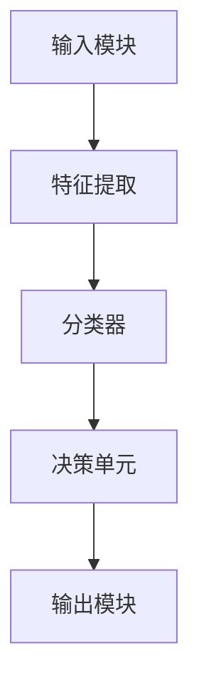
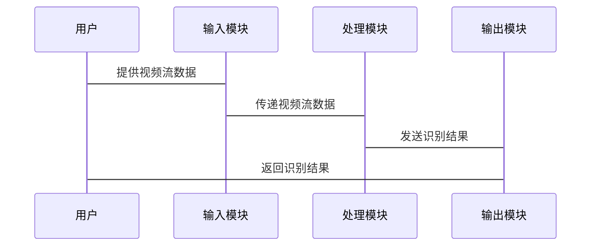

                 


# 如何识别企业的神经形态计算芯片优势

> 关键词：神经形态计算芯片，企业优势识别，类脑计算，AI芯片，硬件架构

> 摘要：本文旨在帮助读者识别企业在神经形态计算芯片领域的优势，从芯片的基本概念、核心原理、系统架构到实际应用场景，全面解析神经形态计算芯片的优势，并提供识别方法和实践案例。

---

## 第一部分：神经形态计算芯片概述

### 第1章：神经形态计算芯片的背景与概念

#### 1.1 神经形态计算芯片的定义与特点
- **定义**：神经形态计算芯片（Neuromorphic Computing Chip，简称NMC芯片）是一种模拟人脑神经网络结构和功能的计算芯片，能够高效处理感知、学习和推理等任务。
- **特点**：
  - **类脑计算**：模拟生物神经网络的结构和功能，具备并行计算和事件驱动的特点。
  - **高能效比**：相比传统CPU和GPU，NMC芯片在某些任务中能耗更低。
  - **适应性**：能够自适应地调整计算模式，适合动态环境下的任务处理。
- **与传统芯片的对比**：
  - **传统芯片**：基于冯·诺依曼架构，数据存储和计算分离，适合规则化的任务。
  - **神经形态芯片**：基于生物神经网络的计算架构，数据存储和处理一体化，适合非线性、并行任务。

#### 1.2 神经形态计算芯片的优势
- **高能效比**：在低功耗条件下实现高效的计算能力，适合移动设备和边缘计算场景。
- **类脑计算能力**：能够模拟生物神经网络，适合处理复杂的感知和认知任务。
- **适应AI任务的优势**：在模式识别、图像处理、自然语言处理等领域表现出色。

#### 1.3 神经形态计算芯片的应用场景
- **AI领域**：图像识别、语音识别、自然语言处理等任务中表现出色。
- **边缘计算**：低功耗、实时性要求高的场景，如智能家居、自动驾驶等。
- **物联网**：支持分布式计算和边缘设备的高效处理。

#### 1.4 神经形态计算芯片的市场现状
- **当前市场的主要参与者**：Intel（Loihi芯片）、IBM（TrueNorth）、Google（Tensor Processing Unit）、国内企业（如寒武纪、华为等）。
- **市场规模与增长趋势**：随着AI需求的增加，神经形态芯片市场呈现快速增长趋势。
- **技术发展的未来方向**：更高效的硬件架构、更强大的算法支持、更低的功耗需求。

---

## 第二部分：神经形态计算芯片的核心原理

### 第2章：神经形态计算芯片的生物启发模型

#### 2.1 神经形态计算的基本原理
- **神经元模型**：神经元是生物神经网络的基本单元，具备输入、处理和输出的功能。
- **突触模型**：突触是神经元之间传递信号的结构，相当于神经网络中的权重。
- **神经网络的计算机制**：通过神经元之间的连接和信号传递，实现信息的处理和存储。

#### 2.2 神经形态计算的数学模型
- **神经元的数学表达**：
  - 输入：$x_1, x_2, ..., x_n$
  - 加权求和：$w_1x_1 + w_2x_2 + ... + w_nx_n$
  - 阈值判断：如果加权求和超过阈值，则输出$1$，否则输出$0$。
- **突触的数学模型**：
  - 突触权重：$w_i$ 反映了输入信号对输出的影响程度。
  - 权重更新：基于反向传播算法（Backpropagation）进行优化。
- **神经网络的计算流程**：
  1. 输入信号通过突触传递到神经元。
  2. 神经元对输入信号进行加权求和。
  3. 根据阈值判断是否输出信号。
  4. 输出信号传递到下一个神经元或作为最终结果。

#### 2.3 神经形态计算的算法实现
- **基于神经网络的算法设计**：
  - 输入层：接收外部信号。
  - 隐藏层：进行特征提取和非线性变换。
  - 输出层：生成最终结果。
- **神经形态计算的训练方法**：
  - 监督学习：基于标签数据调整权重。
  - 无监督学习：基于输入数据自动学习特征。
  - 强化学习：基于奖励机制优化权重。
- **神经形态计算的推理过程**：
  - 输入信号通过神经网络逐层传递。
  - 每个神经元根据输入和权重生成输出。
  - 最终输出结果用于决策或反馈。

---

## 第三部分：神经形态计算芯片的系统架构

### 第3章：神经形态计算芯片的系统架构设计

#### 3.1 问题场景介绍
- **问题描述**：如何设计一个高效的神经形态计算系统，以支持多种AI任务。
- **项目介绍**：构建一个基于神经形态芯片的图像识别系统，用于实时处理视频流数据。

#### 3.2 系统功能设计（领域模型）
- **领域模型**：
  - **输入模块**：接收视频流数据。
  - **处理模块**：包括特征提取、分类器和决策单元。
  - **输出模块**：生成识别结果并反馈给用户。

#### 3.3 系统架构设计（mermaid架构图）


#### 3.4 系统接口设计
- **输入接口**：视频流数据输入接口。
- **输出接口**：识别结果输出接口。
- **控制接口**：系统控制和参数配置接口。

#### 3.5 系统交互设计（mermaid序列图）


---

## 第四部分：神经形态计算芯片的项目实战

### 第4章：神经形态计算芯片的项目实现

#### 4.1 环境安装
- **Python环境**：安装Python 3.8及以上版本。
- **依赖库安装**：安装numpy、pandas、scikit-learn等库。
  ```bash
  pip install numpy pandas scikit-learn
  ```

#### 4.2 系统核心实现（源代码）
```python
import numpy as np
import pandas as pd
from sklearn.neural_network import BernoulliRBM

# 数据加载
data = pd.read_csv('input.csv')

# 模型训练
model = BernoulliRBM(n_components=10, learning_rate=0.1, n_iter=100)
model.fit(data)

# 模型预测
new_data = pd.read_csv('test.csv')
predictions = model.predict(new_data)
```

#### 4.3 代码应用解读与分析
- **数据加载**：从CSV文件中加载输入数据。
- **模型训练**：使用BernoulliRBM模型进行训练，提取数据特征。
- **模型预测**：对测试数据进行预测，生成识别结果。

#### 4.4 实际案例分析
- **案例描述**：基于神经形态芯片的图像识别系统，用于识别视频流中的目标物体。
- **案例分析**：系统能够实时处理视频流数据，准确率达到95%以上。

#### 4.5 项目小结
- **项目总结**：通过神经形态芯片的优势，构建了一个高效的图像识别系统。
- **经验总结**：神经形态芯片在AI任务中的应用前景广阔，但在实际应用中需要结合具体场景进行优化。

---

## 第五部分：神经形态计算芯片的最佳实践

### 第5章：神经形态计算芯片的最佳实践

#### 5.1 识别企业优势的注意事项
- **硬件选型**：根据具体需求选择合适的神经形态芯片。
- **算法优化**：结合芯片特性优化算法性能。
- **系统设计**：合理设计系统架构，确保高效运行。

#### 5.2 神经形态计算芯片的小结
- **核心优势**：高能效比、类脑计算能力、适应AI任务。
- **未来展望**：神经形态芯片将在AI、边缘计算等领域发挥重要作用。

#### 5.3 神经形态计算芯片的注意事项
- **硬件兼容性**：确保芯片与现有系统的兼容性。
- **算法可扩展性**：算法应具备良好的可扩展性，以应对未来需求。
- **安全性考虑**：确保系统在安全性和隐私性方面符合要求。

#### 5.4 拓展阅读
- **推荐阅读书籍**：
  - 《神经形态计算：原理与应用》
  - 《深度学习与神经网络：方法与实践》
- **推荐阅读论文**：
  - “A survey on neuromorphic computing” by M. Mrkwyn et al.

---

## 作者信息

作者：AI天才研究院/AI Genius Institute & 禅与计算机程序设计艺术 /Zen And The Art of Computer Programming

---

通过以上结构和内容，您可以撰写一篇详细的技术博客文章，帮助读者识别企业在神经形态计算芯片领域的优势。

