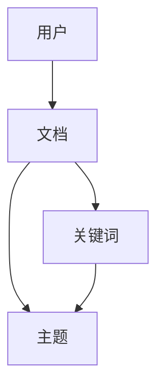
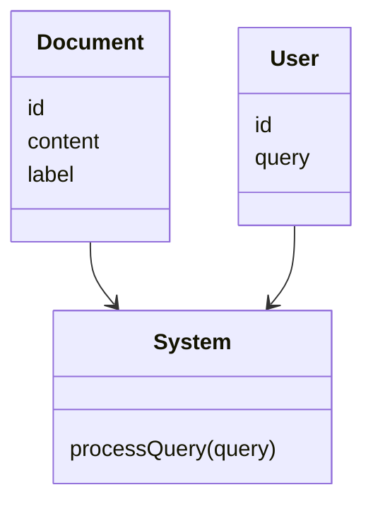
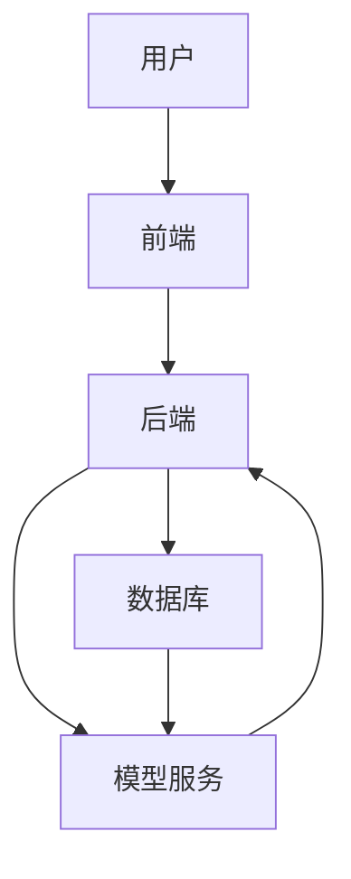

                 


# 如何识别企业的自然语言处理优势

## 关键词：
自然语言处理、企业优势识别、文本分析、机器学习、深度学习、NLP算法、系统架构

## 摘要：
本文详细探讨了如何识别企业的自然语言处理（NLP）优势，通过分析NLP的核心概念、算法原理、系统架构及项目实战，帮助企业发现并利用NLP技术提升竞争力。文章结合实际案例和代码示例，深入解析了NLP的优势识别过程，为企业提供实用的指导。

---

# 第1章 自然语言处理概述

## 1.1 自然语言处理的定义与核心概念
### 1.1.1 自然语言处理的定义
自然语言处理（Natural Language Processing, NLP）是人工智能领域的重要分支，旨在让计算机能够理解、分析和生成人类语言。NLP的目标是通过算法和模型，使计算机能够执行类似人类的文本处理任务，例如文本分类、实体识别、情感分析、机器翻译等。

### 1.1.2 自然语言处理的核心概念
1. **语言模型**：用于预测文本序列的概率分布，是NLP的基石。
2. **自然语言理解（NLU）**：通过分析文本，提取语义信息，帮助计算机理解文本内容。
3. **自然语言生成（NLG）**：生成符合语法和语义的文本，常用于对话系统和内容生成。

### 1.1.3 自然语言处理的边界与外延
NLP的边界包括文本数据的输入和输出，外延则涉及数据预处理、特征提取和模型训练等过程。NLP的优势在于能够处理大规模文本数据，提取隐含信息，为企业决策提供支持。

## 1.2 企业中自然语言处理的优势识别
### 1.2.1 问题背景与问题描述
企业在处理大量文本数据时，往往面临效率低下、信息提取不准确等问题。通过NLP技术，企业可以自动化处理文本数据，提高信息处理效率，降低成本。

### 1.2.2 问题解决的路径与方法
1. **数据预处理**：清洗、分词、去停用词等，确保数据质量。
2. **特征提取**：将文本转换为数值表示，如TF-IDF、词嵌入。
3. **模型训练**：使用机器学习或深度学习算法训练模型，进行分类、识别等任务。

### 1.2.3 优势识别的核心要素与组成
1. **数据质量**：高质量的文本数据是NLP成功的基础。
2. **算法选择**：选择合适的算法和模型，如朴素贝叶斯、深度学习模型。
3. **计算能力**：强大的计算能力是训练复杂模型的必要条件。

## 1.3 自然语言处理在企业中的应用场景
### 1.3.1 企业内部文档处理
- **文档分类**：将内部文档按主题分类，便于管理和检索。
- **信息提取**：从文档中提取关键信息，如客户反馈、项目需求等。

### 1.3.2 客户服务与支持
- **自动问答系统**：通过NLP技术实现智能客服，解决客户问题。
- **情感分析**：分析客户反馈，识别客户情绪，优化服务质量。

### 1.3.3 市场分析与竞争情报
- **市场趋势分析**：通过分析行业报告和新闻，识别市场动态。
- **竞争情报提取**：从竞争对手的产品评论中提取信息，制定市场策略。

---

# 第2章 自然语言处理的核心概念与联系

## 2.1 自然语言处理的核心原理
### 2.1.1 语言模型的构建原理
语言模型通过统计方法计算文本序列的概率，常用n-gram模型和隐马尔可夫模型（HMM）。

### 2.1.2 自然语言理解的实现路径
NLU通过词性标注、句法分析和语义解析，提取文本中的语义信息。

### 2.1.3 自然语言生成的实现机制
NLG通过模板生成、统计模型和基于深度学习的生成模型，生成符合语义的文本。

## 2.2 核心概念的属性对比
| 概念       | 优点                          | 缺点                          |
|------------|-------------------------------|-------------------------------|
| 语言模型   | 高精度，适用于文本生成       | 对数据量要求高                 |
| 有监督学习 | 高准确率                      | 需大量标注数据                 |
| 预训练模型 | 鲁棒性强，通用性好            | 计算资源消耗大                 |

## 2.3 实体关系图（ER图）分析


---

# 第3章 自然语言处理算法原理

## 3.1 算法原理概述
### 3.1.1 自然语言处理的算法分类
- **传统算法**：如朴素贝叶斯、K近邻算法。
- **深度学习算法**：如循环神经网络（RNN）、变换器（Transformer）。

## 3.2 算法原理的数学模型
### 3.2.1 语言模型的概率表示
$$ P(w_1, w_2, ..., w_n) = \prod_{i=1}^{n} P(w_i | w_1, ..., w_{i-1}) $$

### 3.2.2 损失函数与优化算法
- **交叉熵损失函数**：$$ L = -\frac{1}{n}\sum_{i=1}^{n} \log P(y_i | x_i) $$
- **优化算法**：常用随机梯度下降（SGD）和Adam优化器。

## 3.3 算法实现的代码示例
```python
from sklearn.feature_extraction.text import TfidfVectorizer
from sklearn.naive_bayes import MultinomialNB

vectorizer = TfidfVectorizer()
X = vectorizer.fit_transform(text_data)
model = MultinomialNB()
model.fit(X, labels)
```

---

# 第4章 自然语言处理系统的分析与架构设计

## 4.1 问题场景介绍
### 4.1.1 企业文档分类系统
- **场景描述**：将企业内部文档按主题分类，便于管理和检索。

### 4.1.2 客户服务对话系统
- **场景描述**：通过NLP技术实现智能客服，解决客户问题。

## 4.2 系统功能设计
### 4.2.1 领域模型设计


### 4.2.2 系统架构设计


---

# 第5章 项目实战

## 5.1 项目环境安装
- **工具安装**：Python、Jupyter Notebook、scikit-learn、spaCy。

## 5.2 项目核心实现
### 5.2.1 文本分类
```python
from sklearn.datasets import fetch_20newsgroups
from sklearn.feature_extraction.text import TfidfVectorizer
from sklearn.svm import LinearSVC

data = fetch_20newsgroups()
vectorizer = TfidfVectorizer()
X = vectorizer.fit_transform(data['data'])
model = LinearSVC()
model.fit(X, data['target'])
```

## 5.3 项目小结
通过实际案例，展示了NLP技术在企业中的应用，帮助读者理解如何将理论应用于实践。

---

# 第6章 最佳实践与小结

## 6.1 最佳实践
1. **数据预处理**：确保数据质量和完整性。
2. **模型选择**：根据任务选择合适的算法。
3. **性能优化**：通过调参和模型优化提升效果。

## 6.2 小结
本文详细探讨了如何识别企业的自然语言处理优势，通过理论分析和实战案例，帮助读者掌握NLP技术的核心要点。

## 6.3 注意事项
- 数据隐私保护：处理文本数据时，需遵守相关法律法规。
- 模型泛化能力：避免过拟合，确保模型在不同场景下的适用性。

## 6.4 拓展阅读
推荐阅读《自然语言处理实战》、《深度学习入门》等书籍，深入理解NLP技术。

---

# 作者：AI天才研究院 & 禅与计算机程序设计艺术

---

通过以上结构，我们可以清晰地识别企业的自然语言处理优势，并通过实际案例和代码示例，帮助读者理解如何在企业中应用NLP技术。

