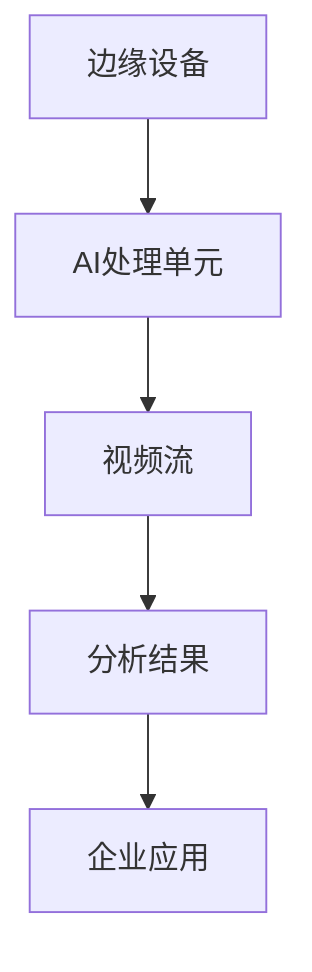
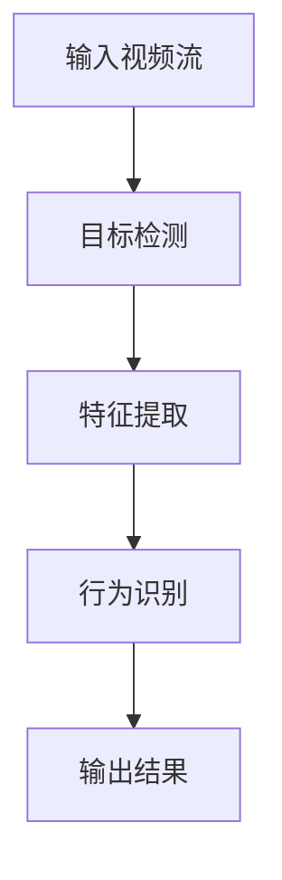

                 


# 如何识别企业的边缘AI视频分析优势

## 关键词：
边缘计算、AI视频分析、企业优势识别、系统架构、算法原理、应用场景

## 摘要：
边缘AI视频分析是一种结合边缘计算和人工智能技术的新兴技术，能够为企业提供实时、高效、安全的视频分析解决方案。本文将从边缘AI视频分析的核心概念、算法原理、系统架构、项目实战等多个方面进行详细分析，帮助读者识别企业在边缘AI视频分析领域的优势，从而在市场竞争中占据领先地位。

---

## 第一部分: 边缘AI视频分析的背景与概念

### 第1章: 边缘AI视频分析的背景与问题背景

#### 1.1 什么是边缘AI视频分析
- **1.1.1 边缘计算的定义与特点**
  - 边缘计算是指在靠近数据源的地方进行数据处理和分析，具有低延迟、高实时性、高安全性等特点。
  - 边缘计算的核心是将计算能力从中心服务器转移到边缘设备，减少数据传输的延迟和带宽消耗。

- **1.1.2 AI视频分析的核心概念**
  - AI视频分析是指利用人工智能技术（如深度学习、计算机视觉等）对视频流进行实时分析，识别视频中的目标、行为、场景等信息。
  - 视频分析的核心任务包括目标检测、行为识别、场景分割等。

- **1.1.3 边缘AI视频分析的定义与边界**
  - 边缘AI视频分析是指在边缘设备上运行AI算法，对视频流进行实时分析和处理。
  - 边缘AI视频分析的边界包括边缘设备的计算能力、网络带宽、延迟要求等。

#### 1.2 问题背景与问题描述
- **1.2.1 传统视频分析的局限性**
  - 传统视频分析通常依赖中心化的服务器进行处理，数据传输延迟高，带宽占用大。
  - 中心化视频分析的实时性差，难以满足边缘场景的需求。

- **1.2.2 边缘AI视频分析的必要性**
  - 边缘AI视频分析能够实现实时、本地化的视频处理，减少对中心服务器的依赖。
  - 边缘AI视频分析能够提高数据安全性，避免数据在传输过程中被截获。

- **1.2.3 企业边缘AI视频分析的核心问题**
  - 如何选择适合的边缘设备和AI算法。
  - 如何保证边缘设备的计算能力和网络带宽。

#### 1.3 问题解决与边界外延
- **1.3.1 边缘AI视频分析的优势**
  - 实时性高，能够在边缘设备上快速处理视频数据。
  - 数据安全性高，减少数据传输过程中的安全风险。
  - 网络依赖低，适合在网络条件较差的边缘场景。

- **1.3.2 边缘AI视频分析的边界与外延**
  - 边缘AI视频分析的边界包括边缘设备的计算能力、网络带宽、延迟要求等。
  - 边缘AI视频分析的外延包括与物联网（IoT）、云计算等技术的结合。

- **1.3.3 边缘AI视频分析的核心要素组成**
  - 边缘设备：包括摄像头、嵌入式设备等。
  - AI算法：包括目标检测、行为识别等算法。
  - 网络传输：包括边缘设备与云端的通信。

### 第2章: 边缘AI视频分析的核心概念与联系

#### 2.1 核心概念原理
- **2.1.1 边缘计算与AI的结合**
  - 边缘计算为AI算法提供了本地化的计算环境。
  - AI算法为边缘计算提供了智能化的数据处理能力。

- **2.1.2 视频分析的核心算法**
  - 视频分析的核心算法包括目标检测、行为识别、场景分割等。
  - 这些算法通常基于深度学习模型，如YOLO、Faster R-CNN等。

- **2.1.3 边缘AI视频分析的系统架构**
  - 边缘AI视频分析的系统架构包括边缘设备、AI算法、网络传输等部分。

#### 2.2 核心概念属性特征对比
- **2.2.1 边缘AI与中心化AI的对比**
  | 特性 | 边缘AI | 中心化AI |
  |------|--------|----------|
  | 计算能力 | 边缘设备计算 | 中心服务器计算 |
  | 延迟 | 低延迟 | 高延迟 |
  | 数据传输 | 本地处理，数据不外传 | 数据传输到中心服务器 |

- **2.2.2 视频分析与图像分析的对比**
  | 特性 | 视频分析 | 图像分析 |
  |------|----------|----------|
  | 数据类型 | 视频流 | 单张图像 |
  | 实时性 | 高 | 较低 |
  | 算法复杂度 | 较高 | 较低 |

- **2.2.3 边缘AI视频分析与其他技术的对比**
  - 边缘AI视频分析与物联网（IoT）的结合：物联网提供数据采集，边缘AI提供数据分析。
  - 边缘AI视频分析与云计算的结合：边缘AI处理实时数据，云计算提供存储和大数据分析。

#### 2.3 ER实体关系图


---

## 第二部分: 边缘AI视频分析的算法原理

### 第3章: 视频分析的核心算法

#### 3.1 目标检测算法
- **3.1.1 YOLO算法原理**
  - YOLO（You Only Look Once）是一种基于深度学习的目标检测算法。
  - YOLO将图像分为网格，每个网格负责检测目标。
  - YOLO通过预测边界框和置信度来实现目标检测。

- **3.1.2 Faster R-CNN算法原理**
  - Faster R-CNN是一种基于区域建议网络（RPN）的目标检测算法。
  - RPN用于生成候选区域，然后对每个候选区域进行分类和定位。

- **3.1.3 比较与选择**
  - YOLO适合实时性要求高的场景，Faster R-CNN适合对准确性要求高的场景。

#### 3.2 视频流分析算法
- **3.2.1 基于帧的分析**
  - 每帧独立分析，适合简单场景。
  - 由于帧率高，计算量大。

- **3.2.2 基于运动检测的分析**
  - 通过检测视频中的运动区域，减少无效区域的分析。
  - 常用于监控场景。

- **3.2.3 基于深度学习的视频分析**
  - 使用3D卷积神经网络（如C3D）进行视频分析。
  - 适合复杂场景，如行为识别。

#### 3.3 算法流程图


#### 3.4 算法实现代码
```python
import tensorflow as tf
from tensorflow.keras.models import Model
from tensorflow.keras.layers import Input, Conv2D, MaxPooling2D, Dense

def yolo_model():
    input_tensor = Input(shape=(416, 416, 3))
    x = Conv2D(32, (3, 3), activation='relu')(input_tensor)
    x = MaxPooling2D((2, 2))(x)
    # 继续添加更多层...
    model = Model(inputs=input_tensor, outputs=x)
    return model

# 示例使用
model = yolo_model()
model.summary()
```

#### 3.5 数学模型与公式
- **YOLO损失函数**
  $$ \text{Loss} = \lambda_{\text{coord}} \cdot \text{Loss}_{\text{coord}} + \lambda_{\text{conf}} \cdot \text{Loss}_{\text{conf}} + \lambda_{\text{prob}} \cdot \text{Loss}_{\text{prob}} $$

---

## 第三部分: 边缘AI视频分析的系统分析与架构设计

### 第4章: 系统分析与架构设计

#### 4.1 问题场景介绍
- 边缘AI视频分析的典型场景包括工业监控、智能安防、智能交通等。

#### 4.2 系统功能设计
- **领域模型**
  ```mermaid
  classDiagram
      class EdgeDevice {
          processVideo()
      }
      class AIModel {
          detectObjects()
      }
      class Network {
          sendData()
      }
      EdgeDevice --> AIModel : "运行AI模型"
      EdgeDevice --> Network : "传输数据"
  ```

- **系统架构设计**
  ```mermaid
  graph TD
      A[Edge Device] --> B[AI Processing]
      B --> C[Network]
      C --> D[Cloud Server]
  ```

- **系统接口设计**
  - 边缘设备与AI模型的接口：视频流输入、模型调用。
  - 边缘设备与网络的接口：数据传输、命令接收。

- **系统交互序列图**
  ```mermaid
  sequenceDiagram
      EdgeDevice -> AIModel: 提供视频流
      AIModel -> EdgeDevice: 返回检测结果
      EdgeDevice -> Network: 发送检测结果
      Network -> CloudServer: 传输数据
  ```

---

## 第四部分: 边缘AI视频分析的项目实战

### 第5章: 项目实战

#### 5.1 环境安装与配置
- 安装Python、TensorFlow、OpenCV等开发工具。
- 配置边缘设备（如树莓派）的开发环境。

#### 5.2 系统核心实现
```python
import cv2
import tensorflow as tf

# 加载预训练模型
model = tf.keras.models.load_model('edge_ai_model.h5')

# 处理视频流
def process_video():
    cap = cv2.VideoCapture(0)
    while cap.isOpened():
        ret, frame = cap.read()
        if not ret:
            break
        # 运行模型进行预测
        prediction = model.predict(frame)
        # 解释预测结果并显示
        cv2.imshow('Edge AI Video Analysis', frame)
        if cv2.waitKey(1) == ord('q'):
            break
    cap.release()
    cv2.destroyAllWindows()

process_video()
```

#### 5.3 实际案例分析
- 案例1：工业监控中的缺陷检测。
- 案例2：智能安防中的行为识别。

#### 5.4 项目总结
- 项目实现的关键点：边缘设备的计算能力、模型的轻量化设计、系统的实时性优化。

---

## 第五部分: 边缘AI视频分析的最佳实践

### 第6章: 最佳实践

#### 6.1 小结
- 边缘AI视频分析的优势包括实时性高、安全性好、网络依赖低。
- 企业在选择边缘AI视频分析方案时，需要综合考虑计算能力、网络条件、应用场景等因素。

#### 6.2 注意事项
- 边缘设备的计算能力有限，需要优化模型的大小和推理速度。
- 数据隐私和安全性是边缘AI视频分析的重要考虑因素。

#### 6.3 拓展阅读
- 推荐阅读《深入理解边缘计算》、《AI视频分析实战》等书籍。

---

## 作者：AI天才研究院/AI Genius Institute & 禅与计算机程序设计艺术 /Zen And The Art of Computer Programming

