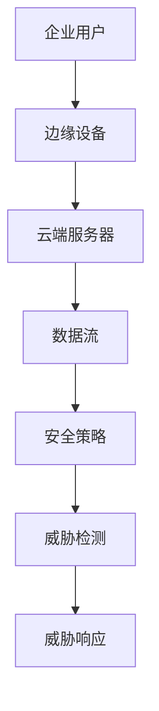
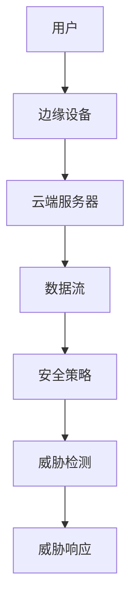
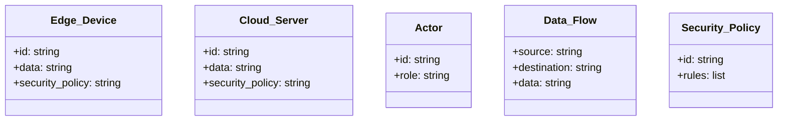

                 


# 如何识别企业的边缘计算安全优势

> 关键词：边缘计算，安全优势，企业安全，技术博客，安全威胁

> 摘要：本文将详细探讨如何识别企业在边缘计算中的安全优势，从边缘计算的基本概念到安全威胁模型的数学分析，再到系统架构设计和项目实战，帮助读者全面理解边缘计算安全的核心要素和实现方法。

---

## 第一章: 边缘计算安全的背景与挑战

### 1.1 边缘计算的基本概念

#### 1.1.1 边缘计算的定义

边缘计算（Edge Computing）是一种分布式计算范式，它将数据处理和存储能力从传统的中心化云端服务器扩展到网络的边缘，例如智能设备、传感器、分支机构等。边缘计算的核心思想是将计算能力推向数据生成的地方，减少数据传输到云端的延迟，提高实时性和响应速度。

#### 1.1.2 边缘计算的核心特点

- **低延迟**：边缘计算能够实时处理数据，减少数据传输到云端的时间，提高响应速度。
- **高带宽**：通过将计算能力分布到边缘，可以减少对中心服务器的依赖，提高网络带宽利用率。
- **本地化**：边缘设备可以在本地处理数据，减少对云端的依赖，提高数据隐私和安全性。

#### 1.1.3 边缘计算在企业中的应用前景

边缘计算在企业中的应用前景广阔，尤其是在物联网（IoT）、工业自动化、智能城市、智能医疗等领域。通过边缘计算，企业可以实现更高效的资源利用、更快速的响应速度和更强大的数据处理能力。

### 1.2 边缘计算安全的重要性

#### 1.2.1 边缘计算的安全挑战

边缘计算的安全挑战主要来自以下几个方面：

- **物理安全**：边缘设备可能容易被物理攻击，例如设备被篡改、传感器被欺骗等。
- **数据隐私**：边缘设备处理的数据可能包含敏感信息，如何保护这些数据不被未经授权的人员访问是一个重要挑战。
- **网络安全**：边缘设备与云端服务器之间的通信可能存在网络攻击的风险，例如数据截获、中间人攻击等。

#### 1.2.2 安全威胁对企业的影响

- **数据泄露**：未经授权的人员可能通过攻击边缘设备或云端服务器，窃取企业的敏感数据，导致企业遭受经济损失和声誉损害。
- **服务中断**：如果边缘设备或云端服务器遭受攻击，可能导致服务中断，影响企业的正常运营。
- **法律风险**：如果企业的数据处理不符合相关法律法规，可能导致法律诉讼和罚款。

#### 1.2.3 边缘计算安全的核心目标

边缘计算安全的核心目标是保护企业的数据隐私、确保系统的可用性和完整性，同时减少安全威胁对企业的影响。

---

## 第二章: 边缘计算安全的核心概念与联系

### 2.1 边缘计算安全的核心原理

#### 2.1.1 边缘计算安全的基本原理

边缘计算安全的基本原理包括以下几个方面：

- **身份认证**：通过身份认证机制，确保只有授权的用户或设备可以访问边缘设备或云端服务器。
- **数据加密**：通过数据加密技术，保护数据在传输和存储过程中的安全性。
- **访问控制**：通过访问控制策略，限制未经授权的用户或设备对系统资源的访问。

#### 2.1.2 边缘计算安全的关键技术

- **加密技术**：使用加密算法对数据进行加密，防止数据被未经授权的人员窃取。
- **身份认证技术**：使用多因素认证（MFA）等技术，确保只有合法用户可以访问系统资源。
- **入侵检测系统（IDS）**：通过入侵检测系统，实时监控系统中的异常行为，及时发现并应对安全威胁。

#### 2.1.3 边缘计算安全的实现方式

- **软件实现**：通过在边缘设备上安装安全软件，实现数据加密、身份认证等功能。
- **硬件实现**：通过在边缘设备上使用安全硬件，例如安全芯片，实现数据加密和身份认证。
- **云端协同**：通过云端服务器与边缘设备的协同工作，实现统一的安全管理。

### 2.2 边缘计算安全的核心概念对比

#### 2.2.1 边缘计算与传统计算模式的对比

| 特性          | 传统计算模式          | 边缘计算模式          |
|---------------|-----------------------|-----------------------|
| 数据处理      | 中央服务器处理数据    | 边缘设备处理数据      |
| 延迟          | 高延迟                | 低延迟                |
| 带宽利用率     | 低带宽利用率          | 高带宽利用率          |
| 数据隐私      | 数据集中在云端，隐私风险较高 | 数据分散在边缘，隐私风险较低 |

#### 2.2.2 边缘计算安全与云计算安全的对比

| 特性          | 边缘计算安全          | 云计算安全            |
|---------------|-----------------------|-----------------------|
| 数据存储      | 数据存储在边缘设备    | 数据存储在云端        |
| 数据传输      | 数据传输距离短        | 数据传输距离长        |
| 网络攻击风险   | 边缘设备可能成为攻击目标 | 云端服务器可能成为攻击目标 |
| 安全管理      | 边缘设备分散管理      | 云端集中管理          |

#### 2.2.3 边缘计算安全的核心要素

- **身份认证**：确保只有授权的用户或设备可以访问系统资源。
- **数据加密**：保护数据在传输和存储过程中的安全性。
- **访问控制**：限制未经授权的用户或设备对系统资源的访问。

### 2.3 边缘计算安全的ER实体关系图

```mermaid
er
actor: 企业用户
edge-device: 边缘设备
cloud-server: 云端服务器
data-flow: 数据流
security-policy: 安全策略
```

---

## 第三章: 边缘计算安全威胁模型与数学分析

### 3.1 边缘计算安全威胁模型

#### 3.1.1 威胁来源分析

边缘计算安全的威胁来源主要包括以下几个方面：

- **内部威胁**：企业内部员工可能因疏忽或恶意行为，导致数据泄露或系统损坏。
- **外部威胁**：黑客可能通过网络攻击、恶意软件等方式，攻击边缘设备或云端服务器。
- **物理威胁**：边缘设备可能被物理篡改或破坏，导致数据泄露或系统损坏。

#### 3.1.2 威胁影响分析

- **数据泄露**：攻击者可能通过漏洞窃取企业的敏感数据。
- **服务中断**：攻击可能导致边缘设备或云端服务器无法正常运行，影响企业的正常运营。
- **法律风险**：数据泄露可能导致企业面临法律诉讼和罚款。

#### 3.1.3 威胁概率模型

威胁概率模型用于评估不同安全威胁对企业的潜在影响。常用的模型包括：

- **概率风险评估模型（PRA）**：通过分析威胁发生的概率和影响程度，评估风险的大小。
- **风险矩阵模型（RM）**：通过将威胁发生的可能性和影响程度进行分类，评估风险的大小。

### 3.2 边缘计算安全威胁的数学模型

#### 3.2.1 威胁概率公式

$$ P = \frac{N}{M} $$

其中，$P$ 表示威胁发生的概率，$N$ 表示威胁事件的数量，$M$ 表示可能的事件总数。

#### 3.2.2 威胁影响评估公式

$$ I = \sum_{i=1}^{n} (w_i \times c_i) $$

其中，$I$ 表示威胁的影响程度，$w_i$ 表示第 $i$ 个威胁的权重，$c_i$ 表示第 $i$ 个威胁的影响程度。

### 3.3 边缘计算安全威胁的流程图



---

## 第四章: 边缘计算安全的系统分析与架构设计

### 4.1 边缘计算安全的系统功能设计

#### 4.1.1 系统功能模块划分

- **身份认证模块**：负责对用户或设备进行身份认证，确保只有授权的用户或设备可以访问系统资源。
- **数据加密模块**：负责对数据进行加密，保护数据在传输和存储过程中的安全性。
- **访问控制模块**：负责限制未经授权的用户或设备对系统资源的访问。

#### 4.1.2 功能模块的交互流程



#### 4.1.3 功能模块的实现方式

- **身份认证模块**：使用多因素认证（MFA）技术，结合用户名、密码和验证码进行身份认证。
- **数据加密模块**：使用AES加密算法对数据进行加密，确保数据在传输和存储过程中的安全性。
- **访问控制模块**：使用基于角色的访问控制（RBAC）策略，限制未经授权的用户或设备对系统资源的访问。

### 4.2 边缘计算安全的领域模型类图



### 4.3 边缘计算安全的系统架构图


---

## 第五章: 边缘计算安全的项目实战

### 5.1 项目环境安装

#### 5.1.1 安装边缘设备

- **硬件要求**：边缘设备需要具备一定的计算能力和存储能力，例如树莓派、工业计算机等。
- **软件要求**：安装边缘设备操作系统，例如Linux、Windows IoT等。

#### 5.1.2 安装云端服务器

- **硬件要求**：云端服务器需要具备较高的计算能力和存储能力，例如阿里云、AWS等。
- **软件要求**：安装云端服务器操作系统，例如Linux、Windows Server等。

### 5.2 系统核心实现源代码

#### 5.2.1 边缘设备代码实现

```python
# 边缘设备代码实现
import hashlib
import hmac

def authenticate(user, password):
    # 使用HMAC-SHA256进行身份认证
    key = b'secret_key'
    message = user.encode('utf-8')
    h = hmac.new(key, message, hashlib.sha256)
    signature = h.hexdigest()
    return signature == password

def encrypt(data):
    # 使用AES加密算法对数据进行加密
    key = b'secret_key'
    cipher = AES.new(key, AES.MODE_ECB)
    encrypted_data = cipher.encrypt(data)
    return encrypted_data
```

#### 5.2.2 云端服务器代码实现

```python
# 云端服务器代码实现
import requests
import json

def send_data(data):
    # 将数据发送到云端服务器
    headers = {'Content-Type': 'application/json'}
    response = requests.post('https://api.example.com', headers=headers, json=data)
    return response.status_code == 200
```

### 5.3 案例分析与详细解读

#### 5.3.1 案例分析

假设某企业使用边缘计算技术对其分支机构的传感器数据进行实时处理。为了确保数据的安全性，企业在每个分支机构部署了一个边缘设备，负责对传感器数据进行加密和身份认证。云端服务器负责对加密数据进行存储和分析。

#### 5.3.2 详细解读

- **边缘设备**：边缘设备负责对传感器数据进行加密和身份认证，确保只有授权的用户或设备可以访问系统资源。
- **云端服务器**：云端服务器负责对加密数据进行存储和分析，确保数据的安全性和隐私性。
- **数据流**：数据从边缘设备传输到云端服务器，经过加密和身份认证后，云端服务器对数据进行处理和分析。

### 5.4 项目小结

通过本项目的实施，企业可以实现对边缘设备的高效管理和数据的安全传输，确保数据的隐私性和安全性。同时，企业可以利用云端服务器的强大计算能力，对边缘设备的数据进行实时分析和处理，提高企业的运营效率和竞争力。

---

## 第六章: 边缘计算安全的最佳实践与注意事项

### 6.1 边缘计算安全的最佳实践

#### 6.1.1 定期进行安全审计

企业应定期对边缘设备和云端服务器进行安全审计，确保系统的安全性和合规性。

#### 6.1.2 更新安全策略

企业应定期更新安全策略，确保系统的安全性和有效性。

#### 6.1.3 培训员工

企业应定期对员工进行安全培训，提高员工的安全意识和技能。

### 6.2 边缘计算安全的注意事项

#### 6.2.1 物理安全

边缘设备可能容易被物理攻击，企业应采取措施保护边缘设备的安全，例如使用安全外壳、加密存储等。

#### 6.2.2 数据隐私

企业应采取措施保护数据的隐私性，例如使用加密技术、访问控制等。

#### 6.2.3 网络安全

企业应采取措施保护边缘设备与云端服务器之间的通信安全，例如使用加密协议、防火墙等。

### 6.3 拓展阅读

- **《边缘计算：架构与安全》**：深入探讨边缘计算的架构设计和安全挑战。
- **《网络安全：原理与实践》**：系统介绍网络安全的基本原理和实际应用。
- **《数据隐私与保护》**：详细讲解数据隐私的保护方法和最佳实践。

---

## 作者：AI天才研究院/AI Genius Institute & 禅与计算机程序设计艺术/Zen And The Art of Computer Programming

---

通过本文的详细探讨，读者可以全面了解如何识别企业在边缘计算中的安全优势，掌握边缘计算安全的核心要素和实现方法。希望本文能为企业在边缘计算安全领域的实践提供有价值的参考和指导。

