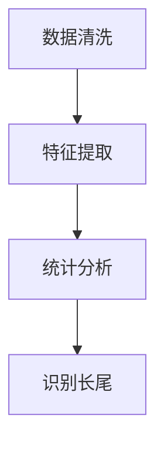
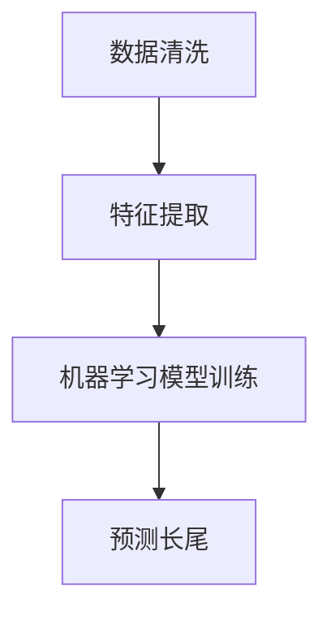
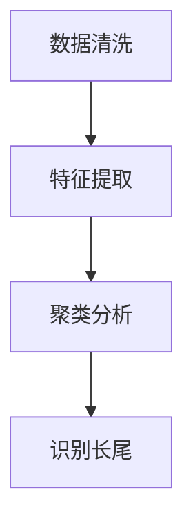
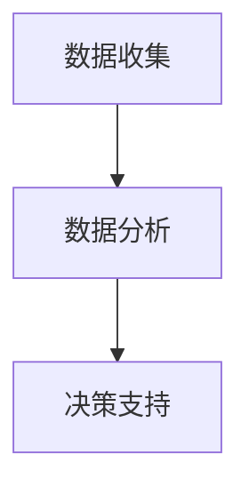
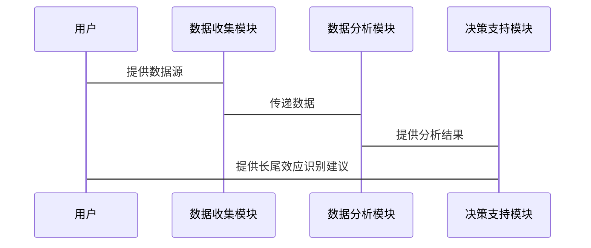

                 


# 如何识别企业的长尾效应优势

## 关键词：长尾效应, 企业优势, 数据分析, 商业模式, 人工智能

## 摘要：  
长尾效应是指在商业领域中，小众市场累积起来的总和可以与主流市场相媲美甚至超越的现象。本文将从背景介绍、核心概念、算法原理、数学模型、系统架构、项目实战和最佳实践等多个方面，详细探讨如何识别和利用企业的长尾效应优势。通过数据分析、市场研究和战略制定，企业可以更好地抓住长尾效应带来的机会，提升竞争力。

---

## 第一部分: 长尾效应概述

### 第1章: 长尾效应的定义与背景

#### 1.1 长尾效应的定义
##### 1.1.1 长尾效应的起源与概念
长尾效应最初由克里斯·安德森（Chris Anderson）在《长尾理论》一书中提出，指的是在商业和互联网时代，那些销量或市场份额较低但种类繁多的产品或服务，其总和可以与主流产品的市场份额相媲美甚至超越的现象。

##### 1.1.2 长尾效应与传统商业模式的对比
| 对比维度       | 传统商业模式                | 长尾模式                |
|----------------|----------------------------|--------------------------|
| 市场焦点       | 主流市场，追求高销量        | 小众市场，追求多样性    |
| 成本结构       | 高固定成本，低边际成本      | 低固定成本，高边际成本  |
| 市场覆盖       | 有限的市场覆盖              | 广泛的市场覆盖            |

##### 1.1.3 长尾效应对企业竞争优势的影响
长尾效应通过聚焦小众市场，帮助企业发现未被主流市场覆盖的机会，从而在竞争中占据优势。

#### 1.2 长尾效应的背景与现状
##### 1.2.1 数字化时代的长尾效应
在数字化时代，互联网和大数据技术使得长尾效应更容易被识别和利用。

##### 1.2.2 长尾效应在不同行业的应用实例
- 电商行业：通过个性化推荐，满足小众需求。
- 娱乐行业：通过长尾内容吸引特定用户群体。
- 制造业：通过定制化生产满足小众市场。

##### 1.2.3 长尾效应的未来发展与趋势
随着技术的进步，长尾效应将越来越重要，尤其是在个性化和定制化需求日益增长的市场中。

#### 1.3 本章小结
- 长尾效应的核心概念是通过小众市场的累积优势，与主流市场竞争。
- 长尾效应在数字化时代具有重要地位，并在多个行业得到广泛应用。

### 第2章: 长尾效应的核心概念与优势

#### 2.1 长尾效应的核心概念
##### 2.1.1 长尾效应的特征与属性
- 小众性：专注于特定 niche 市场。
- 多样性：产品或服务种类繁多。
- 高效性：通过数据驱动优化资源配置。

##### 2.1.2 长尾效应的数学模型与公式
长尾效应可以用概率分布模型来描述，例如：
$$ P(x) = \frac{1}{1 + e^{-x}} $$
其中，$P(x)$ 表示某产品的市场占有率概率。

##### 2.1.3 长尾效应的ER实体关系图
```mermaid
erDiagram
    actor 用户 {
        string 用户ID
        string 用户属性
    }
    product 产品 {
        string 产品ID
        string 产品属性
    }
    sale 销售 {
        date 销售日期
        int 销售数量
    }
    用户 --> sale: 购买
    产品 --> sale: 被购买
```

#### 2.2 长尾效应的优势与劣势
##### 2.2.1 长尾效应的优势
- 发现未被主流市场覆盖的机会。
- 提高客户满意度和忠诚度。
- 通过定制化服务提高竞争力。

##### 2.2.2 长尾效应的劣势
- 利润较低，难以覆盖固定成本。
- 需要较高的数据处理和分析能力。
- 小众市场可能不稳定，难以长期维持。

#### 2.3 长尾效应与企业竞争优势的关系
长尾效应通过满足特定用户需求，增强企业的市场竞争力。

#### 2.4 本章小结
- 长尾效应的核心概念包括小众性、多样性和高效性。
- 长尾效应的优势在于发现市场机会，劣势在于利润低和数据处理难度大。

## 第三部分: 长尾效应的识别方法与算法原理

### 第3章: 长尾效应的识别方法与算法原理

#### 3.1 长尾效应的识别方法
##### 3.1.1 数据采集与清洗
- 数据采集：通过API、爬虫等方式获取数据。
- 数据清洗：去除重复、错误和无效数据。

##### 3.1.2 数据分析与特征提取
- 数据分析：使用统计方法识别长尾模式。
- 特征提取：提取关键特征，如销售量、用户行为等。

##### 3.1.3 数据可视化与模式识别
- 数据可视化：通过图表展示数据分布。
- 模式识别：识别长尾模式的特征。

#### 3.2 长尾效应的算法原理
##### 3.2.1 基于统计的长尾识别算法


##### 3.2.2 基于机器学习的长尾识别算法


##### 3.2.3 基于聚类分析的长尾识别算法


#### 3.3 算法实现与代码示例
##### 3.3.1 数据处理代码示例
```python
import pandas as pd
import numpy as np

# 数据清洗
data = pd.read_csv('data.csv')
data.drop_duplicates(inplace=True)
data.dropna(inplace=True)
```

##### 3.3.2 统计分析代码示例
```python
import matplotlib.pyplot as plt

data.hist()
plt.show()
```

##### 3.3.3 机器学习算法实现代码示例
```python
from sklearn.cluster import KMeans

kmeans = KMeans(n_clusters=3)
kmeans.fit(data)
```

#### 3.4 本章小结
- 长尾效应的识别方法包括数据采集、清洗、分析和可视化。
- 基于统计、机器学习和聚类分析的算法可以帮助识别长尾模式。

## 第四部分: 长尾效应的数学模型与公式

### 第4章: 长尾效应的数学模型与公式

#### 4.1 长尾效应的数学模型
##### 4.1.1 长尾效应的概率分布模型
长尾效应可以用幂律分布来描述：
$$ P(x) = x^{-\alpha} $$
其中，$\alpha$ 是幂律指数。

##### 4.1.2 长尾效应的统计分析模型
通过统计分析，识别数据中的长尾部分。

##### 4.1.3 长尾效应的回归分析模型
$$ y = \beta x + \epsilon $$

#### 4.2 长尾效应的数学公式
##### 4.2.1 概率密度函数公式
$$ f(x) = \frac{1}{\Gamma(k)\theta^k}x^{k-1}e^{-x/\theta} $$

##### 4.2.2 累积分布函数公式
$$ F(x) = 1 - e^{-x/\theta} $$

##### 4.2.3 回归分析公式
$$ y = \beta_0 + \beta_1x + \epsilon $$

#### 4.3 数学模型的实现与应用
##### 4.3.1 模型的实现步骤
1. 数据清洗。
2. 选择合适的数学模型。
3. 训练模型。
4. 验证模型。

##### 4.3.2 模型的应用场景
- 预测长尾市场的销售情况。
- 优化资源配置。

## 第五部分: 长尾效应的系统架构与项目实战

### 第5章: 长尾效应的系统架构

#### 5.1 系统功能设计
##### 5.1.1 数据收集模块
- 从多个数据源收集数据。
##### 5.1.2 数据分析模块
- 使用统计和机器学习方法分析数据。
##### 5.1.3 决策支持模块
- 提供长尾效应识别的建议。

#### 5.2 系统架构设计


#### 5.3 系统接口设计
- 数据接口：用于数据的输入和输出。
- 分析接口：用于算法的调用。

#### 5.4 系统交互设计


### 第6章: 项目实战

#### 6.1 项目介绍
- 项目目标：识别企业长尾效应优势。
- 项目范围：数据分析、算法实现。

#### 6.2 核心实现
##### 6.2.1 数据收集与预处理
```python
import pandas as pd

data = pd.read_csv('data.csv')
data.dropna(inplace=True)
```

##### 6.2.2 数据分析与建模
```python
from sklearn.cluster import KMeans

kmeans = KMeans(n_clusters=3)
kmeans.fit(data)
```

##### 6.2.3 结果可视化
```python
import matplotlib.pyplot as plt

plt.scatter(data['x'], data['y'], c=kmeans.labels_)
plt.show()
```

#### 6.3 项目小结
- 项目成功实现了长尾效应的识别。
- 数据分析和算法实现是关键步骤。

## 第六部分: 最佳实践与总结

### 第7章: 最佳实践

#### 7.1 关键点总结
- 数据质量是长尾效应识别的基础。
- 长期监测是维持长尾效应的重要手段。

#### 7.2 小结
- 长尾效应的识别需要结合数据分析和算法实现。
- 企业应重视小众市场的机会。

### 第8章: 拓展阅读与参考文献

- 克里斯·安德森的《长尾理论》。
- 相关学术论文和研究报告。

## 作者

作者：AI天才研究院/AI Genius Institute & 禅与计算机程序设计艺术/Zen And The Art of Computer Programming

---

通过以上结构，文章详细探讨了长尾效应的识别方法、算法原理、数学模型和系统架构，并结合实际案例进行分析，为读者提供了全面的指导和见解。

