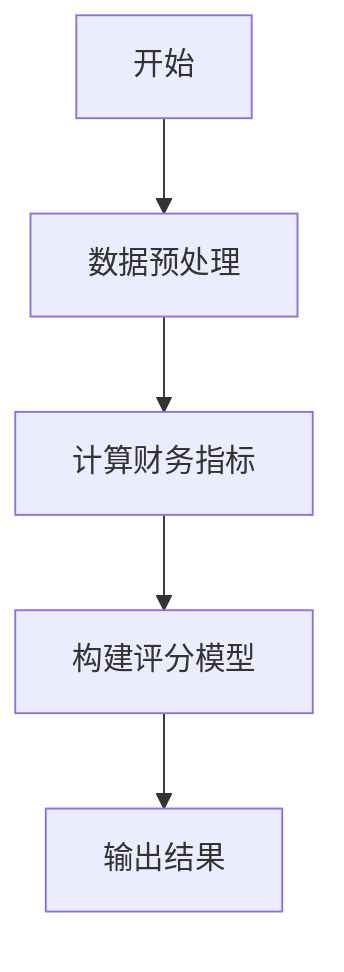

                 


# 如何识别企业的长期增长潜力

> 关键词：企业增长潜力、财务指标、市场竞争力、创新能力、系统架构

> 摘要：识别企业的长期增长潜力是企业战略规划中的关键任务。本文通过分析财务指标、市场竞争力和创新能力等核心要素，结合系统架构和算法模型，提供了一套完整的识别方法，并通过实际案例展示了如何将理论应用于实践。

---

# 第一部分：企业长期增长潜力的背景与核心概念

## 第1章：企业长期增长潜力的背景与问题描述

### 1.1 什么是企业长期增长潜力
#### 1.1.1 企业增长的定义与内涵
企业增长潜力是指企业在未来一段时间内，通过优化内部管理和外部环境，实现销售收入、利润、市场份额等核心指标持续增长的可能性。

#### 1.1.2 长期增长潜力的特征与外延
- **持续性**：增长不是短期的波动，而是长期的趋势。
- **可测性**：通过财务数据、市场分析等方法可以量化评估。
- **可操作性**：通过战略调整和资源优化可以提升增长潜力。

#### 1.1.3 识别企业增长潜力的意义
识别企业增长潜力有助于企业制定科学的发展战略，优化资源配置，规避潜在风险，抓住市场机会。

### 1.2 企业增长潜力的核心要素
#### 1.2.1 财务表现的核心指标
- 收入增长率
- 利润率
- 资产周转率
- 负债率

#### 1.2.2 市场竞争力的关键因素
- 市场份额
- 行业地位
- 竞争对手分析

#### 1.2.3 创新能力与研发投入
- 研发投入占比
- 专利数量
- 产品更新速度

#### 1.2.4 组织能力与管理效率
- 组织架构合理性
- 管理团队能力
- 企业文化与员工满意度

### 1.3 识别企业增长潜力的挑战与边界
#### 1.3.1 数据获取的难度
- 数据的完整性与准确性
- 数据的实时性与动态性

#### 1.3.2 市场环境的不确定性
- 宏观经济波动
- 政策法规变化
- 技术革新速度

#### 1.3.3 企业内部信息的不透明性
- 内部管理效率低下
- 信息孤岛问题

#### 1.3.4 边界与外延的定义
- 如何界定长期的时长
- 如何平衡短期与长期目标

---

## 第2章：企业增长潜力的核心概念与联系

### 2.1 核心概念的原理与特征
#### 2.1.1 财务指标与增长潜力的关系
- 财务指标是衡量企业增长潜力的重要工具，但不是唯一标准。
- 例如，收入增长率高不一定意味着企业具备长期增长潜力，可能只是短期市场波动的结果。

#### 2.1.2 市场机会与竞争优势的结合
- 市场机会是外部环境的驱动因素，竞争优势是内部能力的体现。
- 两者的结合决定了企业在市场中的地位和未来发展空间。

#### 2.1.3 创新能力与长期增长的关联
- 创新能力是企业保持竞争优势的关键，但创新能力的强弱需要通过研发投入、专利数量等指标来量化。

### 2.2 核心概念的属性特征对比
#### 2.2.1 财务指标对比表
| 指标名称       | 重要性权重 | 计算公式                          |
|----------------|------------|-----------------------------------|
| 收入增长率     | 高         | (本年收入 - 上年收入)/上年收入   |
| 利润率         | 高         | 利润/收入                        |
| 资产周转率     | 中         | 销售收入/平均总资产              |

#### 2.2.2 市场竞争力对比表
| 指标名称       | 重要性权重 | 计算公式                          |
|----------------|------------|-----------------------------------|
| 市场份额       | 高         | 企业销售额/行业总销售额          |
| 行业地位       | 高         | 企业排名                          |
| 竞争对手数量   | 中         | 主要竞争对手数量                  |

#### 2.2.3 创新能力对比表
| 指标名称       | 重要性权重 | 计算公式                          |
|----------------|------------|-----------------------------------|
| 研发投入占比     | 高         | 研发费用/总收入                   |
| 专利数量       | 高         | 专利总数                         |
| 产品更新速度     | 中         | 新产品数量/年                    |

### 2.3 ER实体关系图
```mermaid
erd
    entity 企业 {
        id
        财务指标
        市场竞争力
        创新能力
    }
```

---

# 第二部分：企业增长潜力的识别方法与算法

## 第3章：基于财务数据的增长潜力评估算法

### 3.1 算法原理与流程
#### 3.1.1 数据预处理
- 数据清洗：处理缺失值、异常值。
- 数据标准化：统一数据格式和单位。

#### 3.1.2 财务指标计算
- 计算收入增长率、利润率等核心指标。
- 通过加权平均法计算综合得分。

#### 3.1.3 综合评分模型
- 根据财务指标的重要性权重，构建综合评分模型。
- 例如：综合评分 = 0.4×收入增长率 + 0.3×利润率 + 0.3×资产周转率

### 3.2 算法流程图


### 3.3 数学模型与公式
#### 3.3.1 收入增长率计算
$$ 收入增长率 = \frac{\text{本年收入} - \text{上年收入}}{\text{上年收入}} $$

#### 3.3.2 综合评分模型
$$ 综合评分 = w_1 \times \text{收入增长率} + w_2 \times \text{利润率} + w_3 \times \text{资产周转率} $$

其中，$w_1, w_2, w_3$ 是各指标的权重，通常根据行业特点和企业战略目标设定。

---

## 第4章：企业增长潜力的系统架构设计

### 4.1 系统功能设计
#### 4.1.1 数据收集模块
- 采集企业的财务数据、市场数据等。

#### 4.1.2 数据分析模块
- 计算各项财务指标。
- 评估市场竞争力和创新能力。

#### 4.1.3 报告生成模块
- 生成综合评分报告。
- 提出优化建议。

### 4.2 系统架构设计


### 4.3 系统接口设计
- 数据接口：与财务系统、市场数据源对接。
- 报告接口：生成PDF或Excel格式的报告。

---

## 第5章：企业增长潜力识别的项目实战

### 5.1 环境安装
- 安装Python、Pandas、Matplotlib等工具。

### 5.2 核心实现代码
```python
import pandas as pd

# 数据预处理
data = pd.read_csv('enterprise_data.csv')
data = data.dropna()

# 计算财务指标
revenue_growth = (data['revenue'] - data['revenue'].shift(1)) / data['revenue'].shift(1)
profitability = data['profit'] / data['revenue']
```

### 5.3 实际案例分析
- 以某制造企业为例，分析其财务指标和市场竞争力。
- 使用综合评分模型评估其增长潜力。

---

## 第6章：企业增长潜力识别的最佳实践

### 6.1 小结
- 综合评分模型是识别企业增长潜力的重要工具。
- 数据的准确性和完整性是模型效果的关键。

### 6.2 注意事项
- 数据分析时要结合行业特点。
- 结果要与企业实际情况相结合，避免过于依赖模型。

### 6.3 拓展阅读
- 建议阅读《企业战略管理》《数据分析与商业决策》等书籍。

---

# 作者：AI天才研究院 & 禅与计算机程序设计艺术

通过本文的详细分析和步骤讲解，您可以系统地识别企业的长期增长潜力，并为企业制定科学的发展战略提供有力支持。

