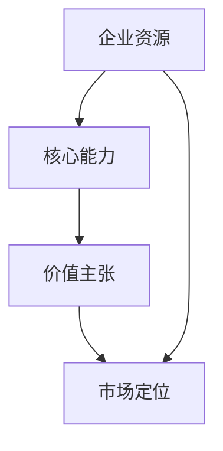
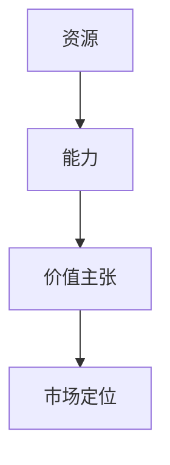
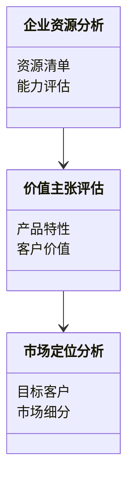
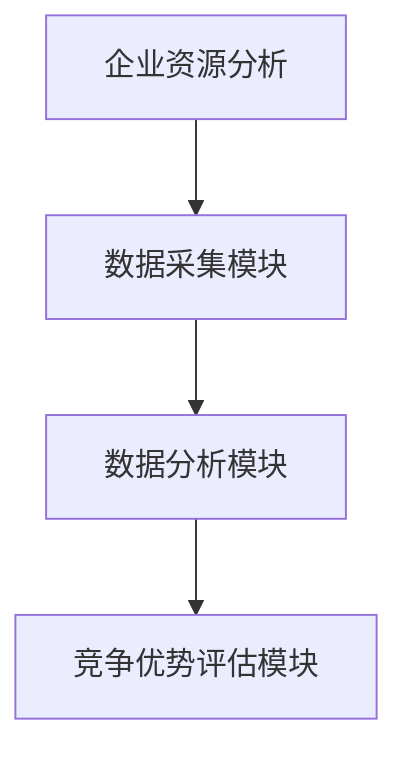

                 


# 如何识别企业的长期竞争优势

> 关键词：企业竞争优势、核心能力、市场定位、资源分析、战略规划、系统架构、数据驱动决策

> 摘要：企业的长期竞争优势是企业持续发展的关键因素。本文通过系统分析和实际案例，深入探讨如何识别和评估企业的竞争优势，包括核心资源、能力、价值主张和市场定位，结合数据驱动的方法，提供有效的识别策略和工具，帮助企业在复杂市场环境中保持竞争力。

---

# 第一部分：企业的长期竞争优势概述

## 第1章：企业的长期竞争优势定义与背景

### 1.1 什么是企业的长期竞争优势

#### 1.1.1 核心概念：问题背景与问题描述
企业的长期竞争优势是指企业在长期经营中能够持续提供独特价值，从而在市场中获得超越竞争对手的盈利能力。竞争优势的核心在于企业的资源、能力和市场定位的有机整合。

#### 1.1.2 问题解决的路径与方法
识别竞争优势需要从企业内部资源和外部市场环境两个维度入手，结合定量分析和定性评估，全面评估企业的核心竞争力。

#### 1.1.3 竞争优势的边界与外延
竞争优势不仅包括产品的独特性，还包括成本优势、品牌影响力、客户关系等多方面因素。

#### 1.1.4 核心要素与组成结构
竞争优势由资源、能力、价值主张和市场定位四部分构成，形成一个相互关联的系统。

### 1.2 长期竞争优势的重要性

#### 1.2.1 企业生存与发展的关键
竞争优势决定企业的市场地位和盈利能力，是企业在激烈竞争中生存和发展的基础。

#### 1.2.2 竞争优势与企业绩效的关系
竞争优势越明显，企业的市场份额和利润率越高，从而实现更好的经营绩效。

#### 1.2.3 竞争优势的动态变化与持续性
竞争优势不是一成不变的，随着市场环境和技术的变化，企业需要不断调整和优化竞争优势。

### 1.3 竞争优势的关键要素分析

#### 1.3.1 资源：企业的核心资源
企业资源包括有形资产（如设备、土地）和无形资产（如品牌、技术），是竞争优势的基础。

#### 1.3.2 能力：企业的核心能力
核心能力是指企业在特定领域的独特技能和知识，如研发能力、生产效率等，是竞争优势的关键。

#### 1.3.3 价值主张：独特的产品与服务
价值主张是企业提供的产品或服务的独特性，能够满足客户的需求并创造价值。

#### 1.3.4 市场定位：目标客户与细分市场
市场定位决定了企业目标客户群体和市场细分策略，直接影响竞争优势的有效性。

### 1.4 竞争优势的识别方法

#### 1.4.1 识别竞争优势的步骤与流程
1. **内部资源分析**：识别企业的核心资源和能力。
2. **外部环境分析**：评估市场需求和竞争态势。
3. **价值主张评估**：确定产品的独特价值。
4. **市场定位优化**：明确目标客户和市场细分。

#### 1.4.2 竞争优势的评估与测量
通过定量分析（如市场份额、利润率）和定性评估（如品牌影响力、客户满意度）相结合的方法，全面评估竞争优势。

#### 1.4.3 竞争优势的动态调整与优化
根据市场变化和企业自身发展，定期评估和优化竞争优势，确保其持续性和有效性。

### 1.5 成功案例与失败教训

#### 1.5.1 国际企业竞争优势分析
以苹果公司为例，其强大的品牌影响力和创新能力是其长期竞争优势的核心。

#### 1.5.2 国内企业竞争优势分析
以华为为例，其在通信技术领域的研发能力和全球化的市场布局是其竞争优势的关键。

#### 1.5.3 竞争优势丧失的典型案例
如柯达公司未能及时转型 digital photography，导致市场份额被蚕食，最终陷入困境。

### 1.6 本章小结
本章通过定义和分析企业的长期竞争优势，探讨了其重要性、关键要素和识别方法，并通过案例分析展示了竞争优势的实际应用。

---

# 第二部分：核心概念与联系

## 第2章：核心概念的原理与联系

### 2.1 核心概念的属性特征对比

| 要素       | 特性                   | 示例                          |
|------------|------------------------|------------------------------|
| 资源       | 有形与无形             | 设备、品牌                    |
| 能力       | 核心技能与独特性       | 研发能力、生产效率            |
| 价值主张   | 独特价值与客户价值     | 创新产品、优质服务            |
| 市场定位   | 目标客户与细分市场     | 高端市场、大众市场            |

### 2.2 ER实体关系图架构


### 2.3 竞争优势的系统架构


---

# 第三部分：算法原理

## 第3章：识别竞争优势的算法与模型

### 3.1 层次分析法（AHP）

#### 3.1.1 算法原理
层次分析法是一种用于多准则决策的分析方法，适用于竞争优势的评估。

#### 3.1.2 算法步骤
1. 构建层次结构模型。
2. 构造判断矩阵。
3. 计算权重向量。
4. 计算一致性检验。

#### 3.1.3 Python实现代码
```python
import numpy as np

# 判断矩阵
matrix = np.array([
    [1, 3, 2, 4],
    [1/3, 1, 2, 3],
    [1/2, 1/2, 1, 2],
    [1/4, 1/3, 1/2, 1]
])

# 计算特征值和特征向量
eigvals, eigvecs = np.linalg.eig(matrix)

# 计算权重向量
weights = eigvecs[:, 0] / eigvecs[:, 0].sum()
weights = weights.round(4)
print(weights)
```

---

# 第四部分：系统分析与架构设计

## 第4章：系统分析与架构设计方案

### 4.1 问题场景介绍
识别竞争优势需要构建一个综合系统，包括数据采集、分析和评估模块。

### 4.2 系统功能设计


### 4.3 系统架构设计


---

# 第五部分：项目实战

## 第5章：项目实战与案例分析

### 5.1 项目介绍
分析某零售企业的竞争优势，识别其资源、能力、价值主张和市场定位。

### 5.2 核心代码实现
```python
import pandas as pd

# 数据采集
data = pd.read_csv('competitor.csv')
# 数据分析
analysis = data[['资源', '能力', '价值主张', '市场定位']]
# 竞争优势评估
analysis['综合评分'] = analysis.apply(lambda x: sum(x) / 4, axis=1)
print(analysis.head())
```

---

# 第六部分：最佳实践

## 第6章：最佳实践与小结

### 6.1 小结
通过系统分析和数据驱动的方法，识别企业的长期竞争优势，确保企业在市场中的持续竞争力。

### 6.2 注意事项
- 数据质量：确保数据的准确性和完整性。
- 主观因素：竞争优势的评估可能受到主观因素的影响，需结合实际情况进行调整。
- 动态优化：竞争优势不是一成不变的，需定期评估和优化。

### 6.3 拓展阅读
- 《竞争优势分析》
- 《企业战略管理》
- 《数据驱动的决策》

---

# 作者：AI天才研究院/AI Genius Institute & 禅与计算机程序设计艺术/Zen And The Art of Computer Programming

