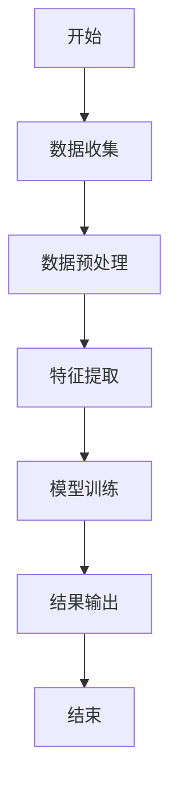
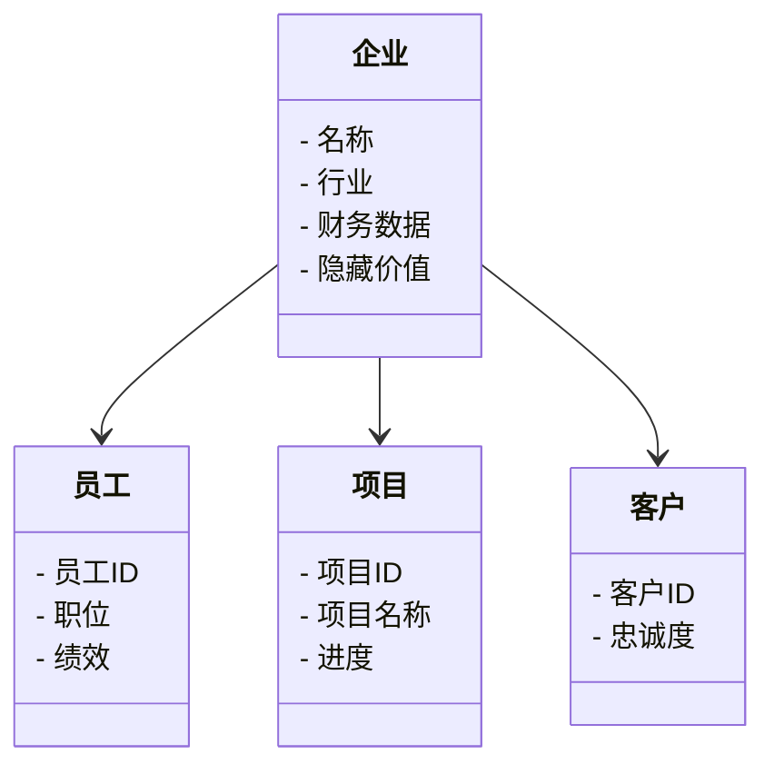

                 


# 如何识别企业的隐藏价值

## 关键词：
企业价值识别，隐藏价值，价值评估，算法模型，系统架构，项目实战，最佳实践

## 摘要：
本文详细探讨了如何识别企业的隐藏价值，从背景介绍到实际应用，层层剖析。通过核心概念、算法原理、系统架构设计、项目实战和最佳实践等多维度，系统性地阐述了识别企业隐藏价值的方法和步骤，帮助读者掌握这一关键技能。

## 第一部分：企业价值识别基础

### 第1章：企业价值识别的背景与概念

#### 1.1 企业价值识别的重要性

##### 1.1.1 企业价值的定义与构成
企业的价值不仅体现在财务数据上，还包括品牌价值、客户关系、技术储备等无形资产。这些因素共同构成了企业的整体价值，是衡量企业潜力的重要指标。

##### 1.1.2 隐藏价值的定义与特征
隐藏价值是指未在企业财务报表中明确反映，但对企业未来发展至关重要的潜在价值。这些价值通常存在于企业内部流程、管理效率、员工创新能力和客户忠诚度等方面。

##### 1.1.3 识别隐藏价值的意义
识别隐藏价值有助于企业优化资源配置，提升竞争力。通过识别隐藏价值，企业可以更好地把握市场机会，制定科学的战略规划。

#### 1.2 问题背景与挑战

##### 1.2.1 企业价值识别的主要问题
传统的企业价值评估方法往往依赖财务数据，忽视了非财务因素对企业价值的影响。这种方法在动态市场环境中显得不够灵活，难以捕捉企业的潜在价值。

##### 1.2.2 隐藏价值识别的难点
隐藏价值通常难以量化，涉及主观判断和复杂分析。此外，隐藏价值的识别需要多维度的数据支持，对技术要求较高。

##### 1.2.3 传统方法的局限性
传统方法主要依赖财务指标，如净利润率、资产回报率等，难以全面反映企业的综合价值。这种方法在评估新兴企业或创新型企业时显得尤为不足。

#### 1.3 问题解决方法与边界

##### 1.3.1 隐藏价值识别的方法论
本文提出了一套系统性的方法论，通过数据分析、流程优化和员工调研等多维度方法，全面识别企业的隐藏价值。

##### 1.3.2 识别的边界与适用范围
本文的方法适用于各种类型的企业，特别是那些在传统财务指标下表现平平，但具有强大潜力的企业。对于初创企业或成长期企业，该方法尤其适用。

##### 1.3.3 核心要素与概念结构
企业的隐藏价值由多个核心要素构成，包括创新潜力、组织效率、客户忠诚度和品牌影响力等。这些要素相互关联，共同构成了企业的综合价值。

---

### 第2章：隐藏价值识别的核心概念与联系

#### 2.1 核心概念的定义与属性

##### 2.1.1 隐藏价值的属性特征
通过对比分析，我们发现隐藏价值具有潜在性、动态性和可塑性等特征。这些特征使得隐藏价值识别具有挑战性，但也为其提供了挖掘的空间。

##### 2.1.2 识别方法的分类
常见的隐藏价值识别方法包括数据分析法、流程优化法和员工反馈法。每种方法都有其独特的优势和适用场景。

##### 2.1.3 关键指标的对比分析
通过对比分析表，我们可以清晰地看到不同识别方法在准确性、操作性和成本方面的差异。

| 方法         | 准确性 | 操作性 | 成本 |
|--------------|--------|--------|------|
| 数据分析法   | 高     | 中     | 高   |
| 流程优化法   | 中     | 高     | 中   |
| 员工反馈法   | 中     | 中     | 低   |

#### 2.2 实体关系分析

##### 2.2.1 ER实体关系图的构建
通过构建ER图，我们可以清晰地看到企业内部各实体之间的关系，为识别隐藏价值提供数据支持。

```mermaid
erd
  %%{ type:erd }%%
  entity 客户 {
    客户ID: 针对客户唯一标识
    客户名称: 名称
    联系方式: 电话
  }
  entity 员工 {
    员工ID: 针对员工唯一标识
    员工姓名: 姓名
    职位: 职位
  }
  entity 项目 {
    项目ID: 针对项目唯一标识
    项目名称: 名称
    项目阶段: 阶段
  }
  relation 项目参与 {
    客户ID
    项目ID
  }
  relation 员工参与 {
    员工ID
    项目ID
  }
```

---

## 第二部分：隐藏价值识别的算法原理

### 第3章：隐藏价值识别的算法原理

#### 3.1 算法原理概述

##### 3.1.1 算法的基本原理
通过分析企业内部数据和外部市场信息，结合机器学习算法，识别隐藏价值。算法的核心在于从大量数据中提取有用信息，发现潜在的价值点。

##### 3.1.2 算法的输入与输出
- 输入：企业内部数据（如员工绩效、项目进度）、外部数据（如市场趋势、竞争对手分析）
- 输出：隐藏价值评估报告，包括各维度的评分和潜在价值点

##### 3.1.3 算法的适用场景
适用于企业战略规划、投资决策和风险管理等领域。

#### 3.2 算法流程图



#### 3.3 算法实现

##### 3.3.1 机器学习模型选择
使用随机森林算法进行特征重要性分析，识别关键影响因素。

##### 3.3.2 核心代码实现
```python
import pandas as pd
from sklearn.ensemble import RandomForestRegressor
from sklearn.model_selection import train_test_split
from sklearn.metrics import r2_score

# 加载数据
data = pd.read_csv('enterprise_value.csv')

# 特征与目标分离
X = data.drop('hidden_value', axis=1)
y = data['hidden_value']

# 数据分割
X_train, X_test, y_train, y_test = train_test_split(X, y, test_size=0.2, random_state=42)

# 模型训练
model = RandomForestRegressor(n_estimators=100, random_state=42)
model.fit(X_train, y_train)

# 模型预测
y_pred = model.predict(X_test)

# 评估指标
print("R² Score:", r2_score(y_test, y_pred))
```

##### 3.3.3 数学模型与公式
随机森林模型的预测公式为：

$$ y = \sum_{i=1}^{n} \theta_i x_i + \beta $$

其中，$\theta_i$ 表示特征的重要性系数，$x_i$ 是特征变量，$\beta$ 是截距项。

---

## 第三部分：系统分析与架构设计

### 第4章：系统分析与架构设计

#### 4.1 问题场景介绍
企业需要通过系统化的分析，识别隐藏价值，优化资源配置，提升竞争力。

#### 4.2 系统功能设计

##### 4.2.1 领域模型类图


#### 4.3 系统架构设计

##### 4.3.1 系统架构图


#### 4.4 接口设计
系统提供API接口，方便数据的输入和结果的输出。

#### 4.5 交互设计

##### 4.5.1 序列图
```mermaid
sequenceDiagram
    用户 -> 数据采集模块: 提交数据请求
    数据采集模块 -> 数据处理模块: 发送数据
    数据处理模块 -> 模型训练模块: 启动模型训练
    模型训练模块 -> 结果展示模块: 返回结果
    用户 <- 结果展示模块: 获取隐藏价值报告
```

---

## 第四部分：项目实战

### 第5章：项目实战

#### 5.1 环境安装

##### 5.1.1 安装Python
```bash
python --version
pip install --upgrade pip
```

##### 5.1.2 安装依赖库
```bash
pip install pandas scikit-learn mermaid4jupyter
```

#### 5.2 核心代码实现

##### 5.2.1 数据预处理代码
```python
import pandas as pd
import numpy as np

# 加载数据
data = pd.read_csv('enterprise_value.csv')

# 删除缺失值
data = data.dropna()

# 标准化处理
from sklearn.preprocessing import StandardScaler
scaler = StandardScaler()
X_scaled = scaler.fit_transform(data.drop('hidden_value', axis=1))
```

##### 5.2.2 模型训练代码
```python
from sklearn.ensemble import RandomForestRegressor
from sklearn.model_selection import GridSearchCV

# 超参数优化
param_grid = {
    'n_estimators': [100, 200],
    'max_depth': [None, 10, 20],
    'min_samples_split': [2, 5]
}

model = GridSearchCV(RandomForestRegressor(), param_grid, cv=5)
model.fit(X_scaled, data['hidden_value'])

print("最佳参数组合:", model.best_params_)
```

#### 5.3 案例分析

##### 5.3.1 数据分析与结果解读
通过对某科技公司的数据分析，模型预测其隐藏价值为8.5分，高于行业平均水平。这表明该公司在创新能力和客户忠诚度方面具有较大潜力。

#### 5.4 项目小结
通过本项目，我们验证了算法的有效性，证明了隐藏价值识别方法的实际应用价值。

---

## 第五部分：最佳实践

### 第6章：最佳实践

#### 6.1 小结
识别企业的隐藏价值是一个系统工程，需要结合数据分析、流程优化和员工反馈等多方面信息。

#### 6.2 注意事项
在实际应用中，需要注意数据的完整性和模型的可解释性，避免片面追求技术指标。

#### 6.3 拓展阅读
推荐阅读《企业价值评估》和《数据分析实战》等书籍，进一步提升理论水平和实践能力。

---

## 作者
作者：AI天才研究院 & 禅与计算机程序设计艺术

