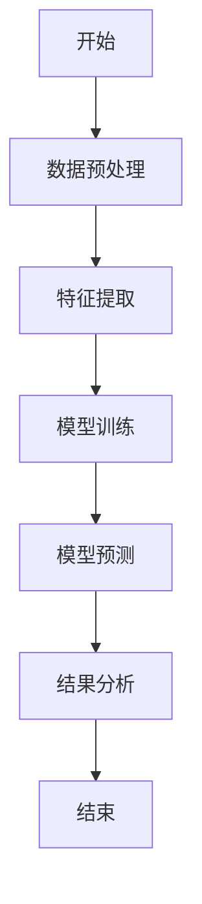

                 


# 如何识别企业的隐藏负债

> 关键词：隐藏负债、企业财务、风险管理、算法原理、系统架构

> 摘要：本文详细探讨了如何识别企业的隐藏负债，从定义、分类到识别方法和系统架构设计，结合实际案例分析，为读者提供全面的解决方案。

## 第一部分：隐藏负债的背景与概念

### 第1章：隐藏负债的定义与重要性

#### 1.1 隐藏负债的定义
- 隐藏负债是指企业在财务报表中未明确列出，但可能对企业财务状况产生重大影响的潜在债务。
- 它通常包括或有负债、未报告的担保、未来承诺等。

#### 1.2 隐藏负债的产生背景
- 经济环境变化导致企业面临更多不确定的财务风险。
- 企业为了掩盖财务困境，故意隐瞒部分负债。
- 会计准则和监管漏洞使得某些负债得以隐藏。

#### 1.3 隐藏负债对企业的影响
- 损害企业信用评级，影响融资能力。
- 增加财务风险，可能引发财务危机。
- 影响管理层决策，可能导致战略失误。

### 第2章：隐藏负债的核心概念

#### 2.1 隐藏负债的原理
- 隐藏负债通常通过复杂的财务操作或法律手段掩盖。
- 其形成机制涉及企业内部管理、外部环境和会计政策的综合因素。

#### 2.2 隐藏负债与企业财务报表的关系
- 隐藏负债可能隐藏在资产负债表、利润表或现金流量表中。
- 它可能导致财务报表数据不准确，误导利益相关者。

#### 2.3 隐藏负债与企业风险管理
- 风险管理是识别隐藏负债的关键工具。
- 通过有效的风险管理，企业可以提前发现潜在的财务风险。

## 第二部分：隐藏负债的识别方法与算法原理

### 第3章：隐藏负债的识别方法

#### 3.1 基于财务数据的识别方法
- **财务比率分析**：通过分析流动比率、速动比率等，识别潜在的财务压力。
- **现金流分析**：检查企业现金流是否异常，发现隐藏负债的迹象。
- **资产负债分析**：对比资产和负债的变化趋势，寻找不一致之处。

#### 3.2 基于非财务数据的识别方法
- **市场风险分析**：评估企业所处行业的风险，判断是否有隐藏的负债。
- **企业信用分析**：通过信用评级和历史违约情况，识别潜在风险。
- **供应链风险分析**：分析供应商和客户的财务健康状况，发现可能的连带责任。

#### 3.3 综合分析法
- 综合运用财务和非财务数据，构建多维度的分析模型。
- 通过建立风险评估指标体系，全面识别隐藏负债。

### 第4章：隐藏负债识别的算法原理

#### 4.1 算法原理概述
- 使用机器学习模型，如逻辑回归和随机森林，预测隐藏负债的可能性。
- 基于财务指标构建特征向量，训练分类模型。

#### 4.2 算法流程图


#### 4.3 数学模型与公式
- 风险评估模型：
  $$ P = \frac{1}{1 + e^{-\beta x}} $$
  其中，$x$ 是特征向量，$\beta$ 是模型参数。

## 第三部分：系统分析与架构设计

### 第5章：系统分析与设计

#### 5.1 系统功能设计
- 数据采集模块：收集企业的财务报表、市场数据等。
- 分析模块：运用算法识别隐藏负债。
- 报告生成模块：生成风险评估报告。

#### 5.2 系统架构设计


#### 5.3 系统接口设计
- 数据接口：与企业财务系统对接，获取实时数据。
- 报告接口：生成可定制的报告格式，如PDF或Excel。

## 第四部分：项目实战

### 第6章：项目实战

#### 6.1 实际案例分析
- 某制造企业隐藏的担保负债，通过分析财务报表和现金流，识别出潜在的担保责任。

#### 6.2 代码实现
```python
import pandas as pd
from sklearn.linear_model import LogisticRegression

# 数据预处理
data = pd.read_csv('financial_data.csv')
X = data[['流动比率', '速动比率', '负债总额变化率']]
y = data['隐藏负债标记']

# 模型训练
model = LogisticRegression()
model.fit(X, y)

# 预测
new_data = pd.read_csv('new_financial_data.csv')
predictions = model.predict(new_data[['流动比率', '速动比率', '负债总额变化率']])
print(predictions)
```

## 第五部分：总结与扩展

### 第7章：总结与扩展

#### 7.1 最佳实践
- 定期进行财务审计，确保数据透明。
- 建立风险管理机制，及时识别潜在风险。

#### 7.2 小结
识别隐藏负债是企业风险管理的重要部分，需要结合财务分析和算法模型，构建全面的监控体系。

#### 7.3 注意事项
- 数据质量对结果影响重大，需确保数据准确。
- 模型需要定期更新，适应市场变化。

#### 7.4 拓展阅读
- 《企业风险管理》
- 《财务报表分析》

---

作者：AI天才研究院 & 禅与计算机程序设计艺术

