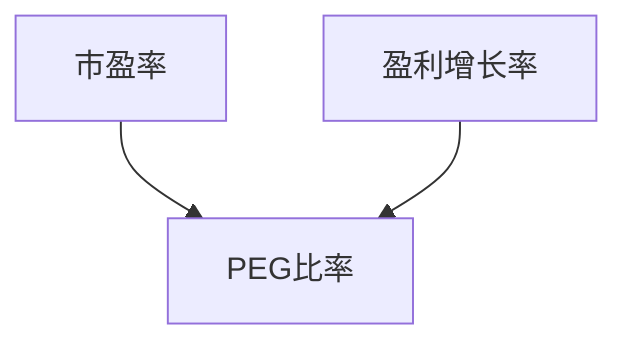
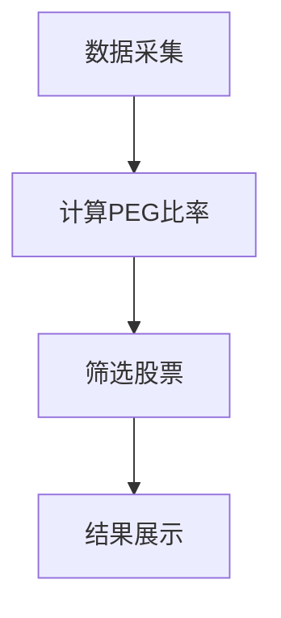

                 


# 如何运用彼得林奇的PEG比率选股

## 关键词：彼得林奇，PEG比率，选股策略，投资分析，股票估值

## 摘要：  
彼得·林奇的PEG（Price/Earnings Growth）比率是一种有效的股票估值方法，它通过将市盈率与盈利增长率相结合，帮助投资者识别出那些被市场低估的成长型股票。本文将深入解析PEG比率的定义、计算方法、应用场景，以及如何在实际投资中运用这一指标进行选股。通过详细的技术分析和实战案例，本文旨在为投资者提供一套科学的选股策略，帮助他们在复杂的市场环境中做出更明智的投资决策。

---

# 第一部分：彼得林奇PEG比率选股基础

## 第1章：什么是PEG比率

### 1.1 PEG比率的定义与背景  
PEG（Price/Earnings Growth）比率是由著名投资专家彼得·林奇提出的，是市盈率（P/E）与盈利增长率（E）的比值。这一指标旨在衡量股票的估值是否合理，特别是在成长型股票的评估中具有重要作用。

### 1.2 PEG比率的核心概念  
- **市盈率（P/E）**：市盈率是股票的市场价格除以每股收益（EPS），反映了市场对公司估值的高低。  
- **盈利增长率（E）**：盈利增长率是公司净利润的年均增长率，衡量了公司的盈利能力提升速度。  
- **PEG比率**：$$PEG = \frac{市盈率}{盈利增长率}$$  

### 1.3 PEG比率的适用场景  
- 适合评估成长型公司，尤其是那些盈利快速增长但市盈率较高的股票。  
- 适合比较不同行业的公司，因为盈利增长率在不同行业中可能差异较大。  

---

## 第2章：PEG比率的核心原理  

### 2.1 PEG比率的数学模型  
- **市盈率公式**：$$市盈率 = \frac{股价}{每股收益}$$  
- **盈利增长率公式**：$$盈利增长率 = \frac{今年净利润 - 去年净利润}{去年净利润}$$  
- **PEG比率公式**：$$PEG = \frac{市盈率}{盈利增长率}$$  

### 2.2 PEG比率的核心属性特征对比  

| 属性 | 描述 |
|------|------|
| 市盈率 | 当前股价与每股收益的比值，反映市场对公司的估值 |
| 盈利增长率 | 公司净利润的年均增长率，反映公司的盈利能力提升速度 |
| PEG比率 | 市盈率与盈利增长率的比值，衡量股票估值是否合理 |

### 2.3 PEG比率的ER实体关系图  


---

## 第3章：如何运用PEG比率进行选股  

### 3.1 PEG比率选股的步骤  
1. **确定投资目标与行业**：选择具有增长潜力的行业，例如科技、医疗等。  
2. **收集目标公司的财务数据**：获取市盈率和盈利增长率等关键指标。  
3. **计算PEG比率**：使用公式$$PEG = \frac{市盈率}{盈利增长率}$$进行计算。  
4. **评估PEG比率的合理性**：一般来说，PEG比率小于1的股票被认为被低估，而大于1的股票可能被高估。  
5. **结合其他指标进行综合判断**：如市净率、ROE等，以确保选股的全面性。  

### 3.2 PEG比率的实战应用  
- **案例分析**：假设某科技公司A的市盈率为30，盈利增长率为15%，则PEG比率为$$30/15=2$$。如果该比率高于1，可能需要进一步分析公司是否被高估。  
- **动态调整**：根据市场变化和公司业绩调整选股策略，定期更新财务数据并重新计算PEG比率。  

---

## 第4章：PEG比率的数学模型与公式  

### 4.1 PEG比率的数学推导  
- 市盈率的计算：$$市盈率 = \frac{股价}{每股收益}$$  
- 盈利增长率的计算：$$盈利增长率 = \frac{今年净利润 - 去年净利润}{去年净利润}$$  
- PEG比率的计算：$$PEG = \frac{市盈率}{盈利增长率}$$  

### 4.2 PEG比率的数学特性  
- **范围与意义**：PEG比率通常在0到3之间。  
- **与市盈率的关系**：PEG比率越低，说明市盈率相对于盈利增长率越低，股票可能被低估。  
- **与盈利增长率的关系**：PEG比率越低，说明盈利增长越快，相对于市盈率来说，股票更具投资价值。  

---

## 第5章：基于PEG比率的选股系统架构  

### 5.1 系统功能设计  
- **数据采集模块**：从数据库或API获取公司财务数据。  
- **计算模块**：计算PEG比率和其他相关指标。  
- **筛选模块**：根据PEG比率筛选出符合条件的股票。  
- **结果展示模块**：以可视化方式展示筛选结果。  

### 5.2 系统架构设计  


---

## 第6章：项目实战：基于PEG比率的选股系统  

### 6.1 环境安装  
- **工具选择**：使用Python和Pandas进行数据处理，使用Matplotlib或Seaborn进行可视化。  

### 6.2 核心实现代码  
```python
import pandas as pd

# 假设df是包含股票数据的DataFrame，包括市盈率（pe）和盈利增长率（eps_growth）列
df['peg'] = df['pe'] / df['eps_growth']

# 筛选出peg小于1的股票
low_peg_stocks = df[df['peg'] < 1]
```

### 6.3 实际案例分析  
- **数据来源**：以某行业（如科技行业）的公司数据为例。  
- **计算与筛选**：计算每家公司的PEG比率，筛选出PEG小于1的股票作为潜在投资标的。  

### 6.4 代码应用解读与分析  
- **数据处理**：使用Pandas进行数据清洗和计算。  
- **结果展示**：将筛选出的股票列表输出，供投资者参考。  

---

## 第7章：最佳实践与注意事项  

### 7.1 小结  
- PEG比率是一种有效的股票估值工具，但需要结合其他指标进行综合判断。  

### 7.2 注意事项  
- **数据准确性**：确保财务数据的准确性和及时性。  
- **行业差异**：不同行业的PEG比率标准可能不同，需结合行业特点进行分析。  
- **长期视角**：PEG比率更适合长期投资者，短期波动可能影响判断。  

### 7.3 拓展阅读  
- 彼得·林奇的其他选股方法。  
- 其他估值指标，如市净率（P/B）、股息率等。  

---

## 作者：AI天才研究院 & 禅与计算机程序设计艺术  

---

通过本文的详细分析和实战案例，读者可以掌握如何运用彼得·林奇的PEG比率进行选股，从而在投资决策中做出更明智的选择。

