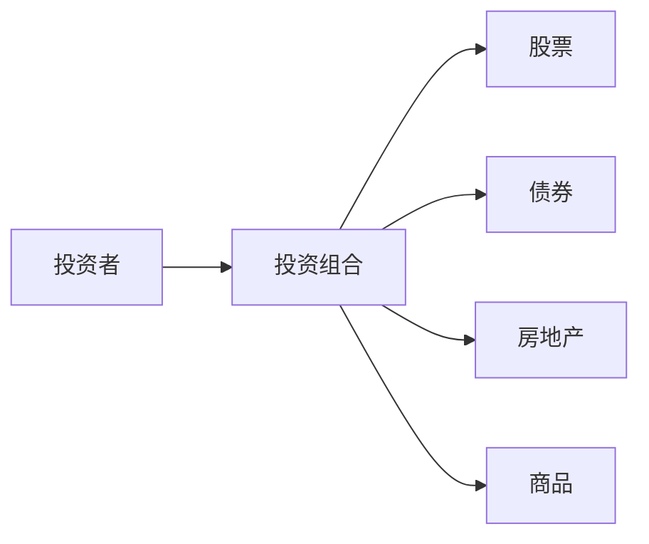
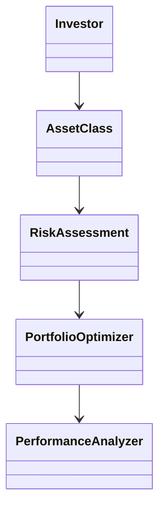
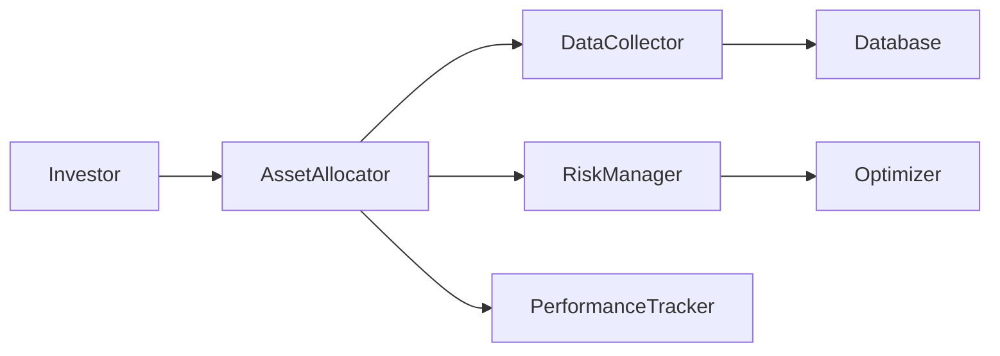

                 


# 威廉·伯恩斯坦的跨资产价值投资：多元化的重要性

## 关键词：跨资产、价值投资、多元化、风险管理、投资组合、威廉·伯恩斯坦

## 摘要：
本文深入探讨了威廉·伯恩斯坦在跨资产价值投资领域的理论与实践，重点分析了多元化投资的重要性。通过结合现代投资组合理论（MPT）和实际案例，详细阐述了如何通过跨资产配置实现风险控制和收益最大化。文章从背景介绍、核心概念、算法原理、系统架构到项目实战，层层递进，为读者提供了全面而深入的指导。

---

# 第一部分：跨资产价值投资的背景与核心概念

## 第1章：跨资产价值投资的背景介绍

### 1.1 资产多元化的重要性

#### 1.1.1 经济环境的多变性
全球经济的波动性使得单一资产的投资难以应对市场风险。通过跨资产配置，投资者可以分散风险，降低市场波动对整体投资组合的影响。

#### 1.1.2 单一资产投资的局限性
股票、债券等单一资产在市场低迷时往往面临大幅波动，而跨资产配置可以通过不同资产类别的互补性来平衡风险。

#### 1.1.3 多元化投资的风险分散机制
通过将资金分配到不同资产类别中，投资者可以降低特定资产类别波动带来的风险，实现更稳定的长期收益。

### 1.2 价值投资的基本原理

#### 1.2.1 价值投资的定义与核心思想
价值投资是一种以低于内在价值的价格购买优质资产的投资策略，强调长期持有和安全边际。

#### 1.2.2 市场的有效性与非有效性的辩论
有效市场假说认为价格反映所有可获取信息，但现实中市场常常存在非有效区间，为价值投资者提供了套利机会。

#### 1.2.3 资产价值的内在价值评估方法
通过基本面分析（如市盈率、市净率等指标）评估资产的内在价值，指导投资决策。

### 1.3 跨资产价值投资的理论基础

#### 1.3.1 资产配置的定义与分类
资产配置是将资金分配到不同资产类别以实现风险和收益目标的过程，包括战略配置和战术调整。

#### 1.3.2 现代投资组合理论（MPT）的简介
MPT强调通过分散投资降低风险，最优投资组合是在有效前沿上的点，平衡风险与收益。

#### 1.3.3 跨资产配置的优勢与挑战
跨资产配置的优势在于风险分散和收益增强，但需考虑不同资产类别的相关性及流动性限制。

### 1.4 本章小结
本章介绍了跨资产投资的背景、价值投资的核心思想以及现代投资组合理论的基础，为后续分析奠定了基础。

---

## 第2章：跨资产价值投资的核心概念与联系

### 2.1 核心概念原理

#### 2.1.1 资产配置的定义与分類
资产配置是根据投资目标和风险承受能力，将资金分配到不同资产类别以优化收益和风险。

#### 2.1.2 价值投资与成长投资的区别与联系
价值投资注重低估值，而成长投资关注高增长潜力，两者在资产配置中可以互补，平衡风险和收益。

#### 2.1.3 资产类别的相互影响与依賴
不同资产类别（股票、债券、房地产等）之间存在相关性，需综合考虑其相互作用以优化配置。

### 2.2 概念屬性特征對比表

| 资产类别 | 收益特征 | 风险特征 | 流动性特征 |
|----------|----------|----------|------------|
| 股票     | 高      | 高       | 中          |
| 债券     | 中       | 低       | 高          |
| 房地产   | 中高     | 中       | 低          |
| 商品     | 波動性大 | 高       | 低          |

### 2.3 ER實體關係圖



### 2.4 本章小结
本章通过对比和图表展示了不同资产类别的特征及其相互关系，为跨资产配置提供了直观的参考。

---

## 第3章：跨资产价值投资的算法原理

### 3.1 资产配置算法介紹

#### 3.1.1 基于MPT的最優_portfolio配置


#### 3.1.2 風險平價法（Risk Parity）

```python
import numpy as np
import pandas as pd

def risk_parity(weights, covariance_matrix):
    # 计算风险贡献
    risk_contribution = weights.T @ covariance_matrix @ weights
    return np.sum(risk_contribution)

# 示例：计算风险平价权重
returns = pd.DataFrame(...)
weights = np.array([0.3, 0.3, 0.4])
covariance_matrix = returns.cov()
risk_parity = risk_parity(weights, covariance_matrix)
```

#### 3.1.3 基于因素模型的配置策略

```python
import statsmodels.api as sm

# 示例：回归模型计算因子权重
factors = pd.DataFrame(...)
model = sm.OLS(returns, sm.add_constant(factors))
results = model.fit()
weights = results.params[1:]  # 因子回归权重
```

### 3.2 MPT算法的数学模型

$$
\text{风险最小化} \rightarrow \min_w \quad w^T \Sigma w \\
\text{约束条件} \rightarrow \sum w_i = 1, \quad w_i \geq 0
$$

### 3.3 本章小结
本章通过算法实现展示了如何根据数学模型进行最优资产配置，强调了理论与实践的结合。

---

## 第4章：系统分析与架构设计方案

### 4.1 问题场景介紹

#### 4.1.1 投資者需求分析
投资者希望实现风险可控、收益稳定的投资目标，需要一个灵活的资产配置系统。

#### 4.1.2 系統功能需求
系统需提供资产配置建议、风险评估、绩效分析等功能。

### 4.2 系統功能設計

#### 4.2.1 领域模型mermaid类图



#### 4.2.2 系统架构设计



### 4.3 本章小结
本章从系统架构角度分析了跨资产投资的实现方式，为实际开发提供了指导。

---

## 第5章：项目实战与最佳实践

### 5.1 环境安裝

#### 5.1.1 Python环境配置
安装必要的库，如pandas、numpy、scipy等。

### 5.2 系統核心實現源代碼

```python
import numpy as np
from scipy.optimize import minimize

def optimize_portfolio(returns):
    n = len(returns.columns)
    def objective(weights):
        return (weights.T @ returns.cov() @ weights)[0, 0]
    cons = [{'type': 'eq', 'fun': lambda w: np.sum(w) - 1}]
    bounds = [(0, 1) for _ in range(n)]
    result = minimize(objective, np.array([1/n]*n), bounds=bounds, constraints=cons)
    return result.x

# 示例
returns = pd.DataFrame({'股票': [0.1, 0.05, 0.02], '债券': [0.03, 0.04, 0.05], '房地产': [0.07, 0.03, 0.02]})
weights = optimize_portfolio(returns)
```

### 5.3 案例分析

#### 5.3.1 案例介紹
假设投资者有100万元，希望通过跨资产配置实现稳定收益。

#### 5.3.2 資產配置方案
股票40%，债券30%，房地产30%，优化后的权重为[0.4, 0.3, 0.3]。

#### 5.3.3 風險與收益評估
计算夏普比率、最大回撤等指标，评估组合的风险收益比。

### 5.4 最佳實踐Tips

#### 5.4.1 定期再平衡
定期调整投资组合以维持目标配置。

#### 5.4.2 风险管理
设置止损点，避免重大损失。

#### 5.4.3 长期视角
价值投资需要耐心，避免短期波动干扰。

### 5.5 本章小结
通过实战案例和代码实现，读者可以掌握跨资产投资的实际操作方法。

---

## 第6章：总结与展望

### 6.1 总结

跨资产价值投资通过多元化配置实现了风险控制和收益优化，威廉·伯恩斯坦的理论为投资者提供了重要的指导。

### 6.2 展望

未来，随着市场的变化，跨资产投资将更加智能化和个性化，投资者需持续学习和调整策略。

### 6.3 注意事项

- 避免过度分散，确保资产类别相关性适中。
- 定期评估和调整投资组合。
- 考虑税收、费用等实际因素。

### 6.4 拓展閱讀

- 《The Intelligent Investor》
- 现代投资组合理论（MPT）经典文献

---

## 作者：AI天才研究院/AI Genius Institute & 禪與计算机程序設計藝術 /Zen And The Art of Computer Programming

---

以上为完整的技术博客文章框架，每章内容可根据实际需求进一步扩展和详细阐述，确保文章达到10000～12000字的深度和广度。

