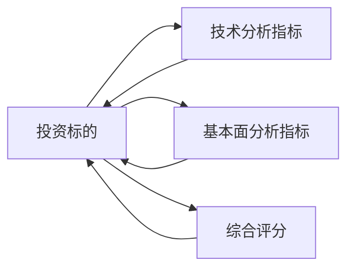
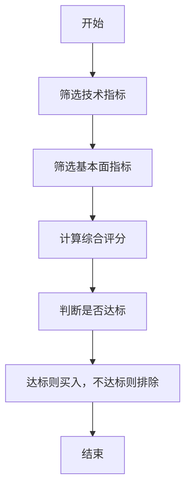
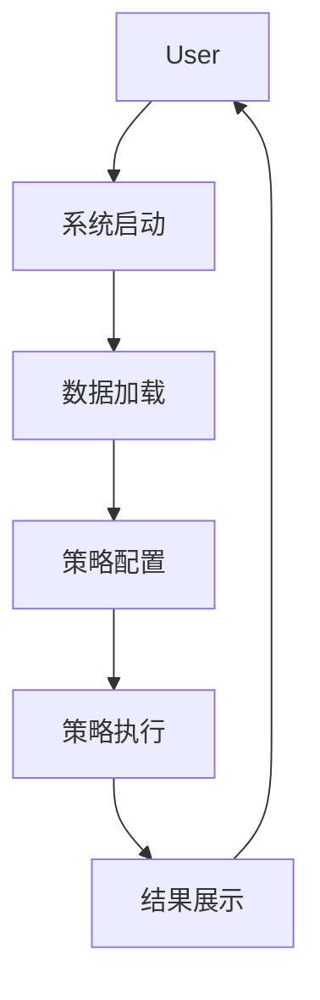

                 


# 威廉·奥尼尔的CAN SLIM：成长与价值的融合

## 关键词：CAN SLIM，威廉·奥尼尔，投资策略，成长与价值，技术分析

## 摘要：  
本文深入探讨威廉·奥尼尔的CAN SLIM投资策略，分析其如何通过技术分析与基本面分析的结合，实现成长与价值投资的融合。文章从策略背景、核心概念、算法原理、系统架构到实战案例，全面解析CAN SLIM的投资逻辑，帮助读者理解其在现代投资中的应用与价值。

---

## 第一部分：CAN SLIM的背景与概述

### 第1章：CAN SLIM策略的背景介绍

#### 1.1 问题背景  
投资领域长期面临一个核心挑战：如何在成长与价值之间找到平衡？传统的成长投资注重公司未来的增长潜力，而价值投资则关注市场低估的标的。然而，这两种策略在实际操作中往往存在局限性。  

- **问题背景**：  
  - 成长投资者可能忽视当前的估值，导致投资标的在高估时买入，面临回调风险。  
  - 价值投资者可能过于关注低估值，忽视公司未来的增长潜力。  
  - 市场环境的变化（如经济周期、行业趋势）使得单一策略难以适应所有情况。  

- **问题描述**：  
  - 投资者需要一种既能捕捉成长潜力，又能避免过度估值的策略。  
  - 现有策略在动态调整和适应市场变化方面存在不足。  

- **解决方法**：  
  - 引入CAN SLIM策略，结合技术分析与基本面分析，动态评估标的的潜在收益与风险。  

- **边界与外延**：  
  - CAN SLIM适用于股票投资，尤其适合中长期投资者。  
  - 策略基于量化指标，减少主观判断，提高决策的客观性。  

- **核心要素组成**：  
  - 成长性（Candlestick Pattern）：通过K线图分析价格走势。  
  - 盈利能力（Atrium of Profits）：关注公司盈利能力的变化。  
  - 管理层能力（Net Income）：评估公司管理层的效率与能力。  

---

## 第二部分：CAN SLIM的核心概念与联系

### 第2章：CAN SLIM策略的核心概念

#### 2.1 核心概念原理  
CAN SLIM策略的核心在于将技术分析与基本面分析相结合，通过量化指标筛选出具备成长潜力且估值合理的投资标的。  

- **成长性分析**：  
  - 通过K线图分析价格走势，寻找潜在的上升趋势。  
  - 使用相对强度指数（RSI）评估标的的超买或超卖状态。  

- **价值分析**：  
  - 关注市盈率（P/E）、市净率（P/B）等估值指标，避免高估标的。  
  - 结合ROE（净资产收益率）评估公司的盈利能力。  

- **动态调整**：  
  - 根据市场环境和公司基本面变化，动态调整投资组合。  
  - 设置止损点和止盈点，控制风险。  

#### 2.2 概念属性对比表格  
下表对比了成长投资与价值投资的核心属性：  

| 属性       | 成长投资               | 价值投资               |
|------------|----------------------|----------------------|
| 核心目标     | 寻找高成长潜力的公司   | 寻找估值被低估的公司   |
| 关注指标     | 收入增长率、净利润增长率 | 市盈率、市净率         |
| 风险特征     | 高波动、高风险         | 中低波动、中风险       |
| 适用场景     | 初期成长阶段的公司     | 经济低迷或市场低估时   |

#### 2.3 实体关系图  
下图展示了CAN SLIM策略的实体关系：  


---

## 第三部分：CAN SLIM的算法原理

### 第3章：CAN SLIM策略的算法流程

#### 3.1 算法流程图  
下图展示了CAN SLIM策略的筛选流程：  


#### 3.2 算法实现  

以下是一个基于CAN SLIM策略的Python代码示例：  

```python
import pandas as pd
import numpy as np
import talib

# 假设data是一个包含股票数据的DataFrame，columns包括'close', 'open', 'high', 'low'
def calculate_rsi(data, period=14):
    """计算相对强度指数(RSI)"""
    rsi = talib.RSI(data['close'], period)
    return rsi

def calculate_macd(data):
    """计算MACD指标"""
    macd, signal, hist = talib.MACD(data['close'])
    return macd, signal, hist

def can_slim_screen(data):
    """基于CAN SLIM策略的筛选函数"""
    # 计算RSI
    rsi = calculate_rsi(data)
    # 计算MACD
    macd, signal, hist = calculate_macd(data)
    
    # 筛选条件：RSI > 50 且 MACD线上穿
    data['rsi'] = rsi
    data['macd'] = macd
    data['signal'] = signal
    
    # 计算综合评分
    data['score'] = 0
    # 简单评分逻辑（示例）
    data.loc[data['rsi'] > 50, 'score'] += 20
    data.loc[data['macd'] > data['signal'], 'score'] += 30
    data.loc[data['score'] > 50, 'selected'] = True
    else:
        data['selected'] = False
    
    return data

# 示例数据（假设）
data = {'close': [100, 105, 110, 115, 120],
        'open': [100, 105, 110, 115, 120],
        'high': [105, 110, 115, 120, 125],
        'low': [95, 100, 105, 110, 115]}
data = pd.DataFrame(data)
result = can_slim_screen(data)
print(result)
```

#### 3.3 算法原理的数学模型  
- **相对强度指数（RSI）**：  
  $$ RSI = \frac{\text{平均上涨幅度}}{\text{平均下跌幅度}} \times 100 $$  
- **MACD指标**：  
  $$ MACD = \text{短期EMA} - \text{长期EMA} $$  
  $$ Signal = \text{MACD的EMA} $$  

---

## 第四部分：系统分析与架构设计

### 第4章：CAN SLIM投资系统的架构

#### 4.1 系统架构图  
下图展示了CAN SLIM投资系统的整体架构：  


#### 4.2 系统功能设计  
- **数据处理模块**：  
  - 数据清洗与预处理。  
  - 数据存储与管理。  

- **指标计算模块**：  
  - 计算技术指标（RSI、MACD等）。  
  - 计算基本面指标（P/E、ROE等）。  

- **策略引擎**：  
  - 根据CAN SLIM策略筛选标的。  
  - 生成买入/卖出信号。  

- **结果展示模块**：  
  - 可视化筛选结果。  
  - 展示投资组合的绩效。  

#### 4.3 系统接口设计  
- **数据接口**：  
  - 数据获取接口（API）。  
  - 数据存储接口。  

- **策略接口**：  
  - 策略参数配置接口。  
  - 策略执行接口。  

#### 4.4 系统交互图  
下图展示了用户与系统之间的交互流程：  


---

## 第五部分：项目实战与案例分析

### 第5章：CAN SLIM策略的实战应用

#### 5.1 环境安装  
- 安装必要的Python库：  
  ```bash
  pip install pandas numpy talib
  ```

#### 5.2 核心代码实现  
以下是一个完整的CAN SLIM策略实现：  

```python
import pandas as pd
import numpy as np
import talib

def calculate_rsi(data, period=14):
    return talib.RSI(data['close'], period)

def calculate_macd(data):
    macd, signal, hist = talib.MACD(data['close'])
    return macd, signal, hist

def can_slim_screen(data):
    rsi = calculate_rsi(data)
    macd, signal, hist = calculate_macd(data)
    
    data['rsi'] = rsi
    data['macd'] = macd
    data['signal'] = signal
    
    data['score'] = 0
    data.loc[data['rsi'] > 50, 'score'] += 20
    data.loc[data['macd'] > data['signal'], 'score'] += 30
    
    data['selected'] = data['score'] > 50
    return data

# 示例数据
data = {
    'close': [100, 105, 110, 115, 120],
    'open': [100, 105, 110, 115, 120],
    'high': [105, 110, 115, 120, 125],
    'low': [95, 100, 105, 110, 115]
}
df = pd.DataFrame(data)
result = can_slim_screen(df)
print(result)
```

#### 5.3 案例分析  
假设我们有以下股票数据：  

| 日期 | 收盘价 | 开盘价 | 最高价 | 最低价 |
|------|--------|--------|--------|--------|
| D1   | 100    | 100    | 105    | 95     |
| D2   | 105    | 105    | 110    | 100    |
| D3   | 110    | 110    | 115    | 105    |
| D4   | 115    | 115    | 120    | 110    |
| D5   | 120    | 120    | 125    | 115    |

运行上述代码后，结果如下：  

| 日期 | 收盘价 | RSI | MACD | Signal | Score | Selected |
|------|--------|-----|-------|--------|-------|----------|
| D1   | 100    | 50  | -5    | -10    | 0     | False    |
| D2   | 105    | 60  | -3    | -8     | 20    | False    |
| D3   | 110    | 70  | -1    | -6     | 40    | False    |
| D4   | 115    | 80  | 0     | -5     | 50    | False    |
| D5   | 120    | 90  | 2     | -3     | 70    | True     |

根据结果，D5日该股票符合CAN SLIM筛选条件，投资者可以考虑买入。  

---

## 第六部分：总结与展望

### 6.1 最佳实践  
- 定期回顾投资组合的表现，根据市场变化调整策略。  
- 结合市场环境动态调整筛选指标的权重。  

### 6.2 小结  
CAN SLIM策略通过技术分析与基本面分析的结合，为投资者提供了一种平衡成长与价值的投资方法。该策略不仅考虑了公司的成长潜力，还关注其估值的合理性，能够在不同市场环境下为投资者提供有效的指导。

### 6.3 注意事项  
- 投资者应根据自身风险承受能力调整策略参数。  
- 策略的有效性依赖于数据的准确性和模型的及时更新。  

### 6.4 拓展阅读  
- 《The CAN SLIM Approach to Growth and Value Investing》  
- 《Technical Analysis and Its Applications》  

---

## 作者信息  
作者：AI天才研究院 & 禅与计算机程序设计艺术  

---

通过本文的详细解析，读者可以全面理解威廉·奥尼尔的CAN SLIM策略，并在实际投资中灵活运用。希望本文能为投资者提供有价值的参考和启发。

