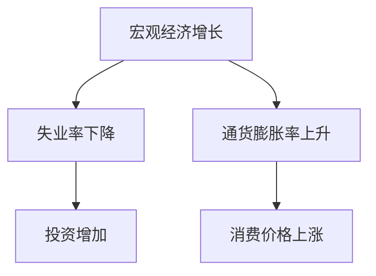
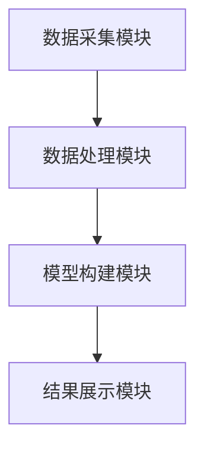

                 


# 宏观经济指标对投资决策的影响

## 关键词：宏观经济指标, 投资决策, 经济周期, GDP, 失业率, 通货膨胀率, 数据分析

## 摘要：  
本文深入探讨了宏观经济指标对投资决策的影响，从基本概念到实际应用，结合经济学和数据分析的视角，详细分析了如何利用宏观经济指标进行投资决策优化。文章首先介绍了宏观经济指标的核心概念和分类，然后从经济周期的角度分析了其对投资决策的影响，接着通过数学模型和算法原理详细讲解了如何利用宏观经济指标进行预测和优化。最后，通过具体案例展示了如何构建投资决策支持系统，并提供了实际的操作指南和最佳实践建议。

---

## 第一部分: 宏观经济指标与投资决策的基础

### 第1章: 宏观经济指标概述

#### 1.1 宏观经济指标的基本概念
- 1.1.1 宏观经济指标的定义  
  宏观经济指标是衡量整个经济体系运行状态的量化指标，包括GDP、失业率、通货膨胀率等。  
- 1.1.2 宏观经济指标的分类  
  - 按时间维度：短期指标和长期指标。  
  - 按影响范围：全国性指标和区域指标。  
  - 按指标类型：总量指标和结构指标。  
- 1.1.3 宏观经济指标的重要性  
  宏观经济指标是投资者了解经济趋势、制定投资策略的重要依据。

#### 1.2 宏观经济指标对投资决策的影响
- 1.2.1 宏观经济指标如何影响投资决策  
  宏观经济指标通过反映经济基本面的变化，帮助投资者判断市场的整体走势。  
- 1.2.2 投资者如何利用宏观经济指标  
  投资者可以通过分析宏观经济指标来优化资产配置、规避风险。  
- 1.2.3 宏观经济指标的局限性  
  宏观经济指标具有滞后性、片面性和不确定性。

#### 1.3 宏观经济指标与经济周期的关系
- 1.3.1 经济周期的基本概念  
  经济周期是指经济活动的波动过程，通常分为衰退、复苏、增长和繁荣四个阶段。  
- 1.3.2 不同经济周期阶段的宏观经济指标表现  
  - 衰退阶段：GDP下降，失业率上升。  
  - 复苏阶段：GDP逐步恢复，失业率下降。  
  - 增长阶段：GDP稳步增长，通货膨胀率温和上升。  
  - 繁荣阶段：GDP高速增长，通货膨胀率可能过快上升。  
- 1.3.3 经济周期对投资决策的影响  
  投资者需要根据经济周期的不同阶段调整投资策略。

### 第2章: 宏观经济指标的核心概念与联系

#### 2.1 宏观经济指标的属性特征对比
- 2.1.1 不同宏观经济指标的特征对比  
  通过对比GDP、失业率、通货膨胀率等指标的定义、计算方法和影响因素，分析它们的异同。  

| 指标类型 | 定义 | 计算公式 | 影响因素 | 同步性 |
|----------|------|-----------|-----------|--------|
| GDP      | 国民生产总值 | 总收入法/总支出法 | 消费、投资、政府支出、净出口 | 同步指标 |
| 失业率    | 劳动力市场指标 | 失业人口/劳动力人口 | 经济增长、劳动力市场政策 | 滞后指标 |
| 通货膨胀率 | 货币购买力指标 | (CPI - 前一期CPI)/前一期CPI | 货币供应、需求、成本推动 | 同步指标 |

- 2.1.2 宏观经济指标的量化分析  
  使用数学公式量化分析各指标之间的关系，例如利用回归分析预测GDP增长对失业率的影响。

#### 2.2 宏观经济指标的ER实体关系图
- 2.2.1 实体关系图的基本结构  
  通过Mermaid图展示宏观经济指标之间的关系，例如GDP与失业率、通货膨胀率之间的相互作用。



---

## 第二部分: 宏观经济指标的算法原理

### 第3章: 宏观经济指标的预测模型

#### 3.1 时间序列分析
- 3.1.1 时间序列分析的基本概念  
  时间序列分析是一种通过历史数据预测未来趋势的方法。  
- 3.1.2 时间序列分析的应用  
  使用ARIMA模型预测GDP增长趋势。

#### 3.2 回归分析
- 3.2.1 回归分析的基本概念  
  回归分析是研究变量之间关系的统计方法。  
- 3.2.2 回归分析的应用  
  使用多元回归模型分析失业率与GDP、通货膨胀率之间的关系。

#### 3.3 聚类分析
- 3.3.1 聚类分析的基本概念  
  聚类分析是将数据点分成不同类别的方法。  
- 3.3.2 聚类分析的应用  
  使用聚类分析识别不同经济周期阶段的特征。

### 第4章: 宏观经济指标的数学模型与公式

#### 4.1 GDP预测模型
- 4.1.1 GDP模型  
  使用ARIMA模型预测GDP增长：$$ARIMA(p, d, q)$$，其中$p$为自回归阶数，$d$为差分阶数，$q$为移动平均阶数。

#### 4.2 失业率预测模型
- 4.2.1 失业率模型  
  使用时间序列模型预测失业率变化：$$\hat{y}_t = \alpha + \beta y_{t-1} + \epsilon_t$$，其中$\alpha$为截距，$\beta$为自回归系数，$\epsilon_t$为误差项。

#### 4.3 通货膨胀率预测模型
- 4.3.1 通货膨胀率模型  
  使用回归模型预测通货膨胀率：$$\hat{CPI}_t = \beta_0 + \beta_1 GDP_t + \beta_2 unemployment_t + \epsilon_t$$，其中$\beta_0$为常数项，$\beta_1$和$\beta_2$为回归系数，$\epsilon_t$为误差项。

---

## 第三部分: 宏观经济指标的系统分析与架构设计

### 第5章: 宏观经济指标分析系统的功能设计

#### 5.1 系统功能设计
- 5.1.1 数据采集模块  
  从政府统计机构、央行等渠道获取宏观经济指标数据。  
- 5.1.2 数据处理模块  
  对数据进行清洗、转换和标准化处理。  
- 5.1.3 模型构建模块  
  使用时间序列分析、回归分析等方法构建预测模型。  
- 5.1.4 结果展示模块  
  将预测结果以图表形式展示，帮助投资者理解。

#### 5.2 系统架构设计
- 5.2.1 系统架构图  
  使用Mermaid图展示系统的整体架构：



---

## 第四部分: 宏观经济指标的项目实战

### 第6章: 宏观经济指标的项目实战

#### 6.1 项目背景
- 项目目标：构建一个基于宏观经济指标的投资决策支持系统。  
- 项目范围：分析GDP、失业率、通货膨胀率等指标对股票、债券等资产的影响。  
- 项目需求：提供实时数据监控和预测功能。

#### 6.2 系统实现
- 6.2.1 环境安装  
  安装Python、Pandas、NumPy、Matplotlib等工具。  
- 6.2.2 核心代码实现  
  使用Python代码实现GDP预测模型：

```python
import pandas as pd
import numpy as np
from statsmodels.tsa.arima.model import ARIMA

# 数据加载
data = pd.read_csv('gdp_data.csv')
data['date'] = pd.to_datetime(data['date'])
data.set_index('date', inplace=True)

# 数据平滑处理
log_data = np.log(data['gdp'])

# 模型训练
model = ARIMA(log_data, order=(1, 1, 1))
model_fit = model.fit()

# 预测
forecast = model_fit.forecast(steps=12)
print(forecast)
```

#### 6.3 结果分析
- 6.3.1 预测结果展示  
  使用Matplotlib绘制GDP增长预测曲线。  
- 6.3.2 案例分析  
  分析2023年经济预测对投资决策的影响。

---

## 第五部分: 总结与展望

### 第7章: 总结与展望

#### 7.1 最佳实践 tips
- 宏观经济指标分析需要结合实际经济环境。  
- 投资者应关注多指标的综合影响，而不仅仅依赖单一指标。  
- 数据分析工具和模型的选择对结果影响重大。

#### 7.2 小结
本文从宏观经济指标的基本概念出发，分析了其对投资决策的影响，并通过数学模型和实际案例展示了如何利用这些指标进行预测和优化。

#### 7.3 注意事项
- 数据来源的可靠性直接影响分析结果。  
- 模型的选择需要根据具体问题和数据特征进行调整。  
- 经济预测具有不确定性，投资者应保持风险意识。

#### 7.4 拓展阅读
- 建议进一步阅读《投资学》、《宏观经济分析》等书籍，深入了解宏观经济指标的详细分析方法。

---

## 作者：AI天才研究院/AI Genius Institute & 禅与计算机程序设计艺术 /Zen And The Art of Computer Programming

