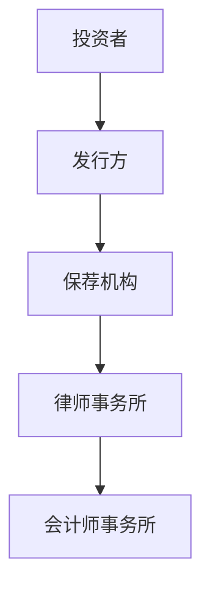

                 


# 定向增发策略：参与上市公司融资的机会

> 关键词：定向增发、上市公司融资、投资者策略、市场分析、风险管理

> 摘要：定向增发是上市公司融资的重要方式之一，本文从定向增发的定义、流程、市场分析、策略选择、风险管理等方面展开，详细探讨了投资者如何通过定向增发策略参与上市公司融资，以及如何在复杂的市场环境中制定有效的投资策略。文章结合实际案例，分析了定向增发的成功与失败经验，并提出了风险管理的最佳实践，为投资者提供了实用的指导。

---

## 第1章: 定向增发的定义与背景

### 1.1 定向增发的定义与特点

定向增发（Non公开发行）是指上市公司向特定投资者（如机构投资者、战略投资者等）发行股票，以筹集资金的一种融资方式。与公开增发相比，定向增发具有以下特点：

- **发行对象特定**：定向增发通常面向少数特定投资者，而非公开市场。
- **发行价格灵活**：发行价格可以根据市场情况和投资者需求进行调整。
- **锁定期**：发行的股票通常有一定的锁定期，以防止短期炒作。

### 1.2 定向增发的背景与发展趋势

随着资本市场的不断发展，定向增发成为企业融资的重要手段。特别是在经济下行周期，企业通过定向增发可以获得更多资金支持。近年来，定向增发的市场规模持续扩大，投资者参与度也在不断提高。

### 1.3 定向增发的主要参与者

- **上市公司**：融资主体，通过定向增发筹集资金用于业务扩展或偿还债务。
- **投资者**：资金提供方，包括机构投资者、战略投资者等。
- **中介机构**：保荐人、律师、会计师等，负责发行过程中的相关工作。

---

## 第2章: 定向增发的流程与机制

### 2.1 定向增发的基本流程

定向增发的流程通常包括以下步骤：

1. **确定融资需求**：上市公司根据自身发展需求确定融资金额和用途。
2. **确定发行对象**：选择特定投资者作为增发对象。
3. **确定发行价格与数量**：根据市场情况和投资者需求确定发行价格和数量。
4. **审批与发行**：向监管部门申请审批，并完成股票发行。

### 2.2 定向增发的定价机制

定向增发的定价机制灵活，通常可以根据市价折扣率、目标收益率等方式确定发行价格。例如，可以采用以下定价方法：

- **市价折扣率**：发行价格为市场价的一定折扣。
- **目标收益率法**：根据投资者的预期收益率确定发行价格。

### 2.3 定向增发的锁定期与解禁机制

定向增发的股票通常有锁定期，锁定期结束后投资者可以自由交易。锁定期的设置有助于稳定股价，防止短期炒作。

---

## 第3章: 定向增发的市场分析与策略选择

### 3.1 定向增发的市场环境分析

市场环境对定向增发的影响至关重要。投资者需要分析宏观经济环境、行业周期和企业基本面等因素，以判断定向增发的可行性。

### 3.2 定向增发的策略选择

投资者在参与定向增发时需要制定合理的策略：

- **投资者策略**：选择基本面良好、行业前景广阔的公司进行投资。
- **上市公司策略**：选择有明确资金需求和良好成长潜力的企业。
- **中介机构策略**：提供专业的发行服务，确保发行过程顺利进行。

### 3.3 定向增发的案例分析

通过实际案例分析，我们可以总结成功与失败的经验。例如，某公司通过定向增发筹集资金用于技术创新，最终实现了业绩增长；而另一家公司因选择不当的投资者导致股价大幅波动。

---

## 第4章: 定向增发的风险管理与控制

### 4.1 定向增发的主要风险

定向增发面临多种风险，包括市场风险、价格波动风险和解禁风险。投资者需要制定有效的风险管理策略。

### 4.2 定向增发的风险管理策略

- **投资者风险管理**：分散投资，避免过度集中。
- **上市公司风险管理**：确保资金用途合理，提高信息披露透明度。
- **中介机构风险管理**：提供专业的风险管理服务，确保发行过程合规。

### 4.3 定向增发的法律与合规风险

定向增发需要遵守相关法律法规，确保发行过程的合规性。投资者需要注意法律风险，避免因违规操作导致损失。

---

## 第5章: 定向增发的系统架构与实施

### 5.1 定向增发的系统架构设计

定向增发的系统架构设计包括功能模块划分、系统架构图（Mermaid）等。例如，系统功能模块可以包括投资者管理、发行管理、风险控制等。



### 5.2 定向增发的算法原理

定向增发的算法原理可以通过以下Python代码实现：

```python
def calculate_irr(cash_flows):
    # 计算内部收益率
    return np.irr(cash_flows)
```

其中，`IRR`（内部收益率）是衡量投资回报的重要指标，公式为：

$$ IRR = \sum_{t=0}^{n} \frac{CF_t}{(1 + r)^t} = 0 $$

---

## 第6章: 定向增发的项目实战

### 6.1 项目背景与需求分析

以某科技公司为例，公司计划通过定向增发筹集资金用于技术创新。

### 6.2 项目实施过程

- **环境安装**：搭建融资分析系统，包括数据采集、分析模块。
- **核心实现**：通过算法计算最优发行价格和投资者组合。

### 6.3 项目总结

通过实际案例分析，我们可以看到定向增发的实施过程和注意事项。例如，某科技公司通过定向增发成功筹集资金，推动了技术创新和业绩增长。

---

## 第7章: 定向增发的最佳实践与小结

### 7.1 最佳实践 tips

- 投资者应选择基本面良好、行业前景广阔的公司。
- 上市公司应合理规划资金用途，提高信息披露透明度。
- 中介机构应提供专业的服务，确保发行过程合规。

### 7.2 小结

定向增发是上市公司融资的重要方式，投资者需要结合市场环境和企业基本面制定合理的策略，同时注意风险管理，避免因市场波动和解禁风险导致损失。

---

## 作者：AI天才研究院/AI Genius Institute & 禅与计算机程序设计艺术/Zen And The Art of Computer Programming

