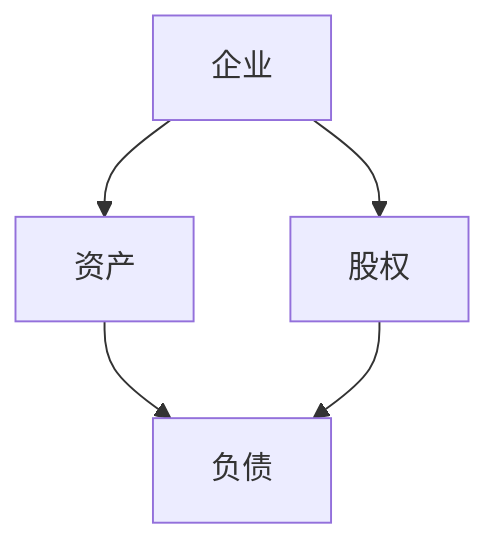
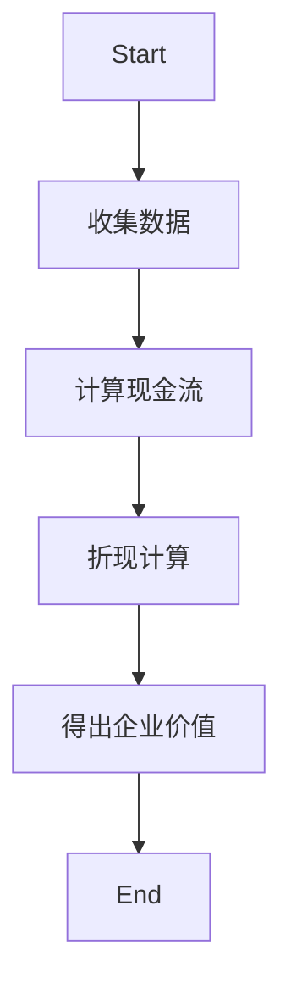
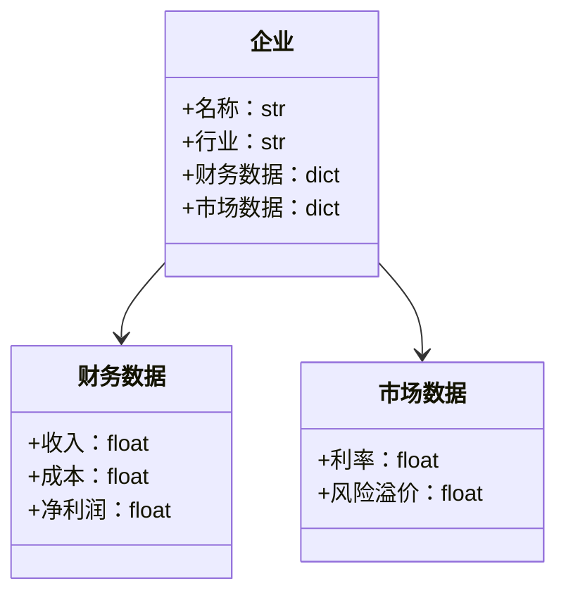
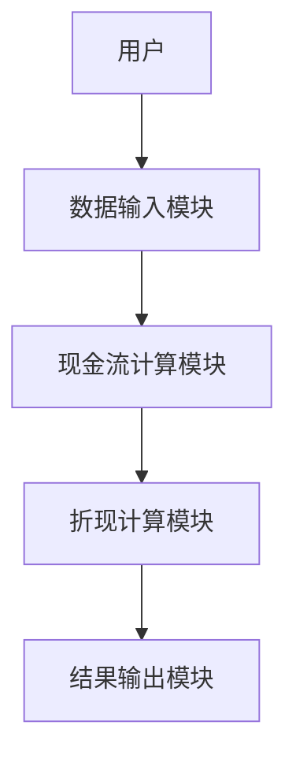
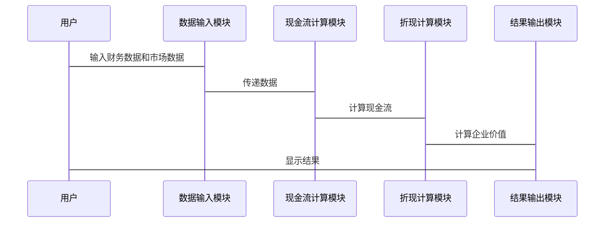

                 


# 实例演示：如何计算企业价值

## 关键词：
- 企业价值
- 现金流折现法
- 财务模型
- 估值分析
- 投资决策

## 摘要：
本文通过详细讲解企业价值的计算方法，从理论基础到实际操作，逐步引导读者掌握企业价值评估的核心原理和应用技巧。文章结合数学模型、算法流程图和实际案例，深入分析企业价值计算的关键步骤，帮助读者在投资决策中做出科学合理的估值判断。

---

# 第一部分: 企业价值计算的背景与核心概念

## 第1章: 企业价值计算的背景介绍

### 1.1 企业价值计算的基本概念
#### 1.1.1 企业价值的定义与内涵
企业价值（Enterprise Value，简称EV）是指企业整体的经济价值，包括所有资产的价值减去负债的价值。它是企业的真实市场价值，通常用于评估企业的整体实力和未来发展潜力。企业价值不仅仅是账面价值，还包括企业的未来现金流、品牌价值、管理团队能力等因素。

#### 1.1.2 企业价值计算的必要性
企业价值计算在企业融资、并购、投资决策等方面具有重要意义。例如，在企业并购中，准确评估目标企业的价值可以帮助买方做出合理的出价决策；在企业融资中，企业价值是确定融资金额和股权分配的重要依据。

#### 1.1.3 企业价值计算的边界与外延
企业价值的计算通常基于企业的未来现金流，因此需要明确企业的经营边界和业务范围。此外，企业价值还包括企业的无形资产（如品牌、专利）和未来增长潜力，这些因素会影响企业的整体估值。

---

### 1.2 企业价值计算的核心要素
#### 1.2.1 企业价值的构成要素
企业价值的构成要素主要包括：
1. **现金流**：企业未来产生的自由现金流是企业价值的核心。
2. **折现率**：用于将未来现金流折现为现值的利率，通常基于企业的风险水平。
3. **资产与负债**：企业的资产价值减去负债价值是企业价值的重要组成部分。
4. **未来增长潜力**：企业的未来盈利能力和发展空间直接影响其价值。

#### 1.2.2 核心要素之间的关系
企业价值的计算需要综合考虑现金流、折现率和企业风险等因素。例如，高风险企业通常需要更高的折现率，从而导致企业价值的降低。

#### 1.2.3 企业价值计算的数学模型初步
企业价值（EV）的计算公式可以表示为：
$$EV = \sum_{t=1}^{n} \frac{CF_t}{(1 + r)^t}$$
其中，$CF_t$是第$t$年的自由现金流，$r$是折现率，$n$是预测期数。

---

### 1.3 企业价值计算的理论基础
#### 1.3.1 财务学基础理论
企业价值的计算基于财务学中的时间价值理论和风险收益理论。时间价值理论认为，资金的时间价值是由于货币的时间价值导致的，因此需要将未来的现金流折现到现值。

#### 1.3.2 企业价值评估的经典模型
1. **现金流折现法（DCF模型）**：通过预测企业未来的自由现金流，将其折现为企业价值。
2. **市盈率法（P/E法）**：通过比较企业的市盈率和行业平均水平，估算企业价值。
3. **市净率法（P/B法）**：通过比较企业的市净率和行业平均水平，估算企业价值。

#### 1.3.3 现金流折现法的初步介绍
现金流折现法是企业价值计算的核心方法，其基本思路是将未来现金流折现为现值，从而得出企业的真实价值。

---

## 1.4 本章小结
本章介绍了企业价值计算的背景、核心概念和理论基础。通过理解企业价值的定义、构成要素和计算方法，读者可以为后续的详细计算打下坚实的基础。

---

## 第2章: 企业价值计算的核心概念

### 2.1 企业价值计算的核心原理
#### 2.1.1 企业价值计算的基本原理
企业价值的计算基于以下两个核心原理：
1. **时间价值理论**：资金的时间价值要求将未来的现金流折现为现值。
2. **风险中性定价**：企业在不同风险水平下，其折现率需要反映其风险特征。

#### 2.1.2 核心原理的数学表达
企业价值的计算公式可以表示为：
$$EV = \sum_{t=1}^{n} \frac{CF_t}{(1 + r)^t}$$
其中，$CF_t$是第$t$年的自由现金流，$r$是折现率，$n$是预测期数。

#### 2.1.3 原理的实际应用
以一家制造企业为例，假设其未来三年的自由现金流分别为100万元、150万元和200万元，折现率为10%。那么，企业价值的现值可以计算为：
$$EV = \frac{100}{1.1} + \frac{150}{(1.1)^2} + \frac{200}{(1.1)^3} \approx 372.09 \text{万元}$$

---

### 2.2 核心概念的属性特征对比
#### 2.2.1 企业价值与资产价值的对比
| 项目 | 企业价值（EV） | 资产价值（BV） |
|------|----------------|----------------|
| 定义 | 企业整体的市场价值 | 企业账面资产的市场价值 |
| 包含内容 | 包括未来现金流、品牌、管理团队等 | 主要包括固定资产、存货等 |
| 计算方式 | 现金流折现法 | 账面价值法 |

#### 2.2.2 企业价值与股权价值的对比
| 项目 | 企业价值（EV） | 股权价值（Equity Value） |
|------|----------------|-------------------------|
| 定义 | 企业整体的市场价值 | 股东拥有的股权的市场价值 |
| 包含内容 | 包括所有资产和负债 | 包括股东权益 |
| 计算方式 | 现金流折现法 | EV减去债务价值 |

#### 2.2.3 企业价值与市场价值的对比
| 项目 | 企业价值（EV） | 市场价值（Market Value） |
|------|----------------|-------------------------|
| 定义 | 企业整体的市场价值 | 企业股票的市场价格 |
| 包含内容 | 包括未来现金流、品牌、管理团队等 | 包括股票价格 |
| 计算方式 | 现金流折现法 | 市场交易法 |

---

### 2.3 实体关系图与流程图

#### 2.3.1 企业价值计算的ER实体关系图


#### 2.3.2 企业价值计算的流程图


---

## 2.4 本章小结
本章通过对比分析企业价值与其他相关概念的差异，帮助读者更好地理解企业价值的核心概念和计算方法。通过实体关系图和流程图，读者可以清晰地看到企业价值计算的逻辑和步骤。

---

## 第3章: 企业价值计算的算法原理

### 3.1 现金流折现法的详细讲解
#### 3.1.1 现金流折现法的数学模型
现金流折现法（DCF模型）是企业价值计算的核心方法，其数学模型如下：
$$EV = \sum_{t=1}^{n} \frac{CF_t}{(1 + r)^t}$$
其中，$CF_t$是第$t$年的自由现金流，$r$是折现率，$n$是预测期数。

#### 3.1.2 现金流折现法的步骤
1. **预测未来现金流**：根据企业的财务数据和市场环境，预测未来几年的自由现金流。
2. **确定折现率**：根据企业的风险水平和市场利率，确定合适的折现率。
3. **计算现值**：将未来现金流折现为现值，并求和得到企业价值。

#### 3.1.3 简单实例演示
假设某企业的未来三年自由现金流分别为100万元、150万元和200万元，折现率为10%。那么，企业价值的现值可以计算为：
$$EV = \frac{100}{1.1} + \frac{150}{(1.1)^2} + \frac{200}{(1.1)^3} \approx 372.09 \text{万元}$$

---

### 3.2 企业价值计算的数学模型与公式
#### 3.2.1 现金流折现法的详细公式
$$EV = \sum_{t=1}^{n} \frac{CF_t}{(1 + r)^t}$$
其中，$CF_t$是第$t$年的自由现金流，$r$是折现率，$n$是预测期数。

#### 3.2.2 企业价值计算的Python代码实现
```python
import numpy as np

def calculate_ev(cash_flows, discount_rate):
    return np.npv(discount_rate, cash_flows)

# 示例数据
cash_flows = [100, 150, 200]
discount_rate = 0.10

# 计算企业价值
ev = calculate_ev(cash_flows, discount_rate)
print(f"企业价值为：{ev:.2f}万元")
```

---

## 3.3 本章小结
本章详细讲解了现金流折现法的数学模型和计算步骤，并通过Python代码实现，帮助读者理解企业价值计算的具体操作。

---

## 第4章: 企业价值计算的系统架构设计

### 4.1 问题场景介绍
企业价值计算通常需要结合企业的财务数据和市场环境，因此需要一个高效的系统架构来支持计算和分析。

### 4.2 系统功能设计
#### 4.2.1 功能模块
1. **数据输入模块**：用户输入企业的财务数据和市场数据。
2. **现金流计算模块**：根据输入数据，计算企业的自由现金流。
3. **折现计算模块**：将现金流折现为企业价值。
4. **结果输出模块**：输出企业价值的计算结果。

#### 4.2.2 领域模型（ER类图）


#### 4.2.3 系统架构图


---

### 4.3 系统接口设计
1. **数据输入接口**：用户通过输入界面提供企业的财务数据和市场数据。
2. **结果输出接口**：系统将计算结果以图表或表格形式展示给用户。

### 4.4 系统交互流程


---

## 4.5 本章小结
本章通过系统架构设计，展示了如何通过模块化的方式实现企业价值计算，确保系统的高效性和可扩展性。

---

## 第5章: 企业价值计算的项目实战

### 5.1 环境安装
为了进行企业价值计算，需要安装以下工具：
1. **Python**：编程语言
2. **NumPy**：数值计算库
3. **Pandas**：数据分析库
4. **Matplotlib**：数据可视化库

安装命令：
```bash
pip install numpy pandas matplotlib
```

---

### 5.2 系统核心实现源代码
#### 5.2.1 现金流计算模块
```python
import numpy as np
import pandas as pd

def calculate_cash_flows(revenue, cost, tax_rate):
    ebit = revenue - cost
    tax = ebit * tax_rate
    net_income = ebit - tax
    free_cash_flow = net_income + non_cash_charges
    return free_cash_flow
```

#### 5.2.2 折现计算模块
```python
def calculate_ev(cash_flows, discount_rate):
    return np.npv(discount_rate, cash_flows)
```

---

### 5.3 案例分析
以某制造企业为例，假设其未来三年的收入分别为500万元、600万元和700万元，成本分别为200万元、250万元和300万元，税率25%，折现率10%。那么，企业价值的计算步骤如下：
1. **计算净利润**：
   - 第一年：净利润 = (500 - 200) * (1 - 0.25) = 225万元
   - 第二年：净利润 = (600 - 250) * (1 - 0.25) = 262.5万元
   - 第三年：净利润 = (700 - 300) * (1 - 0.25) = 325万元

2. **计算自由现金流**：
   - 假设无非现金支出，自由现金流等于净利润。

3. **计算企业价值**：
   $$EV = \frac{225}{1.1} + \frac{262.5}{(1.1)^2} + \frac{325}{(1.1)^3} \approx 672.09 \text{万元}$$

---

## 5.4 本章小结
本章通过实际案例展示了企业价值计算的具体操作，帮助读者理解如何将理论应用于实践。

---

## 第6章: 企业价值计算的最佳实践与注意事项

### 6.1 最佳实践 tips
1. **数据准确性**：确保输入数据的准确性和可靠性。
2. **模型假设**：合理假设折现率和未来现金流。
3. **行业差异**：不同行业的企业价值计算方法可能有所不同，需根据具体情况进行调整。

### 6.2 小结
企业价值计算是一个复杂但重要的过程，通过科学的模型和合理的假设，可以帮助企业在投资决策中做出更明智的选择。

### 6.3 注意事项
1. 企业价值计算需要综合考虑企业的财务状况和市场环境。
2. 模型结果仅供参考，需结合实际情况进行调整。
3. 定期更新模型数据，确保计算结果的时效性。

### 6.4 拓展阅读
1. 《企业价值评估：方法与应用》
2. 《财务模型与估值分析》
3. 《投资学原理与实务》

---

## 作者：AI天才研究院/AI Genius Institute & 禅与计算机程序设计艺术 /Zen And The Art of Computer Programming

---

### 总结
本文通过详细讲解企业价值的计算方法，从理论基础到实际操作，逐步引导读者掌握企业价值评估的核心原理和应用技巧。文章结合数学模型、算法流程图和实际案例，深入分析企业价值计算的关键步骤，帮助读者在投资决策中做出科学合理的估值判断。

