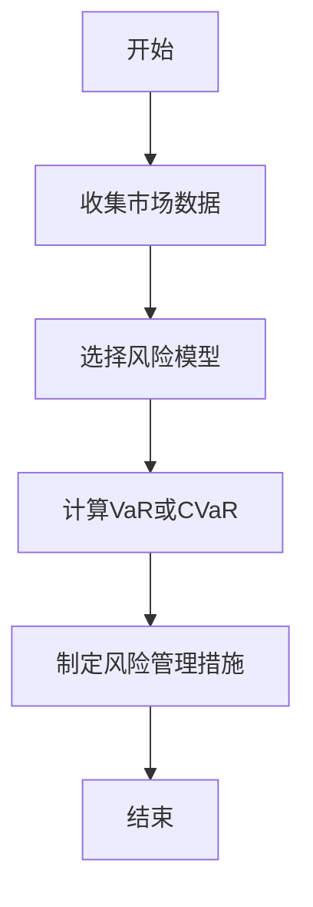
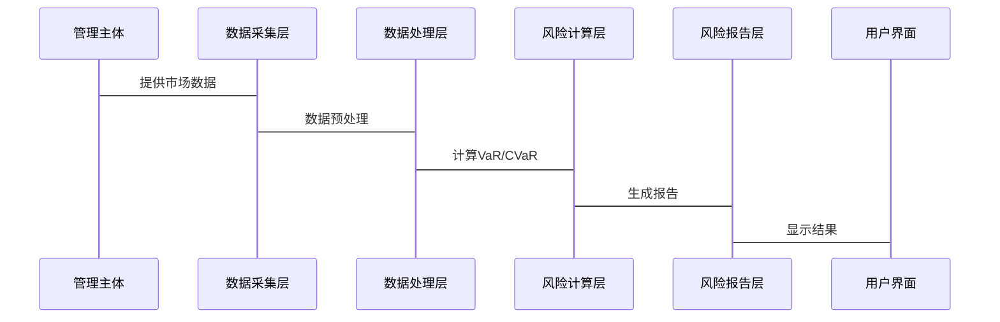

                 


# 尾部风险管理：防范极端市场事件

## 关键词：尾部风险管理、极端市场事件、风险管理模型、系统架构设计、风险管理算法

## 摘要：  
尾部风险管理是金融和投资领域的重要课题，旨在防范极端市场事件带来的潜在损失。本文从尾部风险的定义、特征入手，深入分析尾部风险管理的核心算法与系统架构设计，结合实际案例，探讨如何通过数学模型和系统化方法实现尾部风险管理。文章内容涵盖尾部风险管理的背景、理论基础、算法实现、系统设计及实战应用，为读者提供全面的知识框架和实用的解决方案。

---

## 正文

### 第一部分：尾部风险管理引论

#### 第1章：尾部风险管理概述

##### 1.1 尾部风险的定义与特征
尾部风险（Tail Risk）是指在概率分布的“尾部”区域发生的小概率、高影响事件，这些事件可能对市场或资产造成极端损失。尾部风险的特征包括：
- **低概率**：尾部事件发生的概率较低，但影响巨大。
- **高影响**：一旦发生，可能引发系统性风险或资产大幅贬值。
- **不确定性**：尾部事件的发生往往具有不可预测性。
- **非线性**：尾部事件的影响通常是非线性的，可能引发连锁反应。

##### 1.2 尾部风险管理的重要性
尾部风险管理的核心目标是识别和防范极端事件，以降低潜在损失。其重要性体现在以下几个方面：
- **保护资产**：通过提前预警和干预措施，降低极端事件对资产的冲击。
- **维护市场稳定**：尾部事件可能导致市场崩盘，尾部风险管理有助于维护金融市场的稳定性。
- **提升决策效率**：通过量化分析，投资者可以做出更科学的风险管理决策。

##### 1.3 尾部风险管理的核心概念
尾部风险管理涉及多个关键概念：
- **风险识别**：通过数据分析识别潜在的尾部风险。
- **风险评估**：量化尾部事件的概率和影响。
- **风险控制**：采取措施降低尾部事件的发生概率或减轻其影响。

##### 1.4 尾部风险管理的背景与现状
尾部风险管理的背景可以追溯到2008年金融危机，那次危机暴露了传统风险管理模型在应对极端事件时的不足。近年来，随着大数据和人工智能技术的发展，尾部风险管理逐渐从传统的统计方法转向更复杂的算法模型。

---

#### 第2章：尾部风险管理的核心概念与联系

##### 2.1 尾部风险管理的核心原理
尾部风险管理的核心原理包括：
- **统计学基础**：利用统计模型（如VaR、CVaR）分析尾部事件。
- **机器学习**：通过算法识别潜在的极端事件。
- **系统论**：将市场视为一个复杂系统，分析其内部关联性。

##### 2.2 尾部风险管理的概念属性特征对比
下表对比了尾部风险管理与其他风险管理方式的关键区别：

| 对比维度                | 尾部风险管理              | 传统风险管理              |
|-------------------------|---------------------------|---------------------------|
| 风险类型                | 侧重极端事件             | 侧重常见事件             |
| 分析方法                | 基于统计模型和机器学习    | 基于均值-方差分析        |
| 应用场景                | 适用于黑天鹅事件防范     | 适用于日常风险控制      |

##### 2.3 尾部风险管理的ER实体关系图
以下是尾部风险管理的实体关系图：

```mermaid
erd
    管理主体 --> 尾部风险
    尾部风险 --> 市场数据
    尾部风险 --> 风险模型
    风险模型 --> 管理措施
```

---

### 第二部分：尾部风险管理的算法原理

#### 第3章：尾部风险管理的核心算法

##### 3.1 尾部风险管理的算法原理
尾部风险管理的核心算法包括：
- **VaR（Value at Risk）**：计算在一定置信水平下的潜在损失。
- **CVaR（Conditional Value at Risk）**：VaR的改进版本，考虑尾部事件后的平均损失。
- **马科夫链模型**：用于分析市场状态转移的概率。

##### 3.2 尾部风险管理的数学模型
以下是VaR模型的数学表达式：

$$
\text{VaR}(\alpha) = \min_{x} \{ x | P(L \leq x) \geq \alpha \}
$$

其中，$\alpha$ 是置信水平，$L$ 是潜在损失。

##### 3.3 尾部风险管理的算法流程图
以下是尾部风险管理的算法流程图：



---

### 第三部分：尾部风险管理的系统分析与架构设计

#### 第4章：尾部风险管理的系统分析

##### 4.1 尾部风险管理的系统需求分析
尾部风险管理系统的功能需求包括：
- 数据采集与处理
- 风险模型计算
- 风险预警与报告
- 交互式界面设计

##### 4.2 尾部风险管理的系统架构设计
以下是尾部风险管理系统的架构图：


##### 4.3 尾部风险管理的系统接口设计
以下是尾部风险管理系统的接口设计：



---

### 第5章：尾部风险管理的实战应用

##### 5.1 尾部风险管理的项目实战
以下是一个尾部风险管理的实战案例：

```python
import numpy as np
import pandas as pd
from scipy.stats import norm

def calculate VaR(data, alpha=0.05):
    data_sorted = np.sort(data)
    threshold = int(len(data_sorted) * alpha)
    VaR = data_sorted[threshold]
    return VaR

# 示例数据
returns = np.random.normal(0, 1, 1000)
alpha = 0.05

VaR = calculate VaR(returns, alpha)
print(f"VaR at {alpha} confidence level: {VaR}")
```

##### 5.2 尾部风险管理的案例分析
通过上述代码，我们可以计算出在95%置信水平下的VaR值，从而识别潜在的尾部风险。

---

## 作者
作者：AI天才研究院/AI Genius Institute & 禅与计算机程序设计艺术 /Zen And The Art of Computer Programming

---

通过以上内容，我们系统地介绍了尾部风险管理的核心概念、算法原理和系统设计。希望读者能够通过本文掌握尾部风险管理的基本方法，并在实际应用中加以实践。

