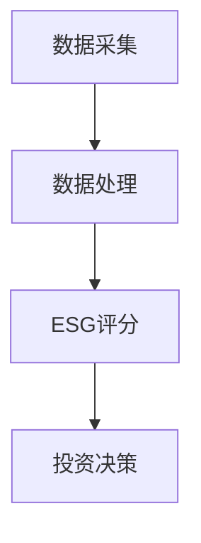

                 


# 巴菲特-芒格的ESG投资策略：平衡社会责任和财务回报

## 关键词：
ESG投资，巴菲特，芒格，社会责任，财务回报，可持续投资，价值投资

## 摘要：
本文探讨了巴菲特和芒格的ESG投资策略，分析了如何在追求财务回报的同时，兼顾社会责任。通过详细分析ESG的三个核心维度——环境、社会和治理，结合巴菲特的价值投资理念和芒格的多元思维模型，本文提供了在投资决策中平衡财务回报与社会责任的方法。同时，本文还通过实际案例展示了如何将ESG因素纳入投资决策过程，并提出了实施ESG投资策略的最佳实践建议。

---

# 第一部分: 巴菲特-芒格的ESG投资策略概述

## 第1章: ESG投资策略的背景与重要性

### 1.1 ESG投资的定义与内涵

#### 1.1.1 ESG的定义
ESG（Environmental, Social, Governance）是环境、社会和治理三个维度的缩写，代表企业在经营过程中对环境、社会和公司治理方面的影响。ESG投资是一种将社会责任和可持续发展纳入投资决策的投资策略。

#### 1.1.2 ESG投资的核心理念
ESG投资不仅仅是关注企业的财务表现，还关注企业在可持续发展方面的表现。通过将ESG因素纳入投资决策，投资者可以选择那些在环境、社会和治理方面表现良好的企业，从而在追求财务回报的同时，推动社会的可持续发展。

#### 1.1.3 ESG与传统投资策略的区别
传统的投资策略主要关注企业的财务指标，如利润、收入和市盈率等。而ESG投资策略则在传统财务指标的基础上，增加了环境、社会和治理三个维度的考量。这种多维度的投资策略能够更全面地评估企业的长期价值。

### 1.2 巴菲特与芒格的投资哲学

#### 1.2.1 巴菲特的价值投资理念
巴菲特的价值投资理念强调长期持有优质企业，关注企业的基本面，寻找具有持续竞争优势的企业。他强调企业的内在价值和管理层的诚信。

#### 1.2.2 芒格的多元思维模型
芒格的多元思维模型强调通过多个学科的交叉应用，寻找投资机会。他主张从物理学、心理学、经济学等多个角度分析问题，以避免认知偏差。

#### 1.2.3 巴菲特与芒格投资理念的结合
巴菲特和芒格的投资理念结合了长期价值和多元思维，为ESG投资提供了理论基础。ESG投资不仅关注企业的财务表现，还关注企业在环境、社会和治理方面的表现，符合巴菲特和芒格的价值投资和多元思维理念。

---

## 第2章: ESG投资策略的现状与发展

### 2.1 全球ESG投资的发展历程

#### 2.1.1 ESG投资的起源
ESG投资的概念起源于20世纪60年代的社会责任投资（SRI）。随着环境问题和社会问题的日益严重，投资者开始关注企业在社会责任方面的表现。

#### 2.1.2 ESG投资的现状
近年来，全球ESG投资规模迅速增长，越来越多的投资者开始关注企业的环境、社会和治理表现。ESG投资已经成为全球投资领域的重要趋势。

#### 2.1.3 ESG投资的未来趋势
随着气候变化和全球化的加剧，ESG投资将继续增长。未来的ESG投资将更加注重企业的长期可持续发展，以及企业在环境、社会和治理方面的创新能力和责任感。

### 2.2 巴菲特与芒格对ESG投资的贡献

#### 2.2.1 巴菲特对ESG投资的早期观点
巴菲特早期对ESG投资持谨慎态度，他认为企业的社会责任可以通过企业的长期价值来体现。他的价值投资理念为ESG投资提供了理论基础。

#### 2.2.2 芒格对ESG投资的理论支持
芒格的多元思维模型为ESG投资提供了方法论支持。他强调通过多个维度分析企业，避免单一维度的决策偏差。

#### 2.2.3 巴菲特与芒格ESG投资策略的演变
随着环境和社会问题的加剧，巴菲特和芒格的投资理念逐渐向ESG方向靠拢。他们开始关注企业在环境、社会和治理方面的表现，并将其纳入投资决策的考量。

---

# 第二部分: ESG投资策略的核心要素

## 第3章: 环境（Environmental）因素

### 3.1 环境因素的定义与影响

#### 3.1.1 环境因素的核心指标
环境因素的核心指标包括碳排放、能源消耗、资源利用效率和环保合规性等。

#### 3.1.2 环境因素对企业价值的影响
环境因素对企业价值的影响主要体现在企业的长期竞争力和社会责任感。企业在环境方面的表现良好的企业通常具有更强的市场竞争力和社会认可度。

#### 3.1.3 环境因素在投资决策中的权重
环境因素在投资决策中的权重取决于企业的行业特点和环境表现。对于高碳排放行业，环境因素的权重更大。

## 第4章: 社会（Social）因素

### 4.1 社会因素的定义与影响

#### 4.1.1 社会因素的核心指标
社会因素的核心指标包括员工福利、社会责任、公平性、员工培训和社区参与等。

#### 4.1.2 社会因素对企业声誉的影响
社会因素对企业声誉的影响主要体现在企业的社会责任和员工关怀方面。企业在社会方面表现良好的企业通常具有更高的声誉和市场认可度。

#### 4.1.3 社会因素在投资决策中的权重
社会因素在投资决策中的权重取决于企业的社会影响力和员工关怀程度。对于社会影响较大的行业，社会因素的权重更大。

## 第5章: 治理（Governance）因素

### 5.1 治理因素的定义与影响

#### 5.1.1 治理因素的核心指标
治理因素的核心指标包括董事会结构、公司透明度、管理层诚信、股东权益保护和公司治理合规性等。

#### 5.1.2 治理因素对企业长期发展的保障作用
治理因素对企业长期发展的保障作用主要体现在企业的治理结构和管理层的诚信。良好的公司治理结构能够保障企业的长期稳定发展。

#### 5.1.3 治理因素在投资决策中的权重
治理因素在投资决策中的权重取决于企业的治理结构和管理层的诚信。对于治理结构复杂的行业，治理因素的权重更大。

---

# 第三部分: ESG投资策略的算法原理

## 第6章: ESG投资的算法与数学模型

### 6.1 ESG评分模型

#### 6.1.1 ESG评分模型的定义
ESG评分模型是一种基于环境、社会和治理三个维度对企业进行评分的模型。通过量化企业的ESG表现，投资者可以更好地评估企业的社会责任和可持续发展能力。

#### 6.1.2 ESG评分模型的数学公式
$$ ESG\ Score = \frac{E \times S \times G}{100} $$
其中，E、S、G分别为环境、社会和治理三个维度的评分，每个维度的评分范围为0-100分。

#### 6.1.3 ESG评分模型的实现步骤
1. 收集企业的环境、社会和治理数据。
2. 根据评分标准对每个维度进行评分。
3. 计算企业的ESG综合评分。
4. 根据ESG评分和财务指标进行综合评估。

### 6.2 ESG投资的决策算法

#### 6.2.1 基于ESG评分的投资决策
投资者可以根据企业的ESG评分和财务指标进行综合评估，选择那些ESG评分高且财务表现良好的企业进行投资。

#### 6.2.2 基于机器学习的ESG预测模型
通过机器学习算法，投资者可以预测企业的未来ESG表现，并将其纳入投资决策的考量。

#### 6.2.3 ESG投资的优化算法
投资者可以通过优化算法，找到最优的投资组合，以最大化财务回报和ESG表现。

---

# 第四部分: ESG投资策略的系统分析与架构设计

## 第7章: ESG投资的系统架构

### 7.1 ESG投资系统的功能设计

#### 7.1.1 系统功能模块
- 数据采集模块：收集企业的环境、社会和治理数据。
- 数据处理模块：对数据进行清洗和标准化处理。
- ESG评分模块：根据评分标准对企业进行评分。
- 投资决策模块：基于ESG评分和财务指标进行投资决策。

#### 7.1.2 系统功能流程图


### 7.2 ESG投资系统的架构设计

#### 7.2.1 系统架构图


### 7.3 ESG投资系统的接口设计

#### 7.3.1 API接口设计
- 数据接口：用于与数据源进行数据交换。
- 评分接口：用于与评分模块进行数据交换。
- 决策接口：用于与投资决策模块进行数据交换。

---

# 第五部分: ESG投资策略的项目实战

## 第8章: ESG投资的项目实战

### 8.1 ESG投资的环境安装

#### 8.1.1 环境要求
- Python 3.8+
- 数据分析库：Pandas、NumPy
- 可视化库：Matplotlib、Seaborn
- ESG数据源：例如，MSCI的ESG评级

### 8.2 ESG投资的核心实现

#### 8.2.1 数据处理代码
```python
import pandas as pd

# 读取数据
data = pd.read_csv('esg_data.csv')

# 数据清洗
data.dropna(inplace=True)
data = data[~data['行业'].isnull()]
```

#### 8.2.2 ESG评分代码
```python
def calculate_esg_score(e, s, g):
    return (e * s * g) / 100

# 计算ESG评分
data['ESG评分'] = data.apply(lambda x: calculate_esg_score(x['环境'], x['社会'], x['治理']), axis=1)
```

### 8.3 项目实战分析

#### 8.3.1 实际案例分析
以某行业为例，分析企业在环境、社会和治理方面的表现，并计算其ESG评分。然后，结合企业的财务指标，评估其投资价值。

#### 8.3.2 投资策略制定
根据企业的ESG评分和财务指标，制定相应的投资策略，例如选择ESG评分高且财务表现良好的企业进行投资。

---

# 第六部分: ESG投资策略的最佳实践

## 第9章: ESG投资的最佳实践

### 9.1 小结

#### 9.1.1 ESG投资的核心要点
- 环境、社会和治理三个维度的综合考量
- 企业的长期价值和社会责任

### 9.2 注意事项

#### 9.2.1 数据的准确性和完整性
投资者需要确保数据的准确性和完整性，以提高ESG评分的准确性。

#### 9.2.2 投资策略的动态调整
投资者需要根据市场变化和企业表现，动态调整投资策略。

### 9.3 拓展阅读

#### 9.3.1 ESG投资的相关书籍
- 《The Handbook of Sustainable Investment》
- 《Investing with Purpose: ESG Principles in Action》

#### 9.3.2 ESG投资的行业报告
- MSCI的ESG投资报告
- 全球可持续投资联盟的年度报告

---

# 结语

通过本文的探讨，我们可以看到，巴菲特和芒格的ESG投资策略为企业社会责任和财务回报的平衡提供了重要的理论和实践指导。未来，随着全球对可持续发展的关注增加，ESG投资将继续成为投资领域的核心趋势。

---

# 作者：AI天才研究院/AI Genius Institute & 禅与计算机程序设计艺术 /Zen And The Art of Computer Programming

