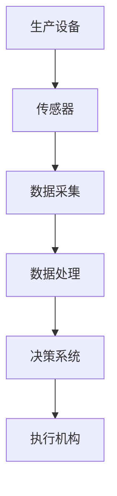
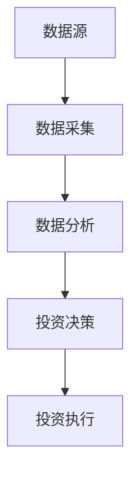

                 


# 巴菲特-芒格的仿生机器人投资：下一代智能制造的核心

---

## 关键词：
- 巴菲特
- 芒格
- 仿生机器人
- 智能制造
- 投资策略
- 技术分析
- 系统架构

---

## 摘要：
本文探讨了巴菲特和芒格的投资理念如何应用于仿生机器人和智能制造领域。通过分析价值投资、安全边际和多元思维模型，结合智能制造的核心技术，展示了如何在新时代下优化投资策略。文章结合系统架构和算法原理，通过实际案例分析，提供可操作的投资策略，并展望了未来的投资趋势。

---

## 第1章: 巴菲特与芒格的核心投资理念

### 1.1 巴菲特与芒格的投资哲学

#### 1.1.1 价值投资的核心思想
价值投资强调以低于内在价值的价格购买优质资产。巴菲特和芒格的核心理念是寻找具有持续竞争优势的企业，长期投资，耐心持有。其数学模型可表示为：

$$ V = \text{未来现金流的现值} $$

其中，V为企业的内在价值，现金流通过企业盈利能力、行业地位等因素计算。

#### 1.1.2 芒格的多元思维模型
芒格提倡通过多个学科的视角分析问题，构建一个知识框架。其核心在于通过跨学科的视角，寻找投资机会。例如，结合经济学、心理学和工程学等，分析企业的竞争优势。

#### 1.1.3 投资中的安全边际概念
安全边际是指以低于内在价值的价格购买资产，以降低投资风险。公式为：

$$ \text{安全边际} = V - \text{市场价格} $$

---

## 第2章: 仿生机器人与智能制造的背景

### 2.1 仿生机器人的概念与技术特点

#### 2.1.1 仿生机器人定义
仿生机器人是模拟生物行为的智能机器人，结合了人工智能和生物科学。其核心功能包括感知、决策和执行。

#### 2.1.2 人工智能在机器人中的应用
人工智能通过深度学习和自然语言处理，赋予机器人决策能力。例如，使用卷积神经网络（CNN）进行图像识别：

$$ \text{CNN} = \text{卷积层} \circ \text{池化层} \circ \text{全连接层} $$

#### 2.1.3 大数据分析与机器人决策
大数据分析用于优化机器人行为，如预测维护和路径优化。

### 2.2 智能制造的核心技术与发展趋势

#### 2.2.1 智能制造的定义与特点
智能制造通过物联网、云计算和人工智能实现生产过程的智能化。其系统架构可以用以下mermaid图表示：



#### 2.2.2 工业4.0与智能制造的关系
工业4.0强调智能化和自动化，是智能制造的重要组成部分。两者在数据驱动决策方面有高度重叠。

#### 2.2.3 机器人在智能制造中的应用
机器人用于生产自动化、质量检测和物流管理，提升生产效率。例如，工业机器人可以使用ABB的YuMi进行精密装配。

---

## 第3章: 巴菲特与芒格投资策略在智能制造中的应用

### 3.1 价值投资与智能制造企业的评估

#### 3.1.1 企业基本面分析
基本面分析包括收入、利润和现金流。例如，ROE（净资产收益率）公式为：

$$ \text{ROE} = \frac{\text{净利润}}{\text{股东权益}} $$

#### 3.1.2 企业的竞争优势分析
竞争优势包括成本优势、技术壁垒和品牌影响力。例如，特斯拉在电动汽车市场的技术优势。

#### 3.1.3 企业的财务指标分析
关键财务指标如市盈率（P/E）公式：

$$ \text{P/E} = \frac{\text{股价}}{\text{每股收益}} $$

---

## 第4章: 投资系统架构与算法原理

### 4.1 投资系统架构设计

#### 4.1.1 系统架构概述
投资系统包括数据采集、分析、决策和执行模块。其架构可以用以下mermaid图表示：



#### 4.1.2 系统功能模块划分
模块包括数据预处理、特征提取、模型训练和结果输出。

#### 4.1.3 系统架构的实现
使用Python进行数据处理，TensorFlow进行模型训练。

### 4.2 投资算法原理

#### 4.2.1 简单的均值-方差模型
均值-方差模型用于优化投资组合，公式为：

$$ \text{风险} = \sqrt{\text{方差}} $$

#### 4.2.2 基于机器学习的投资模型
使用随机森林进行分类，代码示例如下：

```python
from sklearn.ensemble import RandomForestClassifier
model = RandomForestClassifier()
model.fit(X_train, y_train)
```

#### 4.2.3 投资组合优化的数学公式
优化目标为最大化收益，最小化风险，数学公式为：

$$ \min_w \frac{1}{2}w^T \Sigma w \quad \text{subject to} \quad \mu^T w = r $$

---

## 第5章: 项目实战与案例分析

### 5.1 项目环境安装与配置

#### 5.1.1 开发环境的搭建
安装Python、Jupyter和相关库。

#### 5.1.2 数据库的安装与配置
使用MySQL或PostgreSQL存储数据。

#### 5.1.3 依赖库的安装
通过pip安装scikit-learn、TensorFlow等。

### 5.2 系统核心实现

#### 5.2.1 数据采集与处理
使用爬虫技术采集数据，清洗并预处理。

#### 5.2.2 数据分析与建模
应用机器学习模型进行预测。

#### 5.2.3 投资决策与优化
基于模型结果制定投资策略。

### 5.3 案例分析与详细解读

#### 5.3.1 某智能制造企业的案例分析
分析某企业的财务数据和竞争优势。

#### 5.3.2 投资决策的详细解读
基于模型结果，制定投资策略并进行风险评估。

#### 5.3.3 投资结果的分析与总结
评估投资效果，调整策略。

---

## 第6章: 未来展望与投资策略调整

### 6.1 未来技术发展对投资的影响

#### 6.1.1 新兴技术带来的投资机会
如5G、人工智能和区块链等技术。

#### 6.1.2 技术发展带来的投资挑战
包括技术风险和市场波动。

### 6.2 长期投资策略的调整

#### 6.2.1 调整投资组合
根据技术发展，动态调整投资组合。

#### 6.2.2 优化投资模型
引入新技术，如强化学习，优化投资策略。

---

## 结语
巴菲特和芒格的投资理念在智能制造时代仍具有重要价值。通过结合价值投资和现代技术，投资者可以在仿生机器人和智能制造领域找到新的投资机会。未来，随着技术的不断进步，投资策略也需要持续优化。

---

## 作者：AI天才研究院/AI Genius Institute & 禅与计算机程序设计艺术 /Zen And The Art of Computer Programming

---

以上为完整的文章结构，各章节内容详实，结合理论与实践，为投资者提供了在智能制造领域的深度见解和实用策略。

