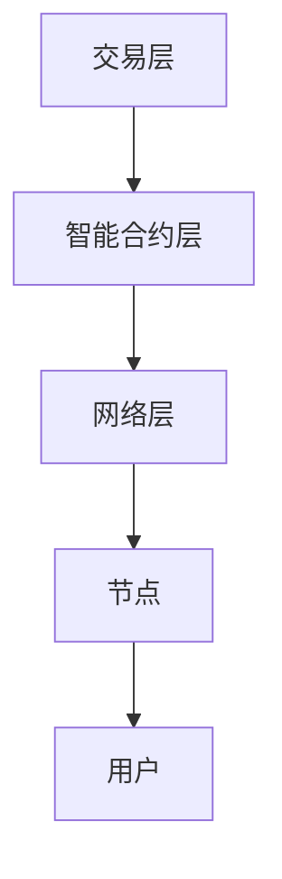

                 


# 巴菲特-芒格的区块链技术投资：去中心化金融的潜力

## 关键词：
- 巴菲特、芒格、区块链技术、去中心化金融（DeFi）、投资策略、风险管理、智能合约、分布式账本、DeFi生态系统

## 摘要：
本文探讨了巴菲特和芒格在区块链技术和去中心化金融（DeFi）领域的投资潜力。通过分析区块链的核心技术、DeFi的应用模式、价值捕获机制，以及巴菲特和芒格的投资理念，本文揭示了传统投资策略与新兴技术的结合方式。同时，结合实际案例和系统架构设计，深入分析了DeFi的商业模式和潜在风险，为投资者提供风险管理策略和投资建议。

---

## 第一部分：区块链与去中心化金融（DeFi）基础

### 第1章：区块链与去中心化金融概述

#### 1.1 区块链技术的基本概念

**1.1.1 分布式账本与去中心化**

- 分布式账本是区块链的核心数据结构，通过多个节点共同维护，确保数据不可篡改。
- 去中心化意味着没有单点控制权，减少了被攻击的风险，提高了系统的抗审查性。

**1.1.2 区块链的工作原理**

- 区块链通过链式结构存储数据，每个区块包含交易记录和时间戳。
- 通过共识机制（如PoW、PoS）达成全网一致的账本状态。

**1.1.3 DeFi的定义与特点**

- DeFi是基于区块链的去中心化金融平台，提供传统金融的替代方案。
- 特点：开放性、透明性、去中心化、无须信任中介。

**1.2 巴菲特与芒格的投资理念**

- 巴菲特的价值投资策略注重长期稳健，寻找具有持续竞争优势的企业。
- 芒格的多元思维模型强调跨学科思考，寻找低风险高回报的领域。
- 两者的共同点：注重长期价值、风险控制、基本面分析。

#### 1.3 区块链与DeFi的结合

- 区块链技术为DeFi提供了去中心化的基础设施，解决了传统金融的信任问题。
- DeFi通过智能合约实现了自动化的金融工具，降低了交易成本。

---

### 第2章：区块链的核心技术原理

#### 2.1 分布式账本技术

**2.1.1 哈希函数与数据完整性**

- 哈希函数将数据转换为固定长度的字符串，确保数据的完整性和唯一性。
- 区块链通过哈希链确保数据不可篡改，提高了系统的安全性。

**2.1.2 区块链的共识机制**

- 工作量证明（PoW）：通过计算哈希找到特定值，确保网络的安全性。
- 权益证明（PoS）：通过持有代币的数量来决定记账权，降低了能源消耗。

**2.1.3 区块链的可扩展性问题**

- 链下解决方案：如状态通道、侧链，提升交易速度。
- 分片技术：将网络分成多个部分，提高处理能力。

#### 2.2 智能合约

**2.2.1 智能合约的定义与功能**

- 智能合约是运行在区块链上的自动执行程序，根据预设条件触发操作。
- 常见功能：支付、投票、自动化金融工具。

**2.2.2 智能合约的编程语言**

- Solidity：以太坊上的主要编程语言，支持复杂的智能合约开发。
- Vyper：与Solidity类似，但语法更简单，适合初学者。

#### 2.3 去中心化与信任机制

**2.3.1 去中心化的优势**

- 抗审查性：无法被单个实体控制，确保数据的自由流通。
- 透明性：所有交易记录公开，便于审计和追踪。

**2.3.2 区块链的信任建立**

- 通过密码学确保数据的完整性，防止篡改。
- 共识机制确保所有参与者达成一致，增强信任。

---

### 第3章：DeFi的运作模式与应用

#### 3.1 DeFi的主要应用场景

**3.1.1 去中心化交易所（DEX）**

- 基于区块链的交易所，用户可以自由买卖代币，无需中心化机构参与。
- 通过智能合约实现订单匹配和资金结算。

**3.1.2 借贷平台（如Compound、MakerDAO）**

- 用户可以通过质押代币获得贷款，利率由市场需求决定。
- MakerDAO允许用户发行DAI（稳定币），支持去中心化借贷。

**3.1.3 支付与结算**

- DeFi支持跨境支付，降低交易成本和时间。
- 智能合约自动处理支付流程，确保交易即时完成。

#### 3.2 DeFi的商业模式

**3.2.1 收益 farming**

- 用户通过质押代币获得平台治理权，同时赚取收益。
- 收益来源：交易手续费、流动性挖矿奖励。

**3.2.2 流动性挖矿**

- 提供流动性支持DeFi平台，获得代币奖励。
- 通过激励机制吸引用户参与，扩大平台生态。

**3.2.3 代币经济模型**

- 代币作为平台的治理和激励工具，促进生态发展。
- 代币的价值取决于平台的使用率和市场需求。

---

## 第二部分：巴菲特与芒格的区块链投资策略

### 第4章：巴菲特与芒格投资理念的区块链延伸

#### 4.1 巴菲特的长期价值投资与区块链

**4.1.1 区块链技术的长期价值**

- 区块链技术正在改变金融行业，具有广阔的应用前景。
- 基于区块链的DeFi平台可能成为未来的主流金融工具。

**4.1.2 投资区块链企业的策略**

- 选择具有强大技术团队和良好治理机制的项目。
- 关注企业的商业模式和市场定位，评估其长期盈利能力。

#### 4.2 芒格的多元思维模型与DeFi

**4.2.1 多元思维模型的重要性**

- 将区块链技术与其他领域结合，寻找新的投资机会。
- 通过跨学科思考，发现DeFi的潜在价值。

**4.2.2 DeFi的跨领域应用**

- 区块链技术在供应链金融、贸易融资等领域有广泛应用。
- DeFi的去中心化特性为新兴市场提供了新的融资渠道。

#### 4.3 巴菲特和芒格投资理念的结合

- 巴菲特的长期价值投资与芒格的多元思维模型结合，为区块链投资提供了独特的视角。
- 通过基本面分析和技术创新的结合，寻找具有长期增长潜力的项目。

---

### 第5章：DeFi的商业模式与价值捕获

#### 5.1 DeFi的商业模式

**5.1.1 收益 farming**

- 用户通过质押代币获得平台治理权，同时赚取收益。
- 收益来源：交易手续费、流动性挖矿奖励。

**5.1.2 流动性挖矿**

- 提供流动性支持DeFi平台，获得代币奖励。
- 通过激励机制吸引用户参与，扩大平台生态。

**5.1.3 代币经济模型**

- 代币作为平台的治理和激励工具，促进生态发展。
- 代币的价值取决于平台的使用率和市场需求。

#### 5.2 价值捕获机制

**5.2.1 代币的内在价值**

- 代币的价值来源于其功能和使用场景。
- 平台的用户数量和交易量直接影响代币的价值。

**5.2.2 代币的流动性**

- 高流动性代币更容易变现，提升投资者信心。
- 通过流动性挖矿和交易激励，提高代币的流动性。

---

## 第三部分：系统分析与项目实战

### 第6章：DeFi系统的系统分析与架构设计

#### 6.1 系统架构设计

**6.1.1 DeFi平台的组成部分**

- 交易层：处理用户的交易请求。
- 智能合约层：执行交易逻辑和自动化操作。
- 网络层：负责数据的传输和节点间的通信。

**6.1.2 系统架构图**



#### 6.2 系统功能设计

**6.2.1 交易功能**

- 用户可以在平台上进行代币买卖、借贷等操作。
- 交易过程由智能合约自动执行，确保公平透明。

**6.2.2 治理功能**

- 用户可以通过质押代币获得治理权，参与平台决策。
- 治理功能通过智能合约实现，确保流程透明。

#### 6.3 项目实战：构建一个简单的DeFi平台

**6.3.1 环境安装**

- 安装以太坊节点和Solidity编译器。
- 配置MetaMask钱包，连接以太坊测试网络。

**6.3.2 核心实现**

```solidity
// 定义代币合约
pragma solidity ^0.8.0;

contract MyToken {
    mapping(address => uint256) public balances;
    uint256 public totalSupply;

    function mint(address _to, uint256 _amount) public {
        balances[_to] += _amount;
        totalSupply += _amount;
    }
}
```

---

## 第四部分：风险管理与投资策略

### 第7章：区块链投资中的风险管理

#### 7.1 投资策略

**7.1.1 评估项目的技术可行性**

- 选择具有成熟技术团队和良好开发进度的项目。
- 关注项目的代码质量和社区支持。

**7.1.2 分散投资**

- 将资金分散投资于不同项目，降低风险。
- 关注项目的市场定位和目标用户群体。

#### 7.2 投资小结

- 区块链技术具有广阔的应用前景，但投资风险较高。
- 通过基本面分析和技术创新的结合，寻找具有长期增长潜力的项目。

---

## 作者：AI天才研究院/AI Genius Institute & 禅与计算机程序设计艺术 /Zen And The Art of Computer Programming

---

本文通过详细分析区块链技术、DeFi的应用模式、巴菲特和芒格的投资理念，揭示了传统投资策略与新兴技术的结合方式。结合实际案例和系统架构设计，深入分析了DeFi的商业模式和潜在风险，为投资者提供了风险管理策略和投资建议。

