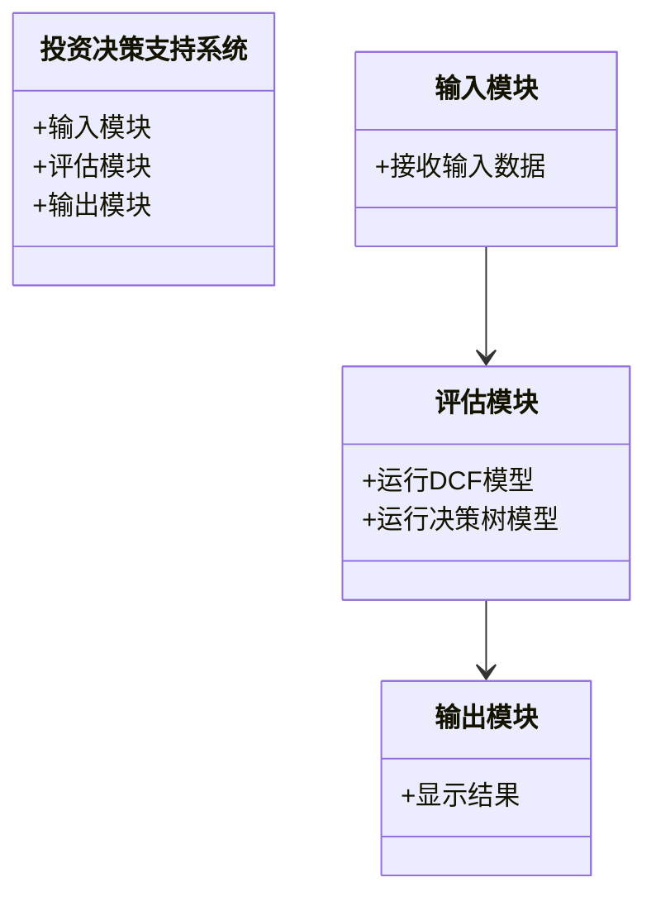
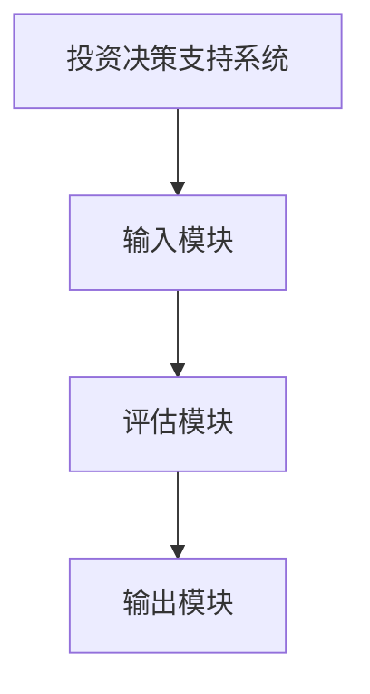
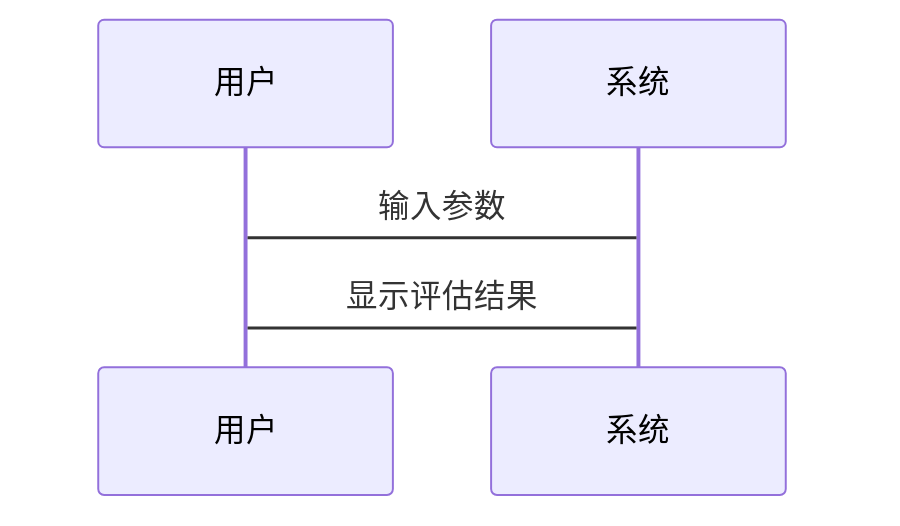

                 


```markdown
# 巴菲特-芒格的可控核聚变商业化投资：能源革命的临界点

> 关键词：巴菲特，芒格，可控核聚变，能源革命，投资模型，核聚变技术，价值投资

> 摘要：本文探讨了巴菲特和芒格如何通过投资可控核聚变技术推动能源革命，分析了其投资策略、技术原理及商业化潜力，构建了投资决策模型，并通过案例分析展示了实际应用。

---

## 第一部分：背景介绍

### 第1章：巴菲特与芒格的投资理念

#### 1.1 巴菲特的价值投资理论
- **1.1.1 价值投资的核心理念**  
  巴菲特的价值投资理论强调以低于内在价值的价格买入优质资产，长期持有。  
  $$\text{内在价值} = \frac{\text{现金流}}{\text{贴现率}}$$  
  例如，评估一家公司未来现金流，以合理贴现率计算其内在价值。

- **1.1.2 巴菲特的投资策略**  
  巴菲特的“护城河”理论，寻找具有竞争优势的企业。他偏好低风险、高壁垒的行业。

- **1.1.3 巴菲特投资哲学的演变**  
  从早期的烟蒂股投资到后期的买入并持有优质资产，体现了对长期价值的追求。

#### 1.2 芒格的多元思维模型
- **1.2.1 多元思维模型的定义**  
  芒格强调构建多学科知识框架，通过跨领域思考解决问题。

- **1.2.2 芒格思维模型的核心要素**  
  包括心理学、经济学、物理学等多学科知识，形成多维度分析框架。

- **1.2.3 多元思维模型在投资中的应用**  
  通过多维度分析企业，识别潜在风险和机会。

### 第2章：可控核聚变的技术与商业化潜力

#### 2.1 可控核聚变的基本原理
- **2.1.1 核聚变的定义与特点**  
  核聚变是通过高温高压使轻核发生聚变反应，释放巨大能量，与传统化石能源相比，核聚变具有零碳排放、资源丰富等优势。

- **2.1.2 可控核聚变的技术挑战**  
  包括高温等离子体控制、材料科学、反应堆设计等技术难题。

- **2.1.3 可控核聚变的能源优势**  
  核聚变能是人类最理想的能源之一，具有无限可持续性和环保性。

#### 2.2 可控核聚变的商业化进程
- **2.2.1 当前商业化现状**  
  目前，全球有多家公司和机构在研究可控核聚变技术，如美国的通用原子核聚变系统公司（General Fusion）和中国的 EAST 装置。

- **2.2.2 核聚变技术的未来发展趋势**  
  技术进步和成本降低将推动核聚变商业化进程。

- **2.2.3 核聚变技术的经济性分析**  
  通过比较不同能源的成本，分析核聚变的经济可行性。

---

## 第二部分：核心概念与联系

### 第3章：巴菲特与芒格的投资模型

#### 3.1 巴菲特的DCF模型
- **3.1.1 DCF模型的基本原理**  
  现金流折现法（DCF）是评估企业价值的核心工具，公式如下：
  $$\text{企业价值} = \sum_{t=1}^{n} \frac{\text{现金流}}{(1 + r)^t}$$  
  其中，r为贴现率，n为预测年限。

- **3.1.2 DCF模型的数学公式**  
  使用Excel或Python进行DCF模型的计算，例如：
  ```python
  def calculate_intrinsic_value(cash_flows, discount_rate):
      return sum(cash_flow / (1 + discount_rate)**t for t, cash_flow in enumerate(cash_flows))
  ```

- **3.1.3 DCF模型的应用实例**  
  通过具体案例分析DCF模型如何评估企业价值。

#### 3.2 芒格的决策树模型
- **3.2.1 决策树模型的定义**  
  决策树是一种图形化的决策工具，用于分析问题场景和可能的解决方案。

- **3.2.2 决策树模型的核心要素**  
  包括决策节点、结果节点、概率分支等。

- **3.2.3 决策树模型的构建步骤**  
  1. 确定问题目标；2. 构建决策树；3. 计算期望值；4. 剪枝优化。

### 第4章：可控核聚变与能源革命的关系

#### 4.1 可控核聚变的技术优势
- **4.1.1 能源安全性**  
  核聚变能是清洁能源，不会产生放射性废料。

- **4.1.2 可持续性**  
  核聚变燃料来源丰富，如氘和氚，地球上储量充足。

- **4.1.3 经济性**  
  随着技术进步，核聚变发电成本将低于传统能源。

#### 4.2 可控核聚变与能源结构转型
- **4.2.1 当前能源结构**  
  传统能源占据主导地位，化石能源占比高。

- **4.2.2 能源结构转型的必要性**  
  应对气候变化，减少碳排放。

- **4.2.3 核聚变在能源革命中的作用**  
  核聚变能是实现能源清洁化、低碳化的关键。

---

## 第三部分：系统分析与架构设计

### 第5章：投资决策支持系统

#### 5.1 系统功能设计
- **5.1.1 领域模型**  
  使用Mermaid类图展示系统各模块之间的关系。



#### 5.2 系统架构设计
- **5.2.1 系统架构图**  
  使用Mermaid图展示系统架构。



#### 5.3 系统接口设计
- **5.3.1 输入接口**  
  接收用户输入的参数，如现金流、贴现率等。

- **5.3.2 输出接口**  
  显示评估结果，如企业价值、投资建议等。

#### 5.4 系统交互设计
- **5.4.1 交互流程图**  
  使用Mermaid图展示用户与系统的交互过程。



---

## 第四部分：项目实战

### 第6章：可控核聚变投资案例分析

#### 6.1 环境搭建
- **6.1.1 安装Python和相关库**  
  使用Python 3.8以上版本，安装numpy、pandas、scikit-learn等库。

#### 6.2 核心代码实现
- **6.2.1 DCF模型实现**

```python
import numpy as np

def calculate_intrinsic_value(cash_flows, discount_rate, periods):
    iv = 0
    for t in range(periods):
        iv += cash_flows[t] / (1 + discount_rate) ** t
    return iv

# 示例数据
cash_flows = [100, 200, 300, 400, 500]
discount_rate = 0.1
periods = 5

iv = calculate_intrinsic_value(cash_flows, discount_rate, periods)
print(f"内在价值为：{iv}")
```

- **6.2.2 决策树模型实现**

```python
from sklearn.tree import DecisionTreeRegressor

# 示例数据
X = np.array([[1, 2], [3, 4], [5, 6], [7, 8]])
y = np.array([2, 4, 6, 8])

model = DecisionTreeRegressor()
model.fit(X, y)

# 预测
print(model.predict([[9, 10]]))
```

#### 6.3 案例分析与小结
- **6.3.1 投资决策过程**  
  通过DCF模型和决策树模型评估某家核聚变公司的投资价值。

- **6.3.2 成功关键因素**  
  选择正确的模型和参数，准确评估企业价值。

---

## 第五部分：总结与展望

### 第7章：投资总结与未来展望

#### 7.1 投资总结
- **7.1.1 投资机会**  
  核聚变技术商业化是未来能源革命的核心，具有巨大投资潜力。

- **7.1.2 投资策略**  
  结合DCF模型和多元思维模型，寻找具有竞争优势的企业。

#### 7.2 未来展望
- **7.2.1 技术进步**  
  核聚变技术的突破将推动能源结构转型。

- **7.2.2 市场前景**  
  核聚变能源将成为未来主要能源之一。

#### 7.3 投资建议
- **7.3.1 投资建议**  
  投资者应关注核聚变技术的商业化进程，选择具有技术优势和竞争优势的企业。

---

## 作者信息

作者：AI天才研究院/AI Genius Institute & 禅与计算机程序设计艺术/Zen And The Art of Computer Programming
```

