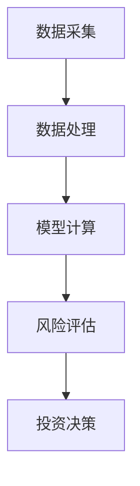

                 


# 巴菲特-芒格的可控核聚变投资：未来能源的终极解决方案

## 关键词：
巴菲特、芒格、可控核聚变、投资模型、能源技术、人工智能

## 摘要：
本文将深入探讨巴菲特和芒格的投资理念如何与可控核聚变技术相结合，构建一种创新的投资模型，为未来能源的投资提供一种终极解决方案。通过分析核聚变能源的技术特点和投资策略，结合数学模型和系统架构设计，本文将为投资者提供一套科学的投资方法，并通过实际案例展示如何将理论应用于实践。

## 第一部分：背景介绍

## 第1章：巴菲特与芒格的投资哲学

### 1.1 巴菲特的价值投资理念
#### 1.1.1 巴菲特的投资原则
- 质值投资
- 长期持有
- 避免短期波动

#### 1.1.2 芒格的多元思维模型
- 复合决策
- 跨学科思维
- 独立思考

#### 1.1.3 价值投资的核心要素
- 安全边际
- 企业竞争优势
- 长期价值

### 1.2 投资与能源的结合
#### 1.2.1 能源投资的特殊性
- 高技术门槛
- 长周期回报
- 高风险高收益

#### 1.2.2 核聚变能源的潜力
- 可持续性
- 无污染
- 高效能

#### 1.2.3 投资与技术的结合
- 技术驱动投资
- 投资推动技术
- 双向影响

## 第2章：可控核聚变能源的基础知识

### 2.1 核聚变的基本原理
#### 2.1.1 核聚变与核裂变的区别
- 反应类型
- 能量释放
- 控制方式

#### 2.1.2 核聚变的优势
- 能源丰富
- 无放射性废物
- 安全性高

#### 2.1.3 核聚变的实际应用
- 能源发电
- 工业应用
- 国防用途

### 2.2 可控核聚变的技术挑战
#### 2.2.1 技术瓶颈
- 等离子体控制
- 热绝缘
- 能量输出

#### 2.2.2 研究进展
- 国际热核聚变实验堆（ITER）
- 私营企业的突破
- 新技术的应用

#### 2.2.3 未来展望
- 技术成熟
- 成本下降
- 商业化应用

## 第3章：核聚变投资模型的构建

### 3.1 核聚变投资模型的核心要素
#### 3.1.1 投资目标
- 技术可行性
- 市场需求
- 回报周期

#### 3.1.2 投资策略
- 风险分散
- 价值评估
- 技术锁定

#### 3.1.3 风险管理
- 量化风险
- 投资组合
- 退出策略

### 3.2 核聚变投资模型的数学表达

#### 3.2.1 投资回报的公式
$$ ROI = \frac{收益 - 投资}{投资} \times 100\% $$

#### 3.2.2 风险评估的模型
$$ 风险系数 = \sum (概率_i \times 影响_i) $$

#### 3.2.3 投资组合优化的算法
$$ 最优化投资组合 = \argmin \sum (w_i \times r_i) $$

## 第4章：核聚变投资的系统架构设计

### 4.1 系统功能设计
#### 4.1.1 数据采集模块
- 技术数据
- 市场数据
- 财务数据

#### 4.1.2 模型计算模块
- 估值模型
- 风险模型
- 投资组合模型

#### 4.1.3 风险评估模块
- 风险指标
- 情景分析
- 报告生成

### 4.2 系统架构图

#### 4.2.1 系统架构的Mermaid图


#### 4.2.2 模块间的交互关系
- 数据采集模块从多个来源获取数据
- 数据处理模块清洗和整合数据
- 模型计算模块基于数据生成估值和风险指标
- 风险评估模块根据模型输出生成报告
- 投资决策模块根据报告做出最终决策

## 第5章：核聚变投资的项目实战

### 5.1 项目环境安装

#### 5.1.1 开发工具安装
- Python 3.8+
- Jupyter Notebook
- VS Code

#### 5.1.2 数据库配置
- MySQL或PostgreSQL
- 连接配置
- 数据库初始化

#### 5.1.3 依赖库安装
- pandas
- numpy
- matplotlib
- scikit-learn

### 5.2 核心代码实现

#### 5.2.1 数据处理代码
```python
import pandas as pd
data = pd.read_csv('data.csv')
data_processed = data.dropna().fillna(0)
```

#### 5.2.2 模型训练代码
```python
from sklearn import linear_model
model = linear_model.LinearRegression()
model.fit(X, y)
```

#### 5.2.3 结果可视化代码
```python
import matplotlib.pyplot as plt
plt.plot(range(len(predict)), predict, 'b', label='Predicted')
plt.plot(range(len(actual)), actual, 'r', label='Actual')
plt.legend()
plt.show()
```

### 5.3 实际案例分析

#### 5.3.1 投资组合优化
$$ 投资组合 = \argmin \sum (w_i \times \sigma_i^2) $$

#### 5.3.2 风险与收益平衡
$$ 最优解 = \argmax \left( \frac{\mu - r_f}{\sigma} \right) $$

## 第6章：核聚变投资的最佳实践

### 6.1 投资策略的优化
#### 6.1.1 多元化投资的重要性
- 分散风险
- 优化回报
- 应对不确定性

#### 6.1.2 风险控制的技巧
- 设置止损
- 定期评估
- 保持灵活性

#### 6.1.3 长期投资的策略
- 选择优质企业
- 长期持有
- 定投策略

### 6.2 投资中的注意事项
#### 6.2.1 行业动态的关注
- 技术进步
- 政策变化
- 市场需求

#### 6.2.2 技术进步的影响
- 新技术的出现
- 成本下降
- 效率提升

#### 6.2.3 市场波动的应对
- 短期波动
- 长期趋势
- 资产配置

## 第7章：总结与展望

### 7.1 本章总结
- 巴菲特和芒格的投资理念与核聚变技术的结合
- 投资模型的构建与实现
- 项目实战的经验总结

### 7.2 未来展望
- 技术进步对投资的影响
- 可控核聚变的商业化前景
- 投资模型的进一步优化

## 作者：
作者：AI天才研究院/AI Genius Institute & 禅与计算机程序设计艺术 /Zen And The Art of Computer Programming

