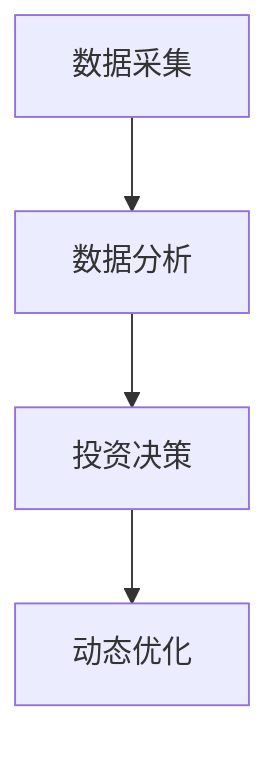
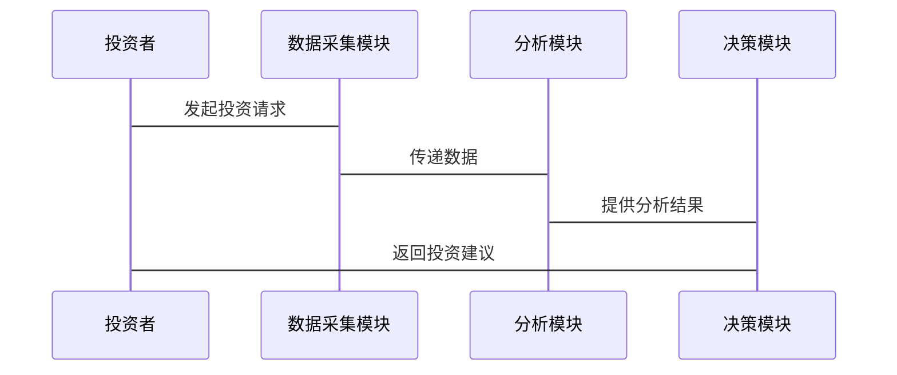

                 


# 巴菲特-芒格的可编程物质投资：纳米机器人与材料科学的融合

> 关键词：巴菲特, 芒格, 可编程物质投资, 纳米机器人, 材料科学

> 摘要：本文探讨了巴菲特和芒格的投资理念与纳米机器人、材料科学的结合，提出了可编程物质投资的概念，并通过系统架构设计和实际案例分析，展示了如何利用这些技术提升投资决策的科学性和精准性。

---

# 第1章 巴菲特与芒格的投资理念

## 1.1 巴菲特的价值投资理念

### 1.1.1 巴菲特的价值投资理念
巴菲特的价值投资理念强调以合理的价格投资于具有持续竞争优势的公司。他注重公司的基本面分析，如盈利能力、财务健康状况和管理团队的稳定性。价值投资的核心在于寻找市场低估的优质企业，并长期持有。

### 1.1.2 芒格的多元思维模型
芒格的多元思维模型强调将多个学科的原理和原则结合起来，形成一个完整的知识框架。他认为，只有通过跨学科的思考，才能全面评估一个投资的潜在风险和机会。

### 1.1.3 巴菲特与芒格理念的结合
巴菲特和芒格的投资理念相辅相成，前者注重企业基本面分析，后者注重跨学科的综合思维。这种结合使得他们的投资策略更加全面和科学。

---

## 1.2 可编程物质投资的定义与背景

### 1.2.1 可编程物质投资的起源
可编程物质投资是一种新兴的投资策略，它利用纳米机器人和材料科学的技术进步，将物质的物理性质与投资决策相结合。这种策略的核心在于通过技术手段实现对物质的动态控制，从而优化投资回报。

### 1.2.2 可编程物质投资的核心概念
可编程物质投资通过纳米机器人对材料的物理性质进行实时调整，从而实现对投资标的动态优化。这种技术的应用使得投资策略更加灵活和精准。

### 1.2.3 可编程物质投资与传统投资的区别
与传统投资相比，可编程物质投资更加注重技术驱动和动态调整。它利用纳米机器人和材料科学的进步，将物质的物理性质与投资策略相结合，从而实现更高的投资效率。

---

## 1.3 纳米机器人与材料科学的基本概念

### 1.3.1 纳米机器人的定义与特点
纳米机器人是指在纳米尺度上运行的微型机器人，具有高度的精确性和智能化。它们可以在微观尺度上执行各种任务，如物质运输、环境监测和医疗诊断。

### 1.3.2 材料科学的核心领域
材料科学研究物质的结构、性能及其应用。它涵盖材料的合成、加工、性能优化和应用开发等领域。材料科学的进步为纳米机器人的发展提供了基础。

### 1.3.3 纳米机器人与材料科学的融合
纳米机器人与材料科学的融合使得物质的物理性质可以被精确控制。这种技术的应用为可编程物质投资提供了技术支持。

---

# 第2章 可编程物质投资的背景与现状

## 2.1 可编程物质投资的背景分析

### 2.1.1 科技进步推动投资模式变革
随着科技的快速发展，投资模式也在不断演变。纳米机器人和材料科学的进步为投资策略的创新提供了新的可能性。

### 2.1.2 纳米机器人技术的发展现状
纳米机器人技术目前仍处于发展阶段，但其潜在应用前景广阔。它在医疗、环境监测和材料加工等领域展现出巨大潜力。

### 2.1.3 材料科学在投资中的潜在应用
材料科学的研究成果可以应用于投资标的的选择和优化。例如，通过材料性能的优化，可以提高投资标的的稳定性和回报率。

---

## 2.2 可编程物质投资的现状

### 2.2.1 当前投资领域的技术化趋势
随着人工智能和大数据技术的应用，投资领域逐渐向技术驱动方向转变。可编程物质投资作为一种新兴策略，正在逐步被投资者所接受。

### 2.2.2 纳米机器人在投资中的应用案例
目前，纳米机器人在投资中的应用还处于探索阶段。但其潜在的应用前景为投资者提供了新的思路。

### 2.2.3 材料科学对投资策略的影响
材料科学的研究成果可以为投资策略提供技术支持。例如，通过材料性能的优化，可以提高投资标的的稳定性和回报率。

---

## 2.3 可编程物质投资的未来展望

### 2.3.1 技术进步对投资模式的深远影响
随着纳米机器人和材料科学的进一步发展，投资模式将发生根本性变化。可编程物质投资将成为主流策略之一。

### 2.3.2 纳米机器人与材料科学的未来发展方向
未来，纳米机器人和材料科学将更加紧密地结合，推动物质的智能化和动态化。这种技术进步将为可编程物质投资提供更强大的技术支持。

### 2.3.3 可编程物质投资的潜在应用场景
可编程物质投资的应用场景将更加广泛。例如，在金融市场上，通过纳米机器人对材料的动态控制，可以实现对投资标的实时优化。

---

# 第3章 巴菲特与芒格投资理念的可编程化

## 3.1 巴菲特价值投资的可编程化

### 3.1.1 价值投资的核心原则
价值投资的核心原则是寻找市场低估的优质企业，并长期持有。这种策略注重企业的基本面分析和长期盈利能力。

### 3.1.2 可编程化价值投资的实现路径
通过纳米机器人和材料科学的技术支持，价值投资可以实现动态优化。例如，通过对材料性能的实时调整，可以提高投资标的的稳定性和回报率。

### 3.1.3 纳米机器人在价值评估中的应用
纳米机器人可以用于对材料的性能进行实时监测和调整，从而提高投资标的的价值评估精度。

---

## 3.2 芒格多元思维模型的可编程化

### 3.2.1 多元思维模型的构成与特点
多元思维模型强调跨学科的综合思考，包括物理学、化学、经济学等多个领域的知识。这种模型可以帮助投资者全面评估投资风险和机会。

### 3.2.2 可编程化多元思维模型的构建
通过纳米机器人和材料科学的技术支持，多元思维模型可以实现动态优化。例如，通过对材料性能的实时监测和调整，可以提高投资决策的科学性和精准性。

### 3.2.3 材料科学在多元思维模型中的应用
材料科学的研究成果可以为多元思维模型提供技术支持。例如，通过对材料性能的优化，可以提高投资标的的稳定性和回报率。

---

## 3.3 巴菲特与芒格投资理念的融合

### 3.3.1 价值投资与多元思维模型的结合
价值投资与多元思维模型的结合可以实现投资策略的全面优化。例如，通过多元思维模型的综合分析，可以找到具有持续竞争优势的优质企业。

### 3.3.2 可编程物质投资的整合策略
可编程物质投资的整合策略结合了价值投资和多元思维模型的优势。通过纳米机器人和材料科学的技术支持，可以实现投资策略的动态优化。

### 3.3.3 纳米机器人与材料科学在投资中的协同作用
纳米机器人与材料科学的协同作用可以进一步提高投资策略的科学性和精准性。例如，通过对材料性能的实时监测和调整，可以优化投资标的的动态表现。

---

# 第4章 可编程物质投资的核心算法与数学模型

## 4.1 可编程物质投资的核心算法

### 4.1.1 投资决策的算法框架
可编程物质投资的核心算法包括数据采集、分析、决策和优化四个阶段。通过算法的动态调整，可以实现对投资标的实时优化。

### 4.1.2 纳米机器人在算法中的应用
纳米机器人可以用于对材料性能的实时监测和调整，从而为算法提供实时数据支持。

### 4.1.3 材料科学对算法优化的贡献
材料科学的研究成果可以为算法优化提供技术支持。例如，通过对材料性能的优化，可以提高算法的计算效率和准确性。

---

## 4.2 投资决策的数学模型

### 4.2.1 投资回报率的数学公式
投资回报率可以通过以下公式计算：
$$\text{投资回报率} = \frac{\text{投资收益}}{\text{初始投资}} \times 100\%$$

### 4.2.2 风险评估的数学模型
风险评估可以通过以下公式计算：
$$\text{风险值} = \text{标准差} \times \text{投资金额}$$

### 4.2.3 投资组合优化的数学方法
投资组合优化可以通过以下步骤实现：
1. 确定投资目标和约束条件。
2. 选择合适的优化算法，如遗传算法或模拟退火算法。
3. 通过优化算法寻找最优投资组合。

---

## 4.3 算法与模型的实现

### 4.3.1 算法的实现步骤
1. 数据采集：通过纳米机器人对材料性能进行实时监测。
2. 数据分析：利用数学模型对数据进行分析和处理。
3. 投资决策：根据分析结果制定投资策略。
4. 动态优化：根据市场变化和材料性能的调整，实时优化投资策略。

### 4.3.2 数学模型的详细推导
通过数学模型的详细推导，可以进一步优化投资策略。例如，通过投资回报率和风险评估的计算，可以找到最优的投资组合。

### 4.3.3 算法与模型的优缺点分析
算法和模型的优缺点分析是实现可编程物质投资的关键步骤。例如，遗传算法具有全局搜索能力，但计算效率较低；模拟退火算法计算效率较高，但容易陷入局部最优。

---

# 第5章 可编程物质投资的系统架构与设计

## 5.1 系统架构设计

### 5.1.1 系统功能设计
系统功能设计包括数据采集、分析、决策和优化四个模块。通过模块化设计，可以实现系统的高效运行。

### 5.1.2 系统架构的Mermaid图


### 5.1.3 系统模块的实现
通过系统模块的实现，可以实现可编程物质投资的动态优化。例如，数据采集模块可以通过纳米机器人对材料性能进行实时监测。

---

## 5.2 系统接口设计

### 5.2.1 系统接口的定义
系统接口包括数据采集接口、分析接口和决策接口。通过接口的标准化设计，可以实现系统的模块化开发。

### 5.2.2 系统接口的实现
通过系统接口的实现，可以实现模块之间的高效通信。例如，数据采集模块可以通过接口将数据传递给分析模块。

---

## 5.3 系统交互设计

### 5.3.1 系统交互的Mermaid图


### 5.3.2 系统交互的实现
通过系统交互的实现，可以实现投资策略的动态优化。例如，投资者可以根据系统的分析结果实时调整投资策略。

---

# 第6章 项目实战：可编程物质投资的实现

## 6.1 环境安装与配置

### 6.1.1 系统环境的要求
系统环境要求包括操作系统、编程语言和相关库的安装。例如，Python编程语言和numpy库是实现可编程物质投资算法的基础。

### 6.1.2 开发工具的安装
开发工具包括Python解释器、Jupyter Notebook和相关库的安装。通过这些工具，可以实现算法的开发和测试。

---

## 6.2 核心代码实现

### 6.2.1 数据采集模块
```python
import numpy as np

def collect_data():
    # 模拟数据采集
    return np.random.rand(100, 10)
```

### 6.2.2 数据分析模块
```python
def analyze_data(data):
    # 模拟数据分析
    return np.mean(data, axis=1)
```

### 6.2.3 投资决策模块
```python
def make_investment_decision(data):
    # 模拟投资决策
    return data > np.mean(data)
```

### 6.2.4 动态优化模块
```python
def optimize_strategy(data, decision):
    # 模拟动态优化
    return data * decision
```

---

## 6.3 代码实现与解读

### 6.3.1 代码实现的详细解读
通过代码实现，可以实现可编程物质投资的动态优化。例如，数据采集模块可以通过纳米机器人对材料性能进行实时监测，分析模块可以对数据进行分析和处理，决策模块可以根据分析结果制定投资策略，优化模块可以根据市场变化和材料性能的调整，实时优化投资策略。

### 6.3.2 代码实现的优缺点分析
代码实现的优缺点分析是实现可编程物质投资的关键步骤。例如，数据采集模块的实现可以提高投资策略的实时性和准确性，但需要考虑数据采集的成本和复杂性。

---

## 6.4 案例分析与实际应用

### 6.4.1 案例分析
通过实际案例分析，可以验证可编程物质投资的可行性。例如，假设我们选择了一家材料科学公司作为投资标的，通过纳米机器人对材料性能进行实时监测和调整，可以实现对投资标的动态优化。

### 6.4.2 实际应用
实际应用中，可编程物质投资可以通过纳米机器人和材料科学的技术支持，实现对投资标的动态优化。例如，在金融市场上，通过纳米机器人对材料的动态控制，可以实现对投资标的实时优化。

---

## 6.5 项目总结

### 6.5.1 项目成果
通过项目实施，可以实现可编程物质投资的动态优化。例如，通过纳米机器人和材料科学的技术支持，可以提高投资策略的科学性和精准性。

### 6.5.2 项目经验与教训
项目实施过程中，需要注重技术与投资策略的结合。例如，纳米机器人和材料科学的技术进步为投资策略的创新提供了新的可能性，但也需要考虑技术实现的成本和复杂性。

---

# 第7章 可编程物质投资的未来展望与挑战

## 7.1 可编程物质投资的未来发展方向

### 7.1.1 纳米机器人与材料科学的进一步融合
未来，纳米机器人与材料科学将更加紧密地结合，推动物质的智能化和动态化。这种技术进步将为可编程物质投资提供更强大的技术支持。

### 7.1.2 可编程物质投资的全球化应用
可编程物质投资的全球化应用将推动投资模式的变革。例如，在全球市场上，通过纳米机器人和材料科学的技术支持，可以实现对投资标的实时优化。

### 7.1.3 可编程物质投资的智能化发展
可编程物质投资的智能化发展将推动投资策略的进一步优化。例如，通过人工智能技术，可以实现对投资策略的自动调整和优化。

---

## 7.2 可编程物质投资面临的挑战

### 7.2.1 技术实现的难度
可编程物质投资的技术实现需要克服许多困难。例如，纳米机器人和材料科学的技术进步为投资策略的创新提供了新的可能性，但也需要考虑技术实现的成本和复杂性。

### 7.2.2 投资策略的动态调整
投资策略的动态调整需要考虑市场变化和技术进步的影响。例如，纳米机器人和材料科学的技术进步可以为投资策略的优化提供技术支持，但也需要考虑技术实现的不确定性和风险。

### 7.2.3 市场接受度的问题
可编程物质投资的市场接受度是一个重要的问题。例如，投资者需要认识到可编程物质投资的潜力和优势，但同时也需要考虑其风险和不确定性。

---

## 7.3 应对挑战的策略

### 7.3.1 技术创新与突破
通过技术创新和突破，可以克服可编程物质投资实现过程中的技术难题。例如，纳米机器人和材料科学的进步为投资策略的优化提供了新的技术支持。

### 7.3.2 投资者教育与培训
投资者教育与培训是提高市场接受度的关键。例如，通过教育和培训，投资者可以更好地理解可编程物质投资的潜力和优势，从而提高市场接受度。

### 7.3.3 政策支持与监管
政策支持与监管是推动可编程物质投资发展的关键。例如，政府可以通过政策支持和监管，为可编程物质投资的发展提供良好的环境。

---

# 作者：AI天才研究院/AI Genius Institute & 禅与计算机程序设计艺术/Zen And The Art of Computer Programming

