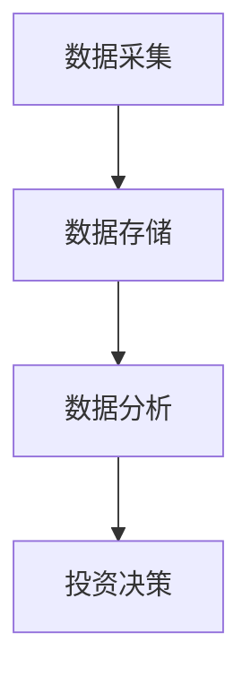
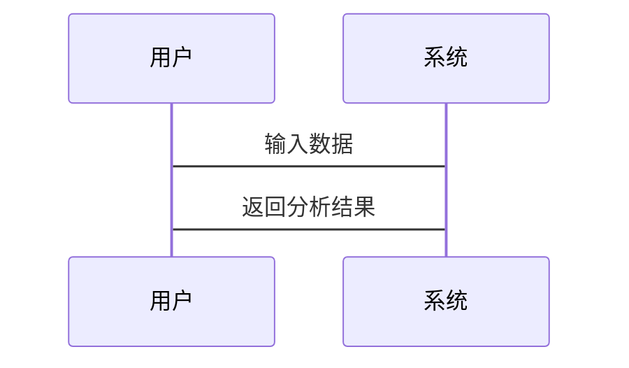

                 


# 巴菲特-芒格的可编程物质投资：纳米级材料科学的新前沿

## 关键词：
- 巴菲特投资理念
- 可编程物质
- 纳米材料科学
- 投资模型
- 纳米级材料
- 物质投资

## 摘要：
本文探讨了巴菲特和芒格的投资理念与纳米级材料科学的结合，特别是可编程物质在投资中的潜在应用。文章详细介绍了纳米材料的物理和化学性质，分析了其对投资策略的影响，并提出了基于纳米材料性能预测的投资模型。通过具体案例，展示了可编程物质在纳米级材料投资中的实际应用，并展望了该领域的未来发展方向。

---

# 第1章 巴菲特-芒格投资理念概述

## 1.1 巴菲特-芒格投资理念的核心思想

### 1.1.1 巴菲特的价值投资理论
巴菲特的价值投资理论强调长期投资、安全边际和企业内在价值。他主张寻找具有强大护城河、持续盈利能力的企业，并以合理的价格买入。

### 1.1.2 芒格的多元思维模型
芒格的多元思维模型强调通过多个学科的交叉应用来理解复杂问题。他主张投资者应该具备物理学、心理学、经济学等多个领域的知识，以避免认知偏差。

### 1.1.3 投资理念的现代发展
随着科技的进步，投资理念也在不断演变。传统的价值投资与现代科技的结合，特别是在材料科学领域的应用，为投资者提供了新的机会。

---

## 1.2 可编程物质的基本概念

### 1.2.1 可编程物质的定义
可编程物质是指可以通过编程手段改变其物理和化学性质的材料。这种材料可以通过纳米技术实现高度定制化，从而满足不同的应用需求。

### 1.2.2 可编程物质的物理特性
可编程物质具有以下物理特性：
- **尺寸效应**：纳米材料的尺寸对其物理性质（如强度、导电性）有显著影响。
- **表面效应**：纳米材料的表面积与体积比高，表面活性强。
- **量子效应**：纳米材料的电子性质受到量子效应的影响。

### 1.2.3 可编程物质的化学特性
可编程物质具有以下化学特性：
- **化学稳定性**：纳米材料可以通过表面修饰提高化学稳定性。
- **反应活性**：纳米材料具有较高的反应活性，可以用于催化反应。
- **催化性能**：纳米催化剂可以显著提高化学反应的效率。

---

## 1.3 纳米级材料科学的基本原理

### 1.3.1 纳米材料的基本性质
纳米材料是指尺寸在纳米尺度（1-100纳米）的材料。其基本性质包括：
- **高比表面积**：纳米材料的表面积与体积比高，具有较强的吸附能力。
- **量子效应**：纳米材料的电子性质受到量子效应的影响，表现出不同于宏观材料的特性。

### 1.3.2 纳米材料的制备方法
纳米材料的制备方法包括：
- **物理方法**：如机械球磨、溅射法等。
- **化学方法**：如溶胶-凝胶法、水热法等。
- **生物方法**：如利用生物分子自组装。

### 1.3.3 纳米材料的应用领域
纳米材料在多个领域有广泛应用：
- **电子领域**：如纳米电子器件、纳米传感器。
- **能源领域**：如纳米电池、纳米太阳能电池。
- **医学领域**：如纳米药物载体、纳米生物传感器。

---

## 1.4 巴菲特-芒格投资理念与纳米材料科学的结合

### 1.4.1 投资与科技的交叉点
巴菲特和芒格的投资理念与科技的结合，特别是在材料科学领域的应用，为投资者提供了新的视角。

### 1.4.2 可编程物质对投资的影响
可编程物质的出现，使得材料的性能可以通过编程手段进行优化，从而影响其市场价值。

### 1.4.3 纳米材料科学的新投资机会
纳米材料科学的发展，为投资者提供了新的投资机会，特别是在新能源、电子、医学等领域。

---

## 1.5 本章小结

本章介绍了巴菲特和芒格的投资理念，以及可编程物质的基本概念和纳米材料科学的基本原理。通过分析投资理念与纳米材料科学的结合，揭示了可编程物质在投资中的潜在应用。

---

# 第2章 可编程物质的物理与化学性质

## 2.1 纳米材料的物理性质

### 2.1.1 纳米材料的尺寸效应
纳米材料的尺寸对其物理性质有显著影响。例如，纳米级的金属材料具有更高的强度和导电性。

### 2.1.2 纳米材料的表面效应
纳米材料的表面积与体积比高，表面活性强，可以用于催化反应。

### 2.1.3 纳米材料的量子效应
纳米材料的电子性质受到量子效应的影响，表现出不同于宏观材料的特性。

---

## 2.2 纳米材料的化学性质

### 2.2.1 纳米材料的化学稳定性
纳米材料可以通过表面修饰提高化学稳定性，从而延长使用寿命。

### 2.2.2 纳米材料的反应活性
纳米材料具有较高的反应活性，可以用于催化反应。

### 2.2.3 纳米材料的催化性能
纳米催化剂可以显著提高化学反应的效率，降低反应成本。

---

## 2.3 可编程物质的可定制性

### 2.3.1 纳米材料的结构可调性
通过纳米技术，可以精确调控纳米材料的结构，从而实现性能优化。

### 2.3.2 纳米材料的性能可编程性
通过编程手段，可以改变纳米材料的物理和化学性质，满足不同的应用需求。

### 2.3.3 可编程物质的应用潜力
可编程物质在多个领域有广泛应用，特别是在电子、能源、医学等领域。

---

## 2.4 本章小结

本章详细介绍了纳米材料的物理和化学性质，以及可编程物质的可定制性。通过分析纳米材料的特性，揭示了其在投资中的潜在应用。

---

# 第3章 可编程物质在投资中的应用

## 3.1 纳米材料的市场价值评估

### 3.1.1 纳米材料的市场现状
当前，纳米材料在多个领域有广泛应用，市场需求不断增长。

### 3.1.2 纳米材料的未来发展趋势
随着技术的进步，纳米材料的应用领域将不断扩展，市场价值也将进一步提升。

### 3.1.3 纳米材料的市场风险与机会
纳米材料的投资风险包括技术风险、市场风险和政策风险。然而，其市场机会也巨大。

---

## 3.2 纳米材料企业的投资策略

### 3.2.1 企业核心竞争力分析
投资者需要评估企业的技术实力、研发能力和市场竞争力。

### 3.2.2 企业财务状况评估
投资者需要分析企业的财务状况，包括收入、利润、现金流等。

### 3.2.3 企业技术创新能力评估
投资者需要关注企业的技术创新能力，特别是其在纳米材料领域的研发投入。

---

## 3.3 可编程物质的投资模型构建

### 3.3.1 投资模型的基本框架
投资模型需要考虑纳米材料的性能、市场需求、企业能力和市场风险等因素。

### 3.3.2 模型的输入变量与输出结果
输入变量包括纳米材料的性能参数、市场需求预测、企业能力评估等；输出结果是投资价值评估。

### 3.3.3 模型的验证与优化
通过实际数据验证模型的准确性，并根据市场变化进行优化。

---

## 3.4 本章小结

本章探讨了纳米材料在投资中的应用，分析了企业的投资策略，并提出了可编程物质的投资模型。通过模型的构建，为投资者提供了新的投资思路。

---

# 第4章 纳米材料的性能预测与投资决策

## 4.1 纳米材料性能预测的数学模型

### 4.1.1 纳米材料性能的线性回归模型
通过线性回归模型，可以预测纳米材料的性能参数。

### 4.1.2 纳米材料性能的非线性回归模型
对于复杂的性能参数，可以采用非线性回归模型进行预测。

### 4.1.3 纳米材料性能的机器学习模型
通过机器学习算法，可以提高性能预测的准确性。

---

## 4.2 投资决策的算法原理

### 4.2.1 投资决策的逻辑流程
投资者需要根据纳米材料的性能预测、市场需求和企业能力等因素，做出投资决策。

### 4.2.2 投资决策的数学模型
通过数学模型，可以量化投资风险和收益，帮助投资者做出决策。

### 4.2.3 投资决策的验证与优化
通过实际数据验证投资模型的准确性，并根据市场变化进行优化。

---

## 4.3 本章小结

本章分析了纳米材料性能预测的数学模型，并探讨了投资决策的算法原理。通过模型的构建，为投资者提供了科学的投资依据。

---

# 第5章 系统分析与架构设计方案

## 5.1 问题场景介绍
投资者需要评估纳米材料的投资价值，需要一个系统化的解决方案。

## 5.2 系统功能设计

### 5.2.1 数据采集模块
负责采集纳米材料的性能数据、市场需求数据和企业能力数据。

### 5.2.2 数据分析模块
通过数据分析模块，对数据进行清洗、建模和预测。

### 5.2.3 投资决策模块
根据分析结果，生成投资建议和决策报告。

---

## 5.3 系统架构设计

### 5.3.1 系统架构图


### 5.3.2 系统接口设计
系统接口包括数据输入接口、数据输出接口和用户界面接口。

### 5.3.3 系统交互设计


---

## 5.4 本章小结

本章设计了纳米材料投资分析的系统架构，包括数据采集、数据分析和投资决策模块，并通过mermaid图展示了系统的架构和交互设计。

---

# 第6章 项目实战：纳米材料投资分析

## 6.1 环境安装

### 6.1.1 系统环境
需要安装Python、数据分析库（如Pandas、NumPy）和可视化库（如Matplotlib）。

### 6.1.2 数据采集工具
可以使用爬虫工具（如BeautifulSoup）采集纳米材料的相关数据。

---

## 6.2 核心实现源代码

### 6.2.1 数据清洗代码
```python
import pandas as pd

# 读取数据
data = pd.read_csv('nanomaterial.csv')

# 删除缺失值
data.dropna(inplace=True)

# 去重
data = data.drop_duplicates()
```

### 6.2.2 性能预测代码
```python
from sklearn.linear_model import LinearRegression

# 训练模型
model = LinearRegression()
model.fit(X_train, y_train)

# 预测结果
y_pred = model.predict(X_test)
```

### 6.2.3 投资决策代码
```python
import numpy as np

# 计算投资价值
value = np.dot(coefficients, features) + intercept
```

---

## 6.3 案例分析

### 6.3.1 案例背景
以锂电池材料为例，分析纳米材料的投资价值。

### 6.3.2 数据分析
通过数据分析，评估纳米材料的性能和市场需求。

### 6.3.3 投资决策
根据分析结果，生成投资建议和决策报告。

---

## 6.4 本章小结

本章通过具体的项目实战，展示了纳米材料投资分析的全过程，包括环境安装、数据采集、数据分析和投资决策。

---

# 第7章 未来展望与总结

## 7.1 未来展望
随着纳米材料技术的不断进步，可编程物质的投资潜力将更加巨大。

## 7.2 本章总结
本文探讨了巴菲特和芒格的投资理念与纳米材料科学的结合，特别是可编程物质在投资中的应用。通过详细分析纳米材料的物理和化学性质，构建了投资模型，并通过具体案例展示了其实际应用。

---

# 作者

作者：AI天才研究院/AI Genius Institute & 禅与计算机程序设计艺术/Zen And The Art of Computer Programming

---

**版权声明：本文版权归作者所有，未经授权不得转载。**

---

感谢您的阅读！希望本文对您理解巴菲特-芒格的可编程物质投资有所帮助！

