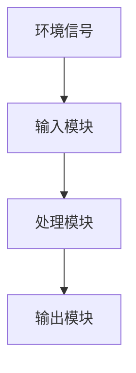

                 


# 巴菲特-芒格的合成生物学投资：创造生命的科技革命

## 关键词
- 合成生物学
- 巴菲特
- 芒格
- 投资策略
- 技术革命
- 生物工程
- 基因编辑

## 摘要
合成生物学作为一门新兴的交叉学科，正在改变我们对生命科学的理解和应用。本文探讨了巴菲特和芒格的投资理念如何应用于合成生物学领域，分析了这一科技革命的投资价值和未来潜力。通过详细的技术分析和案例研究，本文揭示了合成生物学的核心概念、算法原理和系统架构，为投资者提供了深入的见解和策略建议。

---

# 第一部分：合成生物学的背景与投资价值

## 第1章：合成生物学的定义与背景

### 1.1 合成生物学的定义与特点
合成生物学（Synthetic Biology）是结合生物学、工程学和信息科学的新兴领域，旨在通过设计和构建新的生物组件、装置和系统，来实现特定的生物功能。其核心特点包括：

- **工程化设计**：将生命视为可编程的系统，通过模块化设计和工程化方法进行改造。
- **自我复制**：生物系统能够自我复制和进化，具备自我修复能力。
- **多学科交叉**：融合了基因组学、生物化学、工程学和计算机科学等多个学科。

### 1.2 合成生物学的应用领域
合成生物学在多个领域展现出巨大潜力：

- **医药与健康**：开发新型药物、疫苗和生物治疗手段。
- **能源与环保**：生产生物燃料，分解污染物。
- **材料科学**：制造高性能生物材料。
- **农业**：改良作物品种，提高产量和抗逆性。

### 1.3 合成生物学的投资价值
合成生物学的创新性和广泛应用使其成为投资热点。随着技术的进步，其市场规模预计将以指数级增长，吸引了巴菲特和芒格等投资大师的关注。

---

# 第二部分：巴菲特与芒格的投资哲学

## 第2章：巴菲特与芒格的投资哲学

### 2.1 巴菲特的价值投资理念
巴菲特的价值投资理念强调长期价值和管理层信任：

- **长期价值**：关注企业的长期盈利能力，而非短期市场波动。
- **管理层信任**：选择具有优秀管理能力和诚信的企业。
- **安全边际**：投资时预留安全空间，降低风险。

### 2.2 芒格的多元思维模型
芒格的多元思维模型帮助投资者全面分析问题：

- **多维度分析**：将合成生物学与经济、技术和市场趋势结合起来分析。
- **决策框架**：通过跨学科视角评估投资机会。
- **风险管理**：识别潜在风险，制定应对策略。

---

# 第三部分：合成生物学的核心概念与联系

## 第3章：合成生物学的核心原理

### 3.1 基因编辑技术
基因编辑技术（如CRISPR-Cas9）是合成生物学的关键工具：

- **CRISPR-Cas9原理**：通过引导RNA与目标基因配对，切割DNA双链，实现基因编辑。
- **应用实例**：修复遗传疾病基因或增强作物抗病性。

### 3.2 生物设计与工程化
生物设计强调模块化和标准化：

- **模块化设计**：将生物系统分解为功能模块，便于组合和优化。
- **标准化组件**：制定通用生物模块标准，促进组件间的互操作性。

### 3.3 合成生物系统的自我复制与进化
合成生物系统具备自我复制和进化的特性：

- **自我复制机制**：系统能够自主复制，扩大产量。
- **进化能力**：在环境中不断优化，适应新条件。

---

# 第四部分：合成生物学的数学模型与算法原理

## 第4章：合成生物学的数学模型

### 4.1 基因调控网络的数学模型
基因调控网络通过数学模型描述基因表达的动态过程：

- **基因表达模型**：建立基因表达的数学方程，分析其随时间的变化。
  $$ \frac{dG}{dt} = \alpha - \beta G $$
- **反馈调节机制**：考虑正反馈和负反馈对基因表达的影响。

### 4.2 代谢路径优化的数学模型
代谢路径优化通过数学建模寻找最优解：

- **代谢通量分析**：建立代谢通量的数学模型，优化产量。
  $$ \text{最大化} \quad \sum_{i} c_i x_i $$
  $$ \text{受限于} \quad A x = b $$

---

# 第五部分：合成生物学的系统架构设计

## 第5章：系统架构设计

### 5.1 项目介绍
本项目旨在设计一个合成生物系统，用于生产特定代谢产物。

### 5.2 系统功能设计
系统功能包括：
- **输入模块**：接收环境信号。
- **处理模块**：处理信号，启动代谢路径。
- **输出模块**：生成代谢产物。

### 5.3 系统架构图
使用Mermaid绘制系统架构图：



### 5.4 实验设计
实验步骤包括：
1. 设计基因回路。
2. 构建重组质粒。
3. 转化宿主菌并诱导表达。

---

# 第六部分：项目实战

## 第6章：项目实战

### 6.1 环境安装
安装必要的软件和库：

- **Python**：用于数据分析。
- **CRISPR设计工具**：用于基因编辑设计。

### 6.2 核心代码实现
实现基因编辑的Python代码：

```python
def crissp-design(target_sequence):
    # 设计CRISPR引物
    guideRNA = target_sequence[0:20]
    return guideRNA

# 示例使用
target = "ATCGGTAAG"
print(crissp-design(target))
```

### 6.3 案例分析
案例：设计一个生物传感器，用于检测环境中的重金属。

### 6.4 实验结果与优化
分析实验数据，优化系统性能。

---

# 第七部分：最佳实践与总结

## 第7章：最佳实践与总结

### 7.1 投资策略
- **长期视角**：关注合成生物学的长期发展潜力。
- **风险管理**：评估技术、市场和政策风险。

### 7.2 未来趋势
合成生物学将在医药、能源等领域发挥更大作用。

### 7.3 小结
巴菲特和芒格的投资理念为合成生物学提供了独特的视角，投资者需结合技术与市场趋势，制定科学的投资策略。

---

# 结语
合成生物学作为一场科技革命，正在改变我们对生命的理解和应用。通过巴菲特和芒格的投资哲学，我们能够更好地把握这一领域的投资机会。未来，随着技术的进步，合成生物学将继续推动社会和经济的发展。

---

# 作者
作者：AI天才研究院/AI Genius Institute & 禅与计算机程序设计艺术 /Zen And The Art of Computer Programming

---

本文通过详细的技术分析和案例研究，探讨了合成生物学的投资价值和应用潜力，为投资者和科学家提供了宝贵的见解。

