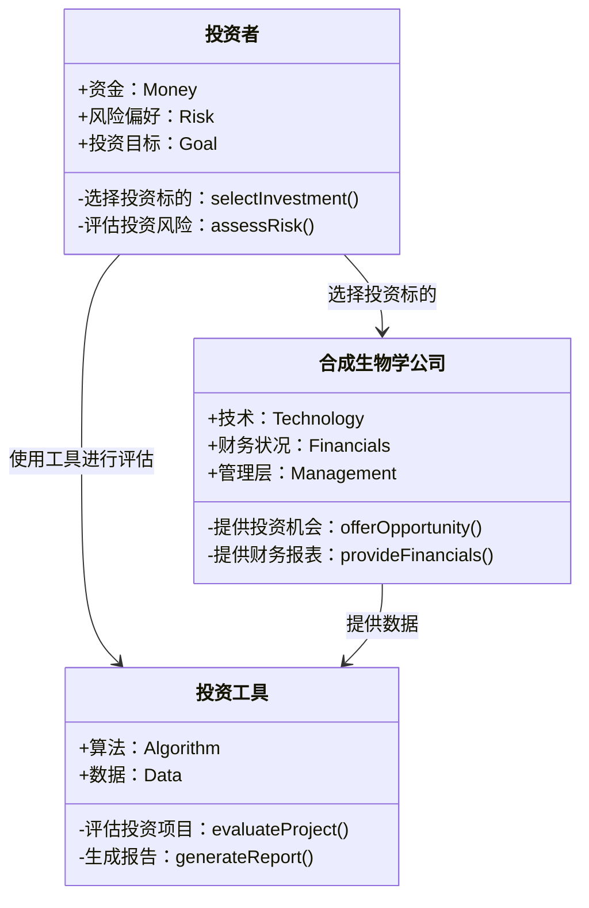
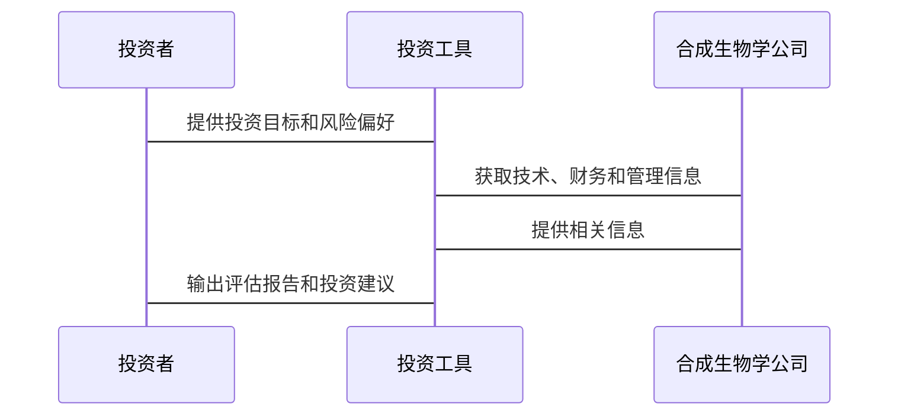

                 


# 巴菲特-芒格的合成生物学投资：重新定义生命科学

## 关键词：合成生物学，巴菲特，芒格，投资哲学，生命科学，数学模型，系统架构

## 摘要

本文探讨了巴菲特和芒格的投资哲学与合成生物学的结合，分析了合成生物学的投资逻辑、评估模型和风险管理策略。通过实际案例和数学模型，展示了如何将巴菲特-芒格的投资理念应用于合成生物学领域，以实现长期价值创造。

## 第1章 合成生物学与巴菲特-芒格投资哲学的背景介绍

### 1.1 合成生物学的基本概念

#### 1.1.1 合成生物学的定义

合成生物学是通过工程学原理设计和构建新的生物系统，或对现有生物系统进行重新设计。其目标是实现对生命系统的精确控制，以解决复杂问题。

#### 1.1.2 合成生物学的核心概念与研究领域

- **基因编辑**：CRISPR-Cas9、TALEN等技术用于精确修改基因组。
- **合成基因回路**：设计人工基因回路以实现特定功能。
- **生物制造**：利用微生物生产化学品、材料和药物。

#### 1.1.3 合成生物学的科学基础与技术特征

- **技术特征**：高度跨学科，涉及生物学、工程学和计算机科学。
- **研究领域**：医药、农业、工业生物技术。

### 1.2 巴菲特与芒格的投资哲学

#### 1.2.1 巴菲特的价值投资理念

- **长期价值**：寻找具有持续竞争优势的企业。
- **安全边际**：以低于内在价值的价格买入。

#### 1.2.2 芒格的多元思维模型

- **多学科思维**：将不同领域的知识整合，形成投资决策。
- **逆向思维**：寻找市场忽略的机会。

#### 1.2.3 巴菲特与芒格投资哲学的核心要素

- **企业护城河**：企业竞争优势的持久性。
- **管理层质量**：管理层的诚信与能力。

### 1.3 巴菲特-芒格投资哲学与合成生物学的结合

#### 1.3.1 合成生物学的商业潜力

- **医药**：合成药物、疫苗。
- **农业**：改良作物，提高产量。
- **工业**：生产生物基材料，减少对化石燃料的依赖。

#### 1.3.2 巴菲特-芒格投资哲学在合成生物学领域的适用性

- **长期视角**：合成生物学项目周期长，适合长期投资。
- **竞争优势**：寻找具有技术壁垒的企业。

#### 1.3.3 合成生物学投资的未来趋势

- **技术进步**：基因编辑和生物制造技术的持续进步。
- **市场扩展**：合成生物学在更多领域的应用。

## 第2章 合成生物学的核心概念与投资逻辑

### 2.1 合成生物学的科学基础

#### 2.1.1 基因编辑技术（如CRISPR）

- **CRISPR-Cas9**：允许科学家精确编辑基因组。
- **应用**：疾病治疗、农业改良。

#### 2.1.2 合成基因回路的设计与优化

- **基因回路**：由多个基因组成，用于实现特定功能。
- **优化**：提高回路的稳定性和效率。

#### 2.1.3 合成生物学在医药、农业和工业中的应用

- **医药**：生产药物，如胰岛素。
- **农业**：改良作物抗病性。
- **工业**：生产生物基塑料。

### 2.2 巴菲特-芒格投资逻辑的核心要素

#### 2.2.1 企业的护城河分析

- **技术壁垒**：企业拥有的专利和技术优势。
- **市场准入**：企业进入市场的难易程度。

#### 2.2.2 企业的财务健康状况

- **盈利能力**：企业是否能够持续盈利。
- **财务杠杆**：企业债务水平。

#### 2.2.3 企业的管理团队与文化

- **管理层质量**：管理层的诚信和能力。
- **企业文化**：企业是否鼓励创新和持续改进。

### 2.3 合成生物学企业的投资评估模型

#### 2.3.1 企业的技术壁垒评估

- **技术独特性**：技术是否独特，难以被复制。
- **技术成熟度**：技术是否经过验证，是否可以大规模应用。

#### 2.3.2 企业的市场竞争力分析

- **市场份额**：企业在市场中的份额。
- **竞争对手分析**：主要竞争对手的技术和市场地位。

#### 2.3.3 企业的长期价值评估

- **未来收益**：企业未来几年的预期收益。
- **行业发展趋势**：行业未来的发展方向和潜力。

## 第3章 巴菲特-芒格投资策略在合成生物学中的应用

### 3.1 投资标的筛选标准

#### 3.1.1 企业的技术创新能力

- **研发投入**：企业是否投入足够的研发资源。
- **研发成果**：企业是否有显著的研发成果，如专利数量。

#### 3.1.2 企业的商业模式可行性

- **商业模式**：企业的盈利模式是否可行。
- **市场定位**：企业在市场中的定位是否清晰。

#### 3.1.3 企业的市场前景与规模潜力

- **市场规模**：市场的大小和增长潜力。
- **市场进入障碍**：进入市场的难易程度。

### 3.2 投资组合的构建与风险管理

#### 3.2.1 投资组合的多元化策略

- **分散投资**：将资金分散投资于不同的企业或项目，降低风险。
- **行业分散**：投资于不同的行业，避免因某一行业波动影响整体投资。

#### 3.2.2 风险管理与退出机制

- **风险管理**：识别和评估投资中的各种风险，制定应对策略。
- **退出机制**：确定在什么情况下退出投资，以实现收益或减少损失。

#### 3.2.3 合成生物学投资的长期性与波动性

- **长期性**：合成生物学项目通常需要较长时间才能见到成果。
- **波动性**：由于技术不确定性和市场波动，投资回报可能波动较大。

### 3.3 投资案例分析

#### 3.3.1 巴菲特与芒格的经典投资案例

- **可口可乐**：巴菲特长期投资可口可乐，因其强大的品牌和分销网络。
- **富国银行**：芒格投资富国银行，因其在金融领域的领先地位。

#### 3.3.2 合成生物学领域的投资成功案例

- **Moderna**：投资于其mRNA技术平台，用于疫苗和药物开发。
- **Gilead Sciences**：投资于其抗病毒药物研发。

#### 3.3.3 投资失败的教训与经验总结

- **失败案例**：某些合成生物学企业的技术未能商业化，或市场接受度低。
- **教训**：技术可行性、市场需求和管理层能力是投资的关键因素。

## 第4章 合成生物学投资的数学模型与算法分析

### 4.1 投资评估的数学模型

#### 4.1.1 净现值（NPV）模型

净现值是指将未来现金流按Discount Rate折现到现值，减去初始投资。公式：

$$ NPV = \sum_{t=1}^{n} \frac{CF_t}{(1 + r)^t} - Initial Investment $$

其中，CF_t是第t年的现金流，r是折现率，n是项目寿命。

#### 4.1.2 内部收益率（IRR）模型

内部收益率是指使净现值为零的折现率。公式：

$$ NPV = \sum_{t=1}^{n} \frac{CF_t}{(1 + IRR)^t} - Initial Investment = 0 $$

#### 4.1.3 投资回收期

投资回收期是指收回初始投资所需的时间。计算公式：

$$ 回收期 = \frac{Initial Investment}{Annual Cash Inflow} $$

### 4.2 投资组合的风险管理与优化

#### 4.2.1 风险评估与量化

使用方差和标准差衡量投资风险。公式：

$$ \sigma = \sqrt{\sum_{i=1}^{n} (x_i - \mu)^2 / N} $$

其中，σ是标准差，x_i是各观测值，μ是平均值，N是观测数。

#### 4.2.2 资产配置优化

使用现代投资组合理论（MPT）进行资产配置优化，以最小化风险或最大化收益。

### 4.3 投资决策的算法分析

#### 4.3.1 简单线性回归模型

用于预测未来现金流。公式：

$$ y = a + b x + \epsilon $$

其中，y是因变量，x是自变量，a是截距，b是斜率，ε是误差项。

#### 4.3.2 风险调整后的回报评估

使用夏普比率衡量风险调整后的回报。公式：

$$ 夏普比率 = \frac{E[r_p] - r_f}{\sigma_p} $$

其中，E[r_p]是投资组合的预期回报，r_f是无风险利率，σ_p是投资组合的标准差。

## 第5章 合成生物学投资的系统分析与架构设计方案

### 5.1 系统分析

#### 5.1.1 问题场景介绍

合成生物学投资涉及技术、市场、财务等多个因素，需要系统性分析。

#### 5.1.2 项目介绍

假设我们投资一家合成生物学公司，目标是开发一种新型生物燃料。

### 5.2 系统架构设计

#### 5.2.1 领域模型（Mermaid类图）



### 5.3 系统架构设计（Mermaid架构图）


### 5.4 系统接口设计

- **投资者接口**：接收投资目标和风险偏好，输出投资建议。
- **公司接口**：提供财务和管理信息，输出投资机会。
- **工具接口**：接收数据和目标，输出评估结果。

### 5.5 系统交互（Mermaid序列图）



## 第6章 项目实战：合成生物学投资的决策过程与代码实现

### 6.1 项目环境安装

- **工具安装**：安装Python、Pandas、NumPy、Matplotlib等工具。
- **数据获取**：获取目标公司的财务数据和技术信息。

### 6.2 系统核心实现源代码

#### 6.2.1 净现值计算代码

```python
def calculate_npv(cash_flows, discount_rate):
    npv = 0
    for year, cash_flow in enumerate(cash_flows):
        if year == 0:
            npv += cash_flow
        else:
            npv += cash_flow / (1 + discount_rate) ** year
    return npv

# 示例数据
cash_flows = [ -100, 30, 30, 30, 30 ]
discount_rate = 0.10

npv = calculate_npv(cash_flows, discount_rate)
print(f"净现值：{npv}")
```

#### 6.2.2 内部收益率计算代码

```python
def calculate_irr(cash_flows):
    from scipy.optimize import minimize
    def npv(r):
        return sum(cf / (1 + r)**t for t, cf in enumerate(cash_flows))
    res = minimize(lambda r: -npv(r), 0.1)
    return res.x[0]

irr = calculate_irr([ -100, 30, 30, 30, 30 ])
print(f"内部收益率：{irr}")
```

### 6.3 代码应用解读与分析

- **净现值计算**：用于评估投资项目的盈利能力。
- **内部收益率计算**：用于评估项目的吸引力。

### 6.4 投资决策过程与分析

- **环境分析**：分析行业趋势和政策环境。
- **技术评估**：评估公司的技术优势和可行性。
- **财务分析**：分析公司的财务状况和盈利能力。
- **投资建议**：综合以上分析，提出投资建议。

### 6.5 项目小结

- **成功因素**：准确的数据收集、合理的模型构建、全面的风险管理。
- **挑战与解决方案**：技术不确定性、市场需求预测难，通过多元化投资和严格筛选降低风险。

## 第7章 总结与展望

### 7.1 总结

本文探讨了巴菲特和芒格的投资哲学与合成生物学的结合，分析了合成生物学的投资逻辑、评估模型和风险管理策略。通过实际案例和数学模型，展示了如何将巴菲特-芒格的投资理念应用于合成生物学领域，以实现长期价值创造。

### 7.2 未来展望

随着合成生物学技术的不断进步和应用领域的扩展，其投资价值将更加显著。未来，投资者需要更加关注技术发展、市场需求和企业创新能力，以抓住合成生物学带来的投资机会。

## 作者：AI天才研究院/AI Genius Institute & 禅与计算机程序设计艺术/Zen And The Art of Computer Programming

---

**注意事项**：

1. 以上代码需要安装必要的Python库，如scipy、pandas、numpy、matlibplot。
2. 代码仅为示例，实际应用需根据具体数据进行调整。
3. 投资有风险，本文内容仅供参考，具体投资决策需谨慎。

