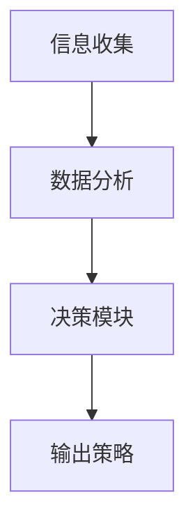

                 

# 巴菲特-芒格的后疫情时代投资策略：适应新常态

> 关键词：巴菲特、芒格、投资策略、后疫情时代、风险管理、价值投资

> 摘要：本文探讨了巴菲特和芒格在后疫情时代的投资策略调整，分析了他们如何通过价值投资和风险管理适应新常态，提供了数学模型和系统架构设计的详细解读，并结合实际案例进行分析，最后总结了最佳实践和投资经验。

---

## 第一部分：背景介绍

### 第1章：疫情对全球经济与投资的影响

#### 1.1 疫情对全球经济的影响
- 1.1.1 疫情对供应链的冲击：全球供应链中断导致生产成本上升和交货时间延长。
- 1.1.2 疫情对消费习惯的影响：线上消费激增，远程办公普及，传统行业受到冲击。
- 1.1.3 疫情对金融市场的冲击：股市波动加剧，投资者信心受挫。

#### 1.2 投资策略在疫情前后的变化
- 1.2.1 疫情前的投资策略特点：注重短期收益，风险偏好较高。
- 1.2.2 疫情后投资策略的转变：更注重长期价值，风险厌恶增加。
- 1.2.3 投资者行为的变化：从盲目跟风转向理性分析。

#### 1.3 巴菲特和芒格的投资理念演变
- 1.3.1 巴菲特的价值投资理念：寻找具有持续竞争优势的企业，注重企业的内在价值。
- 1.3.2 芒格的多元思维模型：强调跨学科思考，避免情绪化决策。
- 1.3.3 疫情对两人投资理念的影响：更加注重企业的现金流和抗风险能力。

---

## 第二部分：核心概念与联系

### 第2章：价值投资的深化

#### 2.1 价值投资的内涵与外延
- 2.1.1 价值投资的核心要素：企业内在价值、市场情绪、安全边际。
- 2.1.2 价值投资与疫情的结合：疫情加速了企业分化，优质企业更具投资价值。
- 2.1.3 价值投资的长期视角：关注企业的长期竞争优势，而非短期波动。

#### 2.2 投资组合优化

---

## 第三部分：算法原理讲解

### 第3章：价值评估模型

#### 3.1 DCF模型的数学公式
$$DCF = \sum_{t=1}^{n} \frac{CF_t}{(1 + r)^t} + \frac{TV}{(1 + r)^n}$$
其中，CF_t为第t年的现金流，r为折现率，TV为终值。

#### 3.2 疫情后DCF模型的调整
- 调整现金流预测：考虑疫情对企业收入的影响。
- 调整折现率：在高不确定性环境下，适当提高折现率。

---

## 第四部分：系统分析与架构设计

### 第4章：投资决策系统架构

#### 4.1 系统功能设计
- 信息收集模块：实时获取市场数据和企业财务报表。
- 数据分析模块：运用数学模型进行估值和风险评估。
- 投资决策模块：基于分析结果制定投资策略。

#### 4.2 系统架构设计

---

## 第五部分：项目实战

### 第5章：疫情期间的投资策略调整

#### 5.1 疫情期间的投资组合调整
- 减少高风险资产配置，增加防御性资产。
- 买入优质企业股票，长期持有。

#### 5.2 实际案例分析
- 案例1：疫情期间投资亚马逊，分析其现金流和竞争优势。
- 案例2：疫情期间投资苹果，分析其市场地位和技术创新。

---

## 第六部分：最佳实践与总结

### 第6章：总结与展望

#### 6.1 投资策略的优化建议
- 坚持价值投资，注重企业的内在价值。
- 加强风险管理，分散投资组合。

#### 6.2 未来展望
- 疫情后的经济复苏将带来新的投资机会。
- 数字化转型和科技创新将成为投资的重点领域。

---

## 作者

作者：AI天才研究院/AI Genius Institute & 禅与计算机程序设计艺术 /Zen And The Art of Computer Programming

