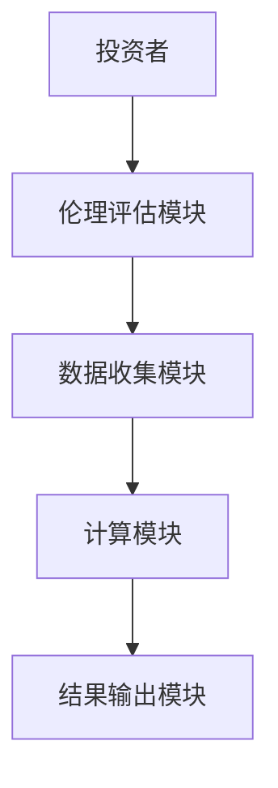

                 


# 巴菲特-芒格的太空资源开发伦理投资：探索与保护的平衡

> 关键词：巴菲特, 芮格, 太空资源, 伦理投资, 探索与保护, 平衡

> 摘要：本文探讨了巴菲特和芒格的价值投资理念在太空资源开发中的应用，分析了如何在探索太空资源的同时实现保护与投资的平衡。通过构建伦理投资模型，本文提出了在太空资源开发中实现经济价值与社会伦理兼顾的策略。

---

## 第一部分：巴菲特-芒格投资哲学与太空资源开发的结合

### 第1章：巴菲特-芒格投资哲学概述

#### 1.1 巴菲特-芒格投资哲学的核心理念

##### 1.1.1 价值投资的定义与核心要素
价值投资是一种以内在价值为导向的投资策略，强调以低于内在价值的价格购买优质资产。其核心要素包括：
- **安全边际**：购买价格低于内在价值，以降低风险。
- **长期视角**：关注企业的长期盈利能力。
- **企业质量**：选择具有强大竞争优势的企业。

##### 1.1.2 巴菲特-芒格投资策略的独特性
芒格的多元思维模型强调跨学科思考，将物理学、心理学、经济学等领域的知识融入投资决策中。巴菲特的价值投资策略则注重企业的财务健康和管理层素质。

##### 1.1.3 投资哲学与太空资源开发的关联
太空资源开发涉及巨大的技术挑战和高昂的投资成本，巴菲特和芒格的投资哲学为投资者提供了在高风险、高回报的领域中做出理性决策的框架。

---

#### 1.2 巴菲特-芒格的价值投资原则

##### 1.2.1 投资的三大核心原则
1. **安全边际**：确保投资价格远低于内在价值。
2. **长期思维**：关注企业的长期盈利能力。
3. **避免风险**：远离高风险、低确定性的投资。

##### 1.2.2 芮格的多元思维模型
芒格的多元思维模型通过跨学科的思考，帮助投资者全面评估企业的潜在风险和机会，特别是在太空资源开发中，需要考虑技术、法律和伦理等多个方面。

##### 1.2.3 长期投资与安全边际的重要性
长期投资策略适合太空资源开发的高风险、高回报特性，而安全边际则确保在高风险投资中降低潜在损失。

---

### 第2章：太空资源开发的背景与挑战

#### 2.1 太空资源开发的现状

##### 2.1.1 太空资源的定义与分类
太空资源包括 asteroid 矿物、月球土壤和太阳系其他天体的资源。这些资源可能包含稀有金属和矿物，具有巨大的经济价值。

##### 2.1.2 当前太空资源开发的主要参与者
主要参与者包括政府机构（如 NASA）、私营公司（如 SpaceX、Blue Origin）和国际组织。私营公司的参与为太空资源开发注入了市场化的活力。

##### 2.1.3 太空资源开发的技术与经济挑战
技术挑战包括发射成本高昂、资源开采难度大；经济挑战则涉及初期投资大、回报周期长。

---

#### 2.2 太空资源开发的伦理问题

##### 2.2.1 资源开发中的环境伦理
太空资源开发可能对地球环境产生间接影响，例如火箭发射导致的污染和轨道碎片问题。

##### 2.2.2 民族与国家利益的平衡
太空资源开发涉及多个国家和企业的利益，如何平衡各方利益是一个复杂的伦理问题。

##### 2.2.3 太空资源开发的法律框架
国际法和多边协议（如《外空条约》）为太空资源开发提供了法律基础，但具体实施仍存在争议。

---

## 第二部分：太空资源开发的伦理投资框架

### 第3章：伦理投资的核心模型与工具

#### 3.1 伦理投资的定义与分类

##### 3.1.1 伦理投资的定义
伦理投资是一种将社会、环境和治理（ESG）因素纳入投资决策的投资策略。

##### 3.1.2 不同类型的伦理投资模式
- **负面筛选**：排除不符合伦理标准的企业。
- **正面筛选**：选择符合伦理标准的企业。
- **股东 activism**：通过股东权利推动企业改进。

##### 3.1.3 伦理投资的核心要素
包括企业治理、环境保护、社会责任和公司治理等方面。

---

#### 3.2 巴菲特-芒格伦理投资模型

##### 3.2.1 投资决策的三要素模型
芒格的多元思维模型将伦理因素纳入投资决策，提出：
1. 企业的社会影响；
2. 企业的环境责任；
3. 企业的治理结构。

##### 3.2.2 伦理评估的指标体系
包括企业治理评分、环境影响评分和社会责任评分。

##### 3.2.3 模型的数学表达式
$$ E = \alpha \cdot V + \beta \cdot S + \gamma \cdot G $$
其中，E为伦理评估得分，V为价值因素，S为社会影响因素，G为治理因素，$\alpha, \beta, \gamma$为权重系数。

---

### 第4章：太空资源开发的伦理评估指标

#### 4.1 伦理评估指标的设计原则

##### 4.1.1 可操作性原则
指标应易于数据收集和计算。

##### 4.1.2 客观性原则
指标应基于客观数据，避免主观偏见。

##### 4.1.3 综合性原则
指标应综合反映企业各方面的伦理表现。

---

#### 4.2 伦理评估指标的具体内容

##### 4.2.1 企业的环境影响
包括资源消耗、碳排放和污染程度。

##### 4.2.2 企业的社会责任
包括员工权益、社区贡献和透明度。

##### 4.2.3 企业的治理结构
包括董事会构成、管理层薪酬和股东权利。

---

## 第三部分：太空资源开发的伦理投资实践

### 第5章：系统架构与技术实现

#### 5.1 项目管理与系统架构

##### 5.1.1 项目管理流程
包括需求分析、项目计划、资源分配和风险控制。

##### 5.1.2 系统架构设计
使用 Mermaid 绘制系统架构图，展示各模块之间的交互关系。



---

#### 5.2 技术实现与算法原理

##### 5.2.1 算法原理
使用 Python 编写伦理评估算法，计算企业伦理得分。

```python
def calculate_ethics_score(enterprise):
    score = 0
    # 环境影响评分
    score += enterprise.environment_impact * 0.3
    # 社会责任评分
    score += enterprise.social Responsibility * 0.3
    # 治理评分
    score += enterprise.governance * 0.4
    return score
```

---

## 第四部分：项目实战与案例分析

### 第6章：项目实战

#### 6.1 环境安装

##### 6.1.1 Python 环境安装
使用 Anaconda 安装 Python 和相关库（如 pandas、numpy）。

##### 6.1.2 数据收集工具
使用爬虫工具收集企业的环境、社会和治理数据。

---

#### 6.2 核心实现

##### 6.2.1 伦理评估模块实现
编写 Python 函数，根据企业数据计算伦理得分。

```python
def compute_ethics_score(environment, social, governance):
    return environment * 0.3 + social * 0.3 + governance * 0.4
```

---

#### 6.3 实际案例分析

##### 6.3.1 案例背景
选择一家私营太空公司，分析其伦理得分。

##### 6.3.2 数据分析与结果解读
通过数据分析，评估该公司的环境、社会和治理表现。

---

### 第7章：结论与未来展望

#### 7.1 结论

##### 7.1.1 主要观点总结
通过构建伦理投资模型，可以在太空资源开发中实现经济价值与社会伦理的平衡。

##### 7.1.2 未来研究方向
进一步完善伦理评估模型，探索更多应用场景。

---

## 作者

作者：AI天才研究院/AI Genius Institute & 禅与计算机程序设计艺术 /Zen And The Art of Computer Programming

---

通过以上结构和内容，文章详细探讨了巴菲特和芒格的投资哲学在太空资源开发中的应用，构建了伦理投资模型，并通过具体案例分析展示了如何在探索与保护之间实现平衡。

