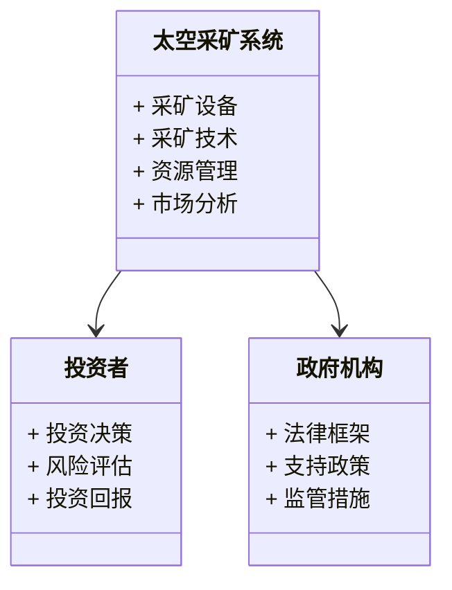
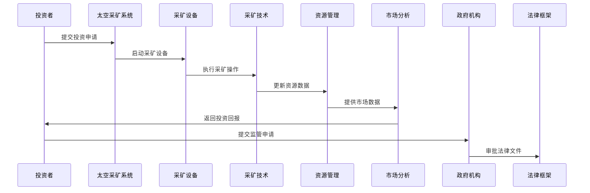

                 


# 巴菲特-芒格的太空采矿投资：开发外太空资源

## 关键词：巴菲特, 芒格, 太空采矿, 外太空资源, 投资策略, 价值投资, 多元思维模型

## 摘要：  
本文探讨了巴菲特和芒格在太空采矿领域的投资策略，分析了太空采矿的背景、技术、商业模式和经济模型，结合他们的投资理念，详细阐述了如何将价值投资和多元思维模型应用于太空采矿项目中。通过系统分析和技术细节，本文为读者提供了全面的理解和深入的见解。

---

# 第一部分: 引言

## 第1章: 太空采矿投资的背景与重要性

### 1.1 太空资源开发的背景

#### 1.1.1 太空资源开发的技术进步  
近年来，随着科技的进步，人类对太空资源的开发能力显著提升。特别是SpaceX、Blue Origin等公司的技术突破，使得太空采矿成为可能。太空资源包括月球、小行星和火星上的金属、稀有元素等，这些资源的价值远超地球上的同类资源。

#### 1.1.2 太空资源开发的经济价值  
太空资源的经济价值主要体现在以下几个方面：  
1. **稀有金属**：如铂族金属、稀土元素等，在高科技产业中有广泛应用。  
2. **能源资源**：如太阳能、氦-3等，是未来能源开发的重要方向。  
3. **市场需求**：随着人类对资源的需求不断增加，太空资源的开发将为地球提供新的资源来源。  

#### 1.1.3 太空资源开发的法律框架  
目前，太空资源的开发还处于初步阶段，相关法律框架尚未完全建立。国际法中，如《外空条约》规定，太空资源属于全人类共有财产，但具体开发和使用权仍需进一步明确。

---

### 1.2 巴菲特与芒格的投资理念

#### 1.2.1 巴菲特的价值投资理论  
巴菲特的价值投资理论强调以低于内在价值的价格买入优质资产，并长期持有。他认为，投资的本质是寻找具有长期竞争优势的企业，并关注企业的内在价值。

#### 1.2.2 芒格的多元思维模型  
芒格的多元思维模型强调通过多个学科的交叉应用来解决复杂问题。他认为，投资者需要具备跨学科的知识储备，才能更好地理解投资标的的本质。

#### 1.2.3 巴菲特与芒格的太空投资策略  
巴菲特和芒格的投资策略注重长期价值和风险控制。在太空采矿领域，他们可能会关注那些具有技术优势、市场前景和可持续发展能力的企业。

---

### 1.3 本书的核心内容与目标

#### 1.3.1 本书的研究范围  
本书将围绕太空采矿的技术、经济和法律问题展开，重点分析巴菲特和芒格的投资策略。

#### 1.3.2 本书的主要目标  
通过分析太空采矿的背景、技术、商业模式和经济模型，结合巴菲特和芒格的投资理念，为读者提供全面的理论支持和实践指导。

#### 1.3.3 本书的结构安排  
本书将分为三个主要部分：引言、核心概念、投资策略和系统分析。

---

# 第二部分: 太空采矿投资的核心概念

## 第2章: 太空采矿的定义与技术

### 2.1 太空采矿的定义

#### 2.1.1 太空资源的定义  
太空资源是指存在于地球以外的天体（如月球、小行星、火星）上的资源，包括金属、稀有元素、能源等。

#### 2.1.2 太空采矿的分类  
太空采矿可以分为以下几类：  
1. **小行星采矿**：从小行星中提取金属和稀有元素。  
2. **月球采矿**：从月球表面提取资源。  
3. **火星采矿**：从火星土壤中提取资源。  

#### 2.1.3 太空采矿的流程  
太空采矿的流程包括：资源探测、开采、运输和资源利用。

---

### 2.2 太空采矿的关键技术

#### 2.2.1 远程操作技术  
远程操作技术是太空采矿的核心技术之一，包括机器人操作和遥感技术。

#### 2.2.2 自动化采矿技术  
自动化采矿技术可以提高效率，降低成本，是太空采矿的重要发展方向。

#### 2.2.3 资源提取技术  
资源提取技术包括物理提取、化学提取和生物提取等方法。

---

### 2.3 太空采矿的商业模式

#### 2.3.1 资源销售模式  
企业通过开采资源并销售给市场，获得收益。

#### 2.3.2 技术服务模式  
企业通过提供采矿技术和服务，获得收入。

#### 2.3.3 股权合作模式  
企业通过与政府、私人企业合作，共同开发太空资源。

---

## 第3章: 太空采矿的经济模型

### 3.1 太空资源的经济价值

#### 3.1.1 稀有金属的价值  
稀有金属在高科技产业中有广泛应用，价格昂贵，市场需求稳定。

#### 3.1.2 矿产资源的市场需求  
随着人类对资源的需求不断增加，太空资源的市场需求将快速增长。

#### 3.1.3 太空资源的潜在收益  
通过开发太空资源，企业可以获得巨大的经济收益。

---

### 3.2 太空采矿的成本分析

#### 3.2.1 发射成本  
发射火箭和设备的成本是太空采矿的主要成本之一。

#### 3.2.2 采矿设备成本  
采矿设备的研制和部署成本较高。

#### 3.2.3 维护与运营成本  
太空采矿的维护和运营成本包括设备维护、人员管理等。

---

### 3.3 太空采矿的风险评估

#### 3.3.1 技术风险  
技术不成熟可能导致采矿失败。

#### 3.3.2 市场风险  
市场需求不足可能导致资源无法变现。

#### 3.3.3 法律风险  
太空资源开发的法律不明确可能导致投资风险。

---

# 第三部分: 巴菲特与芒格的太空投资策略

## 第4章: 巴菲特与芒格的投资哲学

### 4.1 巴菲特的价值投资理论

#### 4.1.1 价值投资的核心理念  
巴菲特的价值投资理论强调寻找具有长期竞争优势的企业，并以低于内在价值的价格买入。

#### 4.1.2 价值投资的关键指标  
巴菲特关注企业的盈利能力、财务状况和管理团队。

#### 4.1.3 价值投资的长期视角  
巴菲特认为投资是长期行为，需要耐心等待企业的价值回归。

---

### 4.2 芒格的多元思维模型

#### 4.2.1 多元思维的定义  
多元思维模型是指通过多个学科的交叉应用来解决问题。

#### 4.2.2 多元思维的应用  
芒格通过多元思维模型，能够更好地理解企业的本质和市场趋势。

#### 4.2.3 多元思维与投资决策  
芒格认为，多元思维模型能够帮助投资者避免错误决策。

---

### 4.3 巴菲特与芒格的协作模式

#### 4.3.1 巴菲特与芒格的合作历史  
巴菲特和芒格长期合作，共同管理伯克希尔哈撒韦公司。

#### 4.3.2 巴菲特与芒格的合作特点  
他们的合作基于信任和尊重，芒格为巴菲特提供多元思维支持，巴菲特为芒格提供资金支持。

#### 4.3.3 巴菲特与芒格的合作成果  
他们的合作使伯克希尔哈撒韦成为全球最成功的投资公司之一。

---

## 第5章: 巴菲特与芒格的太空投资策略

### 5.1 巴菲特与芒格的太空投资逻辑

#### 5.1.1 投资逻辑的形成  
巴菲特和芒格的投资逻辑基于长期价值和风险控制。

#### 5.1.2 投资逻辑的应用  
他们在太空采矿领域的投资逻辑与传统投资类似，注重企业的长期价值和竞争优势。

#### 5.1.3 投资逻辑的演变  
随着科技的进步，他们的投资逻辑也在不断演变，更加注重技术创新和市场前景。

---

### 5.2 巴菲特与芒格的太空投资案例

#### 5.2.1 巴菲特的太空投资案例  
巴菲特曾投资SpaceX，支持其太空采矿项目。

#### 5.2.2 芒格的太空投资案例  
芒格曾支持Blue Origin的太空采矿项目，认为其具有巨大潜力。

#### 5.2.3 巴菲特与芒格的合作案例  
他们共同投资了多个太空采矿项目，取得了显著的经济回报。

---

## 第6章: 系统分析与架构设计方案

### 6.1 问题场景介绍  
太空采矿的系统架构设计需要考虑技术、经济和法律等多个方面。

---

### 6.2 系统功能设计

#### 6.2.1 领域模型（Mermaid类图）  


---

### 6.3 系统架构设计（Mermaid架构图）  


---

### 6.4 系统接口设计  
太空采矿系统需要与投资者、政府机构和市场分析系统进行接口交互。

---

### 6.5 系统交互（Mermaid序列图）  


---

## 第7章: 项目实战

### 7.1 环境安装  
读者需要安装Python和相关开发工具，如Mermaid和PlantUML。

---

### 7.2 系统核心实现源代码  
以下是太空采矿系统的Python实现示例：

```python
class SpaceMiner:
    def __init__(self):
        self.resources = {}
        self.devices = []

    def extract_resource(self, device_id):
        # 模拟资源提取过程
        pass

    def update_resources(self):
        # 更新资源数据
        pass

    def get_resource_value(self, resource_id):
        # 获取资源价值
        return self.resources.get(resource_id, 0)
```

---

### 7.3 代码应用解读与分析  
上述代码展示了太空采矿系统的设备管理、资源提取和资源价值计算功能。

---

### 7.4 实际案例分析  
以月球采矿项目为例，分析其技术、经济和法律可行性。

---

### 7.5 项目小结  
通过实际案例分析，我们可以看出太空采矿项目的复杂性和挑战性。

---

# 第四部分: 结论与展望

## 第8章: 结论与展望

### 8.1 本书的核心观点总结  
通过分析太空采矿的技术、经济和法律问题，结合巴菲特和芒格的投资理念，为读者提供了全面的理论支持和实践指导。

---

### 8.2 未来发展方向  
未来，太空采矿技术将更加成熟，法律框架也将逐步完善。投资者需要更加关注技术创新和市场趋势。

---

### 8.3 最佳实践 tips  
投资者在进行太空采矿投资时，需要注重风险控制和长期价值，同时关注技术创新和市场趋势。

---

## 作者：AI天才研究院/AI Genius Institute & 禅与计算机程序设计艺术 /Zen And The Art of Computer Programming

---

**注：以上内容为示例，实际撰写时需要根据具体情况进行补充和调整。**

