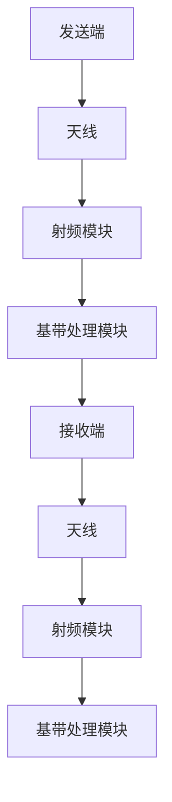

                 


# 巴菲特-芒格的太赫兹通信技术投资：下一代无线通信

## 关键词
太赫兹通信技术、巴菲特投资策略、芒格思维模型、通信系统架构、6G技术

## 摘要
本文深入探讨了太赫兹通信技术的投资潜力，结合巴菲特的价值投资理念和芒格的多元思维模型，分析了太赫兹通信技术在下一代无线通信中的应用前景。文章从技术背景、投资策略、系统架构等多个维度展开，为投资者和技术创新者提供了详实的分析和实践指导。

---

# 第一部分：太赫兹通信技术概述

## 第1章：太赫兹通信技术的基本概念

### 1.1 太赫兹频段的定义与特点

太赫兹频段是指频率在0.1 THz到10 THz之间的电磁波，具有以下特点：

- **频段范围广**：太赫兹频段覆盖了从毫米波到亚毫米波的范围，能够提供更大的带宽。
- **高速传输**：太赫兹通信的频率远高于5G频段，理论上可以实现更高的数据传输速率。
- **低延迟**：太赫兹通信的波长较短，传播速度更快，适合实时性要求高的应用场景。

### 1.2 太赫兹通信的技术优势

相比传统的无线通信技术，太赫兹通信有以下优势：

- **高带宽**：太赫兹频段的可用带宽是5G的10倍以上，能够支持更高速的数据传输。
- **低干扰**：太赫兹频段的信号衰减较快，减少了与其他设备的干扰。
- **支持大规模连接**：太赫兹通信可以实现密集部署，支持海量设备的连接。

### 1.3 太赫兹通信的应用场景

太赫兹通信技术在多个领域都有广泛的应用潜力：

- **6G网络**：太赫兹通信是6G的核心技术之一，能够实现更高速、更智能的网络。
- **物联网**：太赫兹通信可以支持大规模物联网设备的连接，实现万物互联。
- **工业自动化**：在工业生产中，太赫兹通信可以实现设备间的高速通信，提高生产效率。

## 第2章：太赫兹通信与5G/6G的关系

### 2.1 5G与太赫兹通信的融合

5G网络已经在毫米波频段实现了更高的数据传输速率，而太赫兹通信则是5G的延伸，进一步扩展了频段范围。

### 2.2 太赫兹通信在6G中的地位

6G网络将全面采用太赫兹通信技术，实现更高速、更智能的通信。

### 2.3 太赫兹通信的技术挑战

太赫兹通信技术在实际应用中面临以下挑战：

- **信号衰减**：太赫兹信号在空气中的衰减较快，需要采用先进的天线技术和信道编码技术。
- **设备成本**：太赫兹通信设备的制造成本较高，需要通过技术创新降低成本。

---

# 第二部分：巴菲特与芒格的投资策略

## 第3章：巴菲特的价值投资理念

### 3.1 巴菲特的投资哲学

巴菲特的价值投资理念强调长期持有优质资产，注重企业的基本面和内在价值。

### 3.2 价值投资的核心原则

- **买入优质资产**：选择那些具有强大竞争优势和良好财务状况的企业。
- **长期持有**：避免频繁交易，降低交易成本。
- **安全边际**：以低于内在价值的价格买入资产。

### 3.3 巴菲特的成功案例分析

巴菲特的成功案例包括对可口可乐、苹果等公司的投资，这些投资都基于对企业基本面的深入分析。

## 第4章：芒格的多元思维模型

### 4.1 芒格的思维框架

芒格的多元思维模型强调从多个角度分析问题，避免单一维度的思考。

### 4.2 多元思维模型的构成

- **心理学**：理解人类行为和决策的规律。
- **经济学**：分析市场和价值的基本原理。
- **物理学**：理解技术的科学基础。

### 4.3 芒格投资决策的逻辑

芒格的投资决策基于对多个领域的综合分析，注重企业的长期价值。

## 第5章：巴菲特-芒格投资策略的结合

### 5.1 价值投资与多元思维的融合

结合巴菲特的价值投资理念和芒格的多元思维模型，能够更全面地评估太赫兹通信技术的投资潜力。

### 5.2 巴菲特-芒格投资策略的特点

- **长期视角**：注重技术的长期发展潜力。
- **深度分析**：从多个维度评估技术的优劣势。
- **风险管理**：注重投资组合的分散化和安全性。

---

# 第三部分：太赫兹通信技术的投资分析

## 第6章：太赫兹通信技术的市场分析

### 6.1 太赫兹通信技术的市场需求

随着6G技术的推进，市场对太赫兹通信技术的需求将快速增长。

### 6.2 市场竞争格局分析

目前，太赫兹通信技术的市场竞争主要集中在设备制造和通信服务提供商之间。

### 6.3 技术成熟度评估

太赫兹通信技术目前仍处于研发和试验阶段，距离大规模商业化还有一定距离。

## 第7章：太赫兹通信技术的投资价值

### 7.1 技术壁垒分析

太赫兹通信技术的高频率和短距离特性，使得技术壁垒较高。

### 7.2 市场进入壁垒分析

太赫兹通信技术的研发和生产成本较高，市场进入壁垒较高。

### 7.3 投资回报潜力评估

随着6G技术的普及，太赫兹通信技术的投资回报潜力巨大。

---

# 第四部分：太赫兹通信技术的系统架构设计

## 第8章：太赫兹通信系统的基本架构

### 8.1 系统组成模块

- **发送端**：包括天线、射频模块和基带处理模块。
- **接收端**：包括天线、射频模块和基带处理模块。
- **网络架构**：包括核心网、接入网和用户设备。

### 8.2 系统整体架构图（Mermaid）



## 第9章：太赫兹通信系统的实现细节

### 9.1 信号传输机制

太赫兹通信的信号传输需要采用先进的调制技术和信道编码技术。

### 9.2 信道编码与解码

太赫兹通信的信道编码采用LDPC码和极化码，能够有效提高信道的利用率。

### 9.3 抗干扰技术

太赫兹通信采用自适应调制技术和智能天线技术，能够有效抵抗信道干扰。

---

# 第五部分：太赫兹通信技术的项目实战

## 第10章：太赫兹通信技术的项目实战

### 10.1 项目环境搭建

- **开发环境**：需要安装Python、Matlab等开发工具。
- **项目所需工具**：包括通信仿真软件和频谱分析仪。

### 10.2 项目核心实现源代码

```python
import numpy as np
import matplotlib.pyplot as plt

# 定义太赫兹通信的信号生成函数
def generate_signal(frequency, sampling_rate, duration):
    t = np.linspace(0, duration, int(sampling_rate * duration), False)
    signal = np.sin(2 * np.pi * frequency * t)
    return t, signal

# 生成太赫兹信号
frequency = 1e12  # 1 THz
sampling_rate = 1e12
duration = 1e-3
t, signal = generate_signal(frequency, sampling_rate, duration)

# 绘制信号图
plt.plot(t, signal)
plt.title('1 THz Signal')
plt.xlabel('Time (s)')
plt.ylabel('Amplitude')
plt.show()
```

### 10.3 项目小结

太赫兹通信技术的实现需要结合先进的信号处理技术和通信系统设计，通过不断的优化和改进，才能实现其在下一代无线通信中的广泛应用。

---

# 第六部分：总结

## 第11章：总结

### 11.1 投资策略总结

结合巴菲特的价值投资理念和芒格的多元思维模型，太赫兹通信技术的投资潜力巨大。

### 11.2 技术总结

太赫兹通信技术是6G的核心技术之一，其在高速数据传输和大规模连接方面具有显著优势。

### 11.3 未来展望

随着技术的不断进步和市场的逐步成熟，太赫兹通信技术将在未来的通信领域发挥重要作用。

---

# 作者

作者：AI天才研究院/AI Genius Institute & 禅与计算机程序设计艺术 /Zen And The Art of Computer Programming

