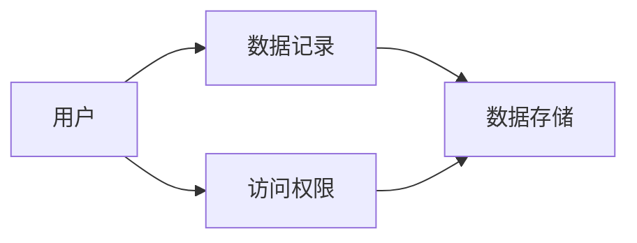
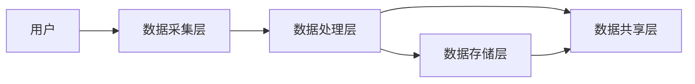

                 


# 巴菲特-芒格的智慧城市安全投资：隐私保护与公共安全的平衡

## 关键词：智慧城市、安全投资、隐私保护、公共安全、巴菲特、芒格

## 摘要：文章探讨了巴菲特和芒格的投资理念在智慧城市安全投资中的应用，重点分析了隐私保护与公共安全的平衡策略。通过系统架构设计和实际案例，展示了如何在智慧城市建设中实现长期的安全投资收益，同时确保隐私和公共安全的双重目标。

---

## 第一部分：智慧城市的背景与安全投资的重要性

### 第1章：智慧城市的背景与安全投资的重要性

#### 1.1 智慧城市的定义与发展趋势

智慧城市的定义：

智慧城市建设通过整合信息通信技术（ICT）、物联网（IoT）、大数据和人工智能（AI）等技术，构建一个高效、可持续、宜居的城市环境。智慧城市旨在优化资源配置、提高居民生活质量、降低运营成本，并增强城市的抗风险能力。

发展趋势：

- **技术驱动**：随着5G、物联网、大数据和人工智能的快速发展，智慧城市建设进入快车道。
- **政策支持**：全球各国政府纷纷出台政策，推动智慧城市建设，提升城市治理能力。
- **可持续发展**：智慧城市强调绿色技术的应用，如智能电网、绿色交通等，助力实现碳中和目标。
- **数据驱动**：数据成为智慧城市建设的核心资源，推动城市决策的智能化和数据化。

#### 1.2 安全投资在智慧城市建设中的重要性

潜在风险与威胁：

- **数据泄露**：智慧城市依赖大量数据，成为黑客攻击的主要目标。
- **系统瘫痪**：关键基础设施（如交通、能源）的网络安全问题可能导致城市运行中断。
- **隐私侵犯**：居民数据的收集和使用可能引发隐私保护问题。

安全投资的重要性：

- **长期收益**：安全投资能有效降低城市运行的风险，避免重大损失。
- **信任构建**：公众对城市数据安全的信任是智慧城市建设成功的关键。
- **可持续发展**：安全投资保障了智慧城市的长期稳定运行。

---

## 第二部分：巴菲特与芒格的投资理念与智慧城市安全投资

### 第2章：巴菲特与芒格的投资理念概述

#### 2.1 巴菲特的价值投资理念

巴菲特的价值投资原则：

1. **安全边际**：投资时考虑资产的内在价值，确保买入价格低于其实际价值。
2. **长期视角**：关注企业的长期盈利能力，而非短期市场波动。
3. **风险管理**：避免高风险投资，确保投资组合的安全性。

成功案例：

- **可口可乐**：巴菲特长期持有可口可乐的股票，因其稳定的现金流和品牌价值。
- **苹果公司**：巴菲特对苹果的投资基于其持续的创新能力。

#### 2.2 芒格的多元思维模型

芒格的多元思维模型：

1. **跨学科思考**：将不同领域的知识结合起来，形成综合判断。
2. **理性决策**：避免情绪化决策，注重逻辑分析。
3. **避免认知偏差**：识别并纠正认知偏差，确保决策的客观性。

成功案例：

- **伯克希尔 Hathaway**：芒格帮助巴菲特构建了一个多元化投资组合，涵盖保险、能源、铁路等多个领域。

### 第3章：巴菲特与芒格理念在智慧城市安全投资中的应用

#### 3.1 巴菲特价值投资理念在智慧城市中的应用

项目评估标准：

- **长期价值**：选择那些具备长期安全价值的项目，如数据加密技术、网络安全解决方案。
- **安全边际**：确保投资的回报率高于预期，避免高风险项目。

风险管理策略：

- **分散投资**：将资金分配到不同类型的安全项目，降低风险。
- **定期评估**：定期审查投资组合，确保其安全性和收益性。

#### 3.2 芒格的多元思维模型在智慧城市中的应用

多维分析：

- **技术评估**：分析智慧城市安全技术的可行性和创新性。
- **市场分析**：评估目标市场的潜力和竞争状况。
- **法律合规**：确保项目符合相关法律法规，特别是数据隐私保护。

理性决策：

- **避免从众心理**：不盲目跟风，独立分析项目价值。
- **长期视角**：关注项目的长期影响，而非短期收益。

---

## 第三部分：隐私保护与公共安全的平衡策略

### 第4章：隐私保护与公共安全的平衡策略

#### 4.1 隐私保护的基本原则与技术手段

隐私保护原则：

- **最小化原则**：仅收集实现目标所需的最少数据。
- **目的限制原则**：数据只能用于特定目的，未经允许不得变更用途。
- **数据主体权利**：数据主体有权访问、更正和删除其数据。

技术手段：

- **数据加密**：采用AES-256等加密算法，保护数据在传输和存储过程中的安全性。
- **匿名化处理**：通过数据脱敏技术，去除个人身份信息，确保数据无法被关联到具体个人。
- **访问控制**：基于角色的访问控制（RBAC）和最小权限原则，限制数据访问权限。

#### 4.2 公共安全的实现路径与挑战

公共安全技术：

- **实时监控**：部署智能摄像头和传感器，实时监测城市环境。
- **预测分析**：利用大数据和AI技术，预测潜在的安全威胁。
- **应急响应**：建立快速响应机制，应对突发事件。

挑战：

- **数据隐私冲突**：在公共安全监控中，如何在数据收集和隐私保护之间找到平衡。
- **技术局限性**：现有技术无法完全消除所有安全威胁。
- **成本控制**：安全投资可能面临预算限制。

---

## 第四部分：系统架构设计与实现

### 第5章：系统架构设计与实现

#### 5.1 问题场景介绍

智慧城市的公共安全系统需要处理大量数据，包括交通、安防、环境监测等信息。如何在保证数据安全的前提下，实现高效的数据共享和处理，是一个复杂的系统工程。

#### 5.2 系统功能设计

系统功能模块：

- **数据采集模块**：收集交通、安防、环境等数据。
- **数据处理模块**：对数据进行清洗、转换和分析。
- **数据存储模块**：采用分布式存储，确保数据的安全性和可用性。
- **数据共享模块**：在不同部门之间实现数据共享，同时保护隐私。

实体关系图（ER图）：



系统架构设计：



#### 5.3 代码实现

数据加密算法：

```python
import hashlib

def encrypt_data(data):
    return hashlib.sha256(data.encode()).hexdigest()

# 示例
data = "sample data"
encrypted_data = encrypt_data(data)
print(encrypted_data)
```

访问控制实现：

```python
from flask import Flask
from flask_restful import Resource, Api

app = Flask(__name__)
api = Api(app)

class DataResource(Resource):
    def get(self):
        # 验证用户权限
        if 'Authorization' not in request.headers:
            return {'message': 'Missing Authorization header'}, 401
        # 处理请求
        return {'data': 'Encrypted data'}

api.add_resource(DataResource, '/data')

if __name__ == '__main__':
    app.run(debug=True)
```

---

## 第五部分：总结与展望

### 第6章：总结与展望

总结：

- 巴菲特和芒格的投资理念为智慧城市的安投提供了重要的指导。
- 隐私保护与公共安全的平衡是智慧城市安全投资的核心挑战。
- 通过技术创新和制度保障，可以在确保隐私的同时，实现高效的公共安全。

展望：

- **技术创新**：开发更先进的数据加密和隐私保护技术，如同态加密、零知识证明等。
- **制度完善**：建立更严格的法律法规，明确数据使用和隐私保护的边界。
- **国际合作**：加强国际间的合作，共同应对智慧城市安全挑战。

---

## 作者：AI天才研究院/AI Genius Institute & 禅与计算机程序设计艺术 /Zen And The Art of Computer Programming

---

这篇文章详细探讨了巴菲特和芒格的投资理念在智慧城市建设中的应用，特别是如何在隐私保护与公共安全之间找到平衡。通过系统架构设计和实际案例分析，展示了如何在智慧城市建设中实现长期的安全投资收益。希望这篇文章能为智慧城市的安全投资提供有益的指导和启示。

