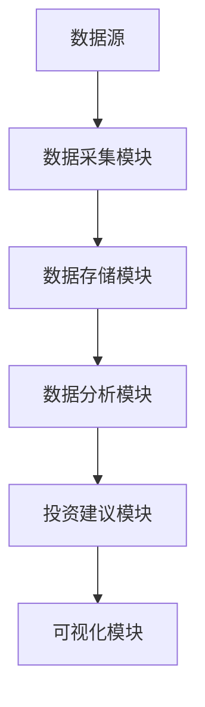

                 


# 巴菲特-芒格的生物计算投资：计算能力的生物学突破

> **关键词**：巴菲特、芒格、生物计算、投资、计算能力、生物学突破、算法原理  
>
> **摘要**：本文探讨了巴菲特和芒格的投资理念与生物计算的结合，分析了生物计算投资的核心概念、算法原理、系统架构以及实际项目中的应用。通过详细的技术分析和实例，展示了生物计算在投资决策中的潜力和优势，为投资者提供了新的视角和方法。

---

## 第1章：巴菲特与芒格的投资哲学

### 1.1 巴菲特与芒格的投资理念
#### 1.1.1 巴菲特的价值投资理论
- 巴菲特的价值投资理念强调寻找具有持久竞争优势的企业，注重企业的内在价值和长期盈利能力。
- 他主张以合理的价格买入优质资产，长期持有，避免频繁交易。

#### 1.1.2 芒格的多元思维模型
- 芒格提倡多元思维模型，认为投资者应具备跨学科的知识，将不同领域的知识结合起来，以更全面的视角分析问题。
- 他强调独立思考，避免从众心理，注重基本面分析和长期趋势。

#### 1.1.3 两人投资理念的结合
- 巴菲特和芒格的投资理念结合了价值投资和跨学科分析，强调对企业基本面的深入研究和长期投资策略。
- 他们的成功不仅依赖于市场分析，还依赖于对企业管理和行业趋势的深刻理解。

---

## 第2章：生物计算投资的背景与概念

### 2.1 生物计算投资的背景
#### 2.1.1 生物学与投资的交叉领域
- 生物学与投资的交叉领域近年来备受关注，尤其是在基因组学、生物技术等领域，数据量的爆炸性增长为投资分析提供了新的可能性。
- 生物计算通过整合生物学数据和计算技术，为投资决策提供了新的工具和方法。

#### 2.1.2 计算能力的生物学突破
- 生物学的进步，如基因测序技术的快速发展，使得大量生物数据得以积累，这些数据为投资分析提供了新的维度。
- 生物计算利用这些数据，结合先进的计算技术，如人工智能和大数据分析，提升了投资决策的精准性和效率。

#### 2.1.3 生物计算投资的定义与范围
- 生物计算投资是指利用生物学数据和计算技术进行投资分析和决策的过程。
- 其范围涵盖生物技术、医疗健康、农业等多个领域，涉及企业的研发能力、市场潜力和风险评估。

---

## 第3章：生物计算投资的核心概念

### 3.1 生物计算投资的原理
#### 3.1.1 生物学与计算能力的结合
- 生物计算投资将生物学数据（如基因序列、蛋白质结构、生理数据等）与计算技术相结合，通过数据分析和建模，揭示潜在的投资机会和风险。
- 例如，通过分析企业的生物技术专利数量和质量，评估其研发能力和发展潜力。

#### 3.1.2 生物计算投资的核心要素
- 生物数据：包括基因组数据、蛋白质结构数据、疾病数据等。
- 计算工具：如机器学习算法、大数据分析工具等。
- 投资目标：如企业估值、风险评估、投资策略优化等。

#### 3.1.3 生物计算投资的数学模型
- 使用统计学和机器学习模型，如回归分析、随机森林、神经网络等，对生物数据进行分析和预测。
- 例如，利用机器学习模型预测某生物技术公司的市场表现。

---

## 第4章：生物计算投资的算法原理

### 4.1 生物计算投资的算法框架
#### 4.1.1 生物计算投资的输入与输出
- 输入：生物数据（基因组数据、蛋白质结构数据等）和市场数据（股价、财务数据等）。
- 输出：投资建议（如买入、卖出信号）、风险评估、企业估值等。

#### 4.1.2 生物计算投资的算法流程
- 数据预处理：清洗和整合生物数据与市场数据。
- 特征提取：识别关键特征，如基因表达水平、专利数量等。
- 模型训练：使用机器学习算法训练模型，预测投资目标。
- 结果分析：验证模型的准确性和稳定性。

#### 4.1.3 生物计算投资的优化策略
- 使用交叉验证优化模型参数。
- 引入领域知识，如生物学专家意见，提升模型的解释性和准确性。

---

## 第5章：生物计算投资的数学模型

### 5.1 生物计算投资的数学基础
#### 5.1.1 生物计算投资的基本假设
- 生物数据与市场表现之间存在某种统计关系。
- 通过数学模型可以捕捉这些关系，用于投资决策。

#### 5.1.2 生物计算投资的核心公式
- 例如，使用线性回归模型预测公司股价：
  $$ y = \beta_0 + \beta_1x_1 + \beta_2x_2 + \dots + \beta_nx_n + \epsilon $$
  其中，$y$ 是目标变量（股价），$x_i$ 是特征变量（生物数据），$\beta_i$ 是回归系数。

#### 5.1.3 生物计算投资的数学推导
- 通过最小二乘法估计回归系数：
  $$ \hat{\beta} = (X^T X)^{-1} X^T y $$

---

## 第6章：生物计算投资的系统架构

### 6.1 生物计算投资的系统设计
#### 6.1.1 系统目标与范围
- 系统目标：提供基于生物计算的投资分析工具。
- 系统范围：涵盖数据采集、分析、预测和可视化。

#### 6.1.2 系统功能模块
- 数据采集模块：收集生物数据和市场数据。
- 数据分析模块：进行特征提取和模型训练。
- 投资建议模块：生成投资建议和风险评估。
- 可视化模块：展示分析结果和预测结果。

#### 6.1.3 系统架构图


---

## 第7章：生物计算投资的项目实战

### 7.1 项目背景与目标
#### 7.1.1 项目需求分析
- 分析某生物技术公司的基因专利数量与股价的关系。
- 预测其未来股价走势。

#### 7.1.2 项目实施计划
- 收集公司过去五年的基因专利数据和股价数据。
- 使用机器学习模型进行预测。

#### 7.1.3 项目成果展示
- 模型预测的股价走势与实际走势对比。

### 7.2 核心代码实现
#### 7.2.1 数据预处理
```python
import pandas as pd

data = pd.read_csv('biotech_data.csv')
data = data.dropna()
```

#### 7.2.2 模型训练
```python
from sklearn.ensemble import RandomForestRegressor
from sklearn.metrics import mean_squared_error

model = RandomForestRegressor()
model.fit(X_train, y_train)
```

#### 7.2.3 模型评估
```python
y_pred = model.predict(X_test)
mse = mean_squared_error(y_test, y_pred)
print(f'MSE: {mse}')
```

---

## 第8章：生物计算投资的未来展望

### 8.1 生物计算投资的发展趋势
- 随着生物技术的进步和计算能力的提升，生物计算投资将更加精准和高效。
- 未来可能结合更多领域知识，如人工智能和区块链技术，进一步优化投资决策。

### 8.2 生物计算投资的应用扩展
- 在医疗健康领域，生物计算投资可用于评估新药研发的市场潜力。
- 在农业领域，可用于优化作物品种和农业技术的投资决策。

### 8.3 生物计算投资的未来挑战
- 数据隐私和安全问题。
- 模型的解释性和可解释性问题。
- 领域知识与技术的结合需要更多跨学科合作。

---

## 第9章：总结与建议

### 9.1 全书总结
- 本文结合巴菲特和芒格的投资理念，详细探讨了生物计算投资的核心概念、算法原理和系统架构。
- 生物计算投资通过整合生物学数据和计算技术，为投资决策提供了新的视角和方法。

### 9.2 投资建议
- 投资者应关注生物计算投资的潜力，尤其是生物技术领域的投资机会。
- 在实际操作中，应结合领域知识和技术创新，制定科学的投资策略。

### 9.3 最佳实践 tips
- 在进行生物计算投资时，应选择可靠的数据源和先进的计算工具。
- 定期更新模型和数据，保持投资策略的灵活性和适应性。

---

## 作者：AI天才研究院/AI Genius Institute & 禅与计算机程序设计艺术 /Zen And The Art of Computer Programming

---

通过以上步骤，您可以系统地撰写一篇关于生物计算投资的技术博客文章，涵盖从理论到实践的各个方面。

