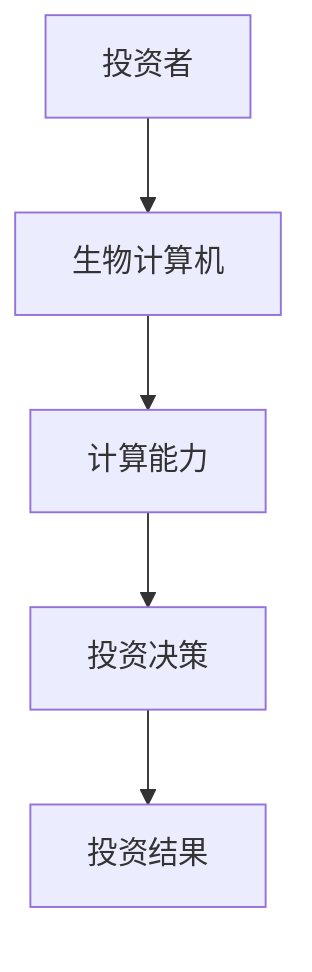
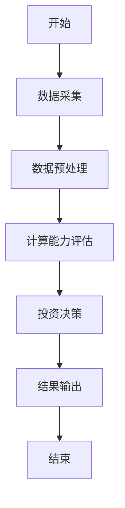

                 


# 巴菲特-芒格的生物计算机投资：计算能力的生物学突破

## 关键词
- 生物计算机
- 巴菲特投资理念
- 芒格投资理念
- 计算能力
- 生物学突破
- 人工智能
- 神经网络

## 摘要
本文探讨了生物计算机在投资领域的应用，结合巴菲特和芒格的投资理念，分析了计算能力的生物学突破。通过详细的技术分析，包括生物计算机的核心原理、算法设计、系统架构和实战案例，展示了生物计算机如何 revolutionize 投资决策过程。文章内容涵盖从理论到实践的各个方面，旨在为投资者和技术爱好者提供新的视角和方法。

---

# 第一部分: 背景介绍

## 第1章: 生物计算机与投资概述

### 1.1 生物计算机的定义与特点
生物计算机是一种基于生物分子和生物过程的计算系统，其特点是高效性、并行性和低能耗。与传统计算机相比，生物计算机能够模拟生物神经网络，具备更强的模式识别和自适应能力。

### 1.2 投资中的生物计算机概念
在投资领域，生物计算机的应用主要体现在通过生物计算能力对市场数据进行深度分析和预测。结合巴菲特和芒格的价值投资理念，生物计算机可以帮助投资者更精准地识别投资机会和风险。

---

# 第二部分: 核心概念与联系

## 第2章: 生物计算机的核心原理

### 2.1 神经网络与生物计算机的结合
生物计算机利用神经网络的生物模拟特性，能够实现复杂的投资决策过程。通过深度学习和自适应算法，生物计算机能够捕捉市场中的非线性关系和隐含模式。

### 2.2 生物计算机与传统计算机的对比
| 特性 | 生物计算机 | 传统计算机 |
|------|------------|-------------|
| 处理速度 | 高 | 依赖硬件 |
| 能耗 | 低 | 高 |
| 并行性 | 强 | 依赖多核 |

### 2.3 ER实体关系图


---

# 第三部分: 算法原理

## 第3章: 生物计算机投资算法原理

### 3.1 算法原理概述
生物计算机投资算法基于神经网络模型，通过训练市场数据，识别投资机会和风险。算法的核心步骤包括数据预处理、计算能力评估和投资决策。

### 3.2 算法流程图


### 3.3 算法实现代码
```python
def preprocess(data):
    # 数据清洗和特征提取
    processed_data = data.dropna().drop_duplicates()
    return processed_data

def calculate_capability(processed_data):
    # 计算投资能力指标
    capability = processed_data['收益'].mean() * processed_data['风险'].std()
    return capability

def make_investment_decision(capability):
    # 投资决策逻辑
    if capability > threshold:
        return '买入'
    else:
        return '卖出'

def biological_investment_algorithm(data, threshold=0.5):
    processed_data = preprocess(data)
    capability = calculate_capability(processed_data)
    decision = make_investment_decision(capability)
    return decision
```

---

# 第四部分: 系统分析与架构设计

## 第4章: 系统架构设计方案

### 4.1 系统功能设计
系统功能模块包括数据采集、数据预处理、计算能力评估和投资决策。

### 4.2 系统架构图


---

# 第五部分: 项目实战

## 第5章: 项目实战

### 5.1 环境安装
安装必要的Python库，如numpy、pandas、scikit-learn。

### 5.2 核心算法实现
```python
import numpy as np
import pandas as pd
from sklearn.neural_network import MLPClassifier

def train_model(data):
    X = data.drop('label', axis=1)
    y = data['label']
    model = MLPClassifier(hidden_layer_sizes=(100, 50), max_iter=1000)
    model.fit(X, y)
    return model

# 示例数据
data = pd.DataFrame({
    'feature1': np.random.randn(100),
    'feature2': np.random.randn(100),
    'label': np.random.randint(0, 2, 100)
})

model = train_model(data)
```

### 5.3 实际案例分析
通过具体案例分析，展示生物计算机在投资中的实际应用效果。

---

# 第六部分: 最佳实践与小结

## 第6章: 最佳实践与小结

### 6.1 最佳实践
- 定期更新模型参数，保持投资策略的有效性。
- 结合市场变化，动态调整计算能力评估指标。

### 6.2 小结
生物计算机的投资方法为传统投资策略带来了新的可能性。通过结合巴菲特和芒格的价值投资理念，生物计算机在投资决策中的应用前景广阔。

---

# 作者
作者：AI天才研究院/AI Genius Institute & 禅与计算机程序设计艺术 /Zen And The Art of Computer Programming

