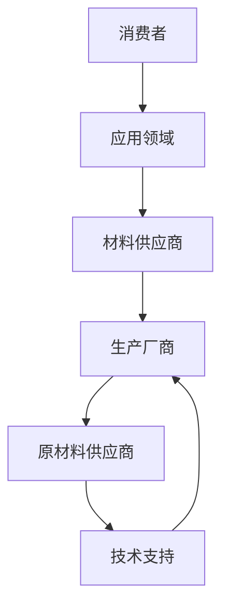

                 

# 巴菲特-芒格的生物降解材料投资：环保与创新的结合

## 关键词：巴菲特，芒格，生物降解材料，环保投资，创新技术，可持续发展，投资策略

## 摘要：本文探讨巴菲特和芒格在生物降解材料领域的投资策略，分析其如何将环保与创新相结合，通过技术原理和市场分析，揭示投资机会和风险，提供深度见解。

---

## 第一章：生物降解材料的背景与重要性

### 1.1 生物降解材料的定义与特点

#### 1.1.1 生物降解材料的定义
生物降解材料是指在自然环境中，通过微生物作用或其他降解机制，能够在一定时间内分解为二氧化碳和水等简单无机物的材料。

#### 1.1.2 生物降解材料的核心特点
- **可再生性**：来源于可再生资源，如淀粉、纤维素。
- **可降解性**：在特定条件下分解，减少环境污染。
- **低毒性**：降解过程无害，对人体和环境无害。

#### 1.1.3 生物降解材料与传统材料的对比
| 属性      | 生物降解材料         | 传统塑料       |
|-----------|----------------------|----------------|
| 材料来源   | 可再生资源           | 石油等不可再生资源 |
| 分解能力   | 可降解               | 难降解           |
| 环境影响   | 低                   | 高               |

### 1.2 环保与可持续发展的背景

#### 1.2.1 全球环境问题的现状
全球塑料污染严重，每年约有800万吨塑料进入海洋，威胁生态平衡。

#### 1.2.2 可持续发展的重要性
联合国可持续发展目标（SDGs）强调减少对环境的破坏，推动绿色经济。

#### 1.2.3 生物降解材料在环保中的作用
通过减少白色污染，生物降解材料为实现可持续发展目标提供技术支持。

---

## 第二章：巴菲特与芒格的投资哲学

### 2.1 巴菲特与芒格的投资理念

#### 2.1.1 巴菲特的价值投资理论
巴菲特强调投资于具有持续竞争优势和良好管理的公司，注重长期价值。

#### 2.1.2 芒格的多元思维模型
芒格提倡跨学科思维，通过多角度分析问题，降低投资风险。

#### 2.1.3 两人投资理念的结合
将长期价值与跨学科分析相结合，注重环保和创新的结合。

### 2.2 投资中的环保与创新

#### 2.2.1 环保投资的兴起
随着环境问题加剧，环保投资成为新的增长点。

#### 2.2.2 创新在投资中的重要性
技术创新是企业竞争力的关键，尤其在材料科学领域。

#### 2.2.3 环保与创新的结合
通过投资环保技术，推动企业创新，实现可持续发展。

---

## 第三章：生物降解材料的科学基础

### 3.1 生物降解材料的分类

#### 3.1.1 可生物降解聚合物
- **聚乳酸（PLA）**：由乳酸聚合而成，广泛用于包装材料。
- **聚乙醇酸（PGA）**：用于医疗领域，可生物降解。

#### 3.1.2 生物基材料
- **淀粉基材料**：以淀粉为原料，制成可降解塑料。
- **纤维素基材料**：来自植物纤维，用于纺织品和包装。

#### 3.1.3 复合材料
- **生物基复合材料**：结合不同材料，提高性能。

### 3.2 生物降解材料的分解机制

#### 3.2.1 分解过程的化学反应
- 生物降解材料在微生物作用下，发生水解和氧化反应，最终分解为二氧化碳和水。

#### 3.2.2 微生物在分解中的作用
- **降解菌种**：特定微生物能分解不同材料，影响降解速度。

#### 3.2.3 分解环境的影响
- **温度与湿度**：分解速度随环境条件变化，影响降解效率。

---

## 第四章：生物降解材料的环境影响分析

### 4.1 环境影响评估方法

#### 4.1.1 生命周期评估（LCA）
分析材料从生产到废弃的全生命周期对环境的影响，识别关键影响点。

#### 4.1.2 环境负荷分析
评估材料对环境资源的消耗和污染排放，优化材料设计。

#### 4.1.3 可持续性指标
制定量化指标，衡量材料的环境友好程度。

### 4.2 生物降解材料的实际应用案例

#### 4.2.1 塑料袋的替代
使用可降解材料制成的袋子，减少白色污染。

#### 4.2.2 包装材料的应用
食品包装采用生物降解材料，减少塑料使用。

#### 4.2.3 农业薄膜的使用
可降解地膜覆盖，减少残留污染，改善土壤健康。

---

## 第五章：巴菲特与芒格的投资策略

### 5.1 投资策略的核心要素

#### 5.1.1 企业基本面分析
- **财务状况**：评估盈利能力、资产负债情况。
- **管理团队**：考察管理能力和战略规划。
- **行业趋势**：分析行业增长潜力和政策支持。

### 5.2 生物降解材料行业的投资机会

#### 5.2.1 行业增长潜力
全球生物降解材料市场预计将以年均15%的速度增长，到2030年市场规模将达数百亿美元。

#### 5.2.2 政策支持的影响
各国政府出台政策鼓励使用可降解材料，为企业提供政策支持和市场保障。

#### 5.2.3 市场需求的驱动
消费者环保意识提升，推动市场需求增长。

---

## 第六章：具体投资案例分析

### 6.1 典型企业的分析

#### 6.1.1 公司背景与业务模式
- **NatureWorks LLC**：全球领先的聚乳酸生产商，专注于生物基材料研发和生产。
- ** BASF SE**：全球化工巨头，投资于生物降解材料研发。

#### 6.1.2 财务状况与盈利能力
- NatureWorks LLC近年来收入增长显著，利润率提升，显示出良好的市场前景。
- BASF在生物降解材料领域的研发投入巨大，但市场回报潜力巨大。

#### 6.1.3 竞争优势分析
- **技术优势**：NatureWorks拥有领先的聚乳酸生产技术。
- **市场优势**：BASF凭借全球网络，快速拓展市场。

### 6.2 投资决策的关键因素

#### 6.2.1 技术创新能力
- 企业的研发能力直接影响其产品竞争力和市场地位。

#### 6.2.2 市场占有率
- 高市场占有率意味着稳定的收入来源和更强的议价能力。

#### 6.2.3 政策环境的影响
- 政府政策对企业生产和推广生物降解材料的支持力度直接影响投资回报。

---

## 第七章：生物降解材料产业链分析

### 7.1 产业链结构图

### 7.2 关键技术节点分析

#### 7.2.1 材料研发
- 开发新型生物降解材料，提升性能和降低成本。

#### 7.2.2 生产工艺优化
- 改进生产流程，提高效率和降低成本。

#### 7.2.3 应用技术开发
- 研究材料在不同领域的最佳应用，确保性能和环保效果。

---

## 第八章：投资风险与风险管理

### 8.1 投资风险的识别

#### 8.1.1 市场风险
- 行业竞争加剧，市场需求波动影响投资回报。

#### 8.1.2 技术风险
- 研发失败或技术落后导致竞争优势丧失。

#### 8.1.3 政策风险
- 政策变化影响市场需求和企业运营。

### 8.2 风险管理策略

#### 8.2.1 多样化投资
- 投资于不同领域的生物降解材料企业，分散风险。

#### 8.2.2 风险对冲
- 利用金融工具对冲市场和政策风险。

#### 8.2.3 定期评估与调整
- 根据市场和政策变化，及时调整投资组合。

---

## 第九章：项目实战与总结

### 9.1 环境评估与投资

#### 9.1.1 项目选择
- 选择具有强大研发能力和良好市场前景的企业。

#### 9.1.2 投资策略
- 长期持有优质企业股票，分享其成长收益。

#### 9.1.3 风险管理
- 定期评估企业财务状况和市场环境，及时应对潜在风险。

---

## 附录

### 附录A：相关数学模型

#### 分解动力学模型
分解速率常数k与温度T的关系可表示为：
$$ k = A \cdot e^{-E_a/(RT)} $$
其中，A为指前因子，E_a为活化能，R为气体常数，T为绝对温度。

### 附录B：参考文献
- 环境科学领域权威期刊文章
- 巴菲特和芒格的投资经典著作

---

## 作者：AI天才研究院 & 禅与计算机程序设计艺术

---

通过以上结构，文章详细分析了生物降解材料的科学基础、环保意义，以及巴菲特和芒格的投资策略。结合具体案例和系统分析，揭示了投资机会与风险，为读者提供了全面的视角和深度见解。

