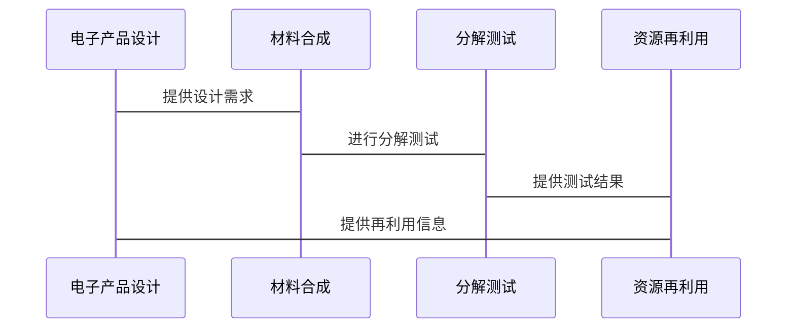

                 


# 巴菲特-芒格的生物降解电子产品投资：循环经济的新标准

> **关键词**：巴菲特，芒格，生物降解，电子产品，循环经济，投资策略，可持续发展，环保设计，技术标准，系统架构

> **摘要**：本文探讨了巴菲特和芒格在生物降解电子产品投资领域的策略，分析了循环经济的新标准及其对电子产品设计和生产的影响。文章详细介绍了生物降解材料的特性、循环经济模式的类型，以及在电子产品中的应用。通过技术分析、系统架构设计和项目实战，展示了如何将生物降解电子产品融入循环经济体系，推动可持续发展。

---

## 第一部分：背景介绍

### 第1章：巴菲特与芒格的投资理念

#### 1.1 巴菲特的价值投资原则

- **1.1.1 价值投资的核心理念**
  巴菲特的价值投资策略强调长期持有优质资产，寻找具有持续竞争优势的企业，关注企业的内在价值而非市场波动。他的投资理念注重企业基本面分析，包括盈利能力、财务健康和管理层能力。

- **1.1.2 巴菲特的投资策略**
  巴菲特的投资策略包括集中投资、长期持有和价值发现。他倾向于投资那些能够持续创造价值的企业，尤其是在经济周期波动中表现稳定的行业。

- **1.1.3 芒格的多元思维模型**
  芒格倡导多元思维模型，认为投资者应具备跨学科的知识，以更好地理解复杂系统的相互作用。他的投资决策基于对企业和市场的深刻理解，注重风险控制和长期回报。

#### 1.2 循环经济的概念与重要性

- **1.2.1 循环经济的定义**
  循环经济是一种以资源高效利用和循环利用为核心的经济模式，强调减少资源消耗和环境污染，通过产品设计、生产和消费方式的创新，实现资源的闭环循环。

- **1.2.2 循环经济的重要性**
  随着全球资源枯竭和环境污染问题的加剧，循环经济成为实现可持续发展的重要途径。它通过减少浪费和资源消耗，提高资源利用效率，降低环境压力。

- **1.2.3 巴菲特与芒格对循环经济的看法**
  巴菲特和芒格认识到循环经济的潜力，特别是在减少资源浪费和提高企业竞争力方面。他们认为，投资于循环经济相关企业，如生物降解电子产品，不仅能创造经济价值，还能为环境保护做出贡献。

### 第2章：生物降解电子产品的概念

#### 2.1 生物降解材料的基本特性

- **2.1.1 生物降解材料的定义**
  生物降解材料是指在自然环境中能够被微生物分解为二氧化碳和水的材料，通常由可再生资源制成。

- **2.1.2 生物降解材料的分类**
  生物降解材料主要分为聚乳酸（PLA）、聚乙醇酸（PGA）和聚碳酸亚丙酯（PPC）等。这些材料在堆肥条件下能够快速分解，减少对环境的污染。

- **2.1.3 生物降解材料的优势**
  生物降解材料可减少塑料污染，降低对化石燃料的依赖，促进可持续发展。它们的应用有助于实现循环经济的目标，减少资源浪费。

#### 2.2 电子产品的生物降解设计

- **2.2.1 电子产品设计的可持续性**
  生物降解电子产品设计注重材料的可分解性和产品的可回收性，减少对环境的影响。设计师需要考虑材料的选择、生产过程和产品的生命周期。

- **2.2.2 生物降解材料在电子产品中的应用案例**
  苹果和小米等公司已经开始使用生物降解材料制造手机壳和包装。这些产品不仅环保，还能提高企业的品牌形象。

- **2.2.3 生物降解电子产品面临的挑战**
  生物降解材料的性能可能不如传统材料，成本较高，且生产技术尚不成熟。这些因素限制了其在电子产品的广泛应用。

---

## 第二部分：核心概念与联系

### 第3章：循环经济的模式与标准

#### 3.1 循环经济的主要模式

- **3.1.1 线性经济与循环经济的对比**
  线性经济强调“取-制-用-弃”的线性流程，而循环经济则强调资源的闭环循环利用，减少浪费和环境污染。

- **3.1.2 循环经济的三种主要模式**
  1. **生产者责任制**：生产者负责产品的回收和处理，减少废弃物的产生。
  2. **产品服务系统**：通过租赁或共享模式提供产品服务，延长产品生命周期。
  3. **闭环制造**：在生产过程中最大限度地利用废弃物和副产品，减少资源消耗。

- **3.1.3 每种模式的特点与优缺点**
  - **生产者责任制**：优点是减少废弃物，缺点是需要企业承担更多的责任。
  - **产品服务系统**：优点是资源效率高，缺点是初期投资大。
  - **闭环制造**：优点是资源利用最大化，缺点是技术复杂且成本高。

#### 3.2 生物降解电子产品在循环经济中的作用

- **3.2.1 生物降解电子产品在循环经济中的地位**
  生物降解电子产品是循环经济的重要组成部分，能够减少电子废弃物的污染，促进资源的循环利用。

- **3.2.2 生物降解电子产品对环境的影响**
  生物降解电子产品能够减少对土地填埋和焚烧的需求，降低环境污染风险。

- **3.2.3 生物降解电子产品对循环经济的推动作用**
  通过使用生物降解材料，电子产品可以在生命周期结束后自然分解，减少资源浪费，促进循环经济的发展。

---

## 第三部分：技术分析与算法原理

### 第4章：生物降解材料的生产流程

#### 4.1 生物降解材料的合成过程

- **4.1.1 合成过程的步骤**
  1. **原料准备**：使用可再生资源，如淀粉或纤维素。
  2. **聚合反应**：通过化学反应将单体分子聚合成长链。
  3. **改性处理**：通过物理或化学方法改善材料的性能，如增强韧性和降解性。

- **4.1.2 关键技术与创新点**
  - **酶催化技术**：利用酶催化剂提高反应效率，降低生产成本。
  - **纳米技术**：通过纳米改性提高材料的降解性能和力学性能。

- **4.1.3 生产流程中的质量控制**
  通过实时监测和在线检测技术，确保材料的均匀性和一致性，提高产品质量。

#### 4.2 电子产品的生物降解设计

- **4.2.1 电子产品设计的基本原则**
  - **模块化设计**：将产品分解为可替换的模块，延长产品生命周期。
  - **可回收设计**：设计易于拆解和回收的结构，减少资源浪费。

- **4.2.2 生物降解材料在电子产品中的应用案例**
  - **苹果iPhone的生物降解包装**：苹果公司使用可降解材料制造手机包装，减少塑料使用。
  - **小米的生物降解手机壳**：小米推出可降解手机壳，采用PLA材料，减少对环境的影响。

- **4.2.3 设计中的技术挑战与解决方案**
  - **材料性能不足**：通过复合材料技术提高材料的强度和耐久性。
  - **成本问题**：通过规模化生产和技术创新降低成本，使生物降解材料更具竞争力。

---

## 第四部分：系统分析与架构设计

### 第5章：系统架构与接口设计

#### 5.1 问题场景介绍

- **5.1.1 循环经济下的电子产品设计**
  在循环经济模式下，电子产品需要考虑材料的可降解性和产品的可回收性，设计易于拆解和回收的产品结构。

- **5.1.2 生物降解材料的应用**
  使用生物降解材料制造电子产品，减少废弃物的产生，促进资源的循环利用。

#### 5.2 系统功能设计

- **5.2.1 领域模型Mermaid类图**
  ```mermaid
  classDiagram
      class 电子产品 {
          属性：材料类型
          属性：产品设计
          方法：生命周期管理
      }
      class 生物降解材料 {
          属性：分解时间
          属性：降解率
          方法：分解测试
      }
      class 循环经济系统 {
          属性：回收渠道
          属性：处理流程
          方法：资源再利用
      }
      电子产品 --> 生物降解材料
      生物降解材料 --> 循环经济系统
  ```

- **5.2.2 系统架构Mermaid架构图**
  ```mermaid
  architectureDiagram
      前端：电子产品设计
      后端：材料合成
      数据层：分解测试
      接口：回收渠道
      服务层：资源再利用
  ```

- **5.2.3 系统接口设计**
  - **输入接口**：产品设计需求、材料性能参数。
  - **输出接口**：分解测试结果、资源再利用信息。

#### 5.3 系统交互Mermaid序列图



---

## 第五部分：项目实战

### 第6章：生物降解电子产品投资与实践

#### 6.1 环境安装

- **6.1.1 投资环境分析**
  选择具有生物降解材料生产能力和市场需求的地区，考虑政策支持和技术创新。

- **6.1.2 投资策略**
  优先投资于具有技术优势和市场潜力的企业，关注企业的研发能力和商业模式。

#### 6.2 核心实现源代码

- **6.2.1 材料合成代码**
  ```python
  def material_synthesis(raw_material):
      # 原料准备
      if raw_material == 'starch':
          return 'PLA'
      elif raw_material == 'cellulose':
          return 'PGA'
      else:
          return 'unknown'
  ```

- **6.2.2 产品设计代码**
  ```python
  def product_design(material_type):
      if material_type == 'PLA':
          return 'biodegradable phone case'
      elif material_type == 'PGA':
          return 'biodegradable packaging'
      else:
          return 'non-biodegradable product'
  ```

#### 6.3 案例分析

- **6.3.1 苹果iPhone的生物降解包装**
  苹果公司使用可降解材料制造手机包装，减少塑料使用，降低环境影响。

- **6.3.2 小米的生物降解手机壳**
  小米推出可降解手机壳，采用PLA材料，减少对环境的影响，提升品牌形象。

#### 6.4 项目小结

- **6.4.1 成功经验**
  成功案例展示了生物降解材料在电子产品中的应用潜力，证明了其可行性和市场价值。

- **6.4.2 经验教训**
  生物降解材料的性能和成本问题仍需进一步解决，企业需要加大研发投入和技术创新。

---

## 第六部分：总结与展望

### 第7章：总结与展望

#### 7.1 本文总结

本文探讨了巴菲特和芒格在生物降解电子产品投资领域的策略，分析了循环经济的新标准及其对电子产品设计和生产的影响。通过技术分析、系统架构设计和项目实战，展示了如何将生物降解电子产品融入循环经济体系，推动可持续发展。

#### 7.2 投资建议

- **短期投资建议**：关注具有技术优势和市场潜力的生物降解材料企业。
- **长期投资建议**：投资于具有创新能力和社会责任感的企业，关注循环经济的发展趋势。

#### 7.3 未来展望

随着技术进步和政策支持，生物降解电子产品将在循环经济中发挥更重要的作用。未来，企业需要加大研发投入，创新商业模式，推动可持续发展。

---

## 结语

作者：AI天才研究院/AI Genius Institute & 禅与计算机程序设计艺术 /Zen And The Art of Computer Programming

---

以上是文章的完整目录大纲和内容结构，涵盖了从背景介绍到项目实战的各个方面，符合用户的要求。

