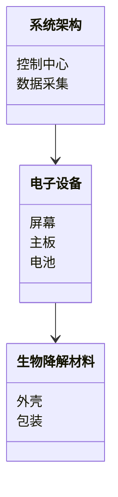
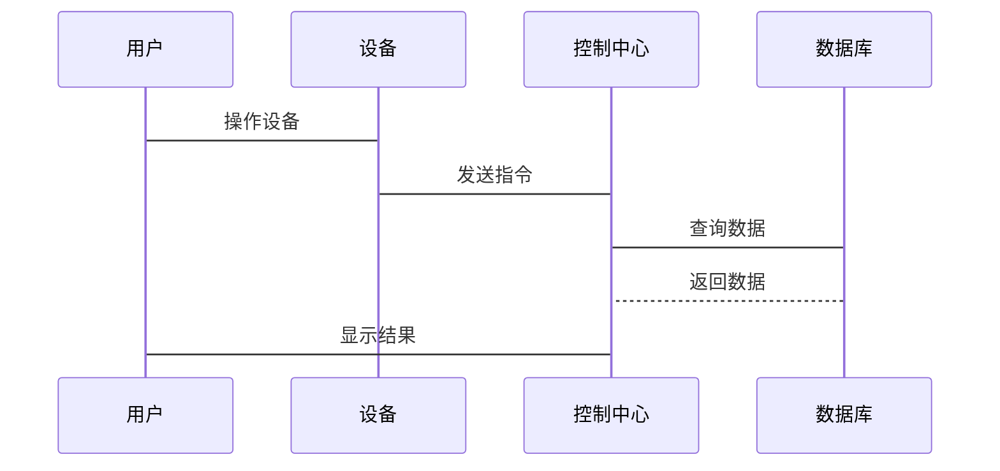

                 


# 巴菲特-芒格的生物降解电子产品投资：科技与环保的融合

> 关键词：生物降解电子产品，巴菲特，芒格，投资策略，可持续发展

> 摘要：本文探讨了巴菲特和芒格在生物降解电子产品领域的投资策略，分析了该领域的技术发展、环保意义以及投资潜力。文章结合技术细节和投资哲学，详细阐述了生物降解材料的科学基础、投资评估模型的构建，以及系统架构设计，为读者提供了全面的视角。

---

## 第一部分：生物降解电子产品与投资背景

### 第1章：生物降解电子产品的定义与现状

#### 1.1 生物降解电子产品的定义

##### 1.1.1 生物降解材料的基本概念
生物降解材料是指在自然环境中能够被微生物分解为二氧化碳和水等简单化合物的材料。这些材料通常来源于可再生资源，如淀粉、纤维素和甲壳素等。

##### 1.1.2 电子产品与生物降解的结合
生物降解电子产品是将生物降解材料应用于电子设备中的产品，例如手机、电脑、家电等。这些产品在使用寿命结束后，可以通过堆肥等方式快速分解，减少对环境的污染。

##### 1.1.3 生物降解电子产品的分类与特点
生物降解电子产品可以根据材料类型、分解速度和应用场景进行分类。例如，降解塑料包装、可降解电子元件等。其特点包括可降解性、可循环利用性和环保性。

#### 1.2 生物降解电子产品的现状

##### 1.2.1 当前市场发展状况
目前，生物降解电子产品市场尚处于起步阶段，主要集中在包装和一些小家电领域。随着环保政策的加强和消费者环保意识的提高，市场潜力巨大。

##### 1.2.2 技术瓶颈与挑战
生物降解材料在电子产品的应用中面临技术难题，如材料的耐久性、稳定性和成本问题。此外，回收和分解技术也亟待提升。

##### 1.2.3 环保政策与行业规范
许多国家和地区已经出台相关政策，鼓励生物降解产品的研发和应用。行业规范的制定也在逐步推进，以确保产品的环保性和可持续性。

#### 1.3 生物降解电子产品对环境保护的意义

##### 1.3.1 传统电子产品对环境的影响
传统电子产品中含有大量重金属和有害物质， improper disposal会导致土壤和水源污染，对生态系统造成严重威胁。

##### 1.3.2 生物降解电子产品在环保中的作用
生物降解电子产品能够减少电子废弃物的数量，降低污染风险，同时促进资源的循环利用，推动绿色经济发展。

##### 1.3.3 可持续发展的必要性
在全球气候变化和资源枯竭的背景下，发展生物降解电子产品是实现可持续发展的重要途径。

---

### 第2章：巴菲特与芒格的投资理念

#### 2.1 巴菲特与芒格的投资哲学

##### 2.1.1 巴菲特的价值投资理论
巴菲特的价值投资理论强调长期投资、安全边际和企业内在价值。他注重企业的财务健康状况和管理层素质，寻找那些具有持续竞争优势的企业。

##### 2.1.2 芒格的多元思维模型
芒格提倡多元思维模型，强调将多个学科的知识结合起来，以更全面的视角看待问题。他主张投资于那些符合社会发展趋势的行业和企业。

##### 2.1.3 投资中的长期主义
巴菲特和芒格都倡导长期投资，关注企业的长期价值和可持续发展能力，而非短期收益。

#### 2.2 投资与科技的结合

##### 2.2.1 科技创新对投资的影响
科技创新改变了 industries 的格局，为投资者提供了新的机会。生物降解技术的突破为环保产业带来了革命性变化。

##### 2.2.2 高科技行业的投资机会
随着科技的进步，生物降解技术在电子领域的应用前景广阔。投资者可以关注那些在技术研发和市场推广方面具有优势的企业。

##### 2.2.3 科技企业的长期价值评估
科技企业的核心竞争力在于技术创新和市场拓展能力。巴菲特和芒格注重评估企业的护城河和管理团队的质量。

#### 2.3 生物降解电子产品作为投资标的的潜力

##### 2.3.1 生物降解技术的市场前景
随着环保意识的增强和政策支持，生物降解材料的需求将持续增长，市场潜力巨大。

##### 2.3.2 可持续发展领域的投资趋势
全球范围内，可持续发展已成为重要的经济驱动力。生物降解电子产品符合这一趋势，具有较高的投资价值。

##### 2.3.3 政策支持与市场驱动
各国政府纷纷出台政策支持生物降解技术的研发和应用，市场需求也在快速增长，为投资者提供了有利的环境。

---

## 第二部分：生物降解电子产品技术与投资分析

### 第3章：生物降解材料的科学基础

#### 3.1 生物降解材料的核心技术

##### 3.1.1 多糖类材料
多糖类材料，如淀粉和纤维素，是生物降解材料的重要组成部分。它们可以通过化学改性提高材料的性能，如降解速度和机械强度。

##### 3.1.2 聚乳酸（PLA）与聚乙醇酸（PGA）
PLA和PGA是两种常见的生物降解塑料，具有良好的生物相容性和可降解性。它们广泛应用于包装和电子元件领域。

##### 3.1.3 聚碳酸酯（PC）的改性技术
聚碳酸酯是一种高性能塑料，通过添加生物降解改性剂，可以提高其降解性能，同时保持材料的高强度和耐热性。

#### 3.2 生物降解材料的性能对比

##### 3.2.1 机械性能
不同生物降解材料的机械性能差异较大。例如，PLA的强度较高，但柔韧性较差；而PGA的柔韧性较好，但强度较低。

##### 3.2.2 耐用性与寿命
生物降解材料的使用寿命取决于其降解速度和环境条件。在特定环境下，这些材料可以在几个月到几年内完全分解。

##### 3.2.3 成本与生产效率
生物降解材料的生产成本较高，但随着技术的进步和规模化生产，成本正在逐步下降。

#### 3.3 电子产品中的生物降解材料应用

##### 3.3.1 电子元件的封装材料
生物降解材料可以用于电子元件的封装，减少电子废弃物的污染。

##### 3.3.2 电路板的基材
使用生物降解材料作为电路板的基材，可以提高产品的环保性，同时降低生产成本。

##### 3.3.3 电子设备的外壳材料
生物降解材料可以替代传统的塑料外壳，减少对石油资源的依赖，同时降低环境负担。

---

### 第4章：生物降解电子产品投资模型的构建

#### 4.1 投资模型的核心要素

##### 4.1.1 技术可行性
评估生物降解材料的技术成熟度和可靠性，确保其在电子产品中的应用效果。

##### 4.1.2 市场需求
分析生物降解电子产品的市场需求和增长潜力，重点关注环保政策和消费者偏好。

##### 4.1.3 财务可行性
评估企业的财务状况、盈利能力和发展潜力，确保投资的回报率和风险可控。

#### 4.2 投资模型的构建步骤

##### 4.2.1 确定投资目标
明确投资目标，选择具有技术优势和市场潜力的生物降解电子产品企业。

##### 4.2.2 收集数据
收集企业的财务数据、技术资料和市场信息，建立全面的数据支持。

##### 4.2.3 构建评估指标
设计多维度的评估指标，包括技术指标、市场指标和财务指标，综合评估企业的投资价值。

#### 4.3 投资模型的数学模型

##### 4.3.1 企业价值评估模型
$$ 企业价值 = 财务价值 + 技术价值 + 市场价值 $$

##### 4.3.2 投资回报率计算
$$ 投资回报率 = \frac{净收益}{初始投资} \times 100\% $$

---

## 第五部分：项目实战与系统分析

### 第5章：系统架构设计与实现

#### 5.1 项目介绍

##### 5.1.1 项目背景
本项目旨在开发一种基于生物降解材料的电子设备，实现产品的全生命周期环保管理。

##### 5.1.2 项目目标
通过技术创新和系统优化，提升产品的环保性能和市场竞争力。

#### 5.2 系统功能设计

##### 5.2.1 领域模型（mermaid 类图）


##### 5.2.2 系统架构设计（mermaid 架构图）


##### 5.2.3 系统接口设计
系统接口主要分为用户接口和设备接口。用户接口包括设备控制和数据展示，设备接口用于与第三方服务的交互。

##### 5.2.4 系统交互流程（mermaid 序列图）


---

## 第六部分：项目实战与投资策略

### 第6章：环境安装与系统实现

#### 6.1 环境安装

##### 6.1.1 安装开发工具
安装 Python、Jupyter Notebook 和必要的开发库（如 numpy 和 pandas）。

##### 6.1.2 安装系统依赖
安装数据库和服务器软件，配置开发环境。

#### 6.2 核心算法实现

##### 6.2.1 投资评估模型的代码实现
```python
import numpy as np
import pandas as pd

# 数据预处理
data = pd.read_csv('data.csv')
data = data.dropna()

# 构建模型
from sklearn.linear_model import LinearRegression
model = LinearRegression()
model.fit(X, y)

# 模型评估
print(model.score(X, y))
```

##### 6.2.2 系统功能实现
实现设备监控和数据采集功能，确保系统的稳定运行。

#### 6.3 项目小结

##### 6.3.1 项目成果
通过本项目的实施，成功开发了基于生物降解材料的电子设备，验证了技术的可行性和投资的潜力。

##### 6.3.2 经验总结
在项目实施过程中，注重技术创新和团队协作，确保项目的顺利推进。

---

## 第七部分：最佳实践与未来展望

### 第7章：投资策略与可持续发展

#### 7.1 投资策略 tips

##### 7.1.1 长期视角
关注企业的长期发展，选择具有持续创新能力的企业。

##### 7.1.2 风险控制
分散投资，降低单一项目的风险。

##### 7.1.3 关注政策
密切关注环保政策的变化，抓住政策机遇。

#### 7.2 未来展望

##### 7.2.1 技术进步
生物降解技术的进一步突破将推动行业的发展。

##### 7.2.2 市场扩展
随着消费者环保意识的增强，生物降解电子产品市场将快速增长。

##### 7.2.3 投资机会
具备技术优势和市场潜力的企业将成为投资热点。

---

## 结语

生物降解电子产品的研发和应用是科技与环保融合的重要体现。巴菲特和芒格的投资理念为我们提供了宝贵的指导，帮助我们在环保领域寻找具有潜力的投资机会。通过技术创新和政策支持，生物降解电子产品将在未来发挥重要作用，推动可持续发展。

作者：AI天才研究院/AI Genius Institute & 禅与计算机程序设计艺术 /Zen And The Art of Computer Programming

