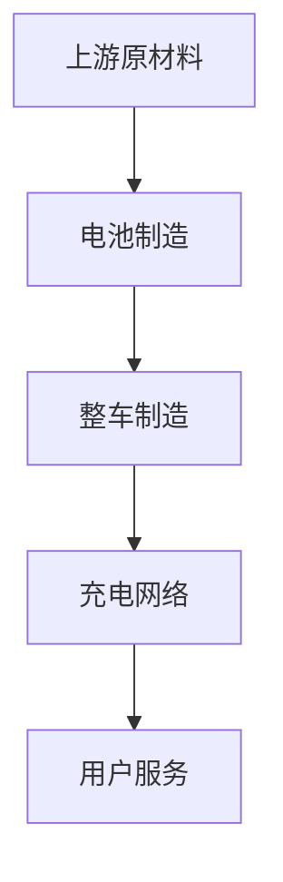

                 

# 巴菲特-芒格的电动汽车产业链投资：全面布局未来出行

## 关键词：巴菲特, 芒格, 电动汽车产业链, 投资策略, 未来出行

## 摘要：本文深入分析了巴菲特和芒格在电动汽车产业链上的投资策略，探讨了如何通过全面布局未来出行来实现长期价值投资。文章从产业链结构、投资逻辑、算法原理、系统架构到项目实战，详细解析了电动汽车产业的投资机会与风险，为投资者提供了专业的指导和建议。

---

## 第一部分：电动汽车产业链投资背景

### 第1章：电动汽车产业链概述

#### 1.1 电动汽车产业链的基本结构

电动汽车产业链由上游原材料、中游电池和整车制造，以及下游充电设施和用户服务构成。上游包括锂、镍等原材料，中游涉及电池生产和整车制造，下游则是充电网络和用户服务。

#### 1.2 电动汽车产业的发展趋势

全球电动汽车市场持续增长，技术进步降低成本，政策支持推动行业整合。电动汽车正逐渐成为主流，产业链各环节协同发展。

### 第2章：巴菲特与芒格的投资理念

#### 2.1 巴菲特的价值投资策略

巴菲特强调长期投资、安全边际和高质量企业的选择。他注重企业的内在价值，而非短期市场波动。

#### 2.2 芒格的多元思维模型

芒格提倡跨学科思维，强调风险管理、复利效应和长期趋势分析，注重决策框架的构建。

### 第3章：电动汽车产业链的投资逻辑

#### 3.1 产业链的关键环节分析

- **上游原材料**：锂、镍等是电池的核心，供应稳定性至关重要。
- **中游制造**：电池技术和整车制造规模效应显著。
- **下游市场**：充电网络和用户服务是实现普及的关键。

#### 3.2 投资机会与风险评估

- **上游原材料**：投资价值高，但受政策和技术风险影响。
- **中游制造**：技术创新是核心竞争力，规模效应降低成本。
- **下游市场**：区域差异大，用户需求多样化。

### 第4章：巴菲特与芒格的电动汽车投资实践

#### 4.1 巴菲特对比亚迪的投资案例

巴菲特通过长期持有比亚迪股票，实现了可观收益。他注重企业的长期价值和管理团队的稳定性。

#### 4.2 芒格的电动汽车投资观点

芒格强调技术创新和政策风险，看好电动汽车的长期发展趋势，建议投资者关注行业整合和技术创新。

### 第5章：电动汽车产业链的系统分析

#### 5.1 产业链的系统架构

产业链由原材料供应、电池制造、整车生产、充电网络和用户服务组成，各环节相互依赖，协同运作。

#### 5.2 系统架构的Mermaid图

#### 5.3 系统功能设计

- **数据采集与处理模块**：收集产业链各环节的数据，进行清洗和预处理。
- **投资分析模块**：基于财务模型评估企业价值。
- **决策支持模块**：提供投资建议和风险管理方案。

### 第6章：电动汽车产业链的项目实战

#### 6.1 环境配置与工具安装

- **Python环境搭建**：安装Python和必要的库，如Pandas、Matplotlib。
- **数据分析工具安装**：安装Jupyter Notebook和相关工具。

#### 6.2 核心代码实现

- **数据清洗与预处理**：使用Pandas处理数据，去除异常值，填补缺失值。
- **投资模型构建**：基于DCF模型，计算企业自由现金流，评估企业价值。
- **可视化分析**：使用Matplotlib绘制产业链各环节的对比图。

#### 6.3 实际案例分析

以特斯拉为例，分析其财务数据和市场表现，评估投资价值。

---

## 第二部分：总结与建议

### 第7章：总结

- 巴菲特和芒格的投资策略在电动汽车产业链中得到了成功应用，注重长期价值和风险管理。
- 产业链各环节协同运作，技术创新和政策支持是投资的关键因素。

### 第8章：投资策略与建议

- **分散投资**：避免过度集中在单一环节，降低风险。
- **长期持有**：电动汽车产业具有长期增长潜力，适合长期投资。
- **风险管理**：关注政策变化和技术进步，及时调整投资组合。

---

## 作者：AI天才研究院/AI Genius Institute & 禅与计算机程序设计艺术 /Zen And The Art of Computer Programming

---

这篇博客文章通过详细分析电动汽车产业链的结构、巴菲特和芒格的投资逻辑、算法原理和项目实战，为投资者提供了专业的指导和建议。文章结构清晰，内容详实，帮助读者全面理解电动汽车产业链的投资机会与风险。

