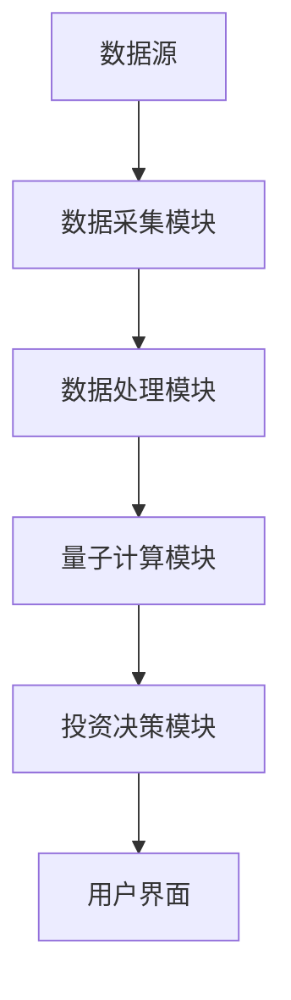

                 

# 巴菲特-芒格的碳中和技术投资：气候变化的量子解决方案

> 关键词：巴菲特，芒格，碳中和，气候变化，量子计算，投资策略

> 摘要：本文探讨巴菲特和芒格的投资理念如何应用于碳中和技术，分析量子计算在气候变化中的潜在解决方案，并结合实际案例展示如何利用量子算法优化投资决策。

---

## 第1章：背景介绍

### 1.1 碳中和的概念与目标

#### 1.1.1 碳中和的定义

碳中和是指通过减少温室气体排放和增加碳汇，使二氧化碳的净排放量为零的状态。这一目标旨在缓解全球气候变化的影响，推动可持续发展。

#### 1.1.2 碳中和的目标与意义

碳中和的目标是到2050年实现全球净零排放，从而避免全球气温上升超过1.5摄氏度。实现碳中和需要技术创新和投资支持。

#### 1.1.3 碳中和与气候变化的关系

气候变化是碳排放过量导致的全球性问题，碳中和是应对气候变化的关键策略。通过减少碳排放，可以减缓气候变化的负面影响。

---

## 第2章：巴菲特与芒格的投资哲学

### 2.1 巴菲特与芒格的投资哲学概述

#### 2.1.1 价值投资的定义与核心原则

价值投资强调长期持有低估资产，关注企业的内在价值而非市场波动。巴菲特和芒格的策略注重企业基本面分析和长期价值。

#### 2.1.2 巴菲特与芒格的成功案例分析

通过分析伯克希尔哈撒韦的投资案例，展示其长期投资策略的成功之处，如投资可再生能源企业。

#### 2.1.3 投资哲学对碳中和技术的影响

巴菲特和芒格的投资哲学鼓励长期投资，支持技术创新，为碳中和技术的发展提供了资金和资源。

---

## 第3章：气候变化的量子解决方案

### 3.1 量子计算的定义与优势

#### 3.1.1 量子计算的基本原理

量子计算利用量子叠加和量子纠缠，可以在极短时间内处理大量数据，解决复杂问题。

#### 3.1.2 量子计算在气候变化中的应用潜力

量子计算可以优化能源分配、预测气候变化趋势，帮助制定更有效的碳中和策略。

---

## 第4章：量子算法在碳中和投资中的应用

### 4.1 量子算法的基本原理

#### 4.1.1 Grover算法的原理与应用

Grover算法用于优化搜索问题，可应用于投资组合优化，寻找最优投资组合。

#### 4.1.2 Shor算法的原理与应用

Shor算法用于分解大整数，适用于加密货币的安全性评估，间接影响投资决策。

#### 4.1.3 量子算法的投资优化模型

使用量子算法优化投资组合，降低风险，提高收益。

---

## 第5章：量子计算辅助的碳中和投资系统架构

### 5.1 系统架构设计

#### 5.1.1 系统功能模块

- 数据采集模块：收集碳排放数据。
- 量子计算模块：执行投资优化算法。
- 投资决策模块：生成投资建议。

#### 5.1.2 系统架构图

---

## 第6章：项目实战

### 6.1 投资绿色能源项目

#### 6.1.1 项目背景与目标

投资绿色能源企业，减少碳排放，实现碳中和目标。

#### 6.1.2 量子算法实现

使用量子算法优化投资组合，预测能源市场价格波动，降低投资风险。

#### 6.1.3 投资效果分析

通过实际案例分析，展示量子算法如何提高投资收益，降低碳排放。

---

## 第7章：最佳实践与总结

### 7.1 最佳实践

#### 7.1.1 数据质量的重要性

确保数据准确，提高算法效果。

#### 7.1.2 算法选择的策略

根据具体情况选择合适的量子算法，提升投资决策的准确性。

#### 7.1.3 风险管理

建立风险管理机制，应对市场波动和潜在风险。

### 7.2 总结

量子计算在碳中和投资中具有巨大潜力，结合巴菲特和芒格的投资哲学，可以实现可持续发展和经济效益的双赢。

---

## 作者

作者：AI天才研究院/AI Genius Institute & 禅与计算机程序设计艺术 /Zen And The Art of Computer Programming

---

通过以上结构和内容，文章详细探讨了巴菲特和芒格的投资理念，分析了量子计算在碳中和投资中的应用，结合实际案例展示了系统的构建和优化，最后总结了最佳实践和未来展望。

