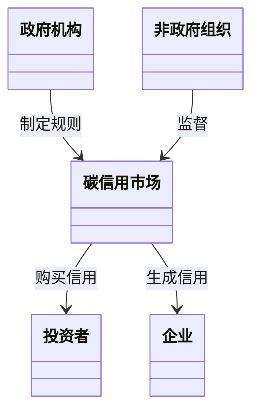
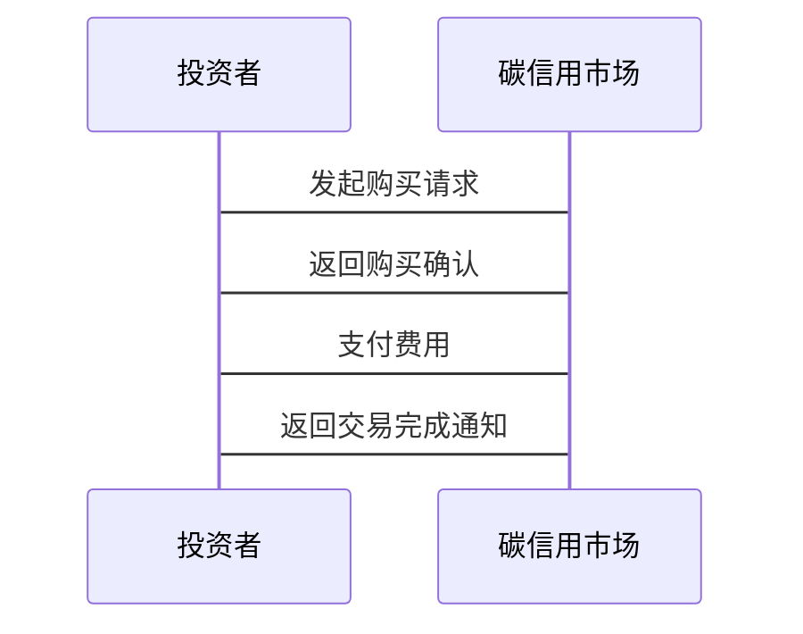

                 


---

# 巴菲特-芒格的碳信用投资：环保与经济效益的结合

## 关键词：
碳信用，巴菲特，芒格，可持续发展，投资策略，环保经济

## 摘要：
本文探讨了巴菲特和芒格在碳信用投资领域的策略，分析了如何将环保与经济效益相结合。文章从碳信用的基本概念出发，结合数学模型和实际案例，详细讲解了碳信用投资的原理、系统架构及实战应用，最后总结了最佳投资策略和未来展望。

---

# 第一部分: 巴菲特-芒格的碳信用投资背景与理念

## 第1章: 碳信用投资的背景与意义

### 1.1 碳信用的基本概念

#### 1.1.1 碳信用的定义与起源
碳信用是一种用于量化减少温室气体排放的工具，允许组织或个人通过购买信用额度来抵消其碳排放。碳信用起源于《京都议定书》，旨在全球范围内减少碳排放。

#### 1.1.2 碳信用的分类与作用
碳信用主要分为自愿碳抵消和合规碳抵消。自愿碳抵消用于企业社会责任，合规碳抵消用于满足政府法规要求。碳信用的作用包括减少碳排放、推动可持续发展和促进绿色经济。

#### 1.1.3 碳信用与可持续发展的关系
碳信用是实现可持续发展的重要工具，通过减少碳排放，推动全球向低碳经济转型，促进环境保护和经济增长的双赢。

### 1.2 巴菲特与芒格的投资理念

#### 1.2.1 巴菲特的价值投资理论
巴菲特强调长期价值投资，注重企业的基本面和内在价值，寻找具有强大护城河和良好管理团队的公司。

#### 1.2.2 芒格的多元思维模型
芒格提倡跨学科思维，将不同领域的知识相互连接，形成决策的多元视角，避免单一思维的局限性。

#### 1.2.3 两人投资理念的结合
巴菲特和芒格结合长期价值和跨学科思维，寻找那些既能产生经济效益又能推动环保目标的企业和项目。

### 1.3 碳信用投资的背景与意义

#### 1.3.1 环境问题的加剧与碳信用的出现
随着全球气候变化加剧，减少碳排放成为全球共识，碳信用作为一种市场机制，成为推动减排的重要工具。

#### 1.3.2 碳信用在经济中的作用
碳信用通过市场机制，将环保目标转化为经济价值，促进企业主动减少碳排放，推动绿色经济发展。

#### 1.3.3 碳信用投资的潜力与挑战
碳信用投资具有巨大的市场潜力，但也面临价格波动、政策风险和技术挑战。

---

## 第2章: 碳信用投资的核心概念与原理

### 2.1 碳信用市场的基本结构

#### 2.1.1 碳市场的参与主体
碳市场的主要参与者包括政府机构、企业、非政府组织和个人投资者。

#### 2.1.2 碳市场的交易机制
碳市场的交易机制包括配额分配、交易场所和价格发现。

#### 2.1.3 碳市场的价格形成
碳价格由市场供需、政策法规和宏观经济因素共同决定。

### 2.2 碳信用的生成与分配

#### 2.2.1 碳信用的生成方式
碳信用通过减少碳排放或增加碳汇来生成，例如可再生能源项目和碳封存技术。

#### 2.2.2 碳信用的分配机制
碳信用分配遵循公平、合理和透明的原则，通常采用拍卖或配额分配方式。

#### 2.2.3 碳信用的质量评估
碳信用的质量由其合规性、可验证性和额外性决定，确保其真实性和有效性。

### 2.3 碳信用投资的核心原理

#### 2.3.1 碳信用的经济价值
碳信用的经济价值取决于市场需求、供应量和政策支持。

#### 2.3.2 碳信用的风险与收益
碳信用投资面临价格波动、政策变化和技术风险，但也可能带来超额收益。

#### 2.3.3 碳信用投资的策略选择
投资者应结合市场趋势、政策变化和企业基本面，选择具有长期增长潜力的碳信用项目。

---

## 第3章: 巴菲特-芒格碳信用投资的数学模型与算法

### 3.1 碳信用定价模型

#### 3.1.1 碳信用定价的基本公式
碳信用价格（P）与市场需求（Q）和供给（S）的关系可以表示为：
$$ P = \alpha \cdot Q + \beta $$
其中，α是价格弹性系数，β是基准价格。

#### 3.1.2 价格预测模型
使用时间序列分析预测碳信用价格，考虑历史数据和市场趋势。

### 3.2 碳信用投资的收益预测

#### 3.2.1 碳信用收益的计算公式
碳信用投资的总收益（R）计算为：
$$ R = \sum_{i=1}^{n} (P_i \cdot Q_i - C_i) $$
其中，P_i是第i个碳信用的价格，Q_i是交易量，C_i是成本。

#### 3.2.2 收益预测的算法实现
使用回归分析预测碳信用价格，结合市场数据和投资策略优化收益。

### 3.3 碳信用投资的风险评估

#### 3.3.1 风险评估的数学模型
碳信用投资的风险（Risk）计算为：
$$ Risk = \sigma^2 + \alpha \cdot Market\_Risk $$
其中，σ是收益波动率，α是风险偏好系数，Market_Risk是市场整体风险。

#### 3.3.2 风险管理策略
通过分散投资、对冲交易和定期监控，降低碳信用投资的风险。

### 3.4 巴菲特-芒格投资策略的算法实现

#### 3.4.1 策略选择算法
根据企业的基本面和环保效益，选择具有长期增长潜力的碳信用项目。

#### 3.4.2 碳信用价格预测算法
使用机器学习模型预测碳信用价格，结合市场趋势和企业数据。

---

## 第四部分: 巴菲特-芒格碳信用投资的系统分析与架构设计

## 第4章: 碳信用投资的系统架构设计

### 4.1 项目介绍
碳信用投资管理系统用于优化投资组合，实现碳信用的生成、交易和管理。

### 4.2 系统功能设计

#### 4.2.1 领域模型
使用Mermaid类图展示系统的主要实体和关系：


### 4.3 系统架构设计

#### 4.3.1 系统架构
使用Mermaid架构图展示系统架构：
```mermaid
docker
    frontend
    backend
    database
    carbon_marketplace
```

### 4.4 系统接口设计

#### 4.4.1 系统接口
主要接口包括碳信用购买、生成和交易，使用RESTful API实现。

### 4.5 系统交互流程

#### 4.5.1 交互流程
使用Mermaid序列图展示投资者购买碳信用的流程：


---

## 第五部分: 巴菲特-芒格碳信用投资的项目实战

## 第5章: 项目实战

### 5.1 环境安装

#### 5.1.1 安装Python
安装Python 3.8及以上版本，确保环境满足要求。

#### 5.1.2 安装依赖库
安装必要的库，如numpy、pandas、scikit-learn和requests。

### 5.2 核心系统实现

#### 5.2.1 碳信用定价模型实现
编写Python代码实现碳信用定价模型：
```python
import numpy as np
import pandas as pd

# 加载数据
data = pd.read_csv('carbon_credit.csv')

# 定义定价模型
def carbon_price_model( demand, supply):
    alpha = 0.5
    beta = 20
    return alpha * demand + beta

# 计算价格
data['Price'] = data.apply(lambda x: carbon_price_model(x['Demand'], x['Supply']), axis=1)

# 输出结果
print(data.head())
```

#### 5.2.2 投资收益预测实现
编写Python代码进行收益预测：
```python
from sklearn.linear_model import LinearRegression

# 加载数据
data = pd.read_csv('carbon_credit.csv')

# 训练模型
model = LinearRegression()
model.fit(data[['Price', 'Demand']], data['Revenue'])

# 预测收益
new_data = pd.DataFrame({'Price': [50, 60], 'Demand': [1000, 1200]})
predictions = model.predict(new_data)

print('Predicted Revenue:', predictions)
```

### 5.3 实际案例分析

#### 5.3.1 案例背景
分析一家新能源企业的碳信用投资案例，展示如何通过碳信用投资实现环保与经济效益。

#### 5.3.2 投资策略选择
选择具有稳定需求和良好市场前景的碳信用项目，优化投资组合。

#### 5.3.3 投资结果与分析
展示投资结果，分析收益与风险，总结经验教训。

### 5.4 项目小结

#### 5.4.1 项目总结
通过实战项目，验证了碳信用投资的可行性和潜力。

#### 5.4.2 经验总结
强调风险管理和市场分析的重要性，为未来投资提供参考。

---

## 第六部分: 巴菲特-芒格碳信用投资的最佳实践与总结

## 第6章: 最佳实践与总结

### 6.1 投资策略建议

#### 6.1.1 长期投资
巴菲特和芒格的长期投资策略适用于碳信用市场，注重企业的长期价值和环保效益。

#### 6.1.2 分散投资
通过分散投资降低风险，避免过度依赖单一项目或市场。

#### 6.1.3 关注政策变化
碳信用市场受政策影响较大，投资者需密切关注政策动向。

### 6.2 风险管理与控制

#### 6.2.1 风险识别
识别市场风险、政策风险和技术风险，制定应对措施。

#### 6.2.2 风险控制
通过多元化投资、对冲交易和定期评估，控制投资风险。

### 6.3 投资与环保的平衡

#### 6.3.1 环保效益
碳信用投资不仅带来经济收益，还推动环境保护，实现可持续发展。

#### 6.3.2 经济效益
通过优化投资组合，实现经济效益的最大化，为投资者创造价值。

### 6.4 未来展望

#### 6.4.1 碳信用市场的前景
随着全球碳减排目标的推进，碳信用市场将保持增长，成为重要的投资领域。

#### 6.4.2 技术进步
技术进步将推动碳信用市场的创新，如区块链技术的应用将提高透明度和效率。

#### 6.4.3 可持续发展
碳信用投资将推动全球向低碳经济转型，为环保和经济发展做出重要贡献。

---

## 作者：AI天才研究院/AI Genius Institute & 禅与计算机程序设计艺术/Zen And The Art of Computer Programming

---

本文通过详细分析巴菲特和芒格的碳信用投资策略，结合数学模型、系统设计和实际案例，全面探讨了如何在环保与经济效益之间实现平衡。从理论到实践，从策略到系统，为投资者提供了有价值的指导和启示。

