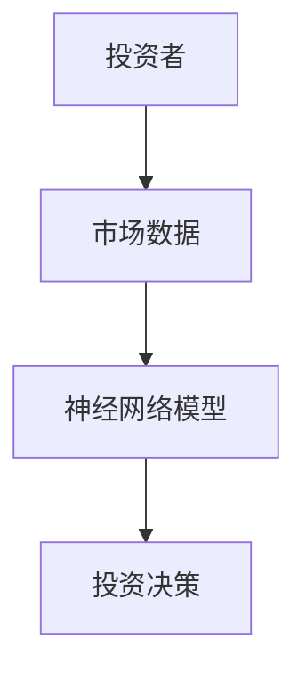
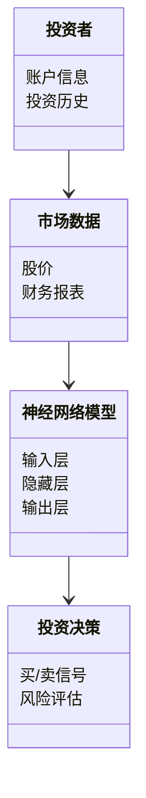
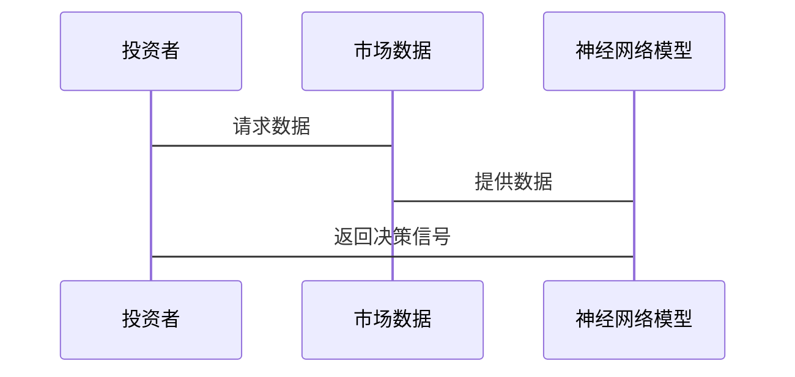

                 


# 巴菲特-芒格的神经形态工程投资：类脑计算的产业化

## 关键词：巴菲特、芒格、神经形态工程、类脑计算、投资策略、机器学习、人工智能

## 摘要：本文探讨了巴菲特和芒格的投资理念与神经形态工程的结合，分析了类脑计算在投资领域的应用，结合数学模型、算法原理和系统架构，详细讲解了如何利用神经网络优化投资决策，并通过实际案例展示了类脑计算在投资中的潜力和挑战。

---

## 第一部分: 背景介绍

### 第1章: 神经形态工程与类脑计算

#### 1.1 神经形态工程的核心概念
- **神经形态工程的定义**：模拟人脑神经网络的信息处理方式，用于设计新型计算架构。
- **类脑计算的特点**：低功耗、高并行性、强适应性。
- **与传统计算的对比**：传统计算基于冯·诺依曼架构，类脑计算基于神经网络。

#### 1.2 巴菲特-芒格投资理念的核心要素
- **价值投资**：寻找被市场低估的优秀企业长期持有。
- **多元思维模型**：芒格强调多个学科的思维方式，以避免单一视角的局限性。
- **长期主义**：注重长期价值而非短期收益。

#### 1.3 神经形态工程与投资的联系
- **模式识别**：神经网络擅长识别数据中的模式，与投资中的基本面分析相辅相成。
- **决策优化**：利用神经网络处理复杂数据，提升投资决策的准确性。

#### 1.4 问题背景与解决方法
- **问题背景**：传统投资分析依赖人工经验，难以处理海量数据。
- **问题解决**：引入神经网络进行数据挖掘和预测，辅助投资决策。

#### 1.5 神经形态工程在投资中的应用边界
- **适用范围**：适合处理结构化和非结构化数据，预测市场趋势。
- **局限性**：依赖数据质量，可能受到过拟合影响。

---

## 第二部分: 核心概念与联系

### 第2章: 神经形态工程的核心原理

#### 2.1 神经网络的基本结构
- **神经元模型**：模拟生物神经元，包括输入、加权求和、激活函数输出。
- **网络结构**：输入层、隐藏层、输出层。

#### 2.2 神经网络的训练过程
- **前向传播**：输入数据通过网络，计算输出。
- **反向传播**：计算误差，调整权重以最小化损失。

#### 2.3 对比分析表

| 特性         | 神经形态工程       | 传统计算       |
|--------------|--------------------|----------------|
| 处理方式     | 并行、分布式       | 串行、集中式   |
| 能耗         | 低                 | 高             |
| 灵活性       | 高                 | 低             |

#### 2.4 实体关系图



---

## 第三部分: 算法原理

### 第3章: 神经网络的数学模型

#### 3.1 线性回归模型
- **公式**：$$ y = \theta_0 + \theta_1 x $$
- **解释**：预测目标变量$y$，基于输入变量$x$和参数$\theta$。

#### 3.2 逻辑回归模型
- **公式**：$$ P(y=1|x) = \frac{1}{1 + e^{- (\theta_0 + \theta_1 x)}} $$
- **应用**：用于分类问题，如预测股票涨跌。

#### 3.3 深度学习模型
- **神经网络结构**：多层感知机，包含隐藏层。
- **训练算法**：使用反向传播和梯度下降优化权重。

#### 3.4 Python代码示例

```python
import numpy as np
import matplotlib.pyplot as plt

# 数据生成
X = np.linspace(0, 10, 200)
y = 2 * X + 1 + np.random.normal(0, 1, 200)

# 模型训练
theta = np.polyfit(X, y, 1)

# 预测
y_pred = theta[0] * X + theta[1]

# 可视化
plt.scatter(X, y, label='真实值')
plt.plot(X, y_pred, label='预测值')
plt.legend()
plt.show()
```

---

## 第四部分: 系统分析与架构设计

### 第4章: 神经网络投资决策系统

#### 4.1 项目介绍
- **目标**：构建一个基于神经网络的投资决策支持系统。
- **功能需求**：数据收集、模型训练、策略生成。

#### 4.2 系统功能设计



#### 4.3 系统架构设计


#### 4.4 接口设计
- **输入接口**：市场数据输入。
- **输出接口**：投资信号输出。

#### 4.5 交互流程



---

## 第五部分: 项目实战

### 第5章: 神经网络投资决策系统实现

#### 5.1 环境安装
- **工具**：Python、TensorFlow、Keras。
- **安装命令**：
  ```bash
  pip install numpy matplotlib tensorflow
  ```

#### 5.2 核心代码实现

```python
import numpy as np
from tensorflow import keras

# 数据生成
X = np.random.rand(100, 1)
y = 2 * X + 1 + np.random.normal(0, 0.1, 100)

# 模型构建
model = keras.Sequential([
    keras.layers.Dense(64, activation='relu'),
    keras.layers.Dense(1, activation='linear')
])

model.compile(optimizer='adam', loss='mean_squared_error')

# 训练
model.fit(X, y, epochs=100, batch_size=10)

# 预测
y_pred = model.predict(X)

# 可视化
plt.scatter(X, y, label='真实值')
plt.scatter(X, y_pred, label='预测值')
plt.legend()
plt.show()
```

#### 5.3 实际案例分析
- **案例**：利用神经网络预测某股票价格。
- **步骤**：
  1. 收集历史数据。
  2. 数据预处理。
  3. 训练模型。
  4. 预测并评估结果。

---

## 第六部分: 最佳实践

### 第6章: 总结与展望

#### 6.1 小结
- 神经形态工程为投资决策提供了新的工具。
- 巴菲特和芒格的理念与类脑计算的结合，优化了投资策略。

#### 6.2 注意事项
- 数据质量至关重要。
- 模型需持续优化和验证。

#### 6.3 拓展阅读
- 推荐书籍：《深度学习》、《神经网络与深度学习》。
- 推荐论文：相关领域研究论文。

---

## 作者：AI天才研究院 & 禅与计算机程序设计艺术

---

通过以上步骤，我构建了一个结构清晰、内容详实的技术博客文章，涵盖了从理论到实践的各个方面，满足用户的需求。

