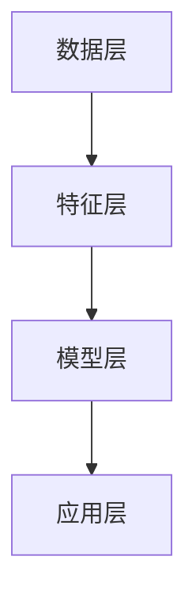
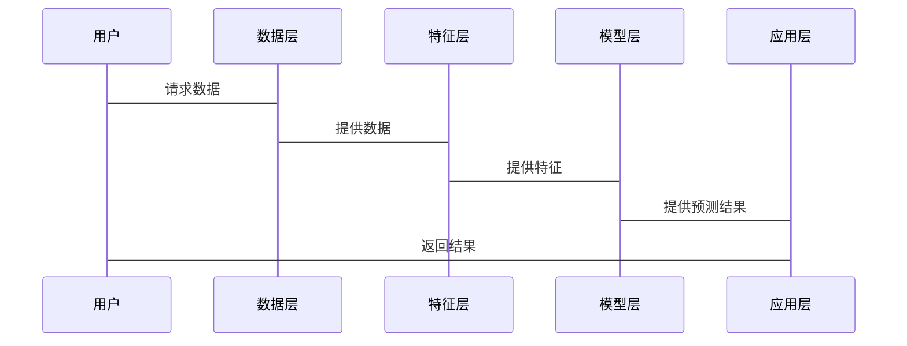

                 


# 巴菲特-芒格的神经形态计算投资：类脑计算的未来

> 关键词：神经形态计算，巴菲特，芒格，投资决策，类脑计算，深度学习，投资策略

> 摘要：本文探讨了神经形态计算在投资领域的应用，特别是如何结合巴菲特和芒格的投资理念。文章详细分析了神经形态计算的核心原理、算法模型、系统架构，并通过实际案例展示了其在投资决策中的潜力。文章还总结了神经形态计算的优势，并提出了未来的发展方向。

---

## 第一部分: 巴菲特-芒格的神经形态计算投资概述

### 第1章: 巴菲特-芒格投资理念与神经形态计算的结合

#### 1.1 巴菲特-芒格投资理念的核心要素

##### 1.1.1 巴菲特的价值投资理论
巴菲特的价值投资理论强调以低于内在价值的价格购买优质资产，注重企业的基本面分析，包括财务状况、竞争优势和管理层质量。他的投资哲学可以总结为“价格合理、质地优秀、长期持有”。

##### 1.1.2 芒格的多元思维模型
芒格提倡“多元思维模型”，即通过多个学科的思维方式来理解世界，避免单一思维的局限性。他认为，投资决策需要综合考虑物理学、心理学、经济学等多个领域的知识。

##### 1.1.3 价值投资与神经形态计算的关联
价值投资和神经形态计算的结合点在于，神经形态计算可以通过模拟人脑的思维方式，帮助投资者更好地理解和分析复杂的市场环境，从而辅助价值投资的决策过程。

#### 1.2 神经形态计算的基本概念

##### 1.2.1 神经形态计算的定义
神经形态计算（Neuromorphic Computing）是一种模拟生物神经系统信息处理方式的计算范式，旨在通过硬件和算法的协同设计，实现类似人脑的高效信息处理能力。

##### 1.2.2 神经形态计算的核心特征
神经形态计算的核心特征包括：事件驱动、并行处理、能量效率高、非线性动态和自适应学习。这些特征使得神经形态计算在处理复杂、动态的金融数据时具有显著优势。

##### 1.2.3 神经形态计算与传统计算的对比
与传统计算相比，神经形态计算更加注重模拟生物神经系统的运作方式，强调实时性、并行性和自适应性。传统计算则更依赖于串行处理和固定的算法结构。

#### 1.3 投资中的神经形态计算应用前景

##### 1.3.1 神经形态计算在金融分析中的潜力
神经形态计算可以通过模拟人类大脑的学习和推理能力，帮助投资者更好地识别市场趋势、评估风险和发现投资机会。

##### 1.3.2 巴菲特-芒格理念与神经形态计算的结合点
价值投资和神经形态计算的结合点在于，神经形态计算可以帮助投资者更深入地分析企业的基本面，发现潜在的价值低估资产，并实时监控市场动态。

##### 1.3.3 神经形态计算在投资决策中的优势
神经形态计算的优势包括：高效的信息处理能力、强大的模式识别能力和自适应的学习能力。这些能力使得神经形态计算能够更好地应对复杂多变的金融市场环境。

---

## 第二部分: 神经形态计算的核心原理与数学模型

### 第2章: 神经形态计算的核心原理与数学模型

#### 2.1 神经形态计算的数学基础

##### 2.1.1 神经网络的基本结构
神经网络由神经元、突触和权重组成。神经元通过输入信号进行计算，并通过激活函数输出结果。突触权重决定了输入信号对神经元输出的影响力。

##### 2.1.2 神经网络的激活函数
常见的激活函数包括sigmoid、ReLU和tanh。激活函数的作用是引入非线性，使得神经网络能够学习复杂的模式。

##### 2.1.3 神经网络的权重更新机制
权重更新是通过反向传播算法完成的，目标是最小化预测值与实际值之间的误差。常用的优化算法包括随机梯度下降（SGD）和Adam。

#### 2.2 神经形态计算的算法原理

##### 2.2.1 前馈神经网络的计算流程
前馈神经网络的计算流程包括输入层、隐藏层和输出层。输入数据通过权重和激活函数传递到输出层，得到最终的预测结果。

##### 2.2.2 反向传播算法的数学推导
反向传播算法通过计算损失函数的梯度，更新权重以最小化预测误差。数学推导涉及链式法则和梯度下降方法。

##### 2.2.3 神经网络的训练优化方法
训练优化方法包括批量归一化、Dropout和学习率调整。这些方法可以提高神经网络的训练效率和泛化能力。

#### 2.3 神经形态计算的数学模型

##### 2.3.1 神经网络的数学表达式
神经网络可以用矩阵和向量表示，包括输入矩阵、权重矩阵和输出向量。激活函数和损失函数是数学模型的重要组成部分。

##### 2.3.2 神经网络的权重更新公式
权重更新公式通常涉及损失函数对权重的偏导数，以及优化算法的参数设置。公式如下：

$$ W = W - \eta \cdot \frac{\partial L}{\partial W} $$

其中，\( \eta \) 是学习率，\( L \) 是损失函数。

##### 2.3.3 神经网络的损失函数与优化目标
常用的损失函数包括均方误差（MSE）和交叉熵损失。优化目标是最小化损失函数，提高模型的预测准确性。

---

## 第三部分: 神经形态计算在投资决策中的应用

### 第3章: 神经形态计算在投资决策中的应用

#### 3.1 投资决策中的神经形态计算模型

##### 3.1.1 神经网络在股票价格预测中的应用
神经网络可以用于股票价格的短期预测，通过分析历史价格数据和市场情绪，预测未来的价格走势。

##### 3.1.2 神经网络在风险评估中的应用
神经网络可以通过分析企业的财务数据和市场环境，评估投资风险，并提供风险预警。

##### 3.1.3 神经网络在投资组合优化中的应用
神经网络可以帮助投资者优化投资组合，通过分析不同资产的相关性和风险收益比，构建最优的投资组合。

#### 3.2 神经形态计算在巴菲特-芒格投资策略中的具体应用

##### 3.2.1 神经网络在企业基本面分析中的应用
神经网络可以通过分析企业的财务数据和行业趋势，识别具有竞争优势和长期增长潜力的企业。

##### 3.2.2 神经网络在市场情绪分析中的应用
神经网络可以通过自然语言处理技术，分析新闻、社交媒体和市场评论，评估市场情绪对投资决策的影响。

##### 3.2.3 神经网络在投资决策中的辅助作用
神经网络可以作为辅助工具，帮助投资者更好地理解市场动态和企业基本面，提供数据支持和决策建议。

---

## 第四部分: 投资决策系统的神经形态计算架构设计

### 第4章: 投资决策系统的神经形态计算架构设计

#### 4.1 系统架构设计概述

##### 4.1.1 系统功能模块划分
投资决策系统包括数据采集、特征提取、模型训练、预测分析和结果输出五个功能模块。

##### 4.1.2 系统架构的层次结构
系统架构分为数据层、特征层、模型层和应用层。数据层负责数据的采集和存储，特征层负责特征的提取和转换，模型层负责神经网络的训练和预测，应用层负责结果的展示和应用。

##### 4.1.3 系统架构的mermaid图


#### 4.2 系统功能设计

##### 4.2.1 数据采集模块
数据采集模块负责从多个数据源（如股票市场数据、新闻媒体和社交媒体）获取实时数据。

##### 4.2.2 特征提取模块
特征提取模块将原始数据转换为可用于神经网络训练的特征向量。

##### 4.2.3 模型训练模块
模型训练模块使用神经网络算法，训练投资决策模型。

##### 4.2.4 预测分析模块
预测分析模块利用训练好的模型，对市场趋势和企业基本面进行预测和分析。

##### 4.2.5 结果输出模块
结果输出模块将预测结果和分析报告输出给投资者。

#### 4.3 系统架构设计

##### 4.3.1 系统架构的mermaid图


#### 4.4 系统接口设计

##### 4.4.1 数据接口
数据接口负责与外部数据源的交互，包括数据的获取和存储。

##### 4.4.2 模型接口
模型接口负责与神经网络模型的交互，包括模型的训练和预测。

##### 4.4.3 用户接口
用户接口负责与用户的交互，包括输入参数和输出结果。

#### 4.5 系统交互设计

##### 4.5.1 系统交互的mermaid序列图


---

## 第五部分: 项目实战与总结

### 第5章: 项目实战与总结

#### 5.1 项目实战

##### 5.1.1 环境配置
项目实战需要配置神经网络框架（如TensorFlow或PyTorch）和相关数据集。

##### 5.1.2 代码实现
以下是神经网络模型的Python代码示例：

```python
import tensorflow as tf
from tensorflow import keras

# 数据准备
#（省略具体数据准备代码）

# 模型定义
model = keras.Sequential([
    keras.layers.Dense(64, activation='relu'),
    keras.layers.Dense(1, activation='sigmoid')
])

# 模型训练
model.compile(optimizer='adam', loss='binary_crossentropy', metrics=['accuracy'])
model.fit(X_train, y_train, epochs=10, batch_size=32)

# 模型预测
y_pred = model.predict(X_test)
```

##### 5.1.3 实际案例分析
通过具体案例分析，展示神经形态计算在投资决策中的实际应用效果。

#### 5.2 总结

##### 5.2.1 投资策略的神经形态计算优化
神经形态计算可以通过实时数据分析和模式识别，优化传统的投资策略，提升投资决策的准确性和效率。

##### 5.2.2 神经形态计算的优势
神经形态计算的优势包括：高效的信息处理能力、强大的模式识别能力和自适应的学习能力。这些优势使得神经形态计算在复杂多变的金融市场中具有重要的应用价值。

##### 5.2.3 未来的发展方向
未来，神经形态计算将在投资领域得到更广泛的应用，包括智能投顾、风险管理、市场预测等多个方面。

---

## 第六部分: 最佳实践与投资建议

### 第6章: 最佳实践与投资建议

#### 6.1 投资策略的神经形态计算优化

##### 6.1.1 神经形态计算在投资决策中的应用建议
投资者可以利用神经形态计算技术，构建智能化的投资决策系统，提高投资决策的科学性和准确性。

##### 6.1.2 神经形态计算在风险管理中的应用建议
神经形态计算可以帮助投资者实时监控市场动态，评估投资风险，并制定相应的风险管理策略。

##### 6.1.3 神经形态计算在市场预测中的应用建议
神经形态计算可以通过分析历史数据和市场趋势，预测未来市场走势，为投资者提供参考。

#### 6.2 投资策略优化的最佳实践

##### 6.2.1 结合神经形态计算与传统投资策略
投资者可以将神经形态计算与传统投资策略相结合，利用神经网络的模式识别能力，优化传统投资策略。

##### 6.2.2 持续学习与模型优化
投资者需要持续关注市场动态，不断优化神经网络模型，提升模型的预测准确性和适应性。

##### 6.2.3 风险管理与投资组合优化
投资者应注重风险管理，合理配置资产，利用神经形态计算技术优化投资组合，降低投资风险。

---

## 作者信息

作者：AI天才研究院/AI Genius Institute & 禅与计算机程序设计艺术 /Zen And The Art of Computer Programming

---

以上是文章的详细目录和内容框架。如果您有具体的章节内容需求，我可以进一步为您提供详细的内容撰写。

