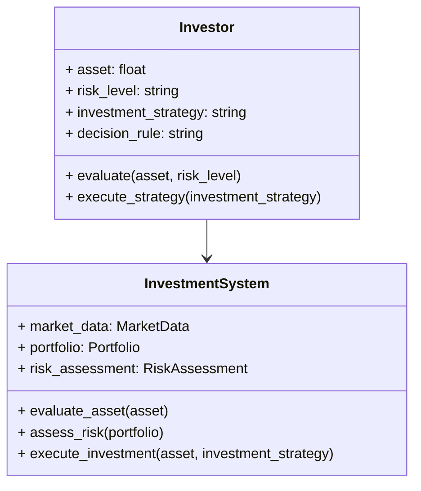
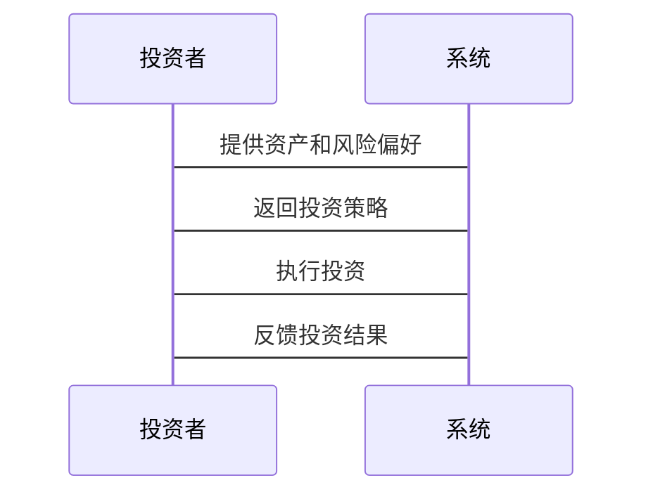

                 


# 巴菲特-芒格的简单投资法则：为什么简单胜于复杂

**关键词**：巴菲特，芒格，投资法则，简单投资，长期思维，价值投资，安全边际

**摘要**：  
巴菲特和芒格的投资哲学强调简单与长期思维，通过价值投资和安全边际的概念，展示了在复杂市场中如何通过简化决策实现卓越的投资回报。本文将深入分析这些简单法则的核心原理、实际应用以及在现代投资中的重要性。

---

## 第1章：投资的基本概念与巴菲特的哲学

### 1.1 投资的基本概念

#### 1.1.1 投资的定义与分类  
投资是将资金投入资产或项目以获得未来收益的行为。根据风险和回报的不同，投资可以分为股票、债券、房地产等多种类型。

#### 1.1.2 投资的基本原则  
投资的基本原则包括分散风险、长期持有、价值发现等。

#### 1.1.3 投资市场的基本特征  
投资市场具有不确定性和波动性，但长期趋势往往遵循价值规律。

---

### 1.2 巴菲特与芒格的生平简介

#### 1.2.1 巴菲特的生平与投资历程  
巴菲特出生于1930年，是伯克希尔·哈撒韦公司的董事长，以价值投资闻名。

#### 1.2.2 芒格的生平与投资哲学  
芒格是巴菲特的长期合作伙伴，强调逆向思维和安全边际。

#### 1.2.3 巴菲特与芒格的合作历程  
两人合作超过50年，共同构建了伯克希尔的帝国。

---

### 1.3 巴菲特-芒格投资法则的核心理念

#### 1.3.1 简单投资法则的定义  
简单法则是指通过长期持有优质资产，避免复杂交易，降低风险。

#### 1.3.2 简单胜于复杂的哲学基础  
复杂性会导致决策失误，简单法则更易于执行和控制风险。

#### 1.3.3 投资中的长期思维与价值导向  
长期思维关注企业的内在价值，而非短期波动。

---

## 第2章：价值投资的核心概念与原理

### 2.1 价值投资的定义与特点

#### 2.1.1 价值投资的定义  
价值投资是寻找市场低估的资产进行投资。

#### 2.1.2 价值投资的核心特点  
注重企业的基本面分析，寻找安全边际。

#### 2.1.3 价值投资与其它投资方法的区别  
价值投资注重长期和内在价值，与短期交易不同。

---

### 2.2 安全边际的概念与重要性

#### 2.2.1 安全边际的定义  
安全边际是投资时留出的保护空间，确保投资价值不低于购买价。

#### 2.2.2 安全边际在投资中的作用  
降低投资风险，提高长期收益。

#### 2.2.3 如何计算与应用安全边际  
通过财务比率和DCF模型计算，确保投资安全。

---

### 2.3 长期思维与复利效应

#### 2.3.1 长期思维的定义与重要性  
长期思维关注企业的持续发展和价值增长。

#### 2.3.2 复利效应的数学模型与实际应用  
复利效应公式：$$A = P(1 + r)^n$$，强调长期投资的收益。

#### 2.3.3 如何通过长期思维实现财富增长  
通过长期持有优质资产，实现财富的指数级增长。

---

## 第3章：巴菲特-芒格投资法则的核心策略

### 3.1 财务报表分析与企业估值

#### 3.1.1 财务报表分析的基本方法  
分析收入表、利润表和现金流量表，评估企业财务状况。

#### 3.1.2 企业估值的核心指标与方法  
使用市盈率、市净率和DCF模型进行估值。

#### 3.1.3 如何通过财务报表分析发现投资机会  
寻找财务健康、增长稳定的公司。

---

### 3.2 寻找具有护城河的企业

#### 3.2.1 护城河的定义与类型  
护城河包括品牌优势、成本优势和技术壁垒。

#### 3.2.2 如何识别具有护城河的企业  
分析行业地位、竞争优势和市场反馈。

#### 3.2.3 护城河在投资中的重要性  
护城河确保企业长期竞争优势。

---

### 3.3 集中投资与分散风险

#### 3.3.1 集中投资的定义与优势  
集中投资降低交易成本，提高收益。

#### 3.3.2 分散风险的策略与方法  
通过分散投资降低特定风险。

#### 3.3.3 如何在集中与分散之间找到平衡  
根据市场情况调整投资组合。

---

## 第4章：巴菲特-芒格投资法则的实践案例

### 4.1 巴菲特的经典投资案例分析

#### 4.1.1 可口可乐的投资案例  
长期持有可口可乐，获得稳定收益。

#### 4.1.2 伯克希尔 Hathaway 的投资历程  
通过收购优质企业，实现价值增长。

#### 4.1.3 其他经典投资案例分析  
如美国运通、富国银行等，均通过价值投资实现收益。

---

### 4.2 芒格的投资哲学与决策过程

#### 4.2.1 芒格的投资哲学  
注重逆向思维，寻找市场低估的机会。

#### 4.2.2 芒格的决策过程与方法  
基于对企业基本面的深入分析，做出投资决策。

#### 4.2.3 芒格与巴菲特合作中的角色分工  
芒格负责企业分析，巴菲特负责资金分配。

---

### 4.3 实际案例中的简单法则应用

#### 4.3.1 简单法则在企业估值中的应用  
使用DCF模型评估企业内在价值。

#### 4.3.2 简单法则在风险管理中的应用  
通过分散投资降低市场风险。

#### 4.3.3 简单法则在投资决策中的应用  
基于长期价值和安全边际做出投资决策。

---

## 第5章：简单投资法则在复杂市场中的应用

### 5.1 复杂市场的基本特征

#### 5.1.1 复杂市场的定义与特点  
市场参与者众多，信息不对称，波动性大。

#### 5.1.2 复杂市场中的投资挑战  
信息过载、短期波动、市场操纵等问题。

#### 5.1.3 简单法则在复杂市场中的重要性  
通过简化决策，降低风险，提高收益。

---

### 5.2 简单法则在实际投资中的应用策略

#### 5.2.1 简单法则在股票投资中的应用  
长期持有优质股票，避免频繁交易。

#### 5.2.2 简单法则在债券投资中的应用  
选择信誉良好的债券，确保稳定收益。

#### 5.2.3 简单法则在基金投资中的应用  
选择长期表现稳定的基金，分散投资风险。

---

### 5.3 简单法则在个人投资决策中的应用

#### 5.3.1 个人投资决策的基本原则  
根据自身风险承受能力制定投资策略。

#### 5.3.2 简单法则在个人投资中的具体应用  
分散投资、长期持有、定期调整投资组合。

#### 5.3.3 如何通过简单法则实现个人财务目标  
通过持续学习和实践，优化投资组合，实现财务自由。

---

## 第6章：系统分析与架构设计方案

### 6.1 问题场景介绍

#### 6.1.1 投资市场的复杂性  
复杂性可能导致投资者决策失误。

#### 6.1.2 投资者的需求分析  
投资者需要简单有效的投资策略。

---

### 6.2 项目介绍

#### 6.2.1 项目目标  
通过系统化方法，简化投资决策过程。

#### 6.2.2 项目范围  
涵盖股票、债券、基金等多种投资类型。

---

### 6.3 系统功能设计

#### 6.3.1 领域模型 mermaid 类图  


---

### 6.4 系统架构设计

#### 6.4.1 系统架构 mermaid 架构图  


---

### 6.5 系统接口设计

#### 6.5.1 投资者与系统交互接口  
```plaintext
投资者 -> 系统: 提供资产和风险偏好
系统 -> 投资者: 返回推荐的投资策略
投资者 -> 系统: 执行投资
系统 -> 投资者: 反馈投资结果
```

---

### 6.6 系统交互 mermaid 序列图



---

## 结论

巴菲特和芒格的投资法则通过简单和长期思维，展示了在复杂市场中实现卓越投资回报的路径。通过价值投资和安全边际，投资者可以在不确定性中找到稳定收益。简单法则的应用不仅降低了风险，还提高了决策效率。在实际投资中，通过系统化的方法和持续学习，投资者可以优化投资策略，实现长期财务目标。

---

**作者：AI天才研究院 & 禅与计算机程序设计艺术**

---

以上是《巴菲特-芒格的简单投资法则：为什么简单胜于复杂》的技术博客文章，基于简单的投资法则，通过系统分析和实际案例，为投资者提供了实用的策略和见解。

