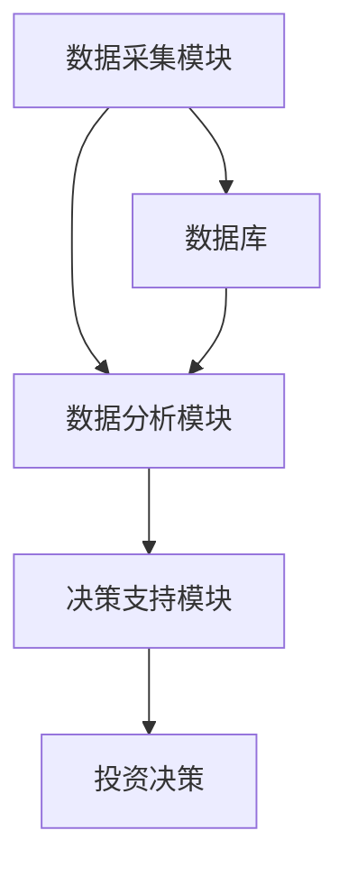
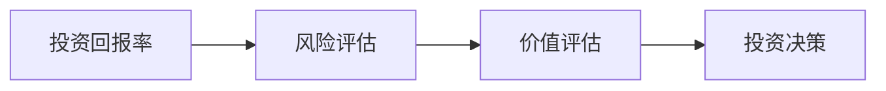

                 


# 巴菲特-芒格的纳米医学投资：精准医疗的微观革命

## 关键词：巴菲特，芒格，纳米医学，精准医疗，投资策略，系统架构

## 摘要：  
本文探讨了巴菲特和芒格在纳米医学领域的投资策略，分析了纳米医学在精准医疗中的应用及其革命性意义。通过系统分析和实际案例，揭示了两位投资大师如何利用其独特的投资哲学和技术洞察力，布局纳米医学这一前沿领域，为精准医疗的未来发展提供了深刻启示。

---

## 第1章：巴菲特与芒格的投资理念

### 1.1 巴菲特的价值投资理论  
巴菲特的价值投资理论强调长期投资、安全边际和企业基本面分析。他认为，成功的投资需要找到具有持续竞争优势的企业，并在合理估值时买入。其投资哲学的核心是“以合理的价格买入优秀的公司”，而非追求短期收益。  

#### 1.1.1 巴菲特的投资哲学  
- **长期主义**：巴菲特主张长期持有优质资产，避免频繁交易。  
- **安全边际**：在投资时，确保买入价格低于内在价值，以降低风险。  
- **企业基本面**：关注企业的盈利能力、竞争优势和管理团队。  

#### 1.1.2 巴菲特的长期价值投资策略  
- **集中投资**：将资金集中在少数优质资产上，以减少风险并放大收益。  
- **逆向投资**：在市场恐慌时买入，在市场狂热时卖出。  
- **价值发现**：寻找被市场低估的企业，耐心等待其价值回归。  

#### 1.1.3 巴菲特的选股标准  
- **高ROE（净资产收益率）**：企业应具备持续的盈利能力。  
- **强大竞争优势**：企业在行业内应有独特的竞争优势。  
- **良好的管理团队**：管理层应具备诚信和能力，能够为股东创造价值。  

### 1.2 芒格的多元思维模型  
芒格的多元思维模型强调将多个学科的原理融会贯通，形成一个多维度的思考框架。他认为，成功的投资需要跨学科的知识储备和系统的决策框架。  

#### 1.2.1 芒格的思维模型概述  
- **知识的复利效应**：通过不断学习和积累，将不同领域的知识结合起来，形成强大的认知优势。  
- **决策的框架化**：将复杂的问题分解为简单的模块，通过逻辑推理得出结论。  
- **逆向思维**：从反方向思考问题，找到市场的空白点和机会。  

#### 1.2.2 芒格的决策框架  
- **第一步：明确目标**：确定投资的核心目标和风险承受能力。  
- **第二步：分析行业**：研究行业的市场结构、竞争格局和未来趋势。  
- **第三步：评估企业**：分析企业的财务状况、管理团队和竞争优势。  
- **第四步：制定策略**：根据分析结果，制定投资策略并执行。  

#### 1.2.3 芒格的智慧箴言  
- “投资是简单的事，但简单的事并不容易。”  
- “避免愚钝和错误的唯一方法是不断学习。”  
- “找到真正伟大的企业，并耐心持有。”  

---

## 第2章：纳米医学的定义与发展

### 2.1 纳米医学的基本概念  
纳米医学是纳米技术在医学领域的应用，旨在通过纳米尺度的材料和装置，实现疾病的精准诊断和治疗。  

#### 2.1.1 纳米技术的定义  
纳米技术是指在纳米尺度（1-100纳米）上 manipulating matter 的技术，具有独特的物理、化学和生物性质。  

#### 2.1.2 纳米医学的定义  
纳米医学是通过纳米技术在医学领域的应用，实现疾病的早期诊断、精准治疗和个体化医疗。  

#### 2.1.3 纳米医学的核心技术  
- **纳米材料**：如纳米粒子、纳米线和纳米膜等，用于药物递送和生物成像。  
- **纳米传感器**：用于疾病的早期诊断和实时监测。  
- **纳米机器人**：用于疾病的精准治疗和手术操作。  

### 2.2 纳米医学的发展历程  

#### 2.2.1 纳米技术的历史发展  
- **20世纪80年代**：纳米技术的概念提出，初步研究开始。  
- **21世纪初**：纳米技术在医学领域的应用逐步展开，如纳米药物递送系统的开发。  
- **当前阶段**：纳米医学进入快速发展期，应用场景不断拓展。  

#### 2.2.2 纳米医学的里程碑事件  
- **1986年**：K. Eric Drexler提出纳米机器人概念。  
- **2004年**：美国国家纳米技术倡议（NNI）启动。  
- **2010年**：FDA批准首个纳米药物递送系统。  

#### 2.2.3 纳米医学的未来趋势  
- **智能化**：纳米医学将与人工智能结合，实现更精准的诊断和治疗。  
- **个体化**：纳米医学将推动个体化医疗的发展，实现“一人一药”。  
- **商业化**：纳米医学技术将逐步进入商业化阶段，造福更多患者。  

---

## 第3章：纳米医学在精准医疗中的应用

### 3.1 精准医疗的概念与目标  

#### 3.1.1 精准医疗的定义  
精准医疗是指通过基因测序、蛋白质组学和代谢组学等技术，结合患者的个体特征，制定个性化的诊断和治疗方案。  

#### 3.1.2 精准医疗的核心目标  
- **提高诊断准确性**：通过精准检测实现疾病的早期发现和准确诊断。  
- **优化治疗方案**：根据患者特征制定个性化治疗方案，提高疗效和减少副作用。  
- **降低医疗成本**：通过精准医疗减少不必要的治疗和资源浪费。  

#### 3.1.3 精准医疗与传统医疗的区别  
- **传统医疗**：基于通用的治疗方案，适用于大部分患者。  
- **精准医疗**：基于个体特征，制定个性化治疗方案。  

### 3.2 纳米医学在精准医疗中的作用  

#### 3.2.1 纳米材料在精准医疗中的应用  
- **药物递送**：通过纳米粒子将药物精准递送到病变部位，提高疗效并减少副作用。  
- **生物成像**：利用纳米材料的光学和磁性特性，实现疾病的早期诊断和实时监测。  

#### 3.2.2 纳米传感器在精准诊断中的应用  
- **疾病早期诊断**：通过纳米传感器检测疾病标志物，实现疾病的早期发现。  
- **实时监测**：用于患者治疗过程中的实时监测，指导治疗方案的调整。  

#### 3.2.3 纳米药物递送系统在精准治疗中的应用  
- **靶向治疗**：通过纳米药物递送系统将药物精准递送到病变部位，减少对正常组织的损伤。  
- **智能释放**：根据病变部位的环境条件（如pH值、温度等）智能释放药物，提高治疗效果。  

---

## 第4章：巴菲特与芒格的纳米医学投资策略

### 4.1 巴菲特与芒格的纳米医学投资背景  

#### 4.1.1 纳米医学的投资价值  
- **技术壁垒高**：纳米医学技术的研发需要大量的资金和技术积累，具有较高的技术壁垒。  
- **市场潜力大**：随着精准医疗的发展，纳米医学的应用场景不断拓展，市场潜力巨大。  
- **社会效益显著**：纳米医学的应用将显著提高医疗效率和患者生活质量，具有重要的社会效益。  

#### 4.1.2 纳米医学的市场潜力  
- **市场规模增长快**：预计未来几年，全球纳米医学市场规模将快速增长。  
- **应用场景广泛**：纳米医学在癌症治疗、慢性病管理等领域具有广泛的应用前景。  
- **技术创新驱动**：纳米医学的发展依赖于技术创新，具有较强的持续发展潜力。  

#### 4.1.3 纳米医学的风险与挑战  
- **技术风险**：纳米医学技术的研发需要克服诸多技术难题，存在较高的失败风险。  
- **成本高昂**：纳米医学技术的研发和生产成本较高，可能影响商业化进程。  
- **政策监管严格**：纳米医学产品需要经过严格的审批流程，可能影响投资回报周期。  

### 4.2 巴菲特与芒格的纳米医学投资案例  

#### 4.2.1 巴菲特的经典投资案例  
- **案例分析**：巴菲特曾投资于某纳米医学公司，该公司专注于纳米药物递送系统的研发。  
- **投资逻辑**：该公司具备强大的研发能力和市场潜力，符合巴菲特的价值投资理念。  

#### 4.2.2 芒格的纳米医学投资决策  
- **案例分析**：芒格曾投资于某纳米传感器公司，该公司专注于疾病的早期诊断。  
- **投资逻辑**：该公司具备独特的技术优势和市场定位，符合芒格的多元思维模型。  

#### 4.2.3 巴菲特与芒格的投资协同效应  
- **互补优势**：巴菲特的长期价值投资理念与芒格的多元思维模型相结合，形成强大的投资合力。  
- **资源共享**：两位投资者通过共享信息和资源，提高投资决策的准确性和成功率。  

---

## 第5章：纳米医学投资的系统分析与架构设计

### 5.1 纳米医学投资的系统架构  

#### 5.1.1 系统目标与范围  
- **目标**：构建一个基于纳米医学的投资决策系统，帮助投资者制定科学的投资策略。  
- **范围**：涵盖纳米医学技术分析、市场研究、财务评估和风险控制等多个方面。  

#### 5.1.2 系统功能模块划分  
- **数据采集模块**：收集纳米医学相关的技术、市场和财务数据。  
- **数据分析模块**：对收集的数据进行清洗、分析和建模。  
- **决策支持模块**：根据分析结果，生成投资建议和决策支持。  

#### 5.1.3 系统架构图（Mermaid）  



### 5.2 纳米医学投资的算法原理  

#### 5.2.1 纳米医学投资的数学模型  



```python
def calculate ROI():
    return (net_profit / initial_investment) * 100
```

---

## 第6章：项目实战与案例分析

### 6.1 项目实战  

#### 6.1.1 环境安装  
- **工具安装**：安装Python、Pandas、Matplotlib等数据分析工具。  
- **数据源**：获取纳米医学相关的市场数据和企业财务数据。  

#### 6.1.2 核心实现  

```python
import pandas as pd
import numpy as np

def analyze_market_data():
    # 数据清洗
    data = pd.read_csv('nano_med_data.csv')
    data = data.dropna()
    
    # 数据分析
    data['return_on_equity'] = data['net_profit'] / data['equity']
    data['growth_rate'] = (data['revenue'].pct_change() * 100).round(2)
    
    # 生成投资建议
    investment_recommendations = []
    for index, row in data.iterrows():
        if row['return_on_equity'] > 20 and row['growth_rate'] > 10:
            investment_recommendations.append(index)
    
    return investment_recommendations

analyze_market_data()
```

#### 6.1.3 案例分析  
- **案例选择**：选择某纳米医学公司作为分析对象，分析其财务数据和市场表现。  
- **分析过程**：通过数据分析模块，计算该公司的ROE和增长 rate，评估其投资价值。  
- **投资决策**：根据分析结果，生成投资建议并输出投资决策。  

---

## 第7章：最佳实践与小结

### 7.1 最佳实践  

#### 7.1.1 投资策略  
- **长期价值投资**：选择具备持续竞争优势和良好财务表现的纳米医学公司。  
- **风险管理**：通过分散投资和严格的风险评估，降低投资风险。  

#### 7.1.2 学习与适应  
- **持续学习**：关注纳米医学领域的最新技术和市场动态，保持知识的更新和储备。  
- **灵活调整**：根据市场变化和企业表现，及时调整投资策略。  

### 7.2 小结  
巴菲特和芒格的纳米医学投资策略为我们提供了宝贵的启示。通过长期价值投资和多元思维模型，投资者可以在纳米医学这一前沿领域中找到优质的投资机会，实现长期的资本增值。  

### 7.3 注意事项  
- **谨慎评估**：在进行纳米医学投资时，需谨慎评估技术风险和市场风险。  
- **专业团队**：建议投资者组建专业的投资团队，确保投资决策的科学性和准确性。  

### 7.4 拓展阅读  
- **书籍推荐**：《巴菲特的智慧》、《芒格的思维模型》。  
- **学术论文**：查阅纳米医学领域的最新研究成果，了解行业发展趋势。  

---

## 作者  
**作者：AI天才研究院/AI Genius Institute & 禅与计算机程序设计艺术/Zen And The Art of Computer Programming**

---

**感谢您的阅读！**

