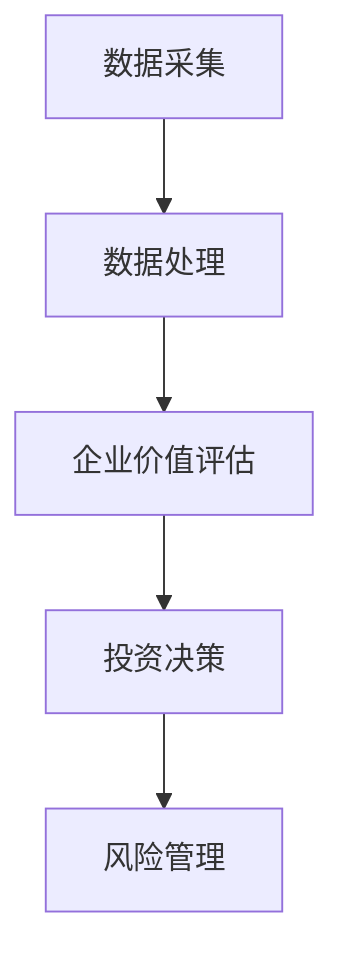

                 


# 巴菲特-芒格的耐心投资：等待击球的好球

> 关键词：巴菲特，芒格，价值投资，耐心投资，安全边际，击球区模型，投资哲学

> 摘要：本文通过技术视角深入解析巴菲特与芒格的投资哲学，探讨如何将耐心投资策略应用于现代投资实践。结合技术分析方法，构建投资决策系统，提供实用的投资工具与实战案例，帮助投资者在复杂市场中做出明智决策。

---

## 目录

1. [巴菲特与芒格的投资哲学](#巴菲特与芒格的投资哲学)
2. [价值投资的核心理念](#价值投资的核心理念)
3. [安全边际与击球区模型](#安全边际与击球区模型)
4. [投资决策系统的算法原理](#投资决策系统的算法原理)
5. [投资组合优化与风险管理](#投资组合优化与风险管理)
6. [实战案例：巴菲特模型的应用](#实战案例：巴菲特模型的应用)
7. [技术驱动的投资未来](#技术驱动的投资未来)
8. [总结与展望](#总结与展望)

---

## 第1章 巴菲特与芒格的投资哲学

### 1.1 巴菲特与芒格的背景介绍

#### 1.1.1 巴菲特的生平与投资理念
沃伦·巴菲特（Warren Buffett），1934年出生，被誉为“股神”，是价值投资的代表人物。他通过长期持有优质企业的策略积累了巨额财富。巴菲特的投资理念强调安全边际、内在价值和企业护城河。

#### 1.1.2 芒格的智慧与多元思维模型
查理·芒格（Charlie Munger）是巴菲特的黄金搭档，他的多元思维模型强调通过跨学科思考来理解投资的本质。芒格认为，投资不仅是对企业的分析，更是对人性的理解。

#### 1.1.3 巴菲特与芒格合作的历程
自1959年芒格加入巴菲特的合伙公司以来，两人合作超过60年，共同构建了伯克希尔哈撒韦帝国。他们的合作基于对价值投资的共同信仰和互补的思维方式。

### 1.2 巴菲特与芒格的投资理念

#### 1.2.1 价值投资的核心理念
价值投资的核心是购买低于内在价值的股票，并长期持有。巴菲特强调：“价格是你买的东西，价值是你拥有的东西。”

#### 1.2.2 安全边际的重要性
安全边际是指股票价格与内在价值之间的差距。巴菲特认为，安全边际是抵御市场波动的缓冲器，确保投资者在市场恐慌时不会亏损。

#### 1.2.3 击球区模型的策略
巴菲特将投资比作棒球，耐心等待击球的好球。他强调，投资不是击中每一个球，而是等待正确的时机。这种策略要求投资者具备耐心和纪律性。

---

## 第2章 价值投资的核心理念

### 2.1 内在价值的计算方法

#### 2.1.1 内在价值的定义
内在价值是企业在未来现金流的现值。巴菲特使用 discounted cash flow（DCF）模型来评估企业价值。

#### 2.1.2 DCF模型的数学公式
$$
\text{内在价值} = \sum_{t=1}^{n} \frac{CF_t}{(1 + r)^t}
$$
其中，\( CF_t \) 是第 \( t \) 年的现金流，\( r \) 是折现率。

#### 2.1.3 企业现金流的预测
现金流预测需要考虑企业的盈利能力、行业地位和竞争优势。巴菲特特别关注企业的ROE（净资产收益率）和ROA（资产回报率）。

### 2.2 价值投资的误区

#### 2.2.1 避免情绪化决策
投资者容易受到市场情绪影响，盲目追涨杀跌。价值投资要求投资者保持理性，坚持安全边际。

#### 2.2.2 避免短期交易
巴菲特反对频繁交易，认为短期波动无法预测。价值投资强调长期持有，等待企业价值的实现。

---

## 第3章 安全边际与击球区模型

### 3.1 安全边际的计算

#### 3.1.1 安全边际的公式
$$
\text{安全边际} = \text{内在价值} - \text{市场价格}
$$
当安全边际为正时，投资具有较高的安全性和 profitability。

#### 3.1.2 安全边际的重要性
安全边际提供了风险缓冲，使投资者在市场下跌时能够避免损失。巴菲特认为，安全边际是价值投资的核心。

### 3.2 击球区模型的策略

#### 3.2.1 击球区的定义
击球区是投资者认为企业价值被显著低估的区域。只有在击球区，巴菲特才会考虑投资。

#### 3.2.2 击球区的筛选条件
- 企业具有强大的竞争优势。
- 价格远低于内在价值。
- 财务状况健康，负债率低。

---

## 第4章 投资决策系统的算法原理

### 4.1 投资决策系统的框架

#### 4.1.1 系统功能模块
1. 数据采集与处理。
2. 企业价值评估。
3. 投资决策逻辑。
4. 风险管理模块。

#### 4.1.2 系统流程图


### 4.2 价值评估算法

#### 4.2.1 DCF模型的实现
使用Python编写DCF模型，计算企业的内在价值。
```python
def calculate_intrinsic_value(cash_flows, discount_rate):
    present_value = 0
    for t in range(len(cash_flows)):
        present_value += cash_flows[t] / (1 + discount_rate) ** t
    return present_value
```

#### 4.2.2 安全边际计算
$$
\text{安全边际} = \text{内在价值} - \text{市场价格}
$$

---

## 第5章 投资组合优化与风险管理

### 5.1 投资组合优化

#### 5.1.1 资产配置策略
- 长期投资：持有优质企业股票。
- 分散投资：避免过度集中。
- 定期再平衡：根据市场变化调整持仓。

#### 5.1.2 资产配置的数学模型
$$
\text{最优权重} = \sum_{i=1}^{n} w_i \times r_i
$$
其中，\( w_i \) 是资产 \( i \) 的权重，\( r_i \) 是资产 \( i \) 的预期回报率。

### 5.2 风险管理策略

#### 5.2.1 风险识别
- 市场风险：整体市场波动。
- 个股风险：个别股票的波动。
- 经济风险：宏观经济因素影响。

#### 5.2.2 风险管理工具
- 期权对冲：通过期权降低市场风险。
- 现金储备：保留足够的流动性应对市场波动。

---

## 第6章 实战案例：巴菲特模型的应用

### 6.1 案例背景

#### 6.1.1 公司选择
以可口可乐为例，分析其竞争优势和财务状况。
- 市场地位：饮料行业的领导者。
- 财务表现：稳定的现金流和高ROE。

#### 6.1.2 价值评估
使用DCF模型计算可口可乐的内在价值，与市场价格对比，确定安全边际。

### 6.2 投资决策

#### 6.2.1 投资时机
等待股价进入击球区，即价格远低于内在价值时买入。

#### 6.2.2 持股策略
长期持有优质企业，避免频繁交易。

---

## 第7章 技术驱动的投资未来

### 7.1 技术在投资中的应用

#### 7.1.1 大数据分析
利用大数据技术分析企业财务数据和市场趋势，提高投资决策的准确性。

#### 7.1.2 人工智能算法
使用机器学习模型预测市场趋势和企业价值，辅助投资决策。

### 7.2 未来的投资趋势

#### 7.2.1 数字化投资
随着科技的发展，越来越多的投资决策将依赖于数字化工具和算法。

#### 7.2.2 可持续投资
环保和ESG（环境、社会、治理）因素将越来越重要，影响投资决策。

---

## 第8章 总结与展望

### 8.1 本文总结
本文通过技术视角深入解析巴菲特与芒格的投资哲学，结合价值投资的核心理念和安全边际的重要性，构建了投资决策系统，并通过实战案例展示了巴菲特模型的应用。

### 8.2 未来展望
随着科技的发展，投资领域将更加依赖于大数据和人工智能。未来的投资者需要结合技术工具和投资哲学，做出更加明智的决策。

---

## 作者信息

作者：AI天才研究院/AI Genius Institute & 禅与计算机程序设计艺术/Zen And The Art of Computer Programming

---

本文结合技术视角，深入分析了巴菲特与芒格的投资哲学，通过系统化的技术方法，为投资者提供了实用的投资策略和工具。希望读者能够通过本文，掌握耐心投资的精髓，实现长期稳健的投资回报。

