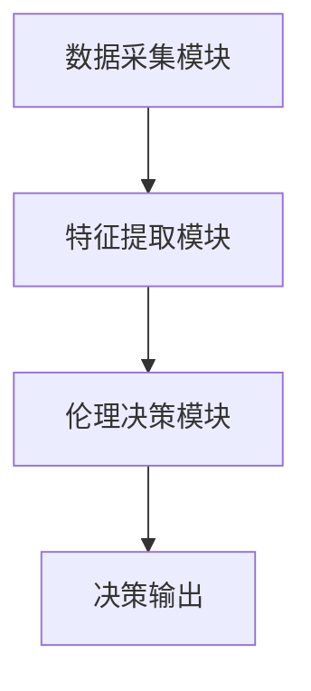

                 


# 巴菲特-芒格的脑机接口伦理投资：增强人类与AI共存

---

## 关键词：
脑机接口（BCI），投资伦理，巴菲特，芒格，人工智能，伦理算法，系统架构，项目实战

---

## 摘要：
本文探讨了脑机接口（BCI）技术在投资伦理中的应用，分析了其在投资决策中的优势与挑战，提出了基于脑机接口的伦理算法设计和系统架构方案，结合实际案例，展示了如何通过技术手段促进人类与AI的和谐共存。

---

# 第一部分：脑机接口技术与投资伦理的背景介绍

## 第1章：脑机接口技术的起源与发展

### 1.1 脑机接口技术的定义与核心概念

#### 1.1.1 从传统计算机到脑机接口的演进
脑机接口（BCI）技术是一种连接人类大脑与外部设备的桥梁，通过采集和解析脑电信号，实现人与机器的直接交互。其发展经历了从简单信号检测到复杂算法处理的演变。

#### 1.1.2 脑机接口技术的核心要素与概念结构
脑机接口的核心要素包括信号采集、特征提取、算法处理和决策输出。其概念结构涵盖了从数据采集到应用反馈的完整流程。

#### 1.1.3 脑机接口技术的边界与外延
脑机接口技术的边界在于其信号处理能力，外延则扩展到医疗、教育、投资等领域。

### 1.2 脑机接口技术的现状与发展趋势
当前，脑机接口技术在医疗领域已取得显著进展，但在投资领域的应用仍处于探索阶段。未来，随着算法优化和硬件进步，其应用将更加广泛。

---

## 第2章：投资伦理与脑机接口技术的结合

### 2.1 投资伦理的基本概念

#### 2.1.1 投资伦理的定义与特征
投资伦理是指在投资决策中遵循道德原则，确保利益相关者的权益得到平衡。其特征包括透明性、公平性和可持续性。

#### 2.1.2 投资伦理的核心原则
包括诚实守信、避免利益冲突、最大化社会福祉等。

#### 2.1.3 投资伦理与社会价值的关系
投资伦理通过促进公平和可持续发展，为社会创造更大价值。

### 2.2 脑机接口技术在投资决策中的应用
脑机接口技术通过实时分析大脑活动，辅助投资者做出更符合伦理的决策。

### 2.3 脑机接口技术对投资伦理的潜在影响
脑机接口技术可能改变投资决策的模式，但也带来了伦理冲突和技术局限性的挑战。

---

## 第3章：脑机接口技术在投资决策中的应用与挑战

### 3.1 脑机接口技术在投资决策中的优势

#### 3.1.1 提高决策效率
通过实时数据处理，投资者可以快速获取决策支持。

#### 3.1.2 增强决策的准确性
脑机接口技术能够捕捉人类不易察觉的情感和认知变化，提高决策的准确性。

#### 3.1.3 优化投资策略
通过分析大量数据，脑机接口可以帮助投资者制定更科学的投资策略。

### 3.2 脑机接口技术在投资伦理中的挑战

#### 3.2.1 伦理冲突的潜在风险
技术可能导致决策责任的模糊，引发伦理争议。

#### 3.2.2 技术的局限性与不确定性
脑机接口技术尚不成熟，可能存在误判和误差。

#### 3.2.3 人类与AI共存的伦理问题
如何平衡人类决策与AI辅助的关系，确保人类主体地位，是亟待解决的伦理问题。

---

# 第二部分：脑机接口技术的核心概念与算法原理

## 第4章：脑机接口技术的核心算法

### 4.1 脑电信号处理算法

#### 4.1.1 信号采集与预处理
通过电极采集脑电信号，并进行滤波和去噪处理。

#### 4.1.2 特征提取方法
采用时频分析、小波变换等方法提取信号特征。

#### 4.1.3 分类算法的实现
常用的分类算法包括支持向量机（SVM）、随机森林（RF）和深度学习模型。

### 4.2 脑机接口算法的数学模型

#### 4.2.1 线性回归模型
$$ y = \beta_0 + \beta_1x + \epsilon $$

#### 4.2.2 支持向量机模型
SVM通过构建超平面实现数据分类。

#### 4.2.3 神经网络模型
深度神经网络通过多层非线性变换，提取复杂特征。

## 第5章：脑机接口技术的伦理算法设计

### 5.1 伦理决策模型的构建

#### 5.1.1 伦理决策的基本框架
包括问题分析、伦理评估和决策优化三个阶段。

#### 5.1.2 基于脑机接口的伦理决策算法
通过实时采集和分析大脑活动，辅助投资者做出符合伦理的决策。

#### 5.1.3 伦理决策的验证与优化
通过实验验证算法的有效性，并不断优化模型参数。

### 5.2 伦理算法的数学模型

#### 5.2.1 伦理评分函数
$$ S = \sum_{i=1}^{n} w_i x_i $$

#### 5.2.2 伦理决策树模型
构建决策树，通过特征权重进行伦理评估。

#### 5.2.3 伦理神经网络模型
深度神经网络通过端到端训练，学习伦理决策模式。

---

# 第三部分：系统分析与架构设计方案

## 第6章：脑机接口投资系统的架构设计

### 6.1 系统功能设计

#### 6.1.1 数据采集模块
负责采集脑电信号，并进行预处理。

#### 6.1.2 特征提取模块
对预处理后的信号进行特征提取。

#### 6.1.3 伦理决策模块
基于提取的特征，进行伦理评估和决策输出。

### 6.2 系统架构设计

#### 6.2.1 系统架构的总体设计
采用模块化设计，各模块之间通过接口进行交互。

#### 6.2.2 模块之间的交互关系
数据采集模块向特征提取模块提供信号，特征提取模块向伦理决策模块提供特征，伦理决策模块输出决策结果。

#### 6.2.3 系统流程图


## 第7章：脑机接口投资系统的项目实战

### 7.1 项目介绍

#### 7.1.1 项目背景
本项目旨在开发一个基于脑机接口的投资决策支持系统。

#### 7.1.2 项目目标
通过实时分析脑电信号，辅助投资者做出更符合伦理的投资决策。

### 7.2 环境安装与代码实现

#### 7.2.1 环境安装
安装必要的库和工具，如Python、numpy、scipy等。

#### 7.2.2 核心代码实现
```python
import numpy as np
from sklearn.svm import SVC

# 数据预处理
def preprocess(eeg_data):
    # 假设eeg_data为脑电信号数组
    # 进行滤波和去噪处理
    return processed_data

# 特征提取
def extract_features(data):
    # 使用小波变换提取特征
    features = []
    for segment in data:
        # 提取特征向量
        features.append(extract_feature(segment))
    return features

# 伦理决策模型
model = SVC()
# 训练模型
model.fit(features, labels)

# 决策输出
def decision_making(eeg_signal):
    features = extract_features(eeg_signal)
    prediction = model.predict(features)
    return prediction
```

#### 7.2.3 代码解读与分析
上述代码展示了从数据预处理、特征提取到模型训练和决策输出的完整流程。

### 7.3 案例分析

#### 7.3.1 实际案例
假设在一次投资决策中，系统通过分析投资者的脑电信号，判断其决策是否符合伦理，并给出建议。

#### 7.3.2 案例分析与解读
通过分析脑电信号，系统识别出投资者的潜在偏见，并调整决策建议，确保投资行为符合伦理标准。

### 7.4 项目小结
本项目展示了如何通过脑机接口技术辅助投资决策，提升伦理合规性。

---

# 第四部分：最佳实践与小结

## 第8章：最佳实践与注意事项

### 8.1 应用中的注意事项
在实际应用中，需注意数据隐私保护、技术局限性和伦理风险。

### 8.2 未来展望
随着技术进步，脑机接口将在更多领域发挥重要作用，投资伦理也将成为研究重点。

## 第9章：小结

本文详细探讨了脑机接口技术在投资伦理中的应用，分析了其优势与挑战，并提出了系统的解决方案。通过技术手段促进人类与AI的和谐共存，是未来发展的方向。

---

## 作者：AI天才研究院 & 禅与计算机程序设计艺术

---

通过以上结构，我们可以看到，本文从背景介绍到系统设计，再到项目实战，全面探讨了脑机接口技术在投资伦理中的应用，为未来的研究和实践提供了有价值的参考。

