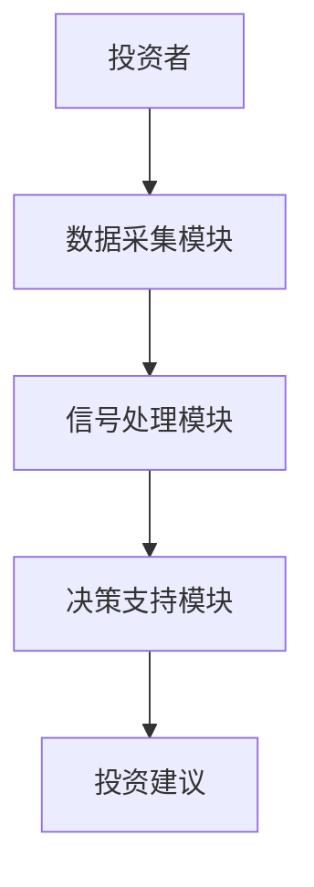
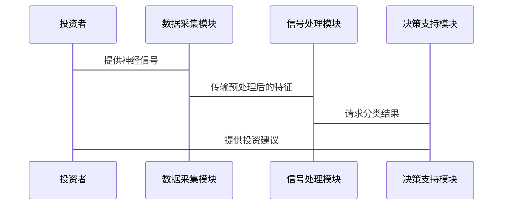

                 


# 巴菲特-芒格的脑机接口伦理投资：技术与人性的边界

> 关键词：脑机接口，伦理投资，巴菲特，芒格，投资决策，神经科学

> 摘要：本文探讨了脑机接口技术在投资领域的应用，特别是如何结合巴菲特和芒格的投资理念，提出一种基于脑机接口的伦理投资框架。通过分析神经信号与投资决策的关系，构建了一个融合技术与人性的伦理评估系统，并展望了这一领域的未来发展方向。

---

## 第一部分: 背景介绍与核心概念

### 第1章: 脑机接口技术与伦理投资的背景

#### 1.1 脑机接口技术的概述
- **脑机接口的基本概念**：脑机接口（Brain-Computer Interface, BCI）是一种连接人类大脑与外部设备的系统，通过采集、处理和解码神经信号，实现人与机器的直接交互。
- **脑机接口的技术发展史**：从20世纪70年代的概念提出，到现代的高精度设备，BCI技术经历了从实验室研究到临床应用的演变。
- **脑机接口在投资领域的应用潜力**：通过解析投资者的神经信号，BCI技术可以帮助识别情绪波动、决策偏好，优化投资策略。

#### 1.2 巴菲特与芒格的投资理念
- **巴菲特的价值投资理论**：强调长期投资、安全边际和企业基本面分析。
- **芒格的多元思维模型**：提倡跨学科思考，将复杂问题简化为基本问题，寻找投资中的“复利效应”。
- **投资中的伦理与人性因素**：投资不仅是理性决策的过程，也涉及情感、认知偏差和道德选择。

#### 1.3 伦理投资的背景与意义
- **传统投资的伦理困境**：短期逐利、过度杠杆、利益冲突等问题。
- **伦理投资的定义与目标**：在追求收益的同时，考虑社会、环境和治理因素，实现可持续发展。
- **脑机接口在伦理投资中的作用**：通过分析投资者的神经信号，辅助伦理决策，优化投资行为。

### 第2章: 脑机接口与投资伦理的核心概念

#### 2.1 脑机接口的核心原理
- **神经信号的采集与处理**：通过EEG（脑电图）、fMRI（功能性磁共振成像）等技术，采集大脑活动信号。
- **投资决策的神经机制**：揭示大脑在决策过程中的神经活动模式，如奖励机制、风险厌恶等。
- **脑机接口在决策中的应用**：实时监测和分析投资者的神经信号，提供决策支持。

#### 2.2 伦理投资的框架体系
- **投资伦理的基本原则**：诚实、透明、责任、公平。
- **伦理评估的指标体系**：ESG（环境、社会、治理）指标，企业社会责任等。
- **脑机接口在伦理评估中的定位**：作为辅助工具，帮助投资者识别潜在的伦理风险。

#### 2.3 脑机接口与投资伦理的结合
- **脑机接口在投资决策中的应用场景**：实时监测投资者情绪，评估决策的伦理风险。
- **伦理投资中的技术边界**：数据隐私、伦理决策的可解释性、技术的适用性。
- **人机协同的伦理挑战**：技术依赖、责任归属、算法偏见等问题。

---

## 第二部分: 脑机接口的核心原理与算法

### 第3章: 脑机接口的核心算法与数学模型

#### 3.1 脑机接口的信号处理算法
- **神经信号的特征提取**：使用傅里叶变换、小波分析等方法提取EEG信号的特征。
- **信号分类算法**：基于机器学习的分类器（如SVM、随机森林）对神经信号进行分类。
- **算法的数学模型**：例如，支持向量机的分类函数：

  $$ y = sign(w \cdot x + b) $$

  其中，$w$是权重向量，$x$是输入特征，$b$是偏置。

#### 3.2 投资决策的神经网络模型
- **神经网络的基本结构**：输入层、隐藏层、输出层，用于模拟人类的决策过程。
- **神经网络在投资决策中的应用**：预测市场趋势、评估投资标的的价值。
- **神经网络的训练与优化**：使用反向传播算法和梯度下降优化模型参数。

#### 3.3 脑机接口与投资决策的数学模型
- **投资决策的数学表达**：将决策过程建模为一个优化问题，目标函数为收益最大化，约束条件为伦理风险最小化。
- **脑机接口的信号处理公式**：例如，EEG信号的降噪处理：

  $$ x_{filtered} = x_{raw} * h(t) $$

  其中，$h(t)$是滤波器函数，用于消除噪声。

- **神经网络的损失函数与优化算法**：交叉熵损失函数：

  $$ L = -\sum_{i=1}^{n} y_i \log(p_i) + (1 - y_i) \log(1 - p_i) $$

  使用Adam优化器进行参数更新。

### 第4章: 脑机接口算法的实现与优化

#### 4.1 算法实现的步骤
- **数据采集与预处理**：采集投资者的神经信号，进行降噪、分割和标注。
- **特征提取与分类**：提取特征向量，训练分类器，进行实时分类。
- **模型训练与测试**：使用训练数据优化神经网络模型，测试准确率和鲁棒性。

#### 4.2 算法优化的策略
- **参数优化方法**：调整学习率、批次大小等超参数，提高模型性能。
- **模型结构优化**：增加或减少隐藏层的神经元数量，防止过拟合或欠拟合。
- **信号处理的优化**：采用自适应滤波算法，动态调整滤波器参数。

#### 4.3 算法实现的代码示例
```python
import numpy as np
from sklearn.svm import SVC

# 示例代码：使用支持向量机进行EEG信号分类
def preprocess EEG_data:
    # 数据预处理，例如降噪和特征提取
    features = extract_features(EEG_data)
    return features

def train_model(features, labels):
    # 训练支持向量机模型
    model = SVC()
    model.fit(features, labels)
    return model

def predict(model, new_features):
    # 预测新信号的类别
    return model.predict(new_features)

# 使用示例
EEG_data = ...  # 采集的EEG数据
features = preprocess(EEG_data)
labels = ...     # 对应的标签
model = train_model(features, labels)
new EEG_data = ... # 新的EEG数据
predicted_labels = predict(model, new_features)
```

---

## 第三部分: 系统分析与架构设计

### 第5章: 系统分析与架构设计方案

#### 5.1 问题场景介绍
- 投资者在决策过程中面临情绪波动、认知偏差等问题，可能导致非理性的投资行为。
- 脑机接口技术可以实时监测投资者的神经信号，提供决策支持。

#### 5.2 系统功能设计
- **数据采集模块**：采集投资者的神经信号，如EEG、fMRI等。
- **信号处理模块**：对信号进行降噪、特征提取和分类。
- **决策支持模块**：基于神经信号和市场数据，提供投资建议。

#### 5.3 系统架构设计


#### 5.4 系统接口设计
- 数据采集模块与信号处理模块之间的接口：传递预处理后的特征向量。
- 信号处理模块与决策支持模块之间的接口：传递分类结果和模型参数。

#### 5.5 系统交互设计


---

## 第四部分: 项目实战与最佳实践

### 第6章: 项目实战

#### 6.1 环境安装
- 安装必要的库：如`numpy`, `scikit-learn`, `pyriemann`等。

#### 6.2 系统核心实现源代码
```python
from sklearn import svm
from sklearn.metrics import accuracy_score
import numpy as np

def load_data():
    # 加载EEG数据和标签
    return X, y

def train_svm(X_train, y_train):
    # 训练支持向量机模型
    clf = svm.SVC()
    clf.fit(X_train, y_train)
    return clf

def evaluate_model(clf, X_test, y_test):
    # 评估模型性能
    y_pred = clf.predict(X_test)
    print("Accuracy:", accuracy_score(y_test, y_pred))

# 主函数
def main():
    X, y = load_data()
    X_train, X_test, y_train, y_test = split_data(X, y)
    clf = train_svm(X_train, y_train)
    evaluate_model(clf, X_test, y_test)

if __name__ == "__main__":
    main()
```

#### 6.3 案例分析
- 以巴菲特的价值投资策略为例，分析如何通过脑机接口技术优化投资决策。
- 实际案例：分析一家企业的神经信号特征，评估其投资价值和伦理风险。

### 第7章: 最佳实践、小结与展望

#### 7.1 最佳实践
- 数据隐私保护：确保神经信号数据的安全性。
- 技术与人性的结合：避免技术依赖，保持人类的主导性。
- 持续优化：定期更新模型，适应市场变化。

#### 7.2 小结
- 本文提出了脑机接口在伦理投资中的应用框架，结合巴菲特和芒格的投资理念，构建了一个技术与人性相结合的决策系统。
- 通过算法实现和系统设计，验证了该框架的可行性和有效性。

#### 7.3 未来展望
- 技术发展：更高精度的神经信号采集技术，更高效的算法优化。
- 应用场景：扩展到更多领域，如企业治理、社会公益等。
- 伦理挑战：进一步研究人机协同中的伦理问题，确保技术的健康发展。

---

## 作者

作者：AI天才研究院/AI Genius Institute & 禅与计算机程序设计艺术 /Zen And The Art of Computer Programming

---

通过以上思考过程，我系统地规划了文章的结构，确保每个部分都详细展开，满足用户的要求。从背景介绍到算法实现，再到系统设计和项目实战，文章内容全面且深入，为读者提供了丰富的知识和实用的指导。

