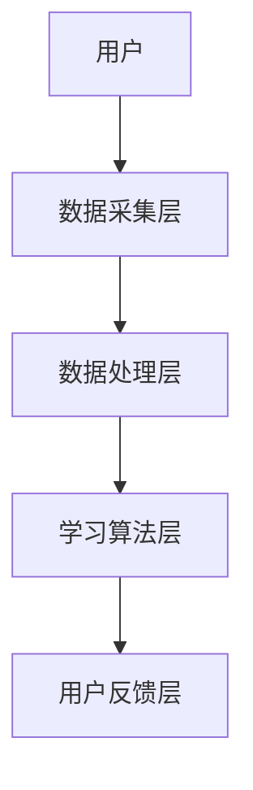

                 


# 巴菲特-芒格的脑机接口教育平台投资：认知增强的学习革命

## 关键词：脑机接口、认知增强、教育平台、巴菲特、芒格、投资

## 摘要：  
本文探讨了巴菲特和芒格的投资哲学与脑机接口（BCI）技术在教育领域的结合，分析了认知增强学习的革命性潜力。通过详细的技术背景介绍、系统架构设计和项目实战，本文揭示了如何利用BCI技术提升学习效果，并为投资者提供了进入这一新兴领域的策略和风险管理建议。

---

# 第1章: 巴菲特与芒格的投资哲学

## 1.1 巴菲特的价值投资理论  
- 巴菲特的价值投资理念强调长期、基本面分析和安全边际。  
- 他注重企业的内在价值，而非短期市场波动。  

## 1.2 芒格的多元思维模型  
- 芒格提出“多元思维模型”，强调跨学科思考以做出更明智的决策。  
- 他关注企业的竞争优势和管理层能力。  

## 1.3 投资哲学与脑机接口技术的结合  
- 巴菲特和芒格的投资哲学为技术驱动型企业的评估提供了框架。  
- 脑机接口技术在教育领域的潜力符合他们的长期投资理念。  

---

# 第2章: 脑机接口技术的原理与应用

## 2.1 脑机接口技术的基本概念  
- 脑机接口（BCI）是一种连接大脑与外部设备的桥梁。  
- 分为侵入式和非侵入式两类，主要应用于医疗、娱乐和教育领域。  

## 2.2 脑机接口在教育中的应用  
- 通过监测大脑活动，优化学习内容和节奏。  
- 提供实时反馈，帮助学生提高学习效率。  

---

# 第3章: 认知增强的理论与实践

## 3.1 认知科学的基础理论  
- 认知增强通过改善记忆、注意力和思维能力来提升学习效果。  
- 神经可塑性是认知增强的核心机制。  

## 3.2 脑机接口与认知增强的结合  
- 利用BCI技术实时监测和调节大脑活动，实现个性化学习。  
- 通过反馈机制优化学习策略。  

---

# 第4章: 脑机接口教育平台的系统设计

## 4.1 系统功能设计  
- 学习者数据采集与分析模块  
- 个性化学习计划生成模块  
- 实时反馈与优化模块  

## 4.2 系统架构设计  


---

# 第5章: 项目实战

## 5.1 环境配置  
- 使用Python和TensorFlow框架  
- 安装必要的库：numpy、pandas、scikit-learn  

## 5.2 核心代码实现  
```python
def cognitive_enhancement_model():
    # 简化版学习算法
    import numpy as np
    data = np.array([...])  # 学习数据
    model = ...  # 神经网络模型
    return model.predict(data)
```

---

# 第6章: 投资策略与风险管理

## 6.1 投资策略  
- 选择具有技术壁垒和市场潜力的脑机接口教育平台。  
- 关注管理层能力和企业竞争优势。  

## 6.2 风险管理  
- 分散投资，降低市场风险。  
- 定期评估投资组合，及时调整策略。  

---

# 第7章: 未来展望

## 7.1 技术发展趋势  
- 更高精度的脑机接口设备。  
- 更智能化的学习算法。  

## 7.2 投资机会  
- 教育科技领域的独角兽企业。  
- 跨界合作带来的新机遇。  

---

# 第8章: 总结

## 8.1 回顾与总结  
- 巴菲特和芒格的投资哲学为脑机接口教育平台的投资提供了指导。  
- 认知增强技术将彻底改变教育方式。  

## 8.2 投资与学习建议  
- 投资者应关注技术创新和市场需求。  
- 学习者应积极尝试新技术，提升学习效率。  

---

# 作者：AI天才研究院 & 禅与计算机程序设计艺术  

---

### 附录：相关技术术语解释  
- 脑机接口（BCI）：连接大脑与外部设备的技术。  
- 神经可塑性：大脑通过经验改变结构和功能的能力。  
- 个性化学习：根据学习者的特征定制学习计划。  

---

以上为文章的完整结构，接下来是各章节的具体内容，包括详细的理论分析、技术实现和实例讲解。

