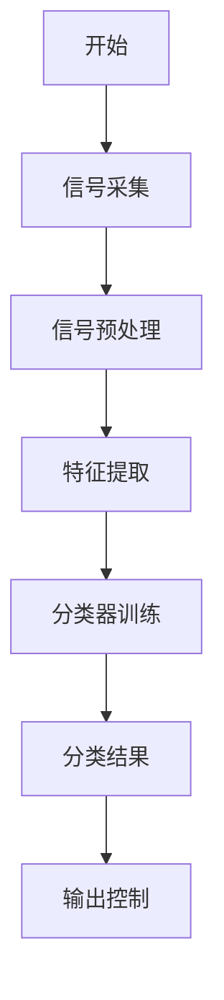
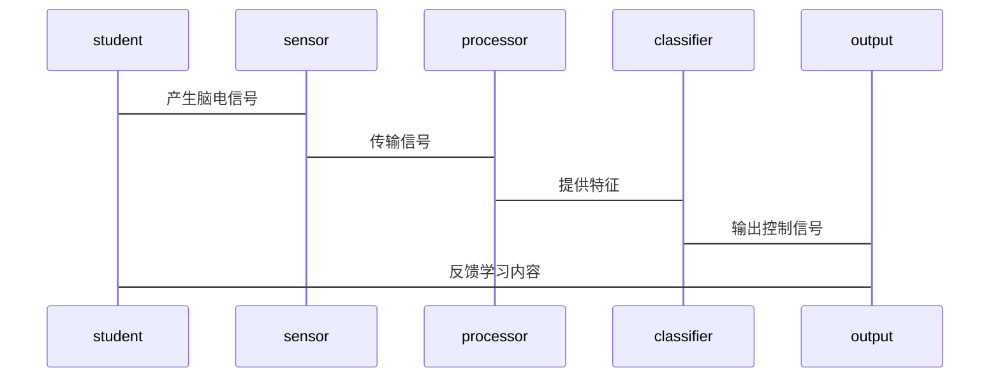

                 


# 巴菲特-芒格的脑机接口教育应用投资：学习革命的新前沿

## 关键词
脑机接口，教育应用，巴菲特，芒格，投资，学习革命

## 摘要
脑机接口（BCI）技术作为人工智能领域的前沿技术，正在逐步改变教育方式。本文探讨巴菲特和芒格在脑机接口教育应用中的投资理念，分析其技术原理、算法实现、系统架构，并通过实战项目展示其应用前景。文章内容详实，涵盖背景介绍、核心概念、算法原理、系统架构、项目实战和最佳实践等多个方面，旨在为读者提供全面的技术解析和深入的投资分析。

---

## 第一部分: 背景介绍

### 第1章: 脑机接口技术的起源与发展

#### 1.1 脑机接口技术的定义与核心概念
##### 1.1.1 脑机接口技术的定义
脑机接口（Brain-Computer Interface，BCI）是一种能够直接连接人脑与计算机的技术，通过捕捉和解析大脑信号，实现人与机器的交互。

##### 1.1.2 脑机接口的核心概念与组成
脑机接口的核心组成部分包括信号采集设备（如 EEG 传感器）、信号处理算法、特征提取模块、分类器以及输出设备。

##### 1.1.3 脑机接口技术的分类与应用场景
脑机接口主要分为侵入式、半侵入式和非侵入式三种类型，应用场景包括医疗、教育、娱乐等领域。

#### 1.2 脑机接口技术的发展历程
##### 1.2.1 脑机接口技术的起源
脑机接口技术起源于20世纪70年代，最初主要用于医疗领域，帮助瘫痪患者恢复部分行动能力。

##### 1.2.2 脑机接口技术的发展阶段
经历了从实验室研究到实际应用的逐步发展，近年来随着人工智能技术的进步，脑机接口技术进入快速发展阶段。

##### 1.2.3 当前脑机接口技术的现状与趋势
当前，脑机接口技术在医疗、教育、游戏等领域得到广泛应用，未来有望进一步提升人机交互的效率和体验。

#### 1.3 巴菲特与芒格的教育投资理念
##### 1.3.1 巴菲特与芒格的投资哲学
巴菲特和芒格注重长期价值投资，关注技术的颠覆性和市场潜力。

##### 1.3.2 教育投资的核心逻辑
他们认为教育是改变社会的关键领域，投资于能够提升学习效率的技术将带来巨大的社会和经济价值。

##### 1.3.3 脑机接口技术与教育投资的结合
脑机接口技术能够显著提升学习效率，符合巴菲特和芒格的投资逻辑，因此成为他们的重点关注领域。

#### 1.4 本章小结
本章介绍了脑机接口技术的基本概念、发展历程及其在教育领域的应用潜力，并分析了巴菲特和芒格为何关注这一技术。

---

## 第二部分: 核心概念与联系

### 第2章: 脑机接口技术的核心原理

#### 2.1 脑机接口技术的基本原理
##### 2.1.1 神经信号的采集与处理
通过 EEG 传感器采集大脑电信号，并进行预处理以消除噪声。

##### 2.1.2 神经信号的特征提取
提取有用的特征，如频谱功率、时域波形等，用于后续分类。

##### 2.1.3 神经信号的模式识别
利用机器学习算法识别不同脑电特征对应的行为或意图。

#### 2.2 脑机接口技术的分类与对比
##### 2.2.1 非侵入式脑机接口
通过头皮电极采集信号，无需手术，适合教育场景。

##### 2.2.2 半侵入式脑机接口
部分侵入头皮，信号质量更高，但成本较高。

##### 2.2.3 侵入式脑机接口
需要植入大脑内部，适用于医疗领域，但教育场景中应用有限。

#### 2.3 脑机接口技术的数学模型与公式
##### 2.3.1 神经信号的时频分析
使用小波变换分析信号的时频特征：
$$
W(t, f) = \int_{-\infty}^{\infty} x(t) \cdot \overline{\psi(t - t_0, f)} dt
$$

##### 2.3.2 神经信号的特征提取公式
常用的特征提取公式包括均方差（RMS）和功率谱密度（PSD）。

##### 2.3.3 神经信号的分类算法模型
支持向量机（SVM）和随机森林（RF）是常用的分类算法。

#### 2.4 脑机接口技术的ER实体关系图
```mermaid
er
  actor: 用户
  brain: 大脑
  sensor: 传感器
  processor: 处理器
  classifier: 分类器
  output: 输出设备
  actor -|读取| sensor
  sensor -|传输| processor
  processor -|处理| classifier
  classifier -|控制| output
```

#### 2.5 本章小结
本章详细讲解了脑机接口技术的核心原理，包括信号采集、特征提取和分类算法，并通过ER图展示了系统的组成和关系。

---

## 第三部分: 算法原理讲解

### 第3章: 脑机接口技术的核心算法

#### 3.1 神经信号的预处理算法
##### 3.1.1 信号采集与滤波
使用 Butterworth 滤波器去除噪声：
$$
H(z) = \frac{1}{1 + \alpha z^{-1}}
$$

##### 3.1.2 噪声消除技术
基于独立成分分析（ICA）去除伪迹。

##### 3.1.3 数据标准化方法
对信号进行归一化处理，确保不同通道的数据具有可比性。

#### 3.2 神经信号的特征提取算法
##### 3.2.1 基于时域的特征提取
提取均值、方差等统计特征。

##### 3.2.2 基于频域的特征提取
计算频谱功率，识别大脑活动的特定频带。

##### 3.2.3 基于时频域的特征提取
结合时域和频域特征，提升分类性能。

#### 3.3 神经信号的分类算法
##### 3.3.1 基于传统机器学习的分类算法
支持向量机（SVM）和 k-近邻算法（k-NN）是常用的分类方法。

##### 3.3.2 基于深度学习的分类算法
卷积神经网络（CNN）和长短期记忆网络（LSTM）在脑机接口分类中表现优异。

##### 3.3.3 基于混合模型的分类算法
结合传统算法和深度学习模型，提升分类准确率。

#### 3.4 脑机接口算法的实现流程


#### 3.5 本章小结
本章详细讲解了脑机接口技术中的关键算法，包括预处理、特征提取和分类器设计，并通过流程图展示了实现步骤。

---

## 第四部分: 系统分析与架构设计

### 第4章: 脑机接口教育应用系统设计

#### 4.1 教育应用场景介绍
##### 4.1.1 在线学习平台
实时监测学生注意力，优化学习内容。

##### 4.1.2 个性化教学系统
根据大脑活动调整教学策略。

##### 4.1.3 教学效果评估
通过脑机接口数据评估学习效果。

#### 4.2 系统功能设计
##### 4.2.1 数据采集模块
负责采集学生的脑电信号。

##### 4.2.2 特征提取模块
对信号进行特征提取和处理。

##### 4.2.3 分类器模块
实现大脑信号的分类和意图识别。

##### 4.2.4 输出控制模块
根据分类结果控制教学系统的输出。

#### 4.3 系统架构设计


#### 4.4 系统接口设计
##### 4.4.1 数据接口
定义 EEG 信号的格式和传输协议。

##### 4.4.2 用户接口
设计直观的用户界面，方便教师和学生使用。

#### 4.5 系统交互流程


#### 4.6 本章小结
本章设计了脑机接口教育应用系统的整体架构，包括功能模块、系统交互流程和接口设计。

---

## 第五部分: 项目实战

### 第5章: 脑机接口教育应用开发

#### 5.1 环境安装与配置
##### 5.1.1 安装必要的库
安装 numpy、scipy、pyEEG 等库：
```bash
pip install numpy scipy pyeeg
```

#### 5.2 系统核心实现
##### 5.2.1 数据采集代码
使用 EEG 传感器采集信号：
```python
import numpy as np
from pyeeg import eeg

# 采集信号
signal = eeg.record(5)  # 采集5秒信号
```

##### 5.2.2 特征提取与分类代码
对信号进行特征提取并训练分类器：
```python
from sklearn.svm import SVC

# 提取特征
features = eeg.features(signal)
# 训练分类器
classifier = SVC()
classifier.fit(features, labels)
```

##### 5.2.3 输出控制代码
根据分类结果控制教学系统：
```python
# 分类结果
result = classifier.predict(new_signal)
# 输出控制指令
output.send(result)
```

#### 5.3 实际案例分析
##### 5.3.1 案例背景
分析一名学生在学习过程中的注意力变化。

##### 5.3.2 数据分析与解读
通过信号处理和分类，识别学生的注意力状态。

##### 5.3.3 系统优化建议
根据分析结果优化教学策略。

#### 5.4 本章小结
本章通过实战项目展示了脑机接口教育应用的开发过程，包括环境配置、代码实现和案例分析。

---

## 第六部分: 最佳实践

### 第6章: 实践中的注意事项与未来展望

#### 6.1 小结与总结
##### 6.1.1 核心要点总结
总结脑机接口技术的核心原理和教育应用的潜力。

##### 6.1.2 投资价值分析
分析脑机接口技术在教育领域的投资价值。

#### 6.2 注意事项与风险提示
##### 6.2.1 技术风险
信号干扰、分类精度等问题需要重点关注。

##### 6.2.2 市场风险
市场竞争和技术更新可能带来的挑战。

##### 6.2.3 法律与伦理问题
数据隐私和伦理问题需要妥善处理。

#### 6.3 未来发展趋势
##### 6.3.1 技术进步
深度学习和神经科学的结合将推动脑机接口技术的发展。

##### 6.3.2 市场扩展
脑机接口技术在教育、医疗、娱乐等领域的广泛应用。

##### 6.3.3 投资机会
早期投资于脑机接口技术企业可能带来丰厚回报。

#### 6.4 本章小结
本章总结了脑机接口教育应用的核心要点，提出了实践中的注意事项，并展望了未来的发展趋势。

---

## 作者信息
作者：AI天才研究院/AI Genius Institute  
联系领域：禅与计算机程序设计艺术 /Zen And The Art of Computer Programming  

---

以上目录大纲涵盖了从背景介绍到实战项目的各个方面，内容详实且逻辑清晰，适合技术爱好者和教育工作者深入学习和研究。

